# Social Engineering

Source: https://notes.kodekloud.com/docs/CompTIA-Security-Certification/Threats-Vulnerabilities-and-Mitigations/Social-Engineering/page

This article explores social engineering in cybersecurity, focusing on human vulnerabilities and various attack techniques like phishing, vishing, and typosquatting.

One of the most damaging attack vectors in cybersecurity is the human element. Beyond vulnerabilities in hardware, software, and systems, individuals—employees, customers, contractors, and suppliers—represent a significant attack surface.

Often, people are granted system access to perform legitimate tasks. However, this same access can be exploited when individuals are manipulated or tricked into revealing credentials or inadvertently granting unauthorized access.

<Frame>
  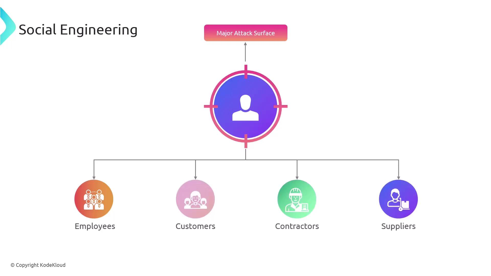
</Frame>

This method is known as social engineering, sometimes described as "acting the human." Common techniques include impersonation and pretexting, where an attacker poses as someone in a trusted position to coerce a target into taking a specific action—often under a false sense of urgency.

<Frame>
  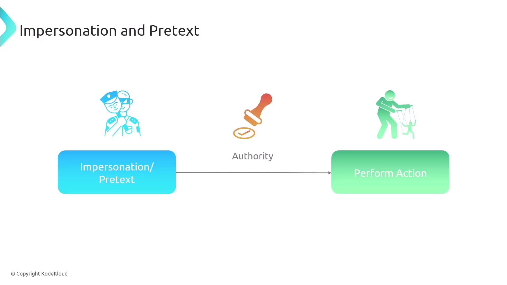
</Frame>

Attackers may also use social consensus to create the impression that everyone is complying with the request, thereby making any refusal appear abnormal. In addition, phishing is one of the most prevalent attack techniques in this domain.

<Callout icon="lightbulb">
  Phishing attacks lure users into executing malicious code concealed within seemingly legitimate emails or files. A single click on a deceptive link may lead to the compromise of login credentials or unauthorized system access. Attackers sometimes set up counterfeit websites, such as fake bank login pages, to steal sensitive information.
</Callout>

<Frame>
  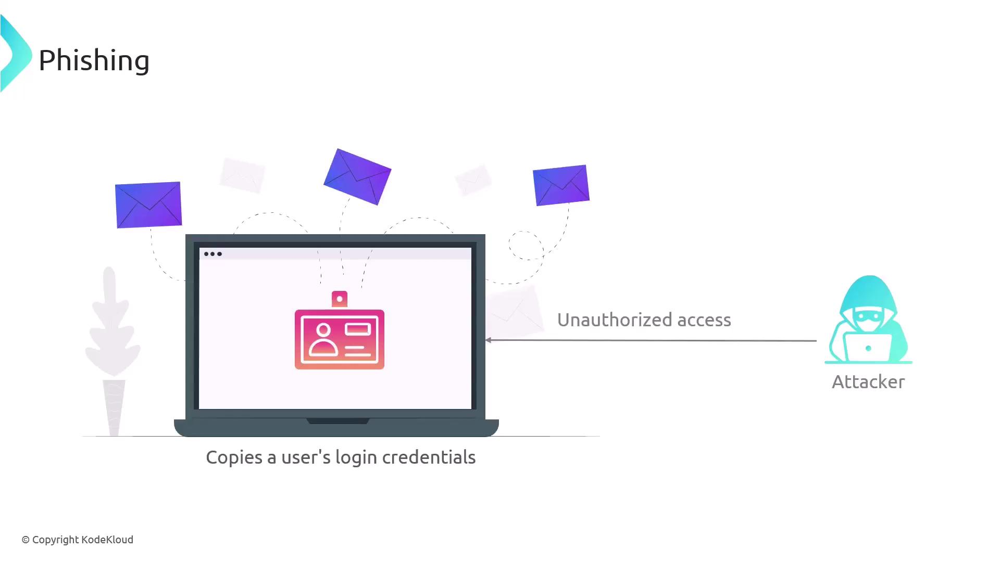
</Frame>

While most phishing attempts are executed through email, they can also occur over telephone or voice channels.

<Frame>
  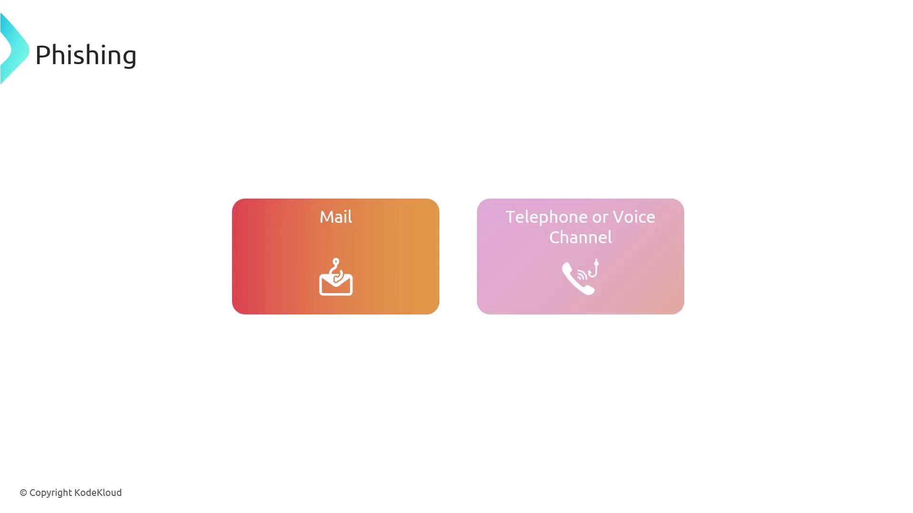
</Frame>

When phishing is conducted over voice channels, it is known as vishing; when it occurs via SMS text messages, it is termed smishing.

<Frame>
  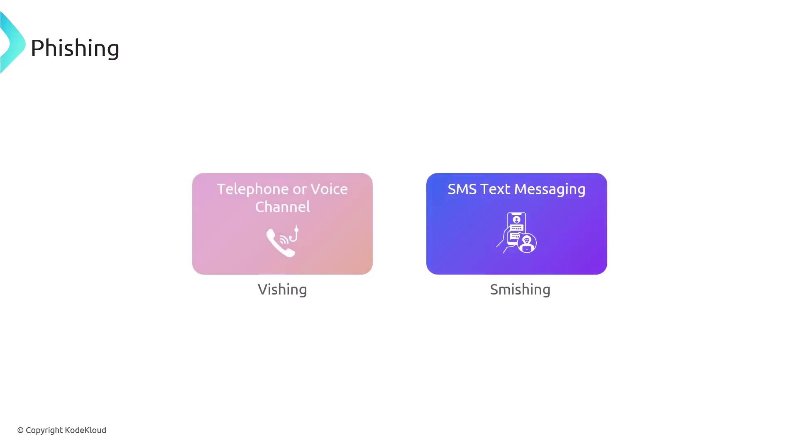
</Frame>

Business compromise emails are a specialized form of phishing that include steps to appear as though they originate internally within the organization. For example, an attacker might send an urgent email impersonating a company executive to trick the target into actions like purchasing gift cards for a fictitious event.

<Frame>
  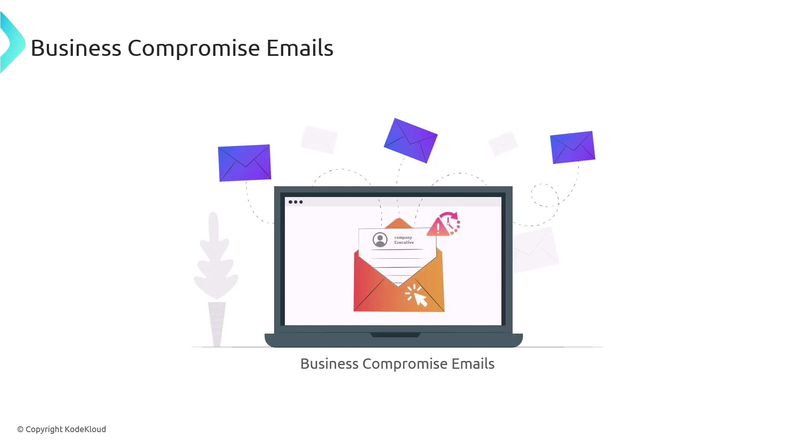
</Frame>

It is important to distinguish this from whaling—a targeted phishing attack aimed specifically at high-profile individuals rather than regular employees.

<Frame>
  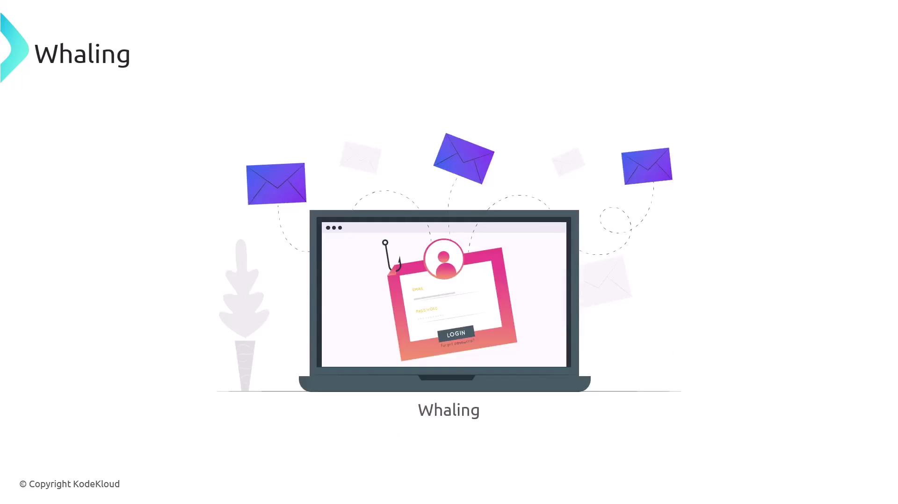
</Frame>

Another sophisticated technique is the watering hole attack. Unlike phishing—where the attacker directly entices the target to click on a malicious link—a watering hole attack involves compromising a website known to be popular with a specific group. Once infected, the site delivers a malicious payload to visitors during their interaction.

<Frame>
  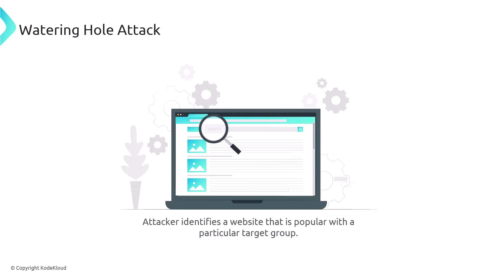
</Frame>

<Frame>
  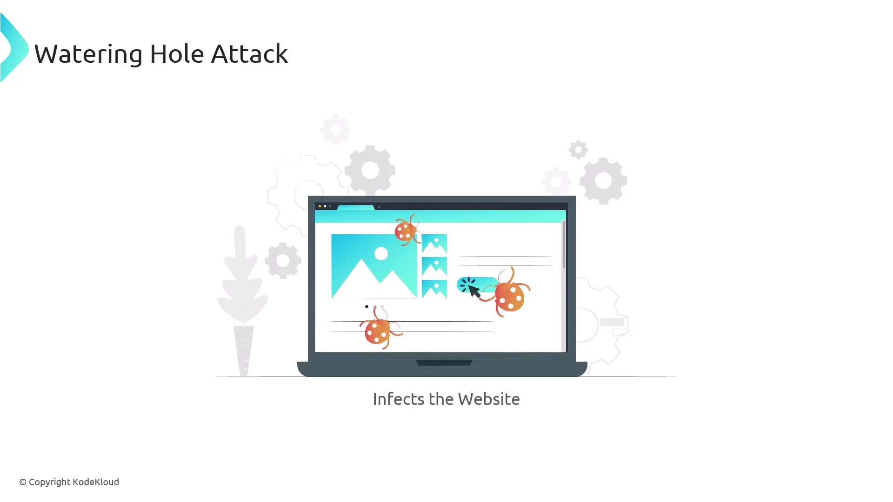
</Frame>

Pharming is a more complex attack that redirects users to a malicious website even when the correct URL is entered. This method manipulates the Domain Name System (DNS), which converts website names into IP addresses. For example, a user typing [www.kodekloud.com](http://www.kodekloud.com) might be unknowingly redirected to an attacker-controlled site.

<Frame>
  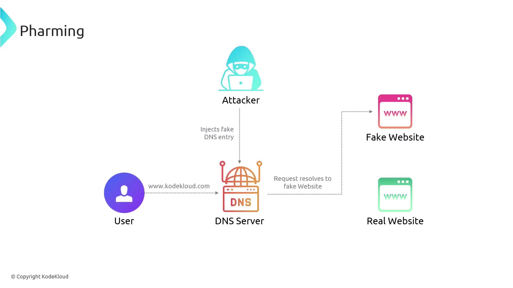
</Frame>

Typosquatting exploits common typing errors in website addresses. An attacker registers a domain name that closely resembles a legitimate one (e.g., [www.kodekloud.com](http://www.kodekloud.com) versus [www.kodecloud.com](http://www.kodecloud.com)) and designs it to mimic the real site. Users who make a typographical error are then directed to the fraudulent site.

<Frame>
  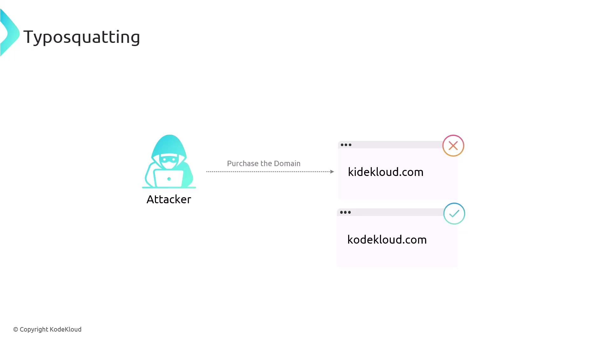
</Frame>

Finally, it is crucial to understand the role of lures in social engineering attacks. A lure is an enticing element—such as an email, USB drive, or other removable media—that encourages a user to click on a link or execute a file containing hidden malicious code. Lures may be disguised as useful applications, documents, or image files.

<Frame>
  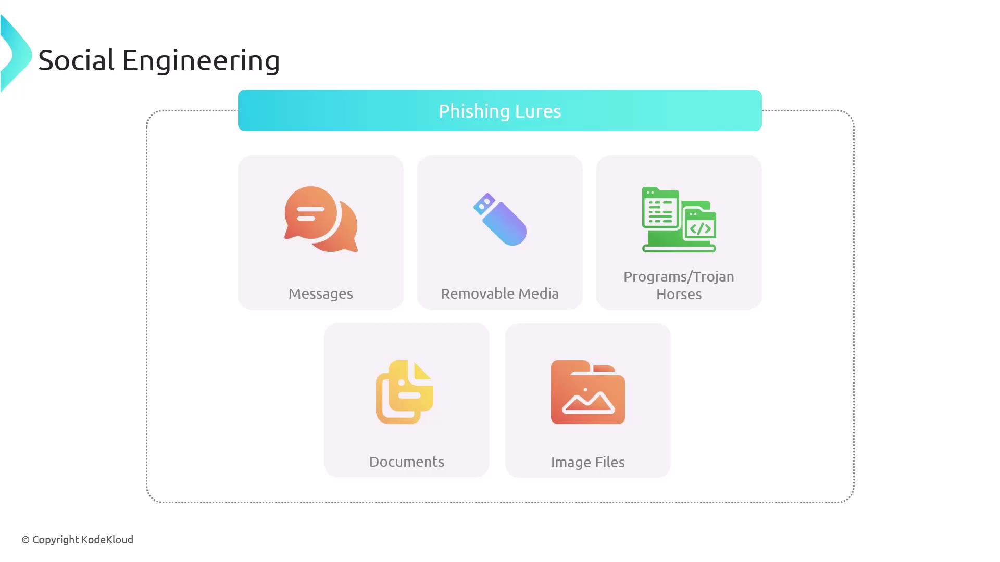
</Frame>

<Callout icon="triangle-alert">
  Always verify the authenticity of emails, websites, and other digital communications before taking action. Maintaining vigilance is critical in defending against social engineering attacks.
</Callout>

<CardGroup>
  <Card title="Watch Video" icon="video" href="https://learn.kodekloud.com/user/courses/comptia-security-certification/module/208b2070-c737-43e9-b012-7f868f1621be/lesson/ba8fd772-5e19-4fbf-9eb4-bc89da84d6e2" />
</CardGroup>
