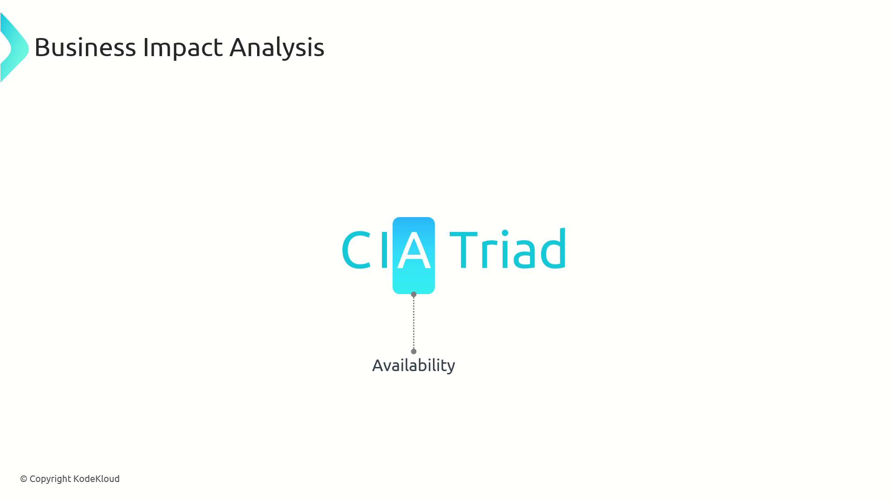
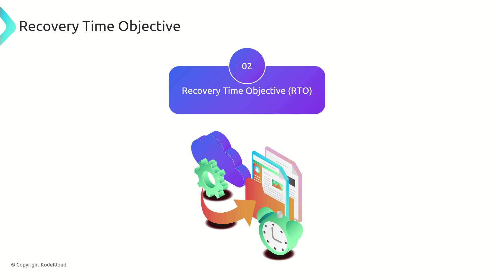
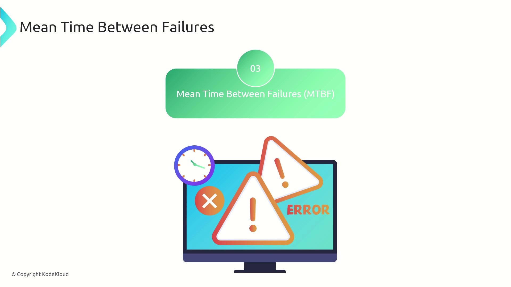

# Business Impact Analysis BIA

Source: https://notes.kodekloud.com/docs/CompTIA-Security-Certification/Security-Management/Business-Impact-Analysis-BIA/page

This article explores Business Impact Analysis and its role in managing disruptions to ensure system availability and operational resilience through strategic recovery planning.

In this article, we explore the critical process of Business Impact Analysis (BIA) and its role in helping organizations understand and manage the potential impacts of disruptions. By examining key concepts, companies can develop robust recovery strategies to ensure continuous system availability and operational resilience.

Recall the CIA triad—especially the "A" for Availability?

<Frame>
  
</Frame>

BIA primarily focuses on maintaining availability by identifying and mitigating risks that could lead to service interruptions. By conducting a thorough BIA, organizations can formulate strategic plans to recover quickly from events like Distributed Denial of Service (DDoS) attacks or internet outages. Approaches such as implementing failover systems and designing highly available architectures are common strategies derived from a detailed BIA.

The process of BIA involves understanding several key terms:

## Recovery Point Objective (RPO)

Recovery Point Objective (RPO) is defined as the maximum tolerable amount of data loss that an organization can sustain during an incident while maintaining acceptable business operations. Consider your backup strategy: in a ransomware attack or any data loss scenario, RPO determines the frequency of your backups.

For example, if your systems are backed up daily, the maximum data loss could be up to one day’s data. Conversely, if backups are performed weekly, your organization might lose up to seven days’ worth of data. The RPO sets the guideline for the acceptable interval between backups relative to the potential data loss.

<Frame>
  
</Frame>

## Recovery Time Objective (RTO)

Recovery Time Objective (RTO) refers to the maximum acceptable downtime after a disruption before the restoration of critical applications or systems. Unlike average recovery times observed during routine incidents, RTO is a predefined boundary that organizations use to measure responsiveness during a crisis.

<Frame>
  
</Frame>

Understanding and setting an appropriate RTO is essential for ensuring that recovery efforts align with business requirements and minimize operational downtime.

## Mean Time Between Failures (MTBF)

Mean Time Between Failures (MTBF) is a reliability metric that indicates the average operational time between system failures. By monitoring MTBF, organizations can effectively plan preventive maintenance and forecast system reliability over time. This approach supports proactive measures to enhance overall system performance and reduce unexpected outages.

<Frame>
  
</Frame>

<Callout icon="lightbulb">
  Understanding RPO, RTO, and MTBF empowers organizations to design systems that are resilient to disruptions. These metrics serve as foundational elements in developing comprehensive recovery plans that reduce downtime and limit financial and operational impacts.
</Callout>

By integrating these essential metrics into your Business Impact Analysis, you can improve your preparedness for unexpected scenarios, ensuring that your business maintains continuity and minimizes potential losses. For additional insights and best practices on BIA and disaster recovery, explore our related guides and resources on system availability and risk management.

<CardGroup>
  <Card title="Watch Video" icon="video" href="https://learn.kodekloud.com/user/courses/comptia-security-certification/module/2ed228f2-896d-4847-a874-59c17394f560/lesson/fe824f47-f4f1-495b-8d4d-f33ffe0d144d" />
</CardGroup>
