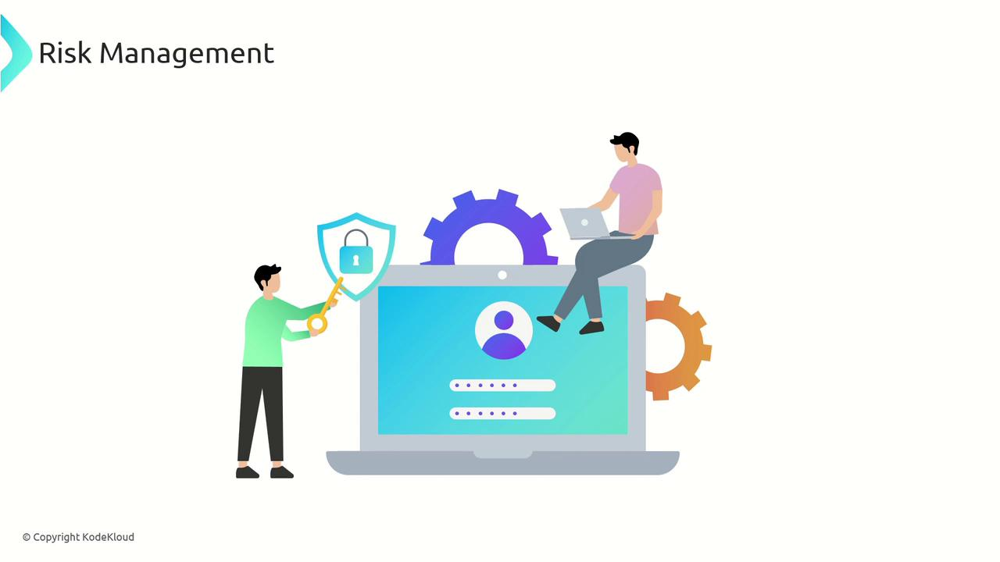

# Risk Management

Source: https://notes.kodekloud.com/docs/CompTIA-Security-Certification/Security-Management/Risk-Management/page

This article focuses on understanding and managing risk within security governance to protect organizational assets and maintain stakeholder trust.

In this article, we focus on understanding and effectively managing risk within the realm of security governance. Risk is defined as the potential for a breach or loss that could significantly impact your organization. Essentially, it represents the possibility of an undesirable event occurring, whether due to known threats or unforeseen circumstances.

<Frame>
  
</Frame>

It is imperative to continuously address and manage these security risks to safeguard organizational assets, maintain operational integrity, and uphold stakeholder trust.

<Callout icon="lightbulb">
  Implementing a proactive risk management strategy can significantly reduce vulnerabilities and enhance your organization's resilience against cyber threats.
</Callout>

<CardGroup>
  <Card title="Watch Video" icon="video" href="https://learn.kodekloud.com/user/courses/comptia-security-certification/module/2ed228f2-896d-4847-a874-59c17394f560/lesson/4d4173ca-a554-435e-a85d-b0acbd5276a3" />
</CardGroup>
