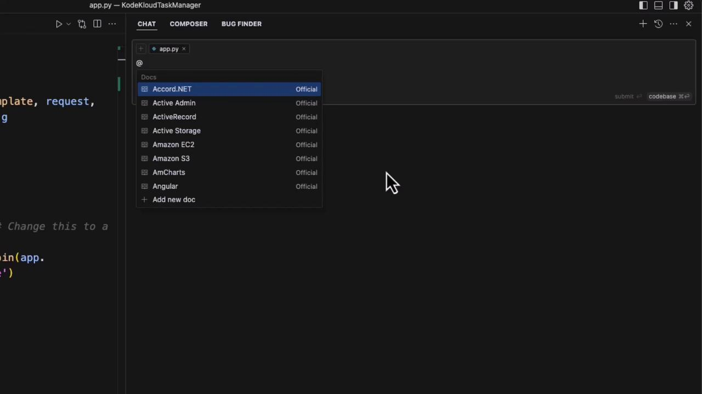
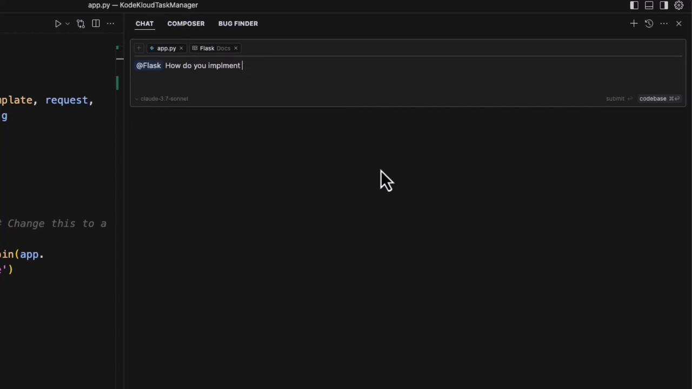
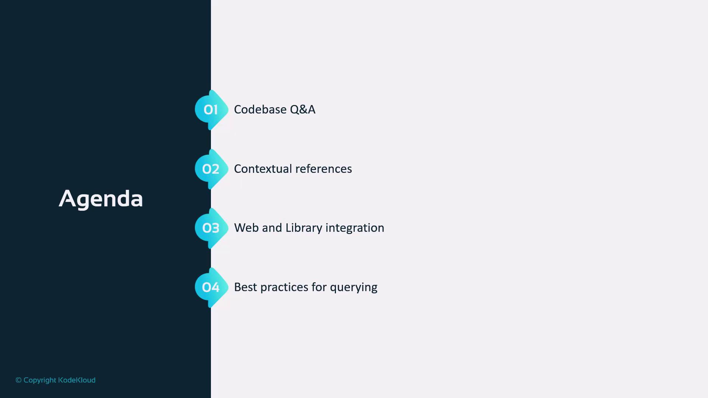

# In-memory token blacklist
blacklist = set()

@app.route("/login", methods=["POST"])
def login():
    username = request.json.get("username")
    password = request.json.get("password")
    # Replace with real credential validation
    if username != "test" or password != "test":
        return jsonify({"msg": "Bad username or password"}), 401

    access_token = create_access_token(identity=username)
    refresh_token = create_refresh_token(identity=username)
    return jsonify(access_token=access_token, refresh_token=refresh_token), 200

@app.route("/protected", methods=["GET"])
@jwt_required()
def protected():
    current_user = get_jwt_identity()
    return jsonify(logged_in_as=current_user), 200

@app.route("/refresh", methods=["POST"])
@jwt_required(refresh=True)
def refresh():
    current_user = get_jwt_identity()
    new_access_token = create_access_token(identity=current_user)
    return jsonify(access_token=new_access_token), 200

@jwt.token_in_blocklist_loader
def check_if_token_revoked(jwt_header, jwt_payload):
    jti = jwt_payload["jti"]
    return jti in blacklist  # Check against your blacklist storage

if __name__ == "__main__":
    app.run(debug=True)
```

<Callout icon="triangle-alert">
  Always store `JWT_SECRET_KEY` in environment variables or a secure vault in production to protect against token forgery.
</Callout>

## Browsing Local Docs Without Leaving Your Editor

Cursor AI embeds your local documentation—Flask, PyTorch, Python, Pytest, and more—into a dedicated sidebar. You can navigate topics or ask questions like “How do you implement meta tags in a Flask application?” and get immediate answers drawn from your project's source docs.

<Frame>
  
</Frame>

For example, Cursor might generate this `base.html` meta tag template:

```html theme={null}
<!DOCTYPE html>
<html lang="en">
<head>
    <meta charset="UTF-8">
    <meta name="viewport" content="width=device-width, initial-scale=1.0">
    <!-- Default meta tags -->
    <title>Default Title</title>
    <meta name="description" content="Default description for your site">
    <!-- Open Graph / Facebook -->
    <meta property="og:type" content="website">
    <meta property="og:url" content="{{ request.url }}">
    <meta property="og:title" content="Default Title">
    <meta property="og:description" content="Default description for your site">
    <meta property="og:image" content="{{ url_for('static', filename='images/default-image.jpg', _external=True) }}">
    <!-- Twitter -->
    <meta name="twitter:card" content="summary_large_image">
    <meta name="twitter:title" content="Default Title">
    <meta name="twitter:description" content="Default description for your site">
    <meta name="twitter:image" content="{{ url_for('static', filename='images/default-image.jpg', _external=True) }}">
    
    
</head>
<body>
    
    
</body>
</html>
```

You can then integrate these meta tags into your Flask routes:

```python theme={null}
@app.route('/blog/<post_id>')
def blog_post(post_id):
    post = get_post_by_id(post_id)
    return render_template(
        'blog_post.html',
        post=post,
        meta_title=post.title,
        meta_description=post.summary
    )
```

<Frame>
  
</Frame>

## Key Features Comparison

| Feature             | Benefit                                 | Access Method          |
| ------------------- | --------------------------------------- | ---------------------- |
| In-Editor Search    | Query web resources without leaving IDE | `/search <query>`      |
| Local Documentation | Instant lookup for Flask, PyTorch, etc. | Sidebar panel          |
| Code Snippets       | Auto-generate boilerplate and templates | Chat and Composer tabs |
| Debugging Tools     | Inline error detection and fixes        | Bug Finder tab         |

## Benefits of In-Editor Integration

By centralizing web search, documentation, code editing, and debugging within Cursor AI, you can:

* Maintain coding flow without context switching
* Quickly access official docs and community knowledge
* Generate and customize code snippets on the fly
* Debug and troubleshoot directly in your editor

<Callout icon="lightbulb">
  Leveraging these integrated features can reduce development time by up to 30% and improve code accuracy.
</Callout>

## References

* [Flask-JWT-Extended Documentation](https://flask-jwt-extended.readthedocs.io/)
* [Cursor AI Official Site](https://cursor.so)
* [Jinja2 Templating](https://jinja.palletsprojects.com/)
* [Python Docs](https://docs.python.org/3/)

<CardGroup>
  <Card title="Watch Video" icon="video" href="https://learn.kodekloud.com/user/courses/cursor-ai/module/68862e8d-747f-43b7-9411-80812e93a277/lesson/f44aae7c-9147-4893-8122-cec4acf2e3e1" />
</CardGroup>


# Introduction

Source: https://notes.kodekloud.com/docs/Cursor-AI/Interacting-with-your-Codebase/Introduction/page

This lesson demonstrates how to use Cursor AI to enhance productivity and understanding in large codebases.

Efficiently querying and exploring large codebases is vital for modern development workflows. In this lesson, we’ll demonstrate how to leverage Cursor AI across four core areas to boost productivity and code comprehension.

<Callout icon="lightbulb">
  Cursor is an AI-powered code assistant that enables you to query, navigate, and understand complex codebases using natural language prompts.
</Callout>

We’ll cover:

1. **Codebase Q\&A**\
   Ask direct questions about functions, classes, and architecture to get instant answers.
2. **Contextual References**\
   Maintain scalable context across multiple files and project directories.
3. **Web & Library Integration**\
   Combine local code insights with external documentation and open-source libraries.
4. **Best Practices for Querying**\
   Learn tips for crafting precise prompts and optimizing your AI-powered searches.

<Frame>
  
</Frame>

By the end of this lesson, you’ll be ready to apply Cursor effectively in your most complex development scenarios.

## Links and References

* [Cursor Documentation](https://cursor.ai/docs)

<CardGroup>
  <Card title="Watch Video" icon="video" href="https://learn.kodekloud.com/user/courses/cursor-ai/module/68862e8d-747f-43b7-9411-80812e93a277/lesson/26097617-a134-4904-b409-7d34ab1bb945" />
</CardGroup>
