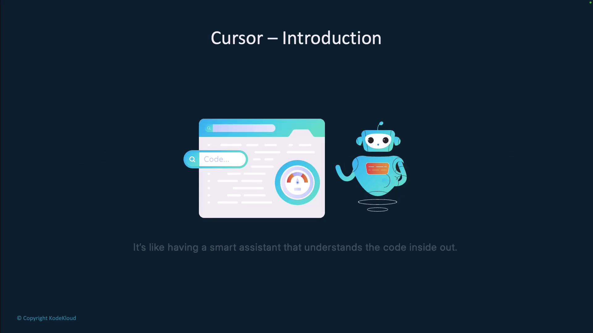
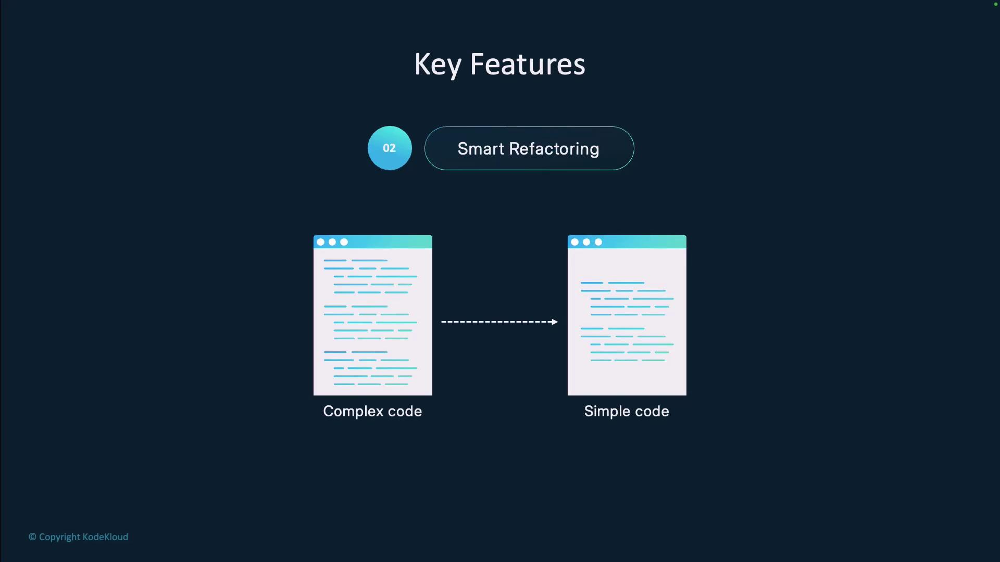
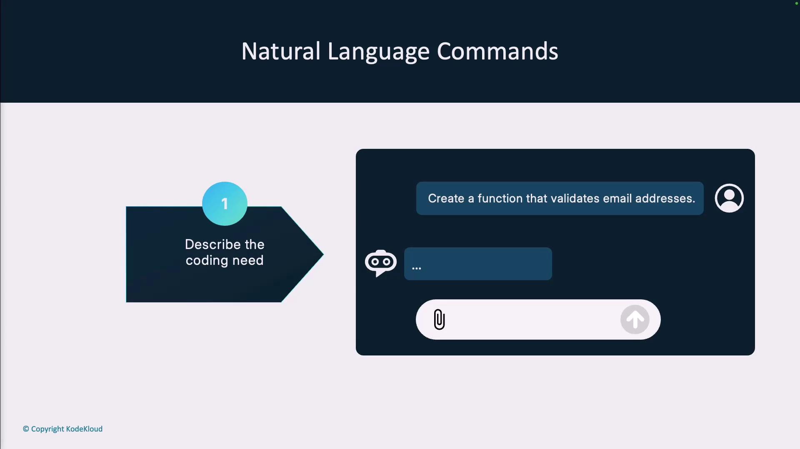
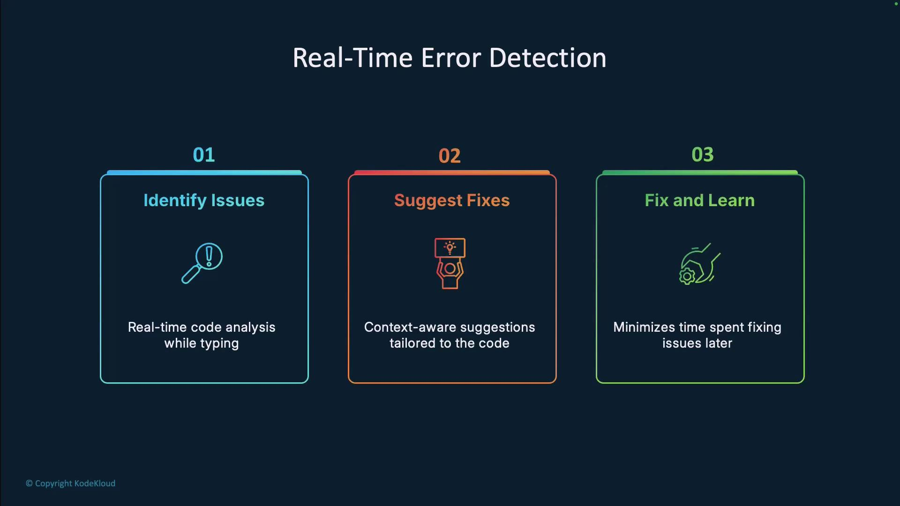
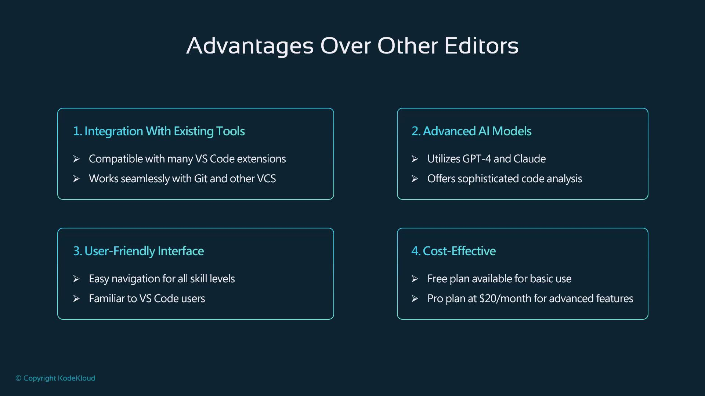
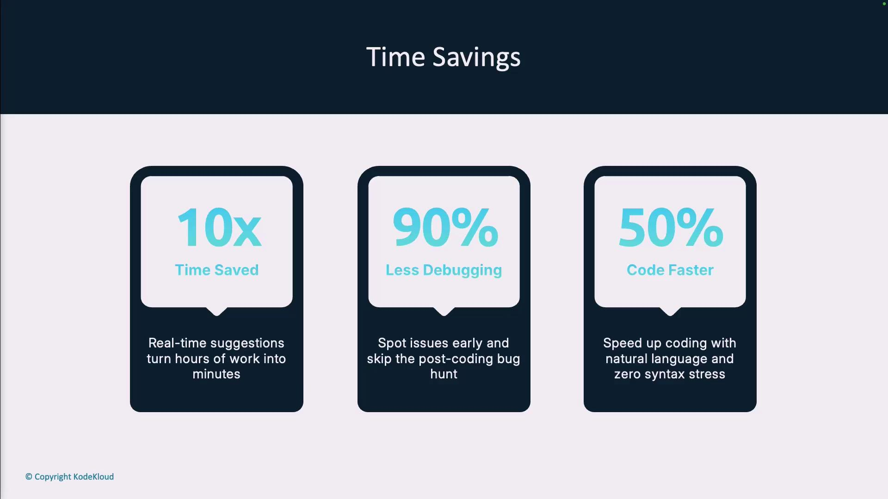
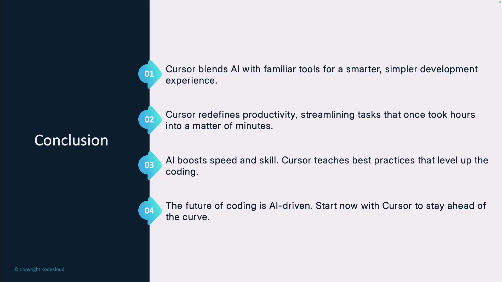

# hello_world.py
def main():
    print("Hello, World!")

if __name__ == "__main__":
    main()
```

Run it in Cursor’s terminal:

```bash theme={null}
python3 hello_world.py
# Output:
# Hello, World!
```

On Ubuntu, you can pin Cursor to the Dock (Dash) by right-clicking its icon and selecting **Add to Favorites**.

***

## References

* [Cursor Official Site](https://cursor.com)
* [VS Code Documentation](https://code.visualstudio.com/docs)
* [Ubuntu Linux](https://ubuntu.com)
* [FUSE on Linux](https://github.com/libfuse/libfuse)

<CardGroup>
  <Card title="Watch Video" icon="video" href="https://learn.kodekloud.com/user/courses/cursor-ai/module/1ca163cf-4d24-4135-a1e6-ff2848c741bf/lesson/5511c2bd-dbd6-45c9-b824-3aa2de2da9a5" />
</CardGroup>


# Why use Cursor

Source: https://notes.kodekloud.com/docs/Cursor-AI/Introduction-to-Cursor/Why-use-Cursor/page

Cursor is an AI-powered code editor designed to enhance productivity and streamline development with intelligent assistance throughout the coding process.

Ready to revolutionize your coding experience? Cursor is an AI-powered code editor built on the familiar [VS Code][vc] platform, designed to boost productivity and streamline development. With intelligent assistance at every step, Cursor helps you focus on creativity rather than repetitive tasks.

## Generate Assets Programmatically

Cursor integrates seamlessly with Node.js and popular libraries like `canvas` to automate asset creation. For example, you can programmatically generate game graphics with just a few lines of JavaScript:

```javascript theme={null}
const fs = require('fs');
const { createCanvas } = require('canvas');

// Generate raccoon icon
const raccoonCanvas = createCanvas(32, 32);
const raccoonCtx = raccoonCanvas.getContext('2d');
raccoonCtx.fillStyle = '#666';
raccoonCtx.beginPath();
raccoonCtx.arc(16, 16, 10, 0, Math.PI * 2);
raccoonCtx.fillStyle = '#fff';
raccoonCtx.beginPath();
raccoonCtx.arc(12, 12, 4, 0, Math.PI * 2);
raccoonCtx.fill();
fs.writeFileSync('dist/assets/raccoon.png', raccoonCanvas.toBuffer());

// Generate platform graphic
const platformCanvas = createCanvas(100, 20);
const platformCtx = platformCanvas.getContext('2d');
platformCtx.fillStyle = '#884513';
platformCtx.fillRect(0, 0, 100, 20);
fs.writeFileSync('dist/assets/platform.png', platformCanvas.toBuffer());
```

## AI-Powered Autocompletion

Cursor’s intelligent autocompletion goes beyond simple syntax suggestions. It analyzes your entire codebase to predict complete code blocks in context, matching your coding style and project patterns.

<Callout icon="lightbulb">
  Use Cursor’s autocompletion to reduce boilerplate and maintain consistent formatting across your files.
</Callout>

For instance, when starting a game script:

```javascript theme={null}
let rope;
let isSwinging = true;
let isHolding = false;
let scoreA = 200;
let scoreB = 0;
let generator;

function preload() {
  // load game assets
}
```

You might outline your new mechanics:

* **Raccoon Setup**: starts at a 45° angle
* **Extended Swing**: rope length increased to 15 units
* **Control Scheme**: hold `H` to charge, `SPACE` to release

Cursor can detect this context and auto-generate event handlers, physics logic, collision detection, and more—saving keystrokes and minimizing errors.

<Frame>
  
</Frame>

## Smart Refactoring

Maintain clean, readable code with Cursor’s automated refactoring suggestions. It spots unused variables, simplifies complex conditionals, and offers single-click transformations to improve maintainability.

<Frame>
  
</Frame>

## Natural Language Commands

Skip memorizing CLI flags or API signatures. Describe your intent in plain English and let Cursor generate tailored solutions. For example, say “Create a function to validate email addresses,” and Cursor generates multiple code snippets for you to choose from and refine.

<Frame>
  
</Frame>

## Real-Time Error Detection

Catch bugs as you type. Cursor continuously analyzes your code, highlights potential issues, and suggests precise fixes—helping you learn best practices and reduce debugging time.

<Frame>
  
</Frame>

## Integrated AI Chat Assistant

Access a project-aware AI chat directly within your editor. Ask questions like “How does the authentication system work?” or “Why is this function throwing an error?” and get answers based on your codebase, not generic examples.

| Feature             | Benefit                                                       |
| ------------------- | ------------------------------------------------------------- |
| Codebase Awareness  | Contextual answers tailored to your implementation            |
| In-Editor Chat      | No need to switch to external documentation or forums         |
| Deep Link Support   | Jump directly to relevant lines in your project               |
| Multi-Model Support | Choose from models like [ChatGPT-4][gpt4] or [Claude][claude] |

<Frame>
  
</Frame>

## Time Savings Infographic

Developers report dramatic gains across key metrics:

* **10× Time Saved** on routine tasks
* **90% Less Debugging** with proactive error alerts
* **50% Faster Coding** using natural language prompts

<Frame>
  
</Frame>

## Conclusion

Cursor represents a new era in AI-assisted development. By merging a familiar [VS Code][vc] interface with advanced AI, it empowers you to:

1. Blend AI suggestions with your preferred workflow
2. Redefine productivity and code quality
3. Accelerate feature development and learning
4. Stay ahead in the evolving world of software engineering

<Frame>
  
</Frame>

## Get Started with Cursor

Download [Cursor][cursor] today and transform the way you code. Your future self will thank you for the hours saved and the frustration avoided.

***

## References

* [VS Code][vc]
* [ChatGPT-4][gpt4]
* [Claude][claude]

[cursor]: https://cursor.so

[vc]: https://code.visualstudio.com

[gpt4]: https://openai.com/product/chatgpt-4

[claude]: https://www.anthropic.com/product/claude

<CardGroup>
  <Card title="Watch Video" icon="video" href="https://learn.kodekloud.com/user/courses/cursor-ai/module/1ca163cf-4d24-4135-a1e6-ff2848c741bf/lesson/f39a4b42-0b03-4c24-a55c-2b6ac48484ca" />
</CardGroup>
