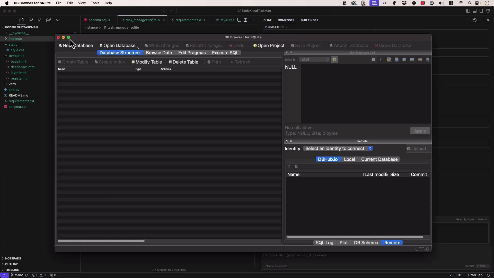
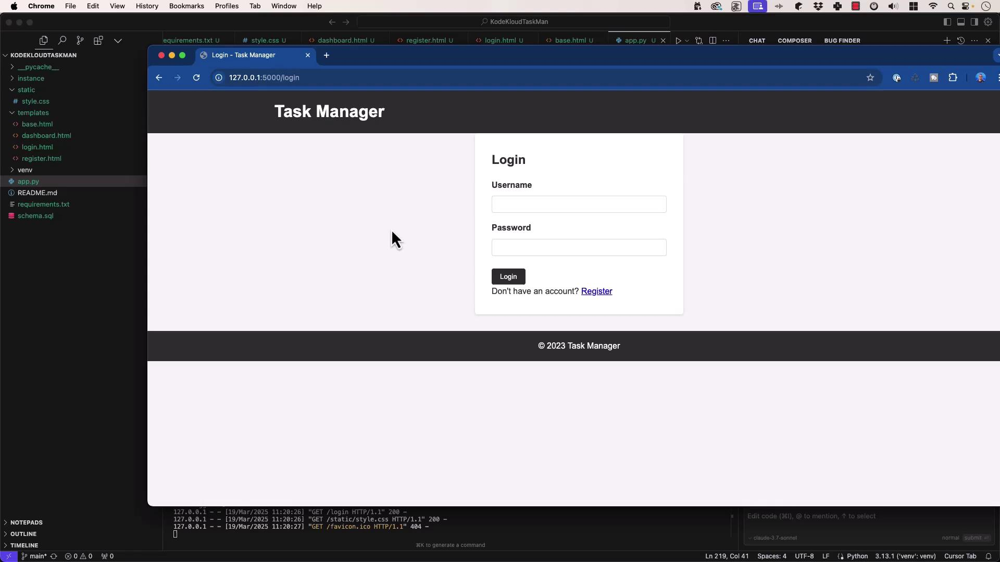
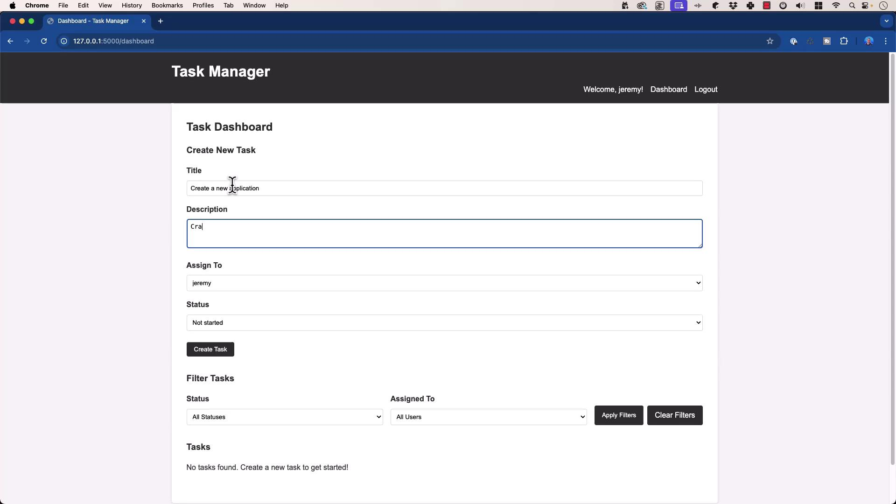
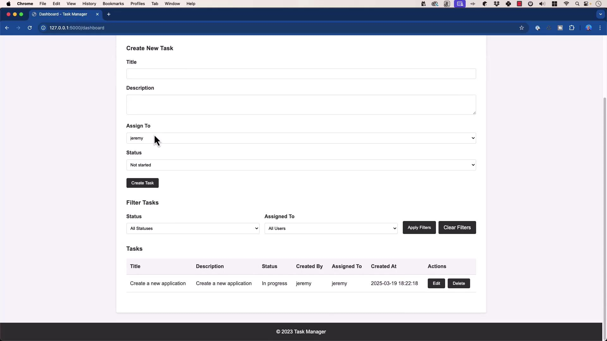
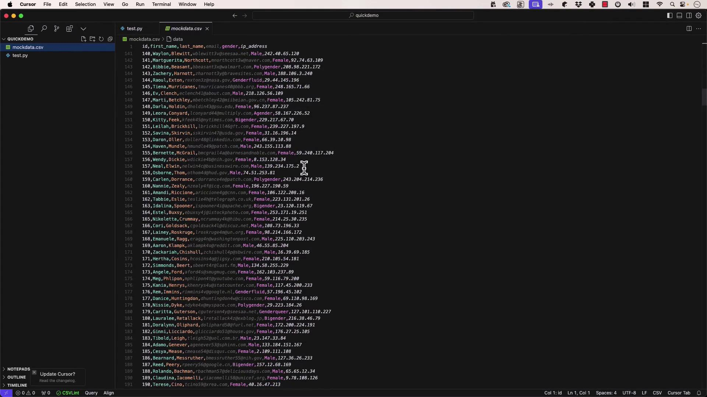
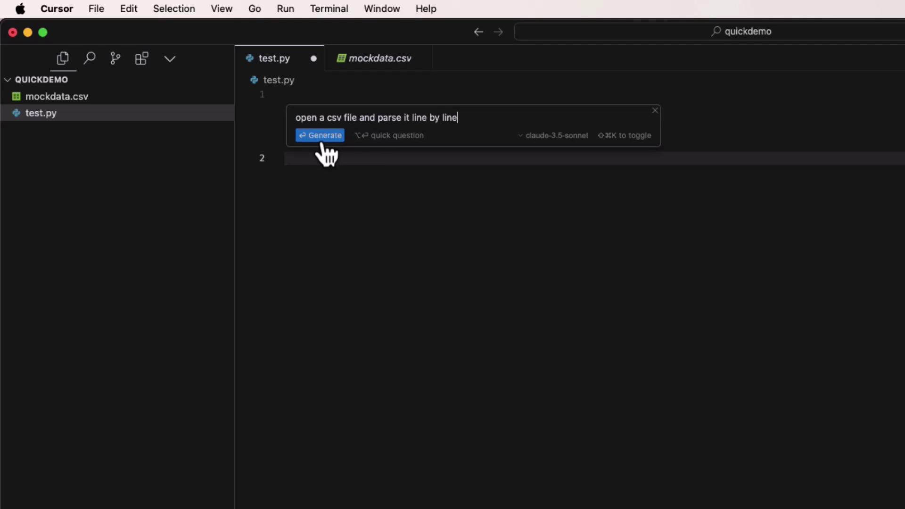

# Authentication helpers
def login_required(view):
    from functools import wraps
    @wraps(view)
    def wrapped_view(**kwargs):
        if 'user_id' not in session:
            return redirect(url_for('login'))
        return view(**kwargs)
    return wrapped_view

@app.route('/register', methods=('GET','POST'))
def register():
    if request.method == 'POST':
        username, password = request.form['username'], request.form['password']
        db, error = get_db(), None
        if not username: error = 'Username is required.'
        elif not password: error = 'Password is required.'
        elif db.execute('SELECT id FROM users WHERE username=?', (username,)).fetchone():
            error = f'User {username} already exists.'
        if error is None:
            db.execute('INSERT INTO users (username, password) VALUES (?, ?)',
                       (username, generate_password_hash(password)))
            db.commit()
            return redirect(url_for('login'))
        flash(error)
    return render_template('register.html')

@app.route('/login', methods=('GET','POST'))
def login():
    if request.method == 'POST':
        username, password = request.form['username'], request.form['password']
        db, user = get_db(), None
        user = db.execute('SELECT * FROM users WHERE username=?', (username,)).fetchone()
        if user and check_password_hash(user['password'], password):
            session.clear()
            session['user_id'] = user['id']
            return redirect(url_for('dashboard'))
        flash('Invalid credentials.')
    return render_template('login.html')

@app.route('/logout')
def logout():
    session.clear()
    return redirect(url_for('login'))

@app.route('/')
def index():
    return redirect(url_for('dashboard' if 'user_id' in session else 'login'))

@app.route('/dashboard')
@login_required
def dashboard():
    status_filter = request.args.get('status', '')
    user_filter   = request.args.get('user', '')
    query = """
        SELECT t.id, t.title, t.description, t.status, t.created_at,
               c.username AS created_by, a.username AS assigned_to
        FROM tasks t
        JOIN users c ON t.created_by = c.id
        JOIN users a ON t.assigned_to = a.id
        WHERE 1=1
    """
    params = []
    if status_filter:
        query += ' AND t.status = ?'; params.append(status_filter)
    if user_filter:
        query += ' AND assigned_to = ?'; params.append(user_filter)
    query += ' ORDER BY t.created_at DESC'
    tasks    = get_db().execute(query, params).fetchall()
    users    = get_db().execute('SELECT id, username FROM users').fetchall()
    statuses = ['Not started','In progress','Complete','Blocked','Closed']
    return render_template('dashboard.html',
                           tasks=tasks, users=users,
                           statuses=statuses,
                           status_filter=status_filter,
                           user_filter=user_filter)

@app.route('/task/create', methods=('POST',))
@login_required
def create_task():
    title = request.form['title']
    description = request.form['description']
    assigned_to = request.form['assigned_to']
    status = request.form['status']
    db = get_db()
    db.execute(
        'INSERT INTO tasks (title, description, status, created_by, assigned_to) VALUES (?, ?, ?, ?, ?)',
        (title, description, status, session['user_id'], assigned_to)
    )
    db.commit()
    flash('Task created successfully!')
    return redirect(url_for('dashboard'))

@app.route('/task/<int:id>/update', methods=('POST',))
@login_required
def update_task(id):
    status = request.form['status']
    assigned_to = request.form['assigned_to']
    db = get_db()
    db.execute('UPDATE tasks SET status=?, assigned_to=? WHERE id=?',
               (status, assigned_to, id))
    db.commit()
    flash('Task updated successfully!')
    return redirect(url_for('dashboard'))

@app.route('/task/<int:id>/delete', methods=('POST',))
@login_required
def delete_task(id):
    db = get_db()
    db.execute('DELETE FROM tasks WHERE id=?', (id,))
    db.commit()
    flash('Task deleted successfully!')
    return redirect(url_for('dashboard'))

if __name__ == '__main__':
    logging.basicConfig(level=logging.DEBUG)
    app.run(debug=True, host='0.0.0.0', port=5000)
```

## 7. Installing & Running

```bash theme={null}
# 1. Create and activate virtual environment
python3 -m venv venv
source venv/bin/activate      # macOS/Linux
# 2. Install dependencies
pip install --upgrade pip
pip install -r requirements.txt

# 3. Initialize the database
flask --app app init-db

# 4. Run the development server
flask --app app run --debug
```

## 8. Inspecting with DB Browser

After initialization, open the SQLite file in [DB Browser for SQLite](https://sqlitebrowser.org/) to verify your tables.

<Frame>
  
</Frame>

## 9. Using the Task Manager

Browse to `http://127.0.0.1:5000/` to see the login screen:

<Frame>
  
</Frame>

1. **Register** a new user
2. **Create & assign** tasks

<Frame>
  
</Frame>

3. **View, update, filter, or delete** tasks:

<Frame>
  
</Frame>

## 10. Conclusion & References

**Key Takeaways**

* Prompt specificity drives accurate LLM output.
* Model quality (e.g., Cloud 3.7 Sonnet) matters for code generation.

### Further Reading

* [Flask Documentation](https://flask.palletsprojects.com/)
* [SQLite Documentation](https://www.sqlite.org/docs.html)
* [Jinja2 Template Engine](https://jinja.palletsprojects.com/)
* [Werkzeug Security](https://werkzeug.palletsprojects.com/en/latest/utils/#module-werkzeug.security)

<CardGroup>
  <Card title="Watch Video" icon="video" href="https://learn.kodekloud.com/user/courses/cursor-ai/module/e11e1c1e-9b6b-4c53-b14a-24babbd114a5/lesson/ef7f933b-8f13-4ea9-8ccb-ec37d1a32b11" />
</CardGroup>


# Demo Intelligent Code Suggestions

Source: https://notes.kodekloud.com/docs/Cursor-AI/Mastering-Autocompletion/Demo-Intelligent-Code-Suggestions/page

This guide explores how Cursor AI enhances Python development with intelligent code suggestions through three powerful modes.

In this guide, we’ll explore how **Cursor AI** supercharges your Python development by offering three powerful modes of code suggestions:

1. **Generate New Code Snippets** (Command K / Ctrl + K)
2. **Inline Chat for Refactors** (Command L / Ctrl + L)
3. **Quick Inline Completions** (Comments + Tab)

We’ll demonstrate these features by parsing a simple CSV file in a Python project.

***

## Project Setup

1. Create a folder named `Quick Demo`.
2. Inside it, add:
   * `test.py`
   * `mockdata.csv` containing headers and rows of user data.

<Frame>
  
</Frame>

```bash theme={null}
mkdir "Quick Demo" && cd "Quick Demo"
touch test.py mockdata.csv
```

<Callout icon="lightbulb">
  Ensure `mockdata.csv` is in the same directory as `test.py` so the script can locate it.
</Callout>

***

## 1. Generate Code with Command K

With `test.py` open, press **Command K** (macOS) or **Ctrl + K** (Windows/Linux).\
**Prompt:**

> Open `mockdata.csv` and parse it line by line.

Select a model (e.g., **Claude 3.5 Sonnet**) and accept the generated snippet:

```python theme={null}
import csv

with open('mockdata.csv', 'r') as file:
    csv_reader = csv.reader(file)
    header = next(csv_reader)  # Skip header

    for row in csv_reader:
        # Each row is a list of values
        user_id, first_name, last_name, email, gender, ip_address = row
        print(f"Processing user {first_name} {last_name}")
```

<Frame>
  
</Frame>

***

## 2. Wrap in `main()` with Inline Chat (Command L)

To structure your script entry point:

1. Press **Command L** (macOS) or **Ctrl + L** (Windows/Linux).
2. Enter:
   > “Please wrap this code in a `main()` function and add the `if __name__ == '__main__'` guard.”

Cursor AI will suggest the edits. Apply them to get:

```python theme={null}
import csv

def main():
    with open('mockdata.csv', 'r') as file:
        csv_reader = csv.reader(file)
        header = next(csv_reader)
        for row in csv_reader:
            user_id, first_name, last_name, email, gender, ip_address = row
            print(f"Processing user {first_name} {last_name}")

if __name__ == "__main__":
    main()
```

Run it in your terminal:

```bash theme={null}
python3 test.py
```

You’ll see:

```text theme={null}
Processing user Vinnie Orne
Processing user Rudolf Tweedle
Processing user Kelliina Boyens
...
```

<Callout icon="lightbulb">
  Using **Command L** lets Cursor AI review your entire file (or project) for context-aware refactors.
</Callout>

***

## 3. Quick Inline Edits with Comments + Tab

For one-line tweaks, simply write a comment and hit **Tab**.\
For example, to print only IP addresses that aren’t `192.168.1.1`:

```python theme={null}
