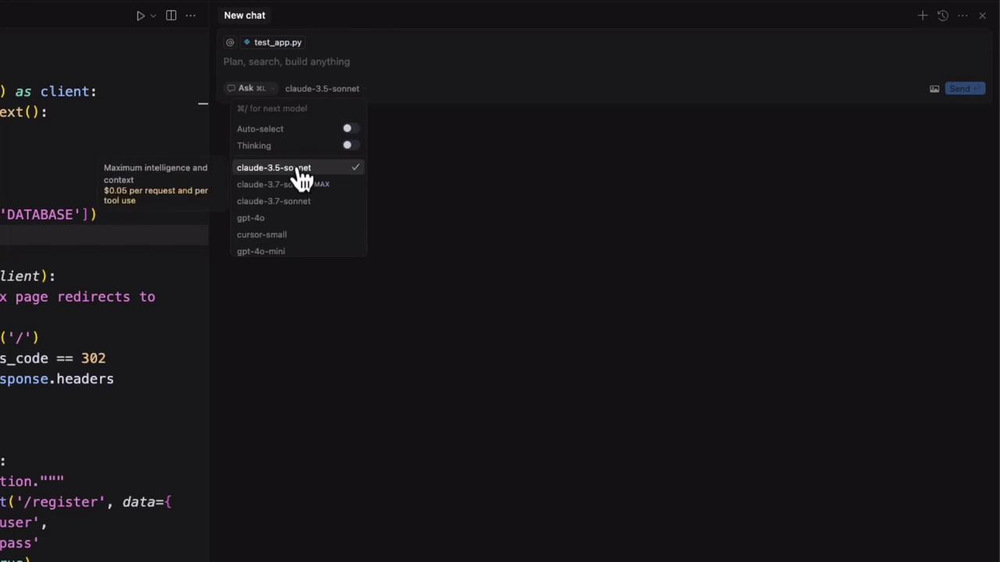
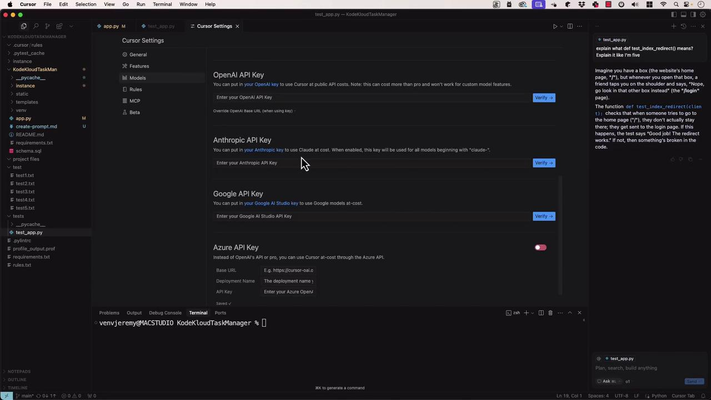
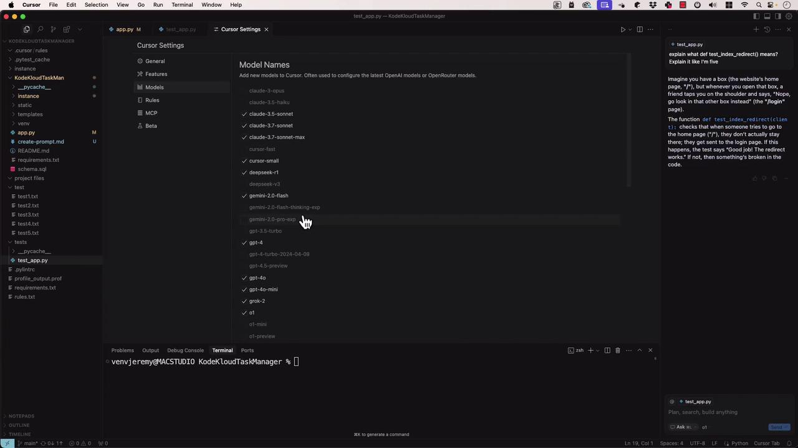

# Create and activate venv
python -m venv venv
source venv/bin/activate

# Install pytest
pip install pytest
```

## 5. Run the Data Processing Script

Execute the generated script:

```bash theme={null}
python process_customers.py
```

<Callout icon="lightbulb">
  The script writes output files `namevalues.csv` and `phone.txt` without printing to the console. Verify with:

  ```bash theme={null}
  head -n 5 namevalues.csv
  head -n 5 phone.txt
  ```
</Callout>

## 6. Inspect Output Samples

```bash theme={null}
# namevalues.csv
first_name,last_name
Joye,Lonnon
Charyl,Wanka
Merrel,Palumbo
Dannel,Tarplee

# phone.txt
619-459-1773
916-472-7327
215-772-7423
723-375-1649
217-778-2922
```

## 7. Run and Auto-Fix Tests

```bash theme={null}
pytest test_process_customers.py -v
```

If any tests fail, Agent Mode will update the tests and re-run them automatically until they pass.

## 8. Generate `requirements.txt` and `README.md`

Ask the agent to scaffold these files:

**requirements.txt**

```text theme={null}
pytest>=8.0
```

**README.md**

````markdown theme={null}
## Setup

1. Clone the repository.
2. Create a virtual environment:
   ```bash
   python -m venv venv
   ```text
3. Activate:
   - macOS/Linux: `source venv/bin/activate`
   - Windows: `venv\Scripts\activate`
4. Install dependencies:
   ```bash
   pip install -r requirements.txt
   ```text

## Usage

```bash
python process_customers.py
```text
Reads `customers.csv`, writes names to `namevalues.csv` and phones to `phone.txt`.

## Testing

```bash
pytest -v
```text
````

***

```python theme={null}
import csv

def process_customer_data(input_file, name_output_file, phone_output_file):
    """
    Process customer data from a CSV file and extract names and phone numbers.

    Args:
        input_file (str): Path to the input CSV file.
        name_output_file (str): Path to the output CSV file for names.
        phone_output_file (str): Path to the output TXT file for phone numbers.
    """
    with open(input_file, newline='') as csvfile:
        reader = csv.DictReader(csvfile)
        names, phones = [], []
        for row in reader:
            first = row.get('first_name', '').strip()
            last = row.get('last_name', '').strip()
            phone = row.get('phone_number', '').strip()
            if first or last:
                names.append((first, last))
            if phone:
                phones.append(phone)

    with open(name_output_file, 'w', newline='') as namefile:
        writer = csv.writer(namefile)
        writer.writerow(['first_name', 'last_name'])
        writer.writerows(names)

    with open(phone_output_file, 'w') as phonefile:
        for phone in phones:
            phonefile.write(phone + '\n')

if __name__ == '__main__':
    process_customer_data('customers.csv', 'namevalues.csv', 'phone.txt')
```

***

## Links and References

* [Python venv documentation](https://docs.python.org/3/library/venv.html)
* [pytest documentation](https://docs.pytest.org/en/stable/)
* [Python csv module](https://docs.python.org/3/library/csv.html)

<CardGroup>
  <Card title="Watch Video" icon="video" href="https://learn.kodekloud.com/user/courses/cursor-ai/module/fcc10c1c-5240-4626-9bfc-bf172a3a00c6/lesson/4c460141-9452-4eed-a5fb-fe6882f49918" />
</CardGroup>


# Demo Choosing Models

Source: https://notes.kodekloud.com/docs/Cursor-AI/Understanding-and-Customizing-Cursor/Demo-Choosing-Models/page

This lesson demonstrates running Flask tests and configuring AI models in Cursor for various development tasks.

In this lesson, we’ll show you how to run Flask tests and configure different AI models inside Cursor for autocompletion, code explanation, or multi-step tasks. By the end, you’ll know how to select, customize, and manage models to fit your development workflow.

## 1. Running Flask Application Tests

Start by defining fixtures and writing basic tests for your Flask app:

```python theme={null}
import os
import pytest
from app import app, init_db

@pytest.fixture
def client():
    # Initialize test client and database
    with app.test_client() as client:
        with app.app_context():
            init_db()
        yield client
    # Clean up temp database files
    os.close(db_fd)
    os.unlink(app.config['DATABASE'])

def test_index_redirect(client):
    """Ensure the index page redirects to login."""
    response = client.get('/')
    assert response.status_code == 302
    assert '/login' in response.headers['Location']

def test_register(client):
    """Verify user registration flow."""
    response = client.post(
        '/register',
        data={'username': 'testuser', 'password': 'testpass'},
        follow_redirects=True
    )
    assert response.status_code == 200
    assert b'Account created successfully!' in response.data
```

## 2. Browsing Model Options in Cursor

Open the chat interface to explore AI model settings:

* Left sidebar: Toggle autocompletion modes (Ask, Agentic, Edit).
* Right pane: Choose a specific model or leave on Auto-select.

<Frame>
  
</Frame>

<Callout icon="lightbulb">
  Auto-select lets Cursor pick the best model based on your preferences and credits.
</Callout>

## 3. AI Model Categories

| Category        | Description                                             |
| --------------- | ------------------------------------------------------- |
| Traditional LLM | Direct response (e.g., ChatGPT, Claude).                |
| Thinking LLM    | Returns answer + step-by-step reasoning.                |
| Agentic LLM     | Automates complex, multi-step workflows (Agentic mode). |

### Example: 2 + 2

Traditional LLM

```text theme={null}
Prompt: "What is 2 plus 2?"
Response: "4"
```

Thinking LLM

```text theme={null}
To find 2 plus 2, I add the numbers together: 2 + 2 = 4. Therefore, the answer is 4.
```

## 4. Popular Models in Cursor

| Model             | Key Strength          | Pricing Example         |
| ----------------- | --------------------- | ----------------------- |
| Claude 3.5 Sonnet | Reliable baseline     | —                       |
| Claude 3.7        | Advanced reasoning    | \$0.05 per request/tool |
| GPT-4             | High speed & accuracy | —                       |
| GPT-4 Mini        | Cost-effective        | —                       |

<Callout icon="triangle-alert">
  Costs can add up quickly—monitor your credits and usage in Cursor Pro or via public API billing.
</Callout>

## 5. Ask Mode for Detailed Explanations

Switch to **Ask Mode** to request human-friendly explanations:

> “Explain what `def test_index_redirect` means.”

```python theme={null}
def test_index_redirect(client):
    """Test that the index page redirects to login."""
    response = client.get('/')
    assert response.status_code == 302
    assert '/login' in response.headers['Location']
```

With GPT-4 in Ask Mode, you might see:

> “This function uses Flask’s test client to ensure a request to `/` returns a 302 redirect to `/login`.”

Experiment by selecting a thinking model and adding prompts like “explain it like I’m five” for varied results.

## 6. Customizing Models in Settings

Under **Cursor Settings → Models**, you can:

* Toggle models on/off
* Enter API keys for [OpenAI](https://openai.com), [Anthropic](https://www.anthropic.com), [Google Cloud](https://cloud.google.com), [Azure](https://azure.microsoft.com)
* Manage billing preferences (Cursor Pro vs. public API)

<Frame>
  
</Frame>

Enable or disable the models you need, then close the panel to apply changes.

<Frame>
  
</Frame>

## Links and References

* [Kubernetes Documentation](https://kubernetes.io/docs/)
* [OpenAI](https://openai.com)
* [Anthropic](https://www.anthropic.com)
* [Google Cloud AI](https://cloud.google.com)
* [Azure AI Services](https://azure.microsoft.com)

<CardGroup>
  <Card title="Watch Video" icon="video" href="https://learn.kodekloud.com/user/courses/cursor-ai/module/fcc10c1c-5240-4626-9bfc-bf172a3a00c6/lesson/c3bd662c-a746-4bc8-b434-15545ebe36e0" />
</CardGroup>
