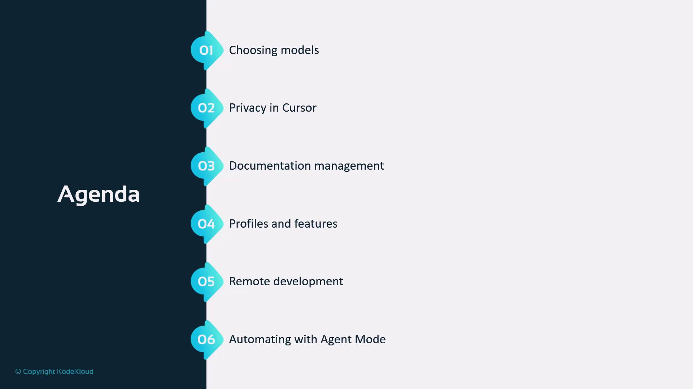

# python
import time
from sklearn import svm
from sklearn.datasets import fetch_openml
from sklearn.model_selection import cross_val_score

musk = fetch_openml('musk', version=1)

start_time = time.time()
X, y = musk.data, musk.target
clf = svm.SVC(gamma='auto')

print("Starting cross validation!")

scores = cross_val_score(clf, X, y, cv=2, n_jobs=-1)

print("Mean score", scores.mean())
print("--- %s seconds ---" % (time.time() - start_time))
print("VS Code Remote Rocks")
```

Add a new SSH host

1. In Cursor, select “Connect via SSH”.
2. Choose “Add New SSH Host” and enter the host using the form user\@host (recommended) or the IP address.

If you only provide an IP address, Cursor/VS Code will append your local username to the entry which can cause accidental logins as the wrong user — so prefer user\@host.

When prompted, choose where to save the SSH configuration entry (your local SSH config file).

<Callout icon="warning">
  Always prefer specifying user\@host in your SSH entries (for example jeremy\@10.0.0.94). If you only specify an IP, your local username may be appended automatically and you may log in as a different user than intended.
</Callout>

<Frame>
  
</Frame>

Connecting and selecting the remote platform

* After adding the host, click Connect. Cursor opens a new window and prompts you to select the remote platform (Linux, Windows, or macOS) for that host.
* You will typically confirm the host fingerprint and then authenticate with a password or SSH key.

<Frame>
  
</Frame>

Typical prompts you will see from the client (example)

```bash theme={null}
# If the host is new, confirm the fingerprint
The authenticity of host '10.0.0.94 (10.0.0.94)' can't be established.
ECDSA key fingerprint is SHA256:xxxxxxxxxxxxxxxxxxxxxxxxxxxxxxxxxxxx.
Are you sure you want to continue connecting (yes/no/[fingerprint])? yes

# Then you'll be prompted for the remote user's password
Enter password for jeremy@10.0.0.94:
```

Setting up the remote server

* If this is the first time connecting, Cursor/VS Code will install the VS Code server on the remote host. You’ll see a status such as “Downloading VS Code Server...” while installation completes.
* After installation, the server runs on the remote machine and accepts connections from the Cursor client.

<Frame>
  
</Frame>

Open a remote folder or clone a repository

* Once the server is running, open a folder that exists on the remote host or clone a repository into the remote workspace.
* The Cursor file explorer now reflects files on the remote filesystem.

Example: listing a projects folder on the remote host

```bash theme={null}
# Remote bash prompt
[jeremy@crashbox ~]$ ls -la /home/jeremy/Projects
drwxr-xr-x 3 jeremy jeremy 4096 Mar 26 20:37 .cursor
-rw-r--r-- 1 jeremy jeremy 8196 Mar 26 20:37 .DS_Store
drwxr-xr-x 7 jeremy jeremy 4096 Mar 26 20:37 .git
drwxr-xr-x 6 jeremy jeremy 4096 Mar 26 20:37 KodeKloudTaskMan
-rw-r--r-- 1 jeremy jeremy 302107 Mar 26 20:37 profile_output.prof
-rw-r--r-- 1 jeremy jeremy 1066 Mar 26 20:37 .pylintrc
-rw-r--r-- 1 jeremy jeremy 381 Mar 26 20:37 requirements.txt
-rw-r--r-- 1 jeremy jeremy 106 Mar 26 20:37 rules.txt
drwxr-xr-x 2 jeremy jeremy 4096 Mar 26 20:37 test
drwxr-xr-x 2 jeremy jeremy 4096 Mar 26 20:37 tests
[jeremy@crashbox KodeKloudTaskMan]$
```

Open files and run terminals on the remote host

* Any terminal you open from a Cursor window connected to the host runs on the remote machine.
* Editing files, running scripts, installing packages, or debugging will execute remotely, using the remote host’s CPU/GPU and filesystem.

Example: remote terminal and process listing

```bash theme={null}
[jeremy@crashbox KodeKloudTaskMan]$ ps aux | head -n 10
USER       PID %CPU %MEM    VSZ   RSS TTY      STAT START   TIME COMMAND
jeremy   192755  1.6  0.0 11791608 58128 ?       S1   20:40   0:00 /home/jeremy/.cursor-server/cli/servers/Stable-82ef0f61c01d079d1b7e5ab04d88499d5
root     192822  0.0  0.0      0     0 ?        I    20:41   0:00 [kworker/17:0-dio/nvme0n1p2]
jeremy   192855  4.0  0.0   4992  3360 ?        S    20:41   0:01 /home/jeremy/.cursor-server/extensions/ms-python.python-2024.12.3-linux-x64/pyth
...
[jeremy@crashbox KodeKloudTaskMan]$
```

Example snippet from a remote project (Flask application)

* You can open and edit apps like a Flask project directly on the remote host. Below is a small excerpt.

```python theme={null}
# python
"""
Task Manager Flask Application.

This module implements a simple task management web application using Flask.
It provides features for user authentication, task creation, updating, and deletion.
Tasks can be assigned to different users and filtered by status.
"""

import csv
import sqlite3
import os
from flask import Flask, render_template, request, redirect, url_for, flash, session, g
from datetime import datetime
import hashlib
import logging

# Initialize Flask app
app = Flask(__name__)
app.config['SECRET_KEY'] = 'dev'  # Change this to a random secret key in production
app.config['DATABASE'] = os.path.join(app.instance_path, 'task_manager.sqlite')

def read_csv(file_path):
    """
    Read data from a CSV file and print each row.

    Args:
        file_path (str): Path to the CSV file to be read

    Returns:
        None: This function prints each row to the console but doesn't return any value
    """
    with open(file_path, newline='') as csvfile:
        reader = csv.reader(csvfile)
        for row in reader:
            print(row)
```

Connecting to other hosts and operating systems

* You can add multiple SSH host entries to your SSH config and switch between machines (Linux, macOS, Windows).
* The process is the same: add user\@host to your SSH config, connect from Cursor, choose the correct platform, and authenticate.

Example macOS connection prompt

```bash theme={null}
# macOS zsh prompt when connected remotely
jeremy@MACSTUDIO ~ % ls -la ~/Projects/Pygame_Traffic_Light_Simulator
# ... project files listed ...
```

Quick reference: remote development workflow

| Step           | What happens                                              | Notes                                                  |
| -------------- | --------------------------------------------------------- | ------------------------------------------------------ |
| Add SSH host   | Create an SSH config entry (user\@host recommended)       | Store multiple entries for different hosts             |
| Connect        | Cursor opens a remote window and prompts for platform     | Confirm fingerprint, authenticate with key or password |
| Server install | VS Code server is installed on the remote host (one-time) | Shows “Downloading VS Code Server...”                  |
| Work           | Terminals, debugging, package installs run remotely       | File explorer shows the remote filesystem              |

Recommended links and references

* [VS Code Remote - SSH documentation](https://code.visualstudio.com/docs/remote/ssh)
* [SSH config file format and usage](https://linux.die.net/man/5/ssh_config)
* [SSH key authentication guide](https://www.ssh.com/academy/ssh/keygen)

Summary

* Cursor uses the Remote - SSH model to run development workflows on a remote host while displaying the editor UI locally.
* Editing, terminals, debugging, and package management operate on the remote machine.
* Always specify user\@host in your SSH entries to avoid unintended username substitutions.
* Use SSH keys for repeatable, passwordless authentication.

<Callout icon="lightbulb">
  If you plan to use multiple remote hosts frequently, save each host entry in your SSH config with descriptive comments and enable SSH key authentication to avoid repeated password prompts.
</Callout>

<CardGroup>
  <Card title="Watch Video" icon="video" href="https://learn.kodekloud.com/user/courses/cursor-ai/module/fcc10c1c-5240-4626-9bfc-bf172a3a00c6/lesson/e0a8493f-52d3-4d87-95dd-0659f2f2c9fc" />
</CardGroup>


# Introduction

Source: https://notes.kodekloud.com/docs/Cursor-AI/Understanding-and-Customizing-Cursor/Introduction/page

Learn to customize Cursor for your development workflow through six core modules to enhance productivity and code quality.

Gain a competitive edge by tailoring Cursor to your unique development workflow. This lesson covers six core modules:

<Frame>
  
</Frame>

| Module                                                       | Overview                                          |
| ------------------------------------------------------------ | ------------------------------------------------- |
| [Model Selection](#model-selection)                          | Dynamically choose and switch AI models           |
| [Privacy & Security](#privacy--security)                     | Encrypt data and enforce access controls          |
| [Documentation Management](#documentation-management)        | Automate doc generation and updates               |
| [Profiles & Advanced Features](#profiles--advanced-features) | Configure user profiles and unlock pro tools      |
| [Remote Development (SSH)](#remote-development-ssh)          | Set up secure remote connections                  |
| [Agentic Mode Automation](#agentic-mode-automation)          | Orchestrate tasks with Cursor’s autonomous agents |

By the end of this lesson, you’ll master Cursor’s advanced capabilities to accelerate development cycles and improve code quality.

<Callout icon="lightbulb">
  Before you begin, ensure that:

  * Cursor vX.Y (or later) is installed
  * You have SSH access to your remote environments
</Callout>

## Links and References

* [Cursor Official Documentation](https://cursor.dev/docs)
* [SSH Configuration Guide](https://example.com/ssh-setup)
* [Security Best Practices](https://example.com/security-practices)

<CardGroup>
  <Card title="Watch Video" icon="video" href="https://learn.kodekloud.com/user/courses/cursor-ai/module/fcc10c1c-5240-4626-9bfc-bf172a3a00c6/lesson/36bff4a5-c584-47f0-b880-ec1012c69a34" />
</CardGroup>
