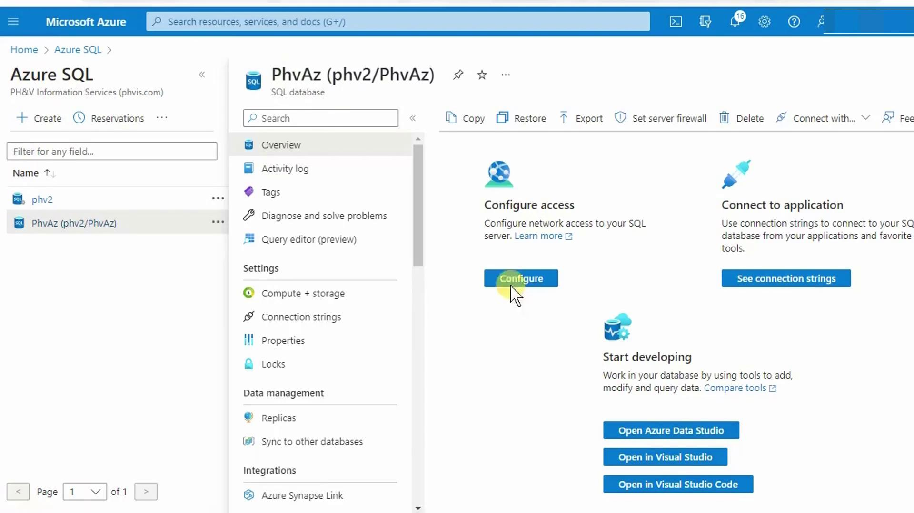
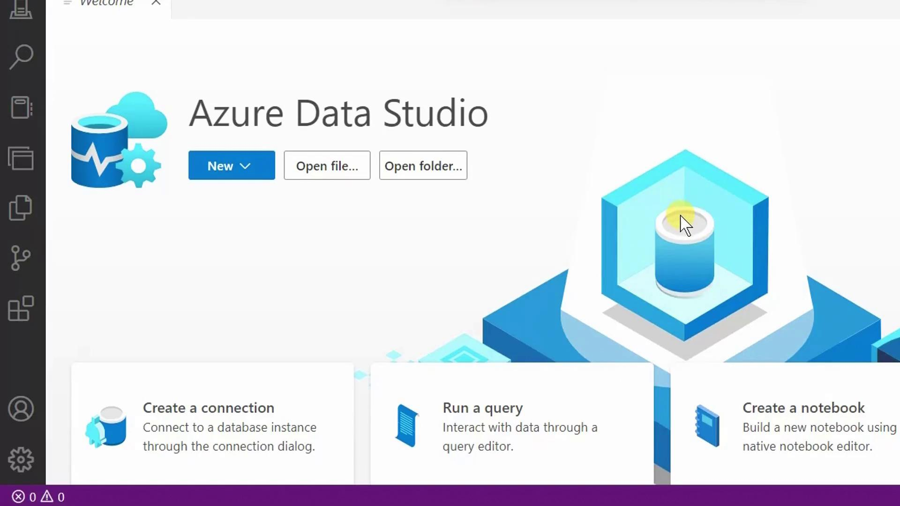
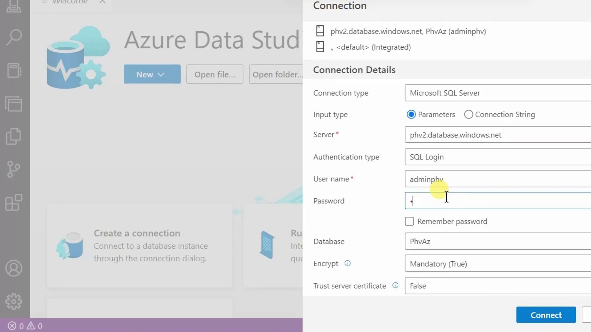
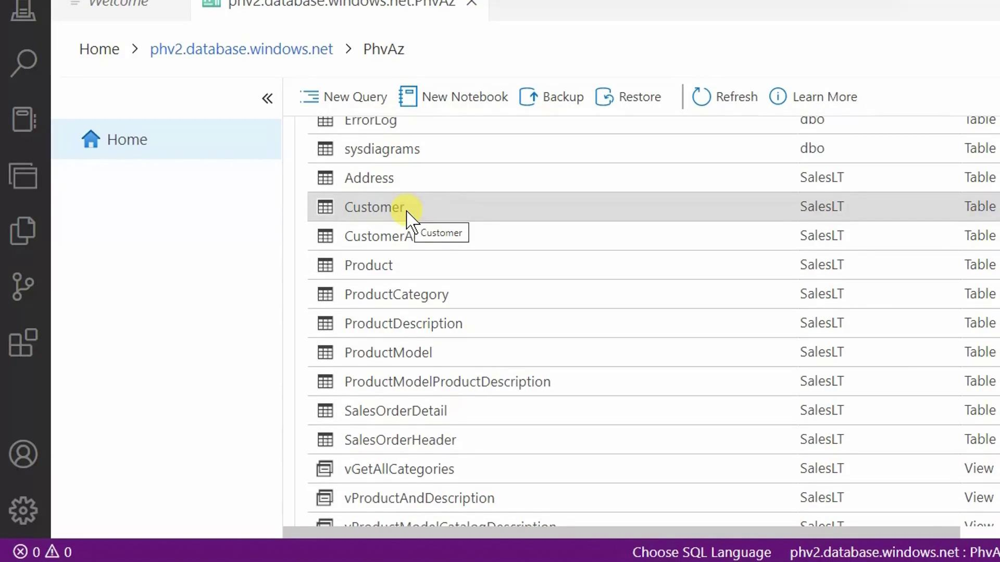

# Demo Running SQL Statements

Source: https://notes.kodekloud.com/docs/DP-900-Microsoft-Azure-Data-Fundamentals/Structured-Data/Demo-Running-SQL-Statements/page

Learn to run basic T-SQL statements in Azure SQL Database using Azure Data Studio, including connecting, exploring, and executing queries.

In this lesson, you’ll learn how to run basic T-SQL statements against an Azure SQL Database using Azure Data Studio. We’ll cover:

* Connecting to your database
* Exploring tables and views
* Executing `SELECT`, `DELETE`, and `UPDATE` queries
* Best practices for clause ordering

## 1. Connect with Azure Data Studio

1. In the Azure portal, open your **Azure SQL Database** resource and click **Open Azure Data Studio**.
2. Azure Data Studio will launch and reconnect you to the last database you accessed.

<Frame>
  
</Frame>

3. When prompted, choose **Launch** since Azure Data Studio is already installed.

<Frame>
  
</Frame>

4. Enter your server administrator login and password, then click **Connect**.

<Frame>
  
</Frame>

## 2. Explore Database Objects

Once connected, the **Object Explorer** displays your database’s schemas, tables, views, and more. Here’s a view of the `SalesLT` schema showing the `Customer` and `Product` tables.

<Frame>
  
</Frame>

## 3. Run SELECT Queries

Click **New Query** (or press Ctrl+N) to open a SQL editor. Then try these examples:

### 3.1 Retrieve All Rows and Columns

```sql theme={null}
SELECT *
FROM SalesLT.Customer;
```

### 3.2 Select Specific Columns

```sql theme={null}
SELECT FirstName,
       LastName
FROM SalesLT.Customer;
```

### 3.3 Sort Results

```sql theme={null}
SELECT FirstName,
       LastName
FROM SalesLT.Customer
ORDER BY LastName;
```

### 3.4 Filter with WHERE

```sql theme={null}
SELECT CustomerID,
       FirstName,
       LastName
FROM SalesLT.Customer
WHERE LastName = 'Adams'
ORDER BY LastName;
```

<Callout icon="lightbulb">
  Always place `WHERE` before `ORDER BY`.\
  Incorrect ordering will trigger a syntax error.
</Callout>

### Clause Order Reference

| Clause   | Purpose             |
| -------- | ------------------- |
| SELECT   | Specify columns     |
| FROM     | Identify the table  |
| WHERE    | Filter rows         |
| ORDER BY | Sort the result set |

## 4. Modify Data

### 4.1 Delete a Row

To remove Francis Adams (`CustomerID = 491`):

```sql theme={null}
DELETE FROM SalesLT.Customer
WHERE CustomerID = 491;
```

Result:

```text theme={null}
(1 row affected)
```

Re-run the `SELECT` to verify:

```sql theme={null}
SELECT CustomerID, FirstName, LastName
FROM SalesLT.Customer
WHERE LastName = 'Adams'
ORDER BY LastName;
```

<Callout icon="triangle-alert">
  Omitting the `WHERE` clause in a `DELETE` statement removes *all* rows.\
  Use `BEGIN TRANSACTION` and `ROLLBACK` for safety during testing.
</Callout>

### 4.2 Update a Row

To correct Jay Adams (`CustomerID = 544`) to “Adamson”:

```sql theme={null}
UPDATE SalesLT.Customer
SET LastName = 'Adamson'
WHERE CustomerID = '544';
```

Result:

```text theme={null}
(1 row affected)
```

Verify the change:

```sql theme={null}
SELECT CustomerID, FirstName, LastName
FROM SalesLT.Customer
WHERE LastName = 'Adamson'
ORDER BY LastName;
```

## 5. Summary

You’ve now:

* Connected to Azure SQL Database with Azure Data Studio
* Explored schemas, tables, and views
* Run `SELECT`, `DELETE`, and `UPDATE` statements
* Learned proper T-SQL clause ordering

## Links and References

* [Azure Data Studio Documentation](https://docs.microsoft.com/azure/data-studio/)
* [Azure SQL Database Overview](https://docs.microsoft.com/azure/azure-sql/)
* [T-SQL Reference](https://docs.microsoft.com/sql/t-sql/)

<CardGroup>
  <Card title="Watch Video" icon="video" href="https://learn.kodekloud.com/user/courses/dp-900-microsoft-azure-data-fundamentals/module/ab06c95a-37f6-40d4-9dd8-b5a6961866b5/lesson/11b234f3-25d7-422b-bee7-55f608091f2a" />
</CardGroup>
