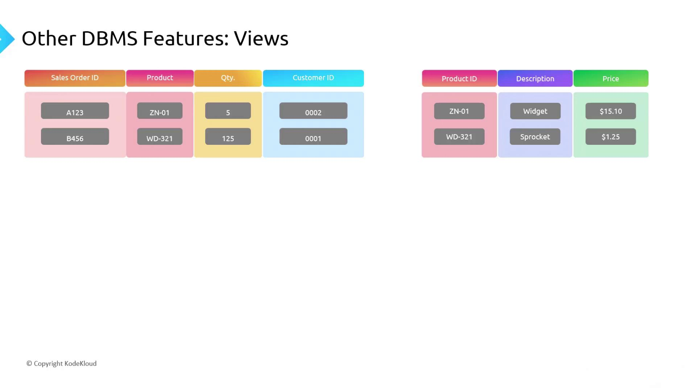
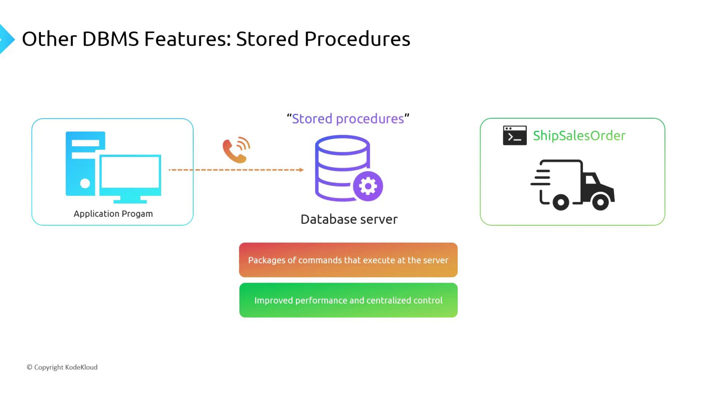

# Other DBMS Features

Source: https://notes.kodekloud.com/docs/DP-900-Microsoft-Azure-Data-Fundamentals/Structured-Data/Other-DBMS-Features/page

This article covers essential RDBMS features like indexes, views, and stored procedures that enhance performance and simplify database management.

Welcome to **Module 2: Structured Data** of the DP-900 Azure Data Fundamentals series. When you normalize data, you often end up with multiple related tables. By defining relationships, queries across tables—like fetching a sales order along with its customer and product details—become seamless.

In this article, we’ll cover three essential relational database management system (RDBMS) features that boost performance, simplify development, and centralize business logic:

| Feature           | Purpose                                     | Example                                                                                                                                                                             |
| ----------------- | ------------------------------------------- | ----------------------------------------------------------------------------------------------------------------------------------------------------------------------------------- |
| Indexes           | Accelerate row retrieval                    | `CREATE INDEX idx_City ON Customers(City);`                                                                                                                                         |
| Views             | Simplify complex joins & enforce security   | `CREATE VIEW v_OrderSummary AS SELECT o.OrderID, c.Name, p.ProductName FROM Orders o JOIN Customers c ON o.CustomerID = c.CustomerID JOIN Products p ON o.ProductID = p.ProductID;` |
| Stored Procedures | Encapsulate business logic & reduce latency | `EXEC ShipSalesOrder @OrderID = 10248;`                                                                                                                                             |

***

## 1. Indexes

An **index** works like a book’s index, providing a fast lookup path into large tables. Instead of scanning every row, the database navigates the index structure to find matching records.

### Clustered vs. Non-Clustered

* **Clustered Index**\
  Defines the physical order of rows in a table. Typically created on the primary key. Only one clustered index per table.

* **Non-Clustered Index**\
  Maintains a separate structure that points back to the data rows. You can define multiple non-clustered indexes on different columns.

<Frame>
  
</Frame>

**Trade-offs**

* Pros:
  * Dramatically faster `SELECT` queries on indexed columns.
* Cons:
  * `INSERT`, `UPDATE`, and `DELETE` operations incur extra overhead to maintain each index.

<Callout icon="triangle-alert">
  Adding too many indexes can degrade DML (Data Manipulation Language) performance. A good rule of thumb is to limit each table to around six non-clustered indexes.
</Callout>

***

## 2. Views

A **view** is a virtual table defined by a SQL query. It can join, filter, and project columns from one or more base tables—simplifying repeated query logic and enforcing column-level security.

```sql theme={null}
CREATE VIEW v_SalesOrderDetails AS
SELECT
  so.OrderID,
  so.OrderDate,
  c.CustomerName,
  p.ProductName,
  od.Quantity,
  od.UnitPrice
FROM SalesOrders so
JOIN OrderDetails od ON so.OrderID = od.OrderID
JOIN Customers c ON so.CustomerID = c.CustomerID
JOIN Products p ON od.ProductID = p.ProductID;
```

<Frame>
  
</Frame>

**Benefits**

* Simplifies complex joins for developers.
* Restricts access to sensitive columns (e.g., hide `CustomerID`) by granting permissions on the view instead of the base tables.

***

## 3. Stored Procedures

A **stored procedure** is a precompiled collection of SQL statements stored on the database server. Executing a stored procedure requires only one network round-trip, improving performance and centralizing business logic.

```sql theme={null}
CREATE PROCEDURE ShipSalesOrder
  @OrderID INT
AS
BEGIN
  BEGIN TRANSACTION;
  
  UPDATE SalesOrders
    SET Status = 'Shipped', ShippedDate = GETDATE()
    WHERE OrderID = @OrderID;

  INSERT INTO Shipments (OrderID, ShipDate)
    VALUES (@OrderID, GETDATE());

  -- Additional validation or logging steps
  COMMIT TRANSACTION;
END;
```

<Frame>
  
</Frame>

**Advantages**

* **Performance:** One call replaces multiple client-server interactions.
* **Consistency:** Business rules run identically every time.
* **Maintainability:** Updates apply immediately to all applications using the procedure.

***

## Links and References

* [Azure SQL Database Concepts](https://docs.microsoft.com/azure/azure-sql/)
* [SQL Server Index Architecture](https://docs.microsoft.com/sql/relational-databases/sql-server-index-design-guide)
* [Creating Views in SQL Server](https://docs.microsoft.com/sql/relational-databases/views/create-view-transact-sql)
* [Working with Stored Procedures](https://docs.microsoft.com/sql/relational-databases/stored-procedures/stored-procedures-database-engine)

<CardGroup>
  <Card title="Watch Video" icon="video" href="https://learn.kodekloud.com/user/courses/dp-900-microsoft-azure-data-fundamentals/module/ab06c95a-37f6-40d4-9dd8-b5a6961866b5/lesson/67848bb6-d0bb-4317-9216-b4c0eb1f9954" />
</CardGroup>
