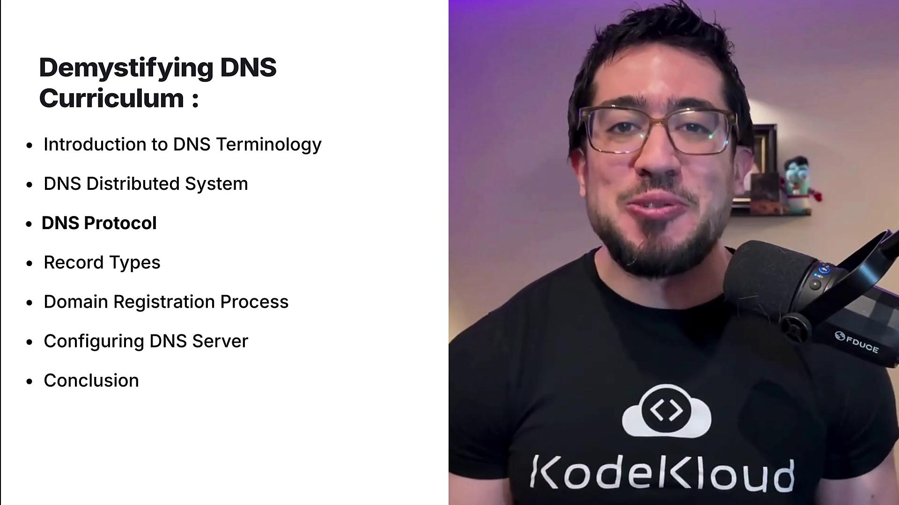
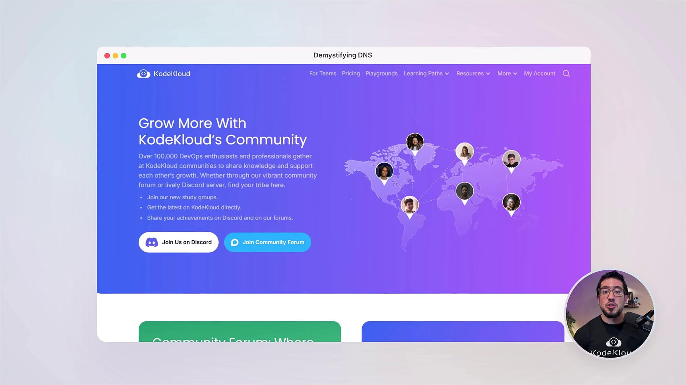

# Starting the named service if not already running
sudo systemctl start named

# Editing configuration and zone file
sudo vi /etc/bind/named.conf.local
sudo vi /etc/bind/db.multinode.kodekloud.lab

# Checking IP addresses:
ping node01
ping node02
```

Example output for node01:

```bash theme={null}
PING node01 (192.5.84.8) 56(84) bytes of data.
64 bytes from node01 (192.5.84.8): icmp_seq=1 ttl=64 time=0.029 ms
```

And for node02:

```bash theme={null}
PING node02 (192.5.84.10) 56(84) bytes of data.
64 bytes from node02 (192.5.84.10): icmp_seq=1 ttl=64 time=0.035 ms
```

### 4. Create the Zone File

Create the file `/etc/bind/db.multinode.kodekloud.lab` with the following content. This file sets the Start of Authority (SOA) record, NS records, and A records for node01, node02, and node03:

```plaintext theme={null}
$TTL 604800
@       IN      SOA     node01.multinode.kodekloud.lab. admin.multinode.kodekloud.lab. (
                              1         ; Serial
                        604800         ; Refresh
                         86400         ; Retry
                        2419200        ; Expire
                         604800 )      ; Negative Cache TTL

@       IN      NS      node01.multinode.kodekloud.lab.
@       IN      NS      node02.multinode.kodekloud.lab.

node01  IN      A       192.5.84.8
node02  IN      A       192.5.84.10
node03  IN      A       192.5.84.12
```

### 5. Restart and Verify

After saving the zone file, restart the BIND9 service:

```bash theme={null}
sudo systemctl reload bind9
```

You can test the DNS resolution by querying the domain using the local nameserver:

```bash theme={null}
# Test resolution using ping
ping node02
ping node03

# Querying with dig
dig @localhost multinode.kodekloud.lab
```

This should return the SOA along with the NS records, confirming that node-01 is correctly serving as the primary nameserver.

***

## Secondary Nameserver Configuration (node-02)

Next, configure node-02 as the secondary (slave) nameserver.

### 1. Install BIND9 on node-02

SSH into node-02 and start the BIND9 service:

```bash theme={null}
ssh node02
sudo systemctl start bind9
```

### 2. Confirm the Primary Server's IP

From node-02, verify the IP address of node-01:

```bash theme={null}
ping node01
```

### 3. Configure the Secondary Zone

Edit the `named.conf.local` file on node-02 to declare it as a secondary nameserver. Use node-01's IP (192.5.84.8) as the master:

```plaintext theme={null}
zone "multinode.kodekloud.lab" {
    type slave;
    file "/var/cache/bind/db.multinode.kodekloud.lab";
    masters { 192.5.84.8; };
};
```

Save the file and reload BIND9:

```bash theme={null}
sudo systemctl reload bind9
```

### 4. Configure Zone Transfer on the Primary (node-01)

Ensure that the `named.conf.options` file on node-01 allows transfers to node-02. An example configuration:

```plaintext theme={null}
options {
    directory "/var/cache/bind";
    allow-transfer { 192.5.84.10; };
    recursion yes;
    allow-recursion { any; };
    listen-on { any; };
};
```

Reload the service after making changes:

```bash theme={null}
sudo systemctl reload bind9
```

### 5. Test the Secondary Setup

Verify node-02's configuration by querying for zone data:

```bash theme={null}
# Query using dig on node-02 itself
dig @localhost multinode.kodekloud.lab

# Test full zone transfer using AXFR if permitted
dig @192.5.84.10 multinode.kodekloud.lab AXFR
```

If the zone transfer is successful, node-02 should return all the zone records.

***

## Webserver (node-03) Configuration

Now, configure node-03 as the webserver and set it up to work with DNS.

### 1. Set Up Nginx on node-03

SSH into node-03, install Nginx, and start the service:

```bash theme={null}
ssh node03
sudo systemctl start nginx
curl localhost
```

A successful response should display the default Nginx welcome page.

### 2. Add a CNAME Record for the Webserver

Update the zone file on the primary nameserver (node-01) by adding a CNAME record for the webserver. SSH into node-01 again and open the zone file `/etc/bind/db.multinode.kodekloud.lab` to include the following record:

```plaintext theme={null}
$TTL 604800
@       IN      SOA     node01.multinode.kodekloud.lab. admin.multinode.kodekloud.lab. (
                       1        ; Serial
                       604800   ; Refresh
                       86400    ; Retry
                       2419200  ; Expire
                       604800 ) ; Negative Cache TTL
@       IN      NS      node01.multinode.kodekloud.lab.
@       IN      NS      node02.multinode.kodekloud.lab.
node01  IN      A       192.5.84.8
node02  IN      A       192.5.84.10
node03  IN      A       192.5.84.12
www     IN      CNAME   node03.multinode.kodekloud.lab.
```

After saving the updated file, reload BIND9:

```bash theme={null}
sudo systemctl reload bind9
```

### 3. Update DNS Settings on node-03

On node-03, update the `/etc/resolv.conf` file to use node-01’s IP as the primary nameserver. An example `resolv.conf` might look like:

```plaintext theme={null}
search us-central1-a.c.kk-lab-prod.internal c.kk-lab-prod.internal google.internal
nameserver 172.25.0.1
options ndots:0
```

### 4. Verify DNS Resolution

Finally, validate the full setup on node-03 by running:

```bash theme={null}
curl www.multinode.kodekloud.lab
```

A successful output displaying the Nginx welcome page HTML confirms that the DNS resolution across both nameservers is working correctly.

***

Through these detailed steps, you have successfully set up a multi-node DNS configuration with a primary nameserver (node-01), a secondary nameserver (node-02), and a webserver (node-03) hosting an Nginx service with a CNAME record pointing to it. This setup ensures reliable DNS resolution across your multi-node environment.

<CardGroup>
  <Card title="Watch Video" icon="video" href="https://learn.kodekloud.com/user/courses/demystifying-dns/module/58962393-1499-4562-b245-eeab14c8a69b/lesson/6cc6a2f3-53f6-4018-9ded-bb08db41563e" />

  <Card title="Practice Lab" icon="installation" href="https://learn.kodekloud.com/user/courses/demystifying-dns/module/58962393-1499-4562-b245-eeab14c8a69b/lesson/693b5f68-dc32-419c-98a5-e540b3c877c2" />
</CardGroup>


# Course Introduction

Source: https://notes.kodekloud.com/docs/Demystifying-DNS/Introduction/Course-Introduction/page

This course introduces DNS fundamentals, practical applications, and hands-on labs for beginners to build and manage DNS servers effectively.

Welcome to the "Demystifying DNS Domain Name System" lesson.

I’m Juan Carlos Martinez, and I will guide you through the fascinating world of DNS—one of the key protocols that powers the internet. DNS functions both as a protocol and a distributed system. Many resources tend to focus on one aspect or assume prior knowledge of the other, which can be challenging for newcomers. This lesson bridges that gap by combining foundational theory with practical, real-world applications.

This course is specifically designed for beginners. You will gain a strong foundation in DNS through interactive labs, practical demonstrations, and a final project where you will configure a simple DNS server on a Linux environment.

## Lesson Overview

### Understanding DNS Basics

We begin with an introduction to essential DNS terminology and tools. One of the key utilities you will learn is `dig`, a command-line tool for querying DNS servers and analyzing responses. Understanding how to use `dig` effectively is essential for troubleshooting and verifying DNS configurations.

### DNS as a Distributed System

Next, we will explore DNS from a systems perspective. This section covers key topics such as:

* Resolvers and the difference between recursive and iterative queries
* Name servers and their replication mechanisms
* Concepts like Anycast and GeoDNS that allow DNS to function globally

### Exploring DNS Protocol Features

We then shift our focus to protocol-specific aspects of DNS. Topics in this section include:

* Extended DNS (EDNS)
* DNS Security Extensions (DNSSEC)
* DNS over HTTPS

Additionally, you will explore various record types (A, AAAA, and CNAME) and see how they are used in real-world naming scenarios.

<Frame>
  
</Frame>

### Domain Registration Insights

Following the protocol discussions, we will delve into the domain registration process. This section clarifies the roles of registrars, registrants, and the importance of secure domain management to prevent hijacking.

### Final Project: Building a DNS Server

The course culminates with a hands-on project where you will set up and configure a basic DNS server. This practical exercise reinforces the theoretical concepts and prepares you for managing DNS in diverse networking scenarios.

## Hands-On Labs

Our interactive labs are designed to help you gain practical experience. You will work with BIND on a Linux system to install, configure, and manage DNS servers, reinforcing theoretical concepts through real-world exercises.

## Community Support

In addition to the course content and labs, you will have access to KodeKloud's vibrant community forum. Engage with fellow learners, share insights, and get expert guidance through interactive discussions.

<Frame>
  
</Frame>

## Conclusion

By the end of this lesson, you will have a comprehensive understanding of both the system and protocol aspects of DNS. This knowledge will be invaluable whether you're managing Linux environments, building networks, or troubleshooting DNS-related issues.

If you’re ready to unlock the secrets of DNS and enhance your network administration skills, enroll now and dive in!

For further learning, check out:

* [Kubernetes Documentation](https://kubernetes.io/docs/)
* [Docker Hub](https://hub.docker.com/)
* [DNSSEC Deployment Best Practices](https://www.dnssec-deployment.org/)

Happy learning!

<CardGroup>
  <Card title="Watch Video" icon="video" href="https://learn.kodekloud.com/user/courses/demystifying-dns/module/6969bd94-5f72-41fc-b801-803b3ed9f9e6/lesson/f35623be-4972-4c17-bb71-aaedbdd4fb0e" />
</CardGroup>
