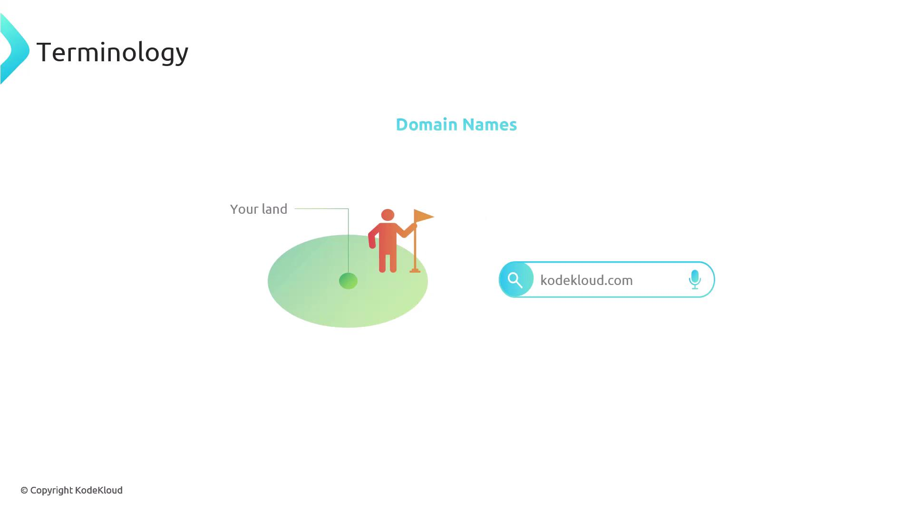
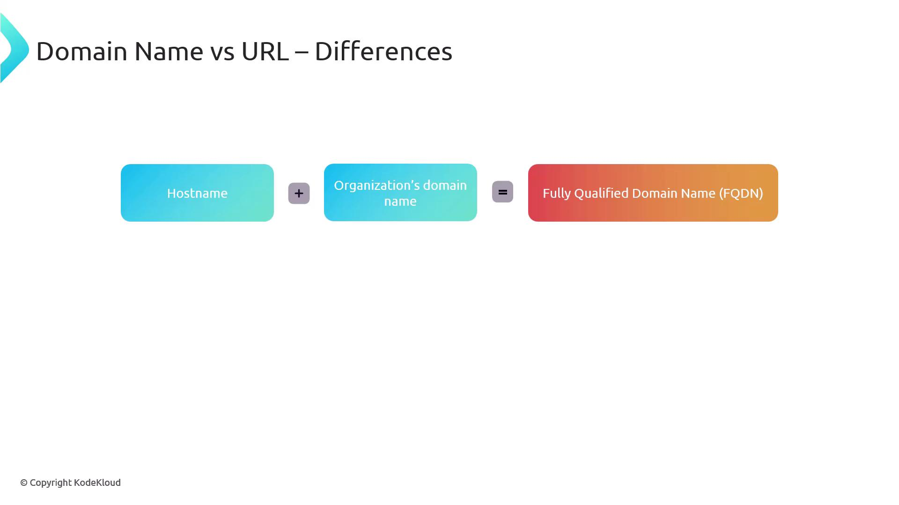
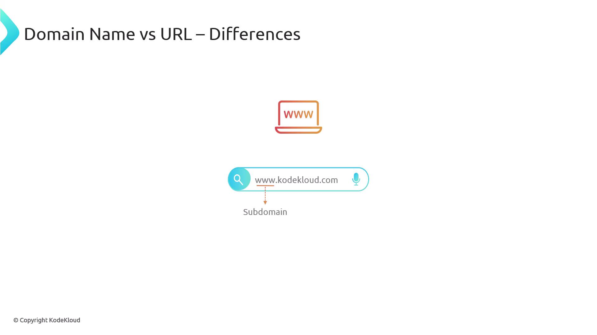
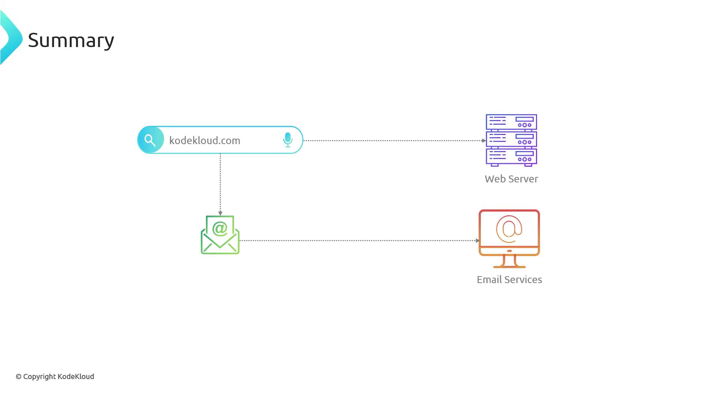

# Terminology

Source: https://notes.kodekloud.com/docs/Demystifying-DNS/Welcome-to-the-World-of-DNS/Terminology/page

This lesson defines essential concepts related to domain names, URLs, and email addresses to enhance understanding of their interactions in the online ecosystem.

In this lesson, we will define several essential concepts related to domain names. Establishing a clear understanding of these terms—domain names, URLs, and email addresses—will enhance your comprehension of how they interact within an online ecosystem.

Consider this analogy: a domain name is like a piece of land that you own for a certain period. When you register a domain such as KodeKloud.com, you purchase a slice of internet real estate, which forms the foundation of your online identity.

<Frame>
  
</Frame>

When you enter KodeKloud.com into your browser, you're using a domain name. The browser then resolves this domain into a URL, especially when it identifies a web server that is actively exposing a service. It is crucial to distinguish a domain name from a URL:

* **Domain Name:** Represents your online identity (e.g., KodeKloud.com).
* **URL:** Specifies the location of a resource on the Internet, typically starting with HTTP or HTTPS.
* **Email Address:** Recognized by the "@" symbol.

Within many organizations, servers may be assigned specific hostnames (for example, webserver01). When a hostname is combined with the organization's domain name, it forms a Fully Qualified Domain Name (FQDN). For instance, the FQDN for the server becomes webserver01.kodekloud.com.

<Frame>
  
</Frame>

Many websites also incorporate the "www" subdomain, such as [www.kodekloud.com](http://www.kodekloud.com). Traditionally, this prefix indicates that a service accessible via the web is being provided. However, using "www" is not mandatory for a website to function correctly.

<Frame>
  
</Frame>

<Callout icon="lightbulb">
  A domain name is your core identity on the Internet—similar to owning or renting a piece of land. This digital asset allows you to host multiple services such as websites, email servers, and more. The Domain Name System (DNS) plays a pivotal role by directing traffic based on how you configure your domain.
</Callout>

To summarize, think of a domain name as a piece of land where you can build different structures (websites, email services, etc.). The DNS functions like an urban planner, ensuring that traffic reaches the correct service.

<Frame>
  
</Frame>

Owning a public domain name grants you the flexibility to create various services and make them readily accessible. As you progress through this lesson, we will dive deeper into DNS understanding how it manages and routes internet traffic to the appropriate services.

For further reading, explore these additional resources:

* [Kubernetes Basics](https://kubernetes.io/docs/concepts/overview/what-is-kubernetes/)
* [Kubernetes Documentation](https://kubernetes.io/docs/)
* [Docker Hub](https://hub.docker.com/)
* [Terraform Registry](https://registry.terraform.io/)

<CardGroup>
  <Card title="Watch Video" icon="video" href="https://learn.kodekloud.com/user/courses/demystifying-dns/module/a983cc32-7f91-4feb-8946-eeb1cea67970/lesson/412f2bb7-e1b2-43ca-b7c6-bcd1c4864176" />
</CardGroup>
