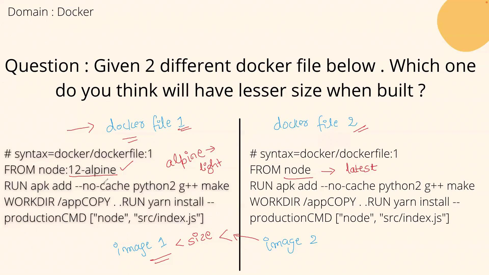

# Dockerfile 1
# syntax=docker/dockerfile:1
FROM node:12-alpine
RUN apk add --no-cache python2 g++ make
WORKDIR /app
COPY . .
RUN yarn install --production
CMD ["node", "src/index.js"]
```

```dockerfile theme={null}
# Dockerfile 2
# syntax=docker/dockerfile:1
FROM node
RUN apk add --no-cache python2 g++ make
WORKDIR /app
COPY . .
RUN yarn install --production
CMD ["node", "src/index.js"]
```

<Callout icon="lightbulb">
  For Dockerfile 2, although the command uses `apk` for package installation, the default "node" image is typically based on a Debian-derived distribution that uses `apt-get`. You may need to adjust the package installation command for compatibility.
</Callout>

## Why Dockerfile 1 Results in a Smaller Image

By using the "node:12-alpine" base image, Dockerfile 1 benefits from Alpine Linux’s minimalistic design. Alpine images include only the essential packages required for many applications, leading to a significantly leaner and more efficient build. In contrast, Dockerfile 2's default "node" image often contains additional packages and dependencies, resulting in a larger file size.

### Key Takeaways for Interview Discussions

When explaining this topic in an interview, you might say:

"In comparing the two Dockerfiles, Dockerfile 1's use of the 'node:12-alpine' base image—a lightweight Alpine Linux-based image—results in a leaner build. On the other hand, Dockerfile 2 employs the more comprehensive 'node' image, which tends to be heavier due to extra packages and dependencies. Therefore, Dockerfile 1 is preferable when optimizing for image size."

## Visual Comparison

<Frame>
  
</Frame>

## Conclusion

This example underscores a key strategy in Docker image optimization: starting with a minimal base image can greatly reduce the overall size, which is particularly advantageous in production environments where deployment speed and resource usage are critical.

For further reading on Docker best practices, consider reviewing the following resources:

* [Docker Best Practices](https://docs.docker.com/develop/dev-best-practices/)
* [Alpine Linux Overview](https://alpinelinux.org/)
* [Node.js Docker Official Images](https://hub.docker.com/_/node/)

Understanding these differences helps in designing efficient Docker images that are both secure and performance-oriented.

<CardGroup>
  <Card title="Watch Video" icon="video" href="https://learn.kodekloud.com/user/courses/devops-interview-preparation-course/module/955d2fcf-4c92-4480-b86e-081d67d83e88/lesson/8960778c-b7ac-42a0-a178-94070177198f" />
</CardGroup>


# Git Question 1

Source: https://notes.kodekloud.com/docs/DevOps-Interview-Preparation-Course/Git/Git-Question-1/page

This article explains how to include a commit message in Git and emphasizes the importance of clear, descriptive messages for project history and collaboration.

Committing code changes with clear, descriptive messages is essential in Git. It not only creates a precise project history but also facilitates smoother code reviews and easier collaboration. In this article, we explain how to include a commit message when committing your code and why it is a best practice.

## Using the -m Option to Pass a Commit Message

When you create a commit in Git, you can include a message describing your changes by using the `-m` flag. This ensures that anyone reviewing the repository can immediately understand the purpose behind each commit. The basic command syntax is:

```bash theme={null}
git commit -m "My message"
```

In this example, Git records your changes along with the message “My message.” For instance, if you commit with a message like “Python with Docker,” that description will appear in your GitHub repository’s commit history and any associated pull requests, providing clear context for your changes.

<Callout icon="lightbulb">
  Always include a concise and descriptive commit message to help reviewers and future maintainers understand your changes quickly.
</Callout>

## The Importance of Descriptive Commit Messages

A well-crafted commit message is crucial for several reasons:

* **Clarifies Changes:** It provides an immediate explanation of the alterations made in the commit.
* **Enhances Code Reviews:** A meaningful message speeds up the review process by offering context without the need to inspect every code change.
* **Maintains a Clean History:** A clear commit history makes it easier to trace the evolution of your project and troubleshoot issues later.

While it is technically possible to commit without a message, doing so creates an empty commit message which can lead to confusion and extra effort when reviewing the project’s history. Therefore, it is always best to include a descriptive message with your commits:

```bash theme={null}
git commit -m "Python with Docker"
```

<Callout icon="triangle-alert">
  Avoid vague commit messages like "fix bug" or "update" that lack detail. Such messages can hinder effective code reviews and make it challenging to track changes in the long run.
</Callout>

## Summary

Every commit in Git, along with its corresponding message, is stored in your repository's history. Make commit messages part of your project’s documentation by ensuring that each message clearly communicates the impact and intent of the changes made. This practice not only enhances collaboration but also simplifies future maintenance and troubleshooting.

Let's move on to our next question.

<CardGroup>
  <Card title="Watch Video" icon="video" href="https://learn.kodekloud.com/user/courses/devops-interview-preparation-course/module/4edc26e9-82be-4ac9-a2bf-bf09a6c3bb98/lesson/20d9f2bf-cbef-4296-8c4b-8435d53b544f" />
</CardGroup>
