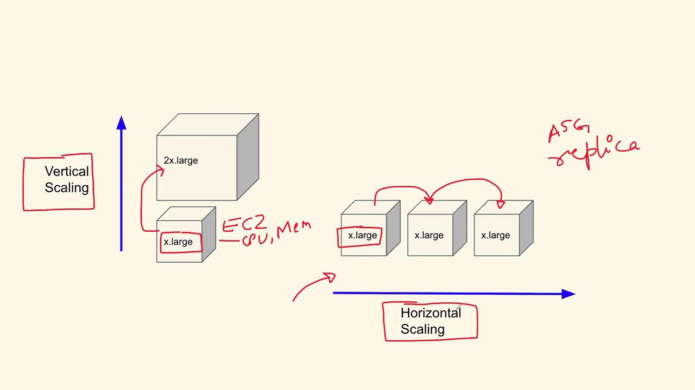

# AWS Question 2

Source: https://notes.kodekloud.com/docs/DevOps-Interview-Preparation-Course/AWS/AWS-Question-2/page

This article explores vertical and horizontal scaling strategies with real-world examples to help design scalable architectures for applications.

In this lesson, we explore vertical scaling and horizontal scaling with real-world use cases and practical examples. Understanding these scaling strategies is essential to designing scalable architectures, whether you're enhancing server capabilities or managing increased traffic loads.

## Understanding Vertical Scaling

Vertical scaling—often known as "scaling up"—involves increasing the resources (such as CPU, memory, and RAM) of an existing server. For instance, upgrading an EC2 instance to a more powerful type to double its computing capacity is a perfect example of vertical scaling. This approach is most effective when your application grows in complexity, requires more processing power, or implements additional features. The increased resources help maintain performance without the need for adding more servers.

<Callout icon="lightbulb">
  Vertical scaling is ideal when performance demands can be met by upgrading single machines, simplifying management by avoiding distributed systems.
</Callout>

## Understanding Horizontal Scaling

Horizontal scaling—commonly referred to as "scaling out"—involves adding more machines or instances to distribute the workload. This approach is particularly beneficial for applications experiencing high traffic volumes. Instead of upgrading a single server's capacity, you deploy additional instances, such as by using auto-scaling groups in AWS or replicating services within a Kubernetes cluster. This strategy is vital for maintaining responsiveness during traffic surges and accommodating concurrent users.

<Callout icon="lightbulb">
  Horizontal scaling helps ensure high availability and fault tolerance since the load is shared across multiple instances.
</Callout>

<Frame>
  
</Frame>

## Practical Use Cases

### Vertical Scaling

Consider an application that initially performs specific tasks but gradually evolves to include more complex functionalities. As the application adds new features and demands increased processing power, upgrading the existing server is necessary. Vertical scaling in this case ensures efficient performance without modifying the overall architecture.

### Horizontal Scaling

Imagine a shopping website that starts with a single product offering. As the website attracts more visitors and experiences a surge in traffic, adding more server instances becomes crucial. Horizontal scaling accommodates the increased load, ensuring the website remains responsive during traffic spikes. This method is especially advantageous when later expanding the site's offerings, integrating payment gateways, or adding real-time multimedia capabilities.

## Interview Insights: Explaining Scaling Approaches

When addressing vertical and horizontal scaling in an interview, consider these key points:

* **Vertical Scaling:**\
  Focuses on boosting the computing power of an individual server by upgrading hardware or instance types. This approach is beneficial when the application demands increased processing capacity due to new features or higher resource usage.

* **Horizontal Scaling:**\
  Involves adding more servers or instances to distribute the workload, ensuring the application can manage high traffic volumes and sudden spikes in user activity. This method enhances fault tolerance and load balancing across the system.

<Callout icon="lightbulb">
  Highlight real-world examples during interviews to demonstrate a clear understanding of when to apply vertical versus horizontal scaling.
</Callout>

With these explanations and examples in mind, you're well-prepared to discuss scaling strategies and their appropriate applications. Let's now move on to the next question in the interview segment.

<CardGroup>
  <Card title="Watch Video" icon="video" href="https://learn.kodekloud.com/user/courses/devops-interview-preparation-course/module/f1169a2e-23de-4377-bc4f-a07c136a11d6/lesson/500c8f25-adfd-47bb-bfd2-6e6e04971806" />
</CardGroup>
