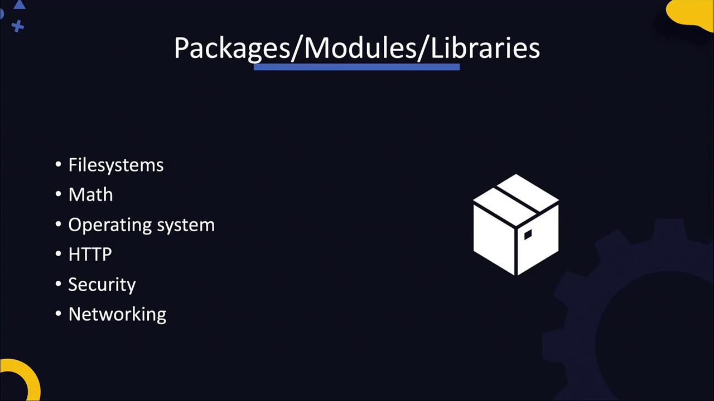

# main.py
def print_message():
    print("Hello World")

if __name__ == '__main__':
    print_message()
```

```plaintext theme={null}
Hello World
  1    0 LOAD_NAME                0 (print)
  3    1 LOAD_NAME                1 (print)
  6    0 LOAD_CONST               0 ('Hello World')
--> 12    CALL_FUNCTION            1 (1 positional, 0 keyword)
 15    PRINT_EXPR
 16    LOAD_CONST               1 (None)
 19    RETURN_VALUE

Machine Code
01100000 10111100 10000001
01100100 01101111 00101111
00000110 00011100 11111010
10110001 01100010 10111010
10000001 01100100 01001110
00001111 00001000 00011110
11111010 10110001 10110001
```

The Python Virtual Machine ensures a consistent runtime environment, allowing your application to run seamlessly on different systems without requiring separate builds.

## Packages, Modules, and Libraries

Developers frequently share reusable code in the form of packages, modules, or libraries. These packages can handle diverse functionalities such as filesystem operations, mathematical computations, OS interactions, web server setup, and more.

<Frame>
  
</Frame>

Applications depend on these packages, and managing them efficiently is crucial in DevOps. Tools such as NPM for Node.js and PIP for Python are used to manage these dependencies, helping prevent issues during the build process.

## The Software Development Lifecycle in DevOps

Once an application is developed, it typically undergoes a series of stages including development, building, testing, and delivery. DevOps practices strongly emphasize automating these stages through Continuous Integration and Continuous Deployment (CI/CD) pipelines. Having a clear understanding of what is being automated is key to successfully implementing automation in your workflows.

The following table summarizes several components crucial to modern application development in a DevOps context:

| Component            | Purpose                                 | Example Command/Tool             |
| -------------------- | --------------------------------------- | -------------------------------- |
| Version Control      | Source code management                  | `git clone https://repository`   |
| Build Automation     | Compiling source code and running tests | `mvn package` or `npm run build` |
| Package Management   | Dependency management                   | `pip install package-name`       |
| Deployment Pipelines | Automated build, test, and deployment   | Jenkins, GitLab CI/CD            |
| Containerization     | Packaging applications for deployment   | Docker, Kubernetes               |

## What’s Next?

In the upcoming sections, we will dive deeper into specific application types, including Python, Java, and Node.js. We will also explore popular web servers like Apache and NGINX, along with databases. Ultimately, you will work through an end-to-end application deployment that covers the entire software development lifecycle, with practical labs to reinforce these concepts.

That concludes this lecture. In the next session, we will focus on Java and explore its critical elements in greater detail. See you there!

<CardGroup>
  <Card title="Watch Video" icon="video" href="https://learn.kodekloud.com/user/courses/devops-pre-requisite-course/module/669946a1-3725-4ba8-af56-14d449f778c3/lesson/933d8174-1ea7-46cf-a7d9-88b218cbc1a8" />
</CardGroup>


# Java Build Packaging

Source: https://notes.kodekloud.com/docs/DevOps-Pre-Requisite-Course/Applications-Basics/Java-Build-Packaging/page

This guide explores building, packaging, and documenting Java applications, highlighting automation with tools like Ant, Maven, and Gradle.

In this guide, we explore the process of building a Java application—from writing and compiling source code to packaging it into a distributable format and generating documentation. We will also demonstrate how build tools automate these processes. The following sections outline a straightforward build process and then discuss more complex workflows using tools such as Ant, Maven, and Gradle.

***

## Compiling a Simple Java Application

A basic Java application follows these steps:

1. Write the source code.
2. Compile the code into bytecode.
3. Run the compiled code using the Java Virtual Machine (JVM).

Consider the source file, MyClass.java:

```java theme={null}
public class MyClass {
    public static void main(String[] args) {
        System.out.println("Hello World");
    }
}
```

To compile this file, run:

```bash theme={null}
javac MyClass.java
```

This command produces a bytecode file named MyClass.class. To execute the application, use:

```bash theme={null}
java MyClass
```

The output will be:

```plaintext theme={null}
Hello World
```

Java source code is transformed into bytecode via the compilation process. The JVM then executes these low-level instructions. You might also inspect the bytecode instructions, as shown below:

```plaintext theme={null}
0: iconst_2
1: istore_1
2: iload_1
3: sipush 1000
6: if_icmpge 44
9: iconst_2
10: istore_2
11: iload_2
12: iload_1
13: if_icmpge 31
```

This sequence represents instructions that enable Java applications to remain cross-platform. As long as a system has a compatible JVM, compiled code can run anywhere.

***

## Packaging the Application

Complex applications often include multiple class files along with external dependencies and resources. For distribution, these files are packaged into an archive file. Typically, applications are packaged into a JAR (Java Archive) file, while web applications might be packaged into a WAR (Web Archive) file containing static assets like HTML, images, and CSS.

To package the application into a JAR file, run:

```bash theme={null}
jar cf MyApp.jar MyClass.class Service1.class Service2.class ...
```

This command creates the MyApp.jar file and automatically generates a manifest file at META-INF/manifest.mf with metadata about the package. The manifest can also specify the application’s entry point using the Main-Class attribute.

To execute the JAR file directly, use:

```bash theme={null}
java -jar MyApp.jar
```

This will produce the familiar output:

```plaintext theme={null}
Hello World
```

***

## Generating Documentation

Documenting your Java code using Javadoc is a best practice that generates an HTML API documentation site. To create the documentation, run:

```bash theme={null}
javadoc -d doc MyClass.java
```

This command creates a directory (doc) with a complete HTML documentation site that other developers can easily navigate.

<Callout icon="lightbulb">
  Using Javadoc ensures that your code documentation remains up-to-date and accessible, which is vital for collaborative development.
</Callout>

***

## The Build Process Overview

The essential build process for a Java application can be summarized in the following commands:

```bash theme={null}
javac MyClass.java
jar cf MyClass.jar [list of classes and resources]
javadoc -d doc MyClass.java
```

For small projects, performing these steps manually works well. However, as projects grow with more files, dependencies, and team members, automating these tasks becomes necessary.

***

## Automating Builds with Ant

Ant is a popular build tool that uses an XML configuration file to define various build targets such as compile, document, and package. Below is an example of an Ant build script (build.xml):

<Frame>
  
</Frame>

```xml theme={null}
<?xml version="1.0"?>
<project name="Ant" default="main" basedir=".">
    <!-- Compiles the Java code -->
    <target name="compile">
        <javac srcdir="/app/src" destdir="/app/build">
        </javac>
    </target>
    <!-- Generates Javadoc -->
    <target name="docs" depends="compile">
        <javadoc packagenames="src" sourcepath="/app/src" destdir="/app/docs">
            <fileset dir="/app/src">
                <include name="**/*" />
            </fileset>
        </javadoc>
    </target>
    <!-- Creates the deployable JAR file -->
    <target name="jar" depends="compile">
        <jar basedir="/app/build" destfile="/app/dist/MyClass.jar">
            <manifest>
                <attribute name="Main-Class" value="MyClass" />
            </manifest>
        </jar>
    </target>
    <!-- Main target that assembles the project -->
    <target name="main" depends="compile, jar, docs">
        <description>Main target</description>
    </target>
</project>
```

To execute specific targets, such as compiling and packaging without generating documentation, run:

```bash theme={null}
ant compile jar
```

<Callout icon="lightbulb">
  Using Ant targets enables you to selectively run just the portions of the build process you need.
</Callout>

***

## Build Tools in the Java Ecosystem

Modern Java projects use build tools like Maven, Gradle, or Ant to simplify the build process by using configuration files. Below are details on Maven and Gradle.

### Maven

Maven uses a file called pom.xml to define the project’s build logic, dependencies, and plugins. Here is an example configuration:

```xml theme={null}
<?xml version="1.0" encoding="UTF-8"?>
<project xmlns="http://maven.apache.org/POM/4.0.0"
         xmlns:xsi="http://www.w3.org/2001/XMLSchema-instance"
         xsi:schemaLocation="http://maven.apache.org/POM/4.0.0 http://maven.apache.org/xsd/maven-4.0.0.xsd">
    <modelVersion>4.0.0</modelVersion>
    <groupId>com.shopizer</groupId>
    <artifactId>shopizer</artifactId>
    <version>2.9.0</version>
    <packaging>pom</packaging>
    <name>shopizer</name>
    <url>http://maven.apache.org/</url>
    <licenses>
        <license>
            <name>Apache License, Version 2.0</name>
            <url>https://www.apache.org/licenses/LICENSE-2.0.txt</url>
        </license>
    </licenses>
</project>
```

To build a Maven project, use the following commands:

```bash theme={null}
$ git clone git://github.com/shopizer-ecommerce/shopizer.git
$ cd shopizer
$ mvn clean install
```

### Gradle

Gradle is another robust build automation tool that often uses a Gradle wrapper for simplified usage. Here is an example Gradle configuration snippet that includes the Docker plugin:

```groovy theme={null}
buildscript {
    repositories {
        jcenter()
    }
    dependencies {
        classpath 'com.bmuschko:gradle-docker-plugin:3.0.6'
    }
}

apply plugin: 'java'
apply plugin: 'application'
apply plugin: 'com.bmuschko.docker-java-application'

import com.bmuschko.gradle.docker.tasks.container.*
import com.bmuschko.gradle.docker.tasks.image.*
```

To build and run your Gradle project, execute:

```bash theme={null}
./gradlew build
./gradlew run
```

This approach automates multiple steps of the build process, reducing the need for manual commands.

***

## Summary

<Frame>
  
</Frame>

In summary, this guide covered the fundamentals of building a Java application. We walked through writing source code, compiling it into bytecode, and packaging it into a JAR file with metadata. We also demonstrated how to generate documentation using Javadoc and highlighted the advantages of automating builds with tools like Ant, Maven, and Gradle.

<Callout icon="lightbulb">
  Understanding these build processes is an essential step toward mastering advanced DevOps practices, such as continuous integration and containerization.
</Callout>

Happy coding, and be sure to experiment with these build processes in your development environment!

<CardGroup>
  <Card title="Watch Video" icon="video" href="https://learn.kodekloud.com/user/courses/devops-pre-requisite-course/module/669946a1-3725-4ba8-af56-14d449f778c3/lesson/0e64ffd8-2bca-4308-9c5f-8098a32f4724" />

  <Card title="Practice Lab" icon="installation" href="https://learn.kodekloud.com/user/courses/devops-pre-requisite-course/module/669946a1-3725-4ba8-af56-14d449f778c3/lesson/8366e1d6-f1d7-4dbe-9179-4f403e2b44f3" />
</CardGroup>
