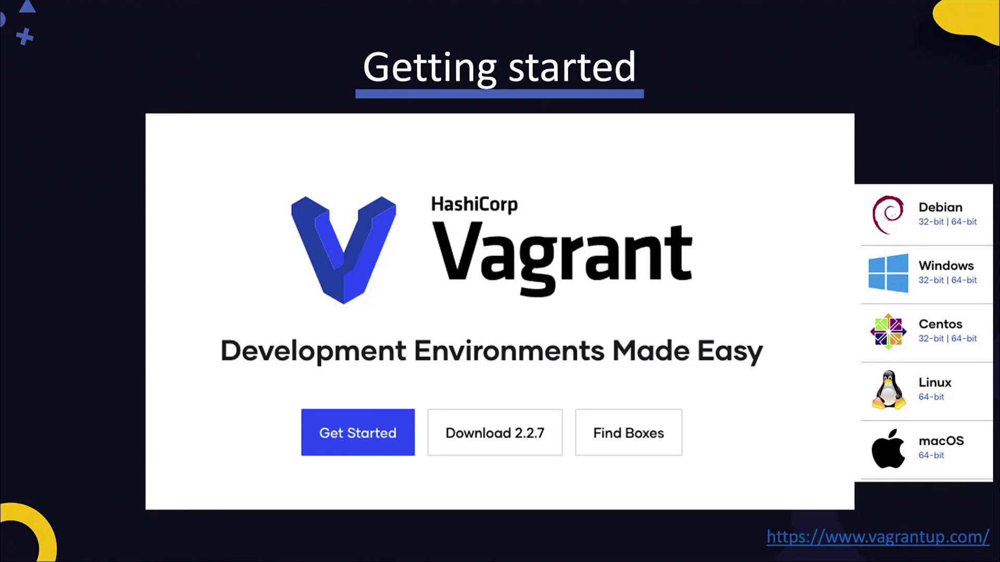
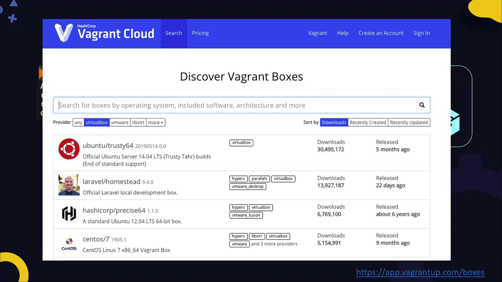

# All Vagrant configuration is done below. The "2" in Vagrant.configure
# configures the configuration version (we support older styles for
# backwards compatibility). Please don't change it unless you know what
# you're doing.
Vagrant.configure("2") do |config|
  # Every Vagrant development environment requires a box. You can search for
  # boxes at https://vagrantcloud.com/search.
  config.vm.box = "centos/7"

  # Disable automatic box update checking. If you disable this, then
  # boxes will only be checked for updates when the user runs
  # `vagrant box outdated`. This is not recommended.
  config.vm.box_check_update = false

  # Create a forwarded port mapping which allows access to a specific port
  # within the machine from a port on the host machine. In the example below,
  # accessing "localhost:8080" will access port 80 on the guest machine.
  # NOTE: This will enable public access to the opened port.
  config.vm.network "forwarded_port", guest: 80, host: 8080

  # Additional provisioning options (such as shell scripts, Ansible, Chef,
  # Docker, Puppet, and Salt) can be added here.
end
```

## Booting Your VM

To launch your virtual machine, run:

```bash theme={null}
vagrant up
```

During this process, Vagrant downloads the CentOS 7 box (if not already available), creates the VM using your chosen provider, and sets up networking (e.g., forwarding port 22 from the guest to port 2222 on the host). The process might take a few minutes while the VM boots up. For instance, VirtualBox displays the new VM, and your terminal might look similar to this:

```plaintext theme={null}
Bringing machine 'default' up with 'virtualbox' provider...
==> default: Importing base box 'centos/7'...
==> default: Matching MAC address for NAT networking...
==> default: Checking if box 'centos/7' version '1905.1' is up to date...
==> default: Setting the name of the VM: Vagrant_default_1586965785289_34868
==> default: Clearing any previously set network interfaces...
==> default: Preparing network interfaces based on configuration...
==> default: Adapter 1: nat
==> default: Forwarding ports...
    default: 22 (guest) => 2222 (host) (adapter 1)
==> default: Booting VM...
==> default: Waiting for machine to boot. This may take a few minutes...
    SSH address: 127.0.0.1:2222
    SSH username: vagrant
    SSH auth method: private key
```

Once you see the “Machine booted and ready” message, you can SSH into the VM:

```bash theme={null}
vagrant ssh
```

Inside the VM, verify the operating system version by inspecting `/etc/*release` or using other commands. To check the status of your VM at any time, run:

```bash theme={null}
vagrant status
```

The status output will indicate whether your VM is running, for example:

```plaintext theme={null}
Current machine states:

default                   running (virtualbox)

The VM is running. To stop this VM, you can run `vagrant halt` to shut it down forcefully, or `vagrant suspend` to suspend the virtual machine. In either case, to restart it, simply run `vagrant up`.
```

To shut down your VM, execute:

```bash theme={null}
vagrant halt
```

After halting, you will see:

```plaintext theme={null}
Current machine states:

default                   poweroff (virtualbox)

The VM is powered off. To restart the VM, simply run `vagrant up`
```

## Customizing VM Resources

The default Vagrantfile includes several commented options for configuring VM resources such as memory allocation and CPU count. By default, the VM might be configured with only 512 MB of RAM, which can affect performance.

To modify these settings for VirtualBox, uncomment and adjust the provider-specific configuration block. For example, to enable a graphical user interface and allocate additional memory and CPU cores, update your Vagrantfile with:

```ruby theme={null}
config.vm.provider "virtualbox" do |vb|
  vb.gui = true
  vb.memory = "1024"
  vb.cpus = 2
  vb.name = "my_centos_vm"
end
```

Remember to reload your VM for the changes to take effect:

```bash theme={null}
vagrant reload
```

After reloading, you can verify the updated VM settings in VirtualBox.

## Troubleshooting Boot Timeout Errors

When running `vagrant up`, you might encounter boot timeout messages such as:

```plaintext theme={null}
default: Warning: Remote connection disconnect. Retrying...
default: Warning: Connection reset. Retrying...
...
Timed out while waiting for the machine to boot. This means that 
Vagrant was unable to communicate with the guest machine within 
the configured time period ("config.vm.boot_timeout").
```

If you experience these issues, ensure networking is functioning properly and authentication is configured correctly. If your box is booting normally but requires extra time, increase the boot timeout by adding or modifying the timeout configuration in your Vagrantfile:

```ruby theme={null}
config.vm.boot_timeout = 600
```

After updating the timeout setting, reload your VM using:

```bash theme={null}
vagrant halt
vagrant reload
```

<Callout icon="lightbulb">
  Increasing the `boot_timeout` value gives your VM additional time to start, helping to avoid premature timeout errors.
</Callout>

## Conclusion

This guide provided an introduction to deploying Vagrant VMs—from installation and Vagrantfile initialization to booting, resource management, and troubleshooting. Vagrant is a powerful tool for configuring multiple virtual environments and sharing custom lab setups. For advanced usage, consider exploring provisioning options with shell scripts or integrating configuration management tools like Ansible, Chef, Docker, and Puppet.

Happy Vagrant-ing!

<CardGroup>
  <Card title="Watch Video" icon="video" href="https://learn.kodekloud.com/user/courses/devops-pre-requisite-course/module/9c8f26c1-90d7-488f-a675-1b77e777c173/lesson/778cabf7-e32a-4a5d-b5d9-db2e2c1863d5" />
</CardGroup>


# Vagrant

Source: https://notes.kodekloud.com/docs/DevOps-Pre-Requisite-Course/Lab-Setup/Vagrant/page

This article introduces Vagrant, a tool that automates the deployment and configuration of virtual machines, simplifying repetitive tasks in managing complex environments.

In this lesson, we introduce the basics of Vagrant—a powerful tool designed to automate the deployment and configuration of virtual machines (VMs). In previous exercises, you manually set up VMs on VirtualBox by downloading images from osboxes.org, configuring networking (including host networks and port forwarding), and booting the VMs individually. These repetitive tasks are now simplified with Vagrant.

Vagrant eliminates manual steps with a single command, "vagrant up," which automatically downloads operating systems, creates networks, and configures port forwarding. This level of automation is especially beneficial when managing complex environments that involve multiple interconnected VMs.

## What Happens When You Run "vagrant up"?

Below is an example of the output when executing the "vagrant up" command. The output shows that Vagrant imports the base box, configures NAT networking, establishes port forwarding, boots the VM, and finalizes the setup process:

```plaintext theme={null}
vagrant up
Bringing machine 'default' up with 'virtualbox' provider...
==> default: Importing base box 'centos/7'...
==> default: Matching MAC address for NAT networking...
==> default: Checking if box 'centos/7' version '1905.1' is up to date...
==> default: Setting the name of the VM: centos2_default_158695892002_53453
==> default: Preparing network interfaces based on configuration...
==> default: Adapter 1: nat
==> default: Forwarding ports...
    default: 22 (guest) => 2200 (host) (adapter 1)
==> default: Booting VM...
==> default: Waiting for machine to boot. This may take a few minutes...
==> default: Machine booted and ready!
```

For more detailed information and to download Vagrant for your operating system, visit [Vagrant's official site](https://www.vagrantup.com).

<Frame>
  
</Frame>

## Initializing a CentOS 7 Box

In this lesson, we will deploy a CentOS 7 box. In Vagrant, a "box" is a pre-packaged environment containing an OS image and configuration scripts. To set up a CentOS 7 environment, run:

```bash theme={null}
vagrant init centos/7
```

A comprehensive list of available Vagrant boxes can be explored at [Vagrant Cloud](https://app.vagrantup.com/boxes). Simply search for your preferred box.

<Frame>
  
</Frame>

After running the `vagrant init` command, a Vagrantfile is created in your current directory. This file contains instructions for customizing your box settings. Once the file is ready, starting the VM is as simple as executing the `vagrant up` command. For instance:

```bash theme={null}
vagrant init centos/7
ls
vagrant up
```

The output will resemble:

```plaintext theme={null}
Bringing machine 'default' up with 'virtualbox' provider...
==> default: Importing base box 'centos/7'...
==> default: Matching MAC address for NAT networking...
==> default: Checking if box 'centos/7' version '1905.1' is up to date...
==> default: Setting the name of the VM: centos2_default_15868958982002_53453
==> default: Preparing network interfaces based on configuration...
    default: Adapter 1: nat
    default: Forwarding ports...
```

## Managing Your Vagrant Environment

Once your VM is up and running, Vagrant offers several commands to manage it. Running the `vagrant` command without any arguments displays all available options. For example:

```bash theme={null}
vagrant
```

The help output includes:

```plaintext theme={null}
Usage: vagrant [options] <command> [<args>]

    -v, --version          Print the version and exit.
    -h, --help             Print this help.

Common commands:
    init                    Initializes a new Vagrant environment by creating a Vagrantfile
    up                      Starts and provisions the Vagrant environment
    suspend                 Suspends the machine
    resume                  Resumes a suspended Vagrant machine
    halt                    Stops the Vagrant machine
    destroy                 Stops and deletes all traces of the Vagrant machine
    status                  Outputs the status of the Vagrant machine
    reload                  Restarts the Vagrant machine and reloads the Vagrantfile configuration
    snapshot                Manages snapshots: saving, restoring, etc.
```

You can suspend, resume, stop, or even take snapshots of your VM. To SSH into your VM, simply type:

```bash theme={null}
vagrant ssh
```

Vagrant determines the correct port for SSH, using key-based authentication by default.

## Customizing the Vagrantfile

The Vagrantfile begins with a configuration block that defines the box image—in this lesson, CentOS 7. This file is highly customizable; you can modify it to include additional settings such as port forwarding, synced folders, resource allocation, and provisioning scripts.

For example, to forward port 8080 on your host to port 80 on the guest, add the following configuration:

```ruby theme={null}
Vagrant.configure("2") do |config|
  config.vm.box = "centos/7"
  config.vm.network "forwarded_port", guest: 80, host: 8080
end
```

Additionally, you can sync a directory between your host and VM for simpler file transfers. To adjust CPU and memory settings for VirtualBox, include a provider block, and use a shell provisioner for running startup scripts. Here is a more comprehensive example of a customized Vagrantfile:

```ruby theme={null}
Vagrant.configure("2") do |config|
  config.vm.box = "centos/7"
  config.vm.network "forwarded_port", guest: 80, host: 8080
  config.vm.synced_folder "../data", "/vagrant_data"
  
  config.vm.provider "virtualbox" do |vb|
    vb.memory = "1024"
  end

  config.vm.provision "shell", inline: <<-SHELL
    yum update
    yum install -y httpd
  SHELL
end
```

<Callout icon="lightbulb">
  This configuration provisions a CentOS 7 VM with port forwarding, a synced folder, a 1024 MB memory allocation in VirtualBox, and a shell script that updates the system while installing the HTTP server.
</Callout>

## Multi-Provider Support

Vagrant supports various providers beyond VirtualBox, including VMware Workstation, VMware Fusion, and Microsoft Hyper-V. Leveraging Vagrant's multi-provider compatibility allows you to quickly deploy and share custom lab environments. Simply share the Vagrantfile with your peers to ensure they can recreate identical VM configurations.

## Conclusion

Vagrant simplifies and accelerates the process of deploying and managing virtual machine environments. Its automation capabilities remove the repetitive tasks associated with manual VM creation, allowing you to focus on developing and testing your applications. Explore Vagrant to streamline your development workflow and build consistent lab environments effortlessly.

Happy Vagrant-ing!

<CardGroup>
  <Card title="Watch Video" icon="video" href="https://learn.kodekloud.com/user/courses/devops-pre-requisite-course/module/9c8f26c1-90d7-488f-a675-1b77e777c173/lesson/5aa4c4a8-22a2-4d20-9fee-cfebf9fce8d3" />
</CardGroup>
