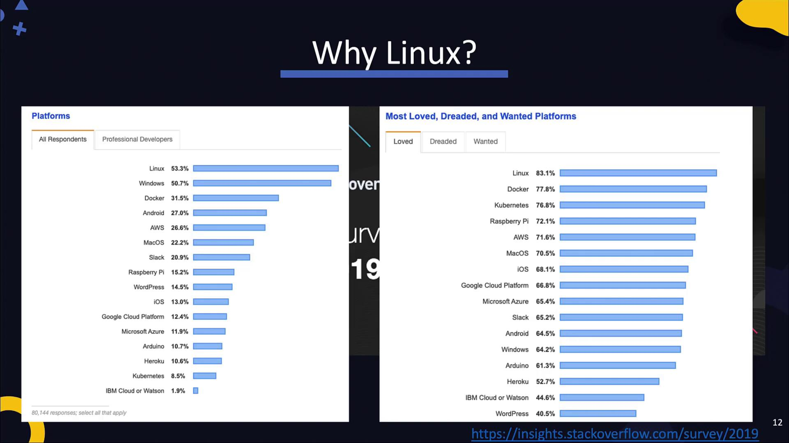
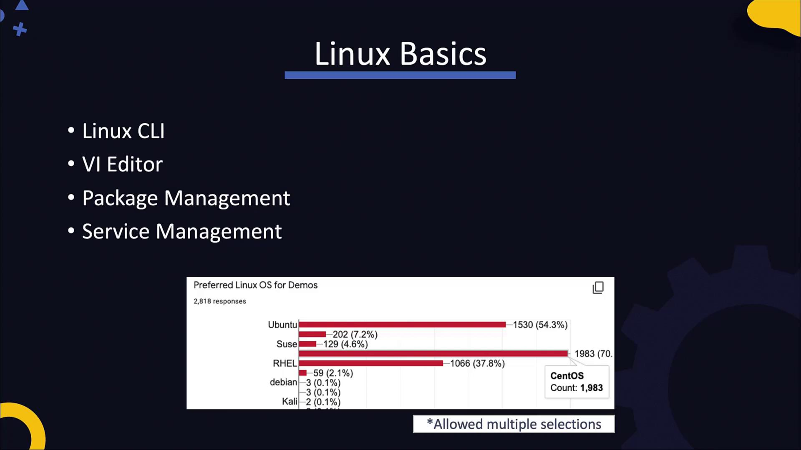
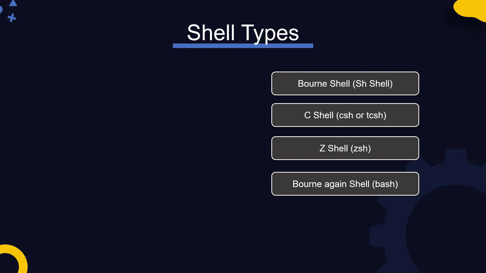

# Working your way through the CLI

Source: https://notes.kodekloud.com/docs/DevOps-Pre-Requisite-Course/Linux-Basics/Working-your-way-through-the-CLI/page

This lesson covers fundamental Linux CLI concepts essential for efficient command-line operations and system management in the Linux environment.

In this lesson, we explore fundamental Linux CLI concepts—an essential crash course for anyone looking to build proficiency in the Linux environment. Whether you're an aspiring DevOps engineer or a seasoned developer transitioning from Windows, mastering these CLI skills will pave the way for efficient command-line operations and system management.

While designing this course, we leveraged insights from Stack Overflow and student surveys to focus on the most in-demand technologies. According to community feedback, Linux remains the most widely used and highly favored platform among developers. If you’re new to Linux, it's highly recommended to become familiar with its basic operations, as many modern DevOps tools—such as Docker, Ansible, and Kubernetes—are built around Linux. For example, Docker originally supported only Linux, and even though Ansible can manage Windows systems, it requires a Linux controller. Moreover, Kubernetes master nodes operate exclusively on Linux. A solid Linux foundation is critical if you plan to pursue certifications and proficiency in these areas.

<Frame>
  
</Frame>

In this lesson, we cover Linux fundamentals, including the Command Line Interface (CLI), text editors like vi, package management, and service management. Our student survey demonstrated a strong preference for CentOS—making it an ideal starting point. CentOS, being the free community version of RHEL, provides experiences that are transferable to both Red Hat Enterprise Linux and certification tracks like Linux Essentials or the Linux Foundation Certified Systems Administrator exam.

<Frame>
  
</Frame>

For those interested in a deeper dive, consider enrolling in the [Learning Linux Basics Course & Labs](https://learn.kodekloud.com/user/courses/learning-linux-basics-course-labs). This course employs a unique story/comic-style approach along with practical labs to enhance your understanding.

Today, we begin our Linux crash course using lab environments. Working with a pre-provisioned Linux system will help you become comfortable with the CLI and core commands before you set up your own Linux system using tools like VirtualBox.

## The Linux Shell and Common Command-Line Tools

Linux systems offer both graphical user interfaces (GUIs) and command-line interfaces (CLIs), but the CLI (or shell) is indispensable in many IT environments—particularly on servers where a GUI is rarely available. Numerous shells exist:

* Bourne shell (sh)
* C shell (csh or tcsh)
* Z shell (zsh)
* Bourne Again Shell (bash)

While the older Bourne shell is limited, the modern bash shell offers advanced features such as arithmetic operations, conditionals, and arrays. To verify which shell you are using, run:

```bash theme={null}
echo $SHELL
```

The echo command prints text or the value of an environment variable, as indicated by the dollar sign.

<Frame>
  
</Frame>

## Core Linux Commands

Below is a list of essential Linux commands for file and directory management:

| Command | Description                                                        | Example Usage                     |
| ------- | ------------------------------------------------------------------ | --------------------------------- |
| echo    | Prints a line of text or an environment variable's value           | `echo Hi`                         |
| ls      | Lists the contents of a directory                                  | `ls`                              |
| cd      | Changes the current directory                                      | `cd my_dir1`                      |
| pwd     | Displays the current working directory                             | `pwd`                             |
| mkdir   | Creates a new directory                                            | `mkdir new_directory`             |
| rm      | Removes files or directories                                       | `rm sample_file.txt`              |
| cp      | Copies files or directories (use `-R` for directories recursively) | `cp new_file.txt copy_file.txt`   |
| mv      | Moves or renames files and directories                             | `mv new_file.txt sample_file.txt` |
| touch   | Creates a new, empty file                                          | `touch new_file.txt`              |

For example, here are some basic commands with sample outputs:

```bash theme={null}
echo Hi
