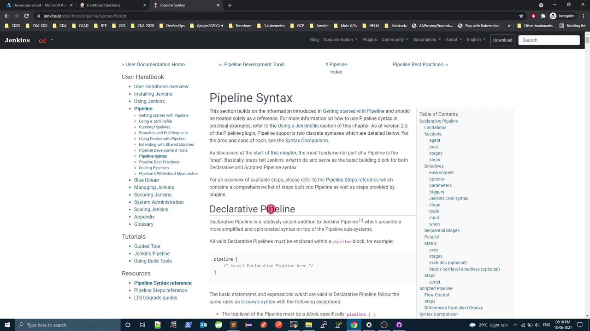
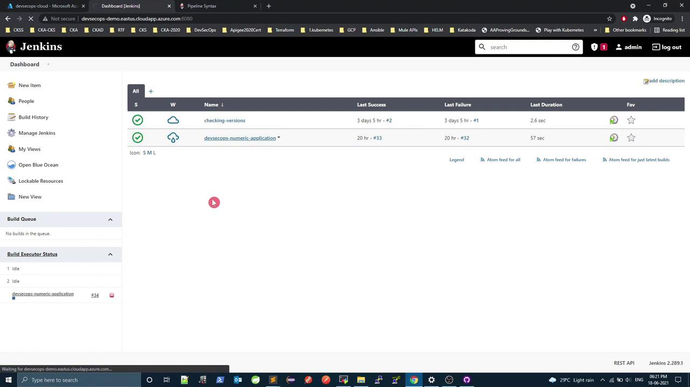
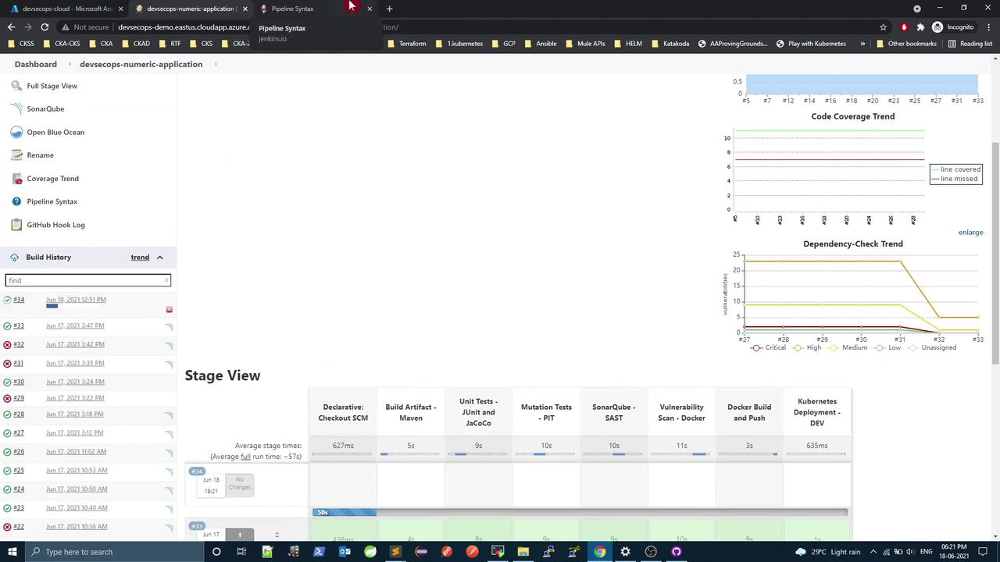
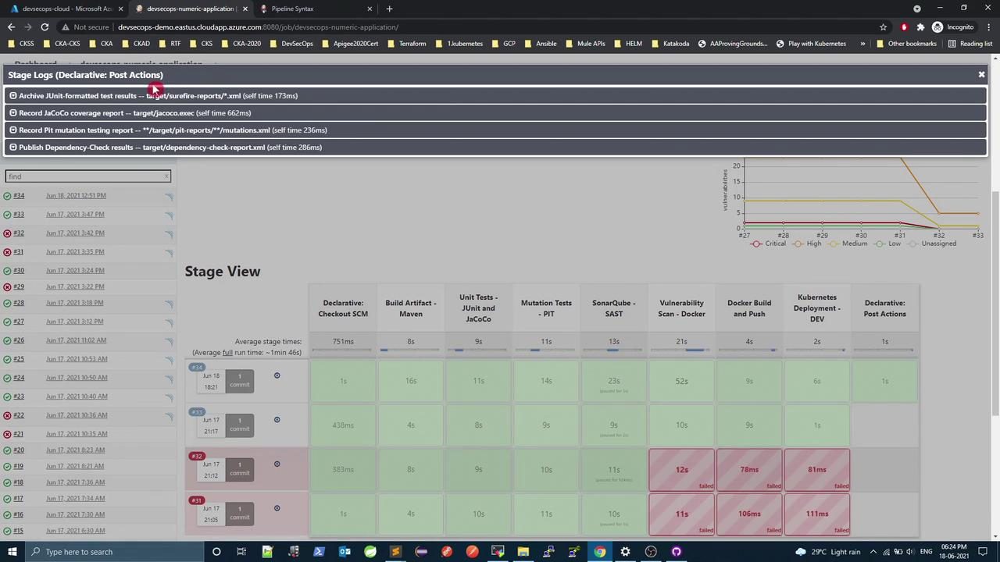

# index.html  mutations.xml
```

Open `index.html` in a browser to explore the complete mutation report.

***

Congratulations! You’ve successfully integrated PIT mutation testing, configured Jenkins for automated reporting, identified weak spots, and enhanced your tests for robust coverage.

***

## Links and References

* [PIT Mutation Testing Documentation][pit-docs]
* [Spring Boot Reference Guide](https://docs.spring.io/spring-boot/docs/current/reference/html/)
* [Jenkins Pipeline Syntax](https://www.jenkins.io/doc/book/pipeline/syntax/)
* [JaCoCo Maven Plugin](https://www.eclemma.org/jacoco/)

[pit-docs]: https://pitest.org/

<CardGroup>
  <Card title="Watch Video" icon="video" href="https://learn.kodekloud.com/user/courses/devsecops-kubernetes-devops-security/module/877bd662-968c-40a5-bda6-a42b600ea957/lesson/459e5ec4-c88f-47eb-95ff-948eb4c4d414" />

  <Card title="Practice Lab" icon="installation" href="https://learn.kodekloud.com/user/courses/devsecops-kubernetes-devops-security/module/877bd662-968c-40a5-bda6-a42b600ea957/lesson/c5e42e3e-37b1-4f76-a064-543b98e74c67" />
</CardGroup>


# Demo Refactoring Jenkins

Source: https://notes.kodekloud.com/docs/DevSecOps-Kubernetes-DevOps-Security/DevSecOps-Pipeline/Demo-Refactoring-Jenkins/page

This tutorial streamlines a Jenkins Declarative Pipeline by consolidating multiple post actions into a single pipeline-level section for improved readability and maintenance.

In this tutorial, we'll streamline a Jenkins Declarative Pipeline by moving multiple `post { always { … } }` blocks from individual stages into a single, pipeline-level `post` section. This approach enhances readability, reduces duplication, and makes future maintenance simpler.

## Why Consolidate `post { always }` Blocks?

When you have several stages that each publish reports or perform cleanup, repeating the same `post` block can clutter your Jenkinsfile. Instead, you can leverage the pipeline-level `post` block to handle all “always” actions in one place.

## Original Jenkinsfile with Repeated Post Sections

Below is a snippet of the existing pipeline. Notice the three stages that each contain their own `post { always { … } }` block:

```groovy theme={null}
stage('Unit Tests - JUnit and JaCoCo') {
    steps {
        sh 'mvn test'
    }
    post {
        always {
            junit 'target/surefire-reports/*.xml'
            jacoco execPattern: 'target/jacoco.exec'
        }
    }
}

stage('Mutation Tests - PIT') {
    steps {
        sh 'mvn org.pitest:pitest-maven:mutationCoverage'
    }
    post {
        always {
            pitmutation mutationStatsFile: '**/target/pit-reports/**/mutations.xml'
        }
    }
}

stage('SonarQube') {
    steps {
        withSonarQubeEnv('SonarQube') {
            sh 'mvn sonar:sonar \
                -Dsonar.projectKey=numeric-application \
                -Dsonar.host.url=http://devsecops-demo.eastus.cloudapp.azure.com:9000'
        }
    }
    timeout(time: 2, unit: 'MINUTES') {
        script {
            waitForQualityGate abortPipeline: true
        }
    }
}

stage('Vulnerability Scan - Docker') {
    steps {
        sh 'mvn dependency-check:check'
    }
    post {
        always {
            dependencyCheckPublisher pattern: 'target/dependency-check-report.xml'
        }
    }
}
```

We’re duplicating the same “always” publishing logic in three places. Let’s consolidate.

## Consolidating Post Actions

Jenkins Declarative Pipeline allows a `post` section at the root of the `pipeline` block. All specified actions run after every stage completes.

<Frame>
  
</Frame>

For reference, check the official [Jenkins Pipeline Syntax documentation](https://www.jenkins.io/doc/book/pipeline/syntax/).

<Callout icon="lightbulb">
  A pipeline-level `post` block can contain `always`, `success`, `failure`, and `unstable` directives.
</Callout>

### Post Actions Summary

| Report Type                | Original Location                      | New Location                 |
| -------------------------- | -------------------------------------- | ---------------------------- |
| JUnit & JaCoCo             | Unit Tests stage `post.always`         | Pipeline-level `post.always` |
| PIT Mutation Reports       | Mutation Tests stage `post.always`     | Pipeline-level `post.always` |
| Dependency-Check Publisher | Vulnerability Scan stage `post.always` | Pipeline-level `post.always` |

## Refactored Jenkinsfile

1. Remove all individual `post { always { … } }` sections.
2. Add one `post` block under the `pipeline` root.
3. Copy each `always` step into that block.

```groovy theme={null}
pipeline {
    agent any

    stages {
        stage('Unit Tests - JUnit and JaCoCo') {
            steps {
                sh 'mvn test'
            }
        }

        stage('Mutation Tests - PIT') {
            steps {
                sh 'mvn org.pitest:pitest-maven:mutationCoverage'
            }
        }

        stage('SonarQube - SAST') {
            steps {
                withSonarQubeEnv('SonarQube') {
                    sh 'mvn sonar:sonar \
                        -Dsonar.projectKey=numeric-application \
                        -Dsonar.host.url=http://devsecops-demo.eastus.cloudapp.azure.com:9000'
                }
                timeout(time: 2, unit: 'MINUTES') {
                    script {
                        waitForQualityGate abortPipeline: true
                    }
                }
            }
        }

        stage('Vulnerability Scan - Docker') {
            steps {
                sh 'mvn dependency-check:check'
            }
        }

        stage('Docker Build and Push') {
            steps {
                withDockerRegistry([credentialsId: 'docker-hub', url: '']) {
                    sh 'printenv'
                    sh 'docker build -t siddharth67/numeric-app:${GIT_COMMIT} .'
                    sh 'docker push siddharth67/numeric-app:${GIT_COMMIT}'
                }
            }
        }

        stage('Kubernetes Deployment - DEV') {
            steps {
                withKubeConfig([credentialsId: 'kubeconfig']) {
                    sh 'sed -i "s/#replace#siddharth67\\/numeric-app:${GIT_COMMIT}/g" k8s_deployment_service.yaml'
                    sh 'kubectl apply -f k8s_deployment_service.yaml'
                }
            }
        }
    }

    post {
        always {
            junit 'target/surefire-reports/*.xml'
            jacoco execPattern: 'target/jacoco.exec'
            pitmutation mutationStatsFile: '**/target/pit-reports/**/mutations.xml'
            dependencyCheckPublisher pattern: 'target/dependency-check-report.xml'
        }
    }
}
```

## Verifying the Refactor

After updating your Jenkinsfile, commit and push to trigger a new build:

```bash theme={null}
git add Jenkinsfile
git commit -m "Refactor: consolidate all post.always actions to pipeline level"
git push
```

In the Jenkins dashboard, you should see all post actions executed at the end of the pipeline:

<Frame>
  
</Frame>

<Frame>
  
</Frame>

<Frame>
  
</Frame>

## Next Steps

Jenkins pipelines can also leverage:

* **Environment directives** for global variables
* **Parallel stages** with `failFast` to optimize runtime
* **Embedded scripted logic** (`script { … }`) for loops, conditionals, and error handling

Here’s a brief example showcasing parallel execution and a `script` block:

```groovy theme={null}
pipeline {
    agent any

    stages {
        stage('Initial Stage') {
            steps {
                echo 'Executing first stage.'
            }
        }

        stage('Parallel Stage') {
            when { branch 'master' }
            failFast true
            parallel {
                stage('Branch A') {
                    agent { label 'for-branch-a' }
                    steps { echo 'Running on Branch A' }
                }
                stage('Branch B') {
                    agent { label 'for-branch-b' }
                    steps { echo 'Running on Branch B' }
                }
            }
        }

        stage('Browser Tests') {
            steps {
                script {
                    def browsers = ['chrome', 'firefox']
                    browsers.each { browser ->
                        echo "Testing in ${browser}"
                    }
                }
            }
        }
    }
}
```

## Links and References

* [Jenkins Pipeline Syntax](https://www.jenkins.io/doc/book/pipeline/syntax/)
* [Declarative Pipeline](https://www.jenkins.io/doc/book/pipeline/development/#pipeline-structure)
* [Jenkins with Docker](https://www.jenkins.io/doc/tutorials/build-a-java-app-with-maven/#use-docker)
* [Kubernetes Plugin for Jenkins](https://plugins.jenkins.io/kubernetes/)

<CardGroup>
  <Card title="Watch Video" icon="video" href="https://learn.kodekloud.com/user/courses/devsecops-kubernetes-devops-security/module/877bd662-968c-40a5-bda6-a42b600ea957/lesson/22f13d2c-e534-48d9-814e-454861e62239" />

  <Card title="Practice Lab" icon="installation" href="https://learn.kodekloud.com/user/courses/devsecops-kubernetes-devops-security/module/877bd662-968c-40a5-bda6-a42b600ea957/lesson/5c44e914-218a-43ce-a7ea-f8325fdc28ce" />
</CardGroup>
