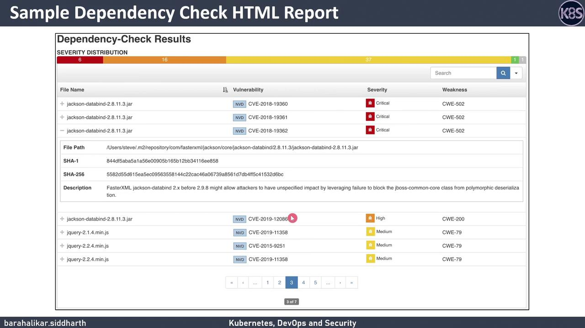

# Fetch and prepare the installer
curl https://thoughtworks.github.io/talisman/install.sh -o ~/install-talisman.sh
chmod +x ~/install-talisman.sh

cd /path/to/your-git-project

# Install as a pre-push hook (default)
~/install-talisman.sh

# Optionally install as a pre-commit hook
~/install-talisman.sh pre-commit
```

<Callout icon="lightbulb">
  The installer adds or updates hooks in `.git/hooks`. Ensure you have write permissions to the project directory before running the script.
</Callout>

### Hook Types Comparison

| Hook Type  | Purpose                                | Installation Command               |
| ---------- | -------------------------------------- | ---------------------------------- |
| pre-push   | Scan code before running `git push`    | `~/install-talisman.sh`            |
| pre-commit | Scan code before allowing `git commit` | `~/install-talisman.sh pre-commit` |

## Preparing the Demo Repository

On your VM, clone (or navigate to) the demo repository and pull the latest changes:

```bash theme={null}
git clone https://github.com/your-org/devsecops-k8s-demo.git
cd devsecops-k8s-demo
git pull
ls -l
```

You should see:

* `Jenkinsfile`
* `Dockerfile`
* `k8s_deployment_service.yaml`
* `.git` folder (containing the `hooks` directory)

## Installing the Pre-Push Hook

Add Talisman to your demo repo:

```bash theme={null}
~/install-talisman.sh
```

Verify the hook is in place:

```bash theme={null}
ls .git/hooks | grep pre-push
# pre-push
# pre-push.sample
```

## Testing Talisman Scans

Create a directory with sample files simulating secrets:

```bash theme={null}
mkdir sec_files && cd sec_files

echo "username=siddharth"                                > file1
echo "secure-password123"                               > password.txt
echo "apikey=iz5yCqhjgrPtr_La56sdukjfav_laCqhjgrPtr_2s"  > file2
echo "base64encodedsecret=cGFzc3dvcmx0aXMtcXdlcnR5MTIzCg==" > file3

cd ..
```

Stage and commit:

```bash theme={null}
git add sec_files/
git commit -m "Add test secret files"
```

Attempt to push:

```bash theme={null}
git push
```

Talisman will scan and block any push with detected secrets. Example output:

```bash theme={null}
Talisman Scan: 12 / 12  <----- ERRORS -----------
FILE                       | ERRORS                                           | SEVERITY
---------------------------+--------------------------------------------------+---------
sec_files/password.txt     | failed checks against the pattern password       | low
sec_files/file3            | contains base64 encoded strings                  | low
sec_files/file3            | potential secret pattern: base64encodedsecret=…   | low
sec_files/file2            | potential secret pattern: apikey=iz5yCqhjgrPtr…   | low

error: failed to push some refs to 'https://github.com/...'
```

<Callout icon="lightbulb">
  By default, Talisman checks for passwords, API keys, and Base64-encoded secrets. You can customize its behavior with a `.talismanrc` file if needed.
</Callout>

## Ignoring Specific Files

To exempt certain files from scanning, create a `.talismanrc` in your project root:

```yaml theme={null}
fileignoreconfig:
  - filename: sec_files/file3
    checksum: b058bbb495454d508634e7d508163ad962c3ec699bc676db38a5
```

Then commit and push again:

```bash theme={null}
git add .talismanrc
git commit -m "Ignore base64 file3 in Talisman scans"
git push
```

Talisman will now skip `sec_files/file3` but still block other flagged content.

## Cleaning Up and Final Push

Remove or refactor any remaining flagged files:

```bash theme={null}
cd sec_files
rm password.txt file2
cd ..
git add -u
git commit -m "Remove sensitive files"
git push
```

With only approved files left, the final push should succeed.

***

By integrating Talisman as a pre-push (or pre-commit) hook, you ensure that sensitive data—passwords, API keys, and Base64-encoded tokens—are caught before they reach your remote repository.

## Links and References

* [Talisman GitHub Repository][talisman-github]
* [Talisman README][talisman-readme]
* [ThoughtWorks DevSecOps](https://www.thoughtworks.com/insights/topics/devsecops)

[talisman-github]: https://github.com/thoughtworks/talisman

[talisman-readme]: https://github.com/thoughtworks/talisman/blob/master/README.md

<CardGroup>
  <Card title="Watch Video" icon="video" href="https://learn.kodekloud.com/user/courses/devsecops-kubernetes-devops-security/module/877bd662-968c-40a5-bda6-a42b600ea957/lesson/4d7a5ddd-8915-4c81-9707-aad8bebb3d1c" />

  <Card title="Practice Lab" icon="installation" href="https://learn.kodekloud.com/user/courses/devsecops-kubernetes-devops-security/module/877bd662-968c-40a5-bda6-a42b600ea957/lesson/542f820d-7fa7-4705-9f4a-9d47f8f9e0d8" />
</CardGroup>


# Dependency Check Basics

Source: https://notes.kodekloud.com/docs/DevSecOps-Kubernetes-DevOps-Security/DevSecOps-Pipeline/Dependency-Check-Basics/page

This lesson explores OWASP Dependency-Check, an open-source tool for detecting and managing security vulnerabilities in open-source dependencies.

In this lesson, we’ll explore OWASP Dependency-Check—an open-source Software Composition Analysis (SCA) tool—to detect and manage security vulnerabilities in your project’s open-source dependencies.

## Why Dependency Management Matters

As applications grow, they often incorporate numerous third-party libraries. Without proper oversight, these components can introduce known vulnerabilities that compromise your software’s security. Effective dependency management ensures you can:

* Maintain visibility into every external dependency and its version.
* Quickly identify known vulnerabilities and assess their severity.
* Take actionable steps to remediate or suppress issues before they reach production.

## What Is OWASP Dependency-Check?

OWASP Dependency-Check is a free SCA plugin that:

1. **Scans** your project’s dependency files (e.g., POM, `package.json`, `Gemfile`).
2. **Extracts** metadata to determine each component’s Common Platform Enumeration (CPE).
3. **Matches** those CPEs against the [National Vulnerability Database (NVD)](https://nvd.nist.gov/) to find associated [CVEs](https://cve.mitre.org/).

<Frame>
  
</Frame>

### Core Features

| Feature                 | Description                                                                        | Example Configuration                                                                      |
| ----------------------- | ---------------------------------------------------------------------------------- | ------------------------------------------------------------------------------------------ |
| Data Feed Updates       | Downloads and processes the NVD feed.                                              | Initial run (\~10+ minutes), weekly updates thereafter.                                    |
| Suppression & Threshold | Exclude specific CVEs or set a CVSS score threshold to ignore low-severity issues. | `<suppressions><file>ignore.xml</file></suppressions>`<br />`<failOnCVSS>7.0</failOnCVSS>` |
| Reporting               | Generates HTML, XML, or JSON reports detailing each vulnerability.                 | `-format HTML -out reports/`                                                               |

<Callout icon="lightbulb">
  On the very first run, Dependency-Check must download and index the entire NVD feed, which can take **10+ minutes**. Running it at least once every 7 days keeps subsequent updates under a minute.
</Callout>

## Sample HTML Report

Here’s an example of the HTML report you’ll receive after a scan. It lists vulnerable files, CVE identifiers, severity levels, and weakness classifications.

<Frame>
  
</Frame>

## Integrating Dependency-Check with Jenkins

You can automate your scans in a Jenkins pipeline using the official Dependency-Check plugin. The following `Jenkinsfile` snippet demonstrates how to:

1. Run the Dependency-Check analysis.
2. Archive the HTML report.
3. Fail or mark the build unstable based on a CVSS threshold.

```groovy theme={null}
pipeline {
  agent any

  tools {
    odc 'Dependency-Check'  // Name of your Dependency-Check installation
  }

  stages {
    stage('Dependency-Check Analysis') {
      steps {
        dependencyCheck additionalArguments: '-scan . -format HTML -out dependency-check-report'
      }
    }
  }

  post {
    always {
      archiveArtifacts artifacts: 'dependency-check-report/*', fingerprint: true
      recordIssues tools: [dependencyCheck(pattern: '**/dependency-check-report/dependency-check-report.xml')]
      publishHTML(target: [
        reportName: 'Dependency-Check Report',
        reportDir: 'dependency-check-report',
        reportFiles: 'dependency-check-report.html',
        keepAll: true,
        alwaysLinkToLastBuild: true
      ])
    }
    failure {
      echo 'Build failed due to vulnerabilities above the configured CVSS threshold.'
    }
  }
}
```

<Callout icon="triangle-alert">
  Set a realistic `<failOnCVSS>` threshold in your `dependency-check.xml` or CLI arguments to prevent build failures on low-severity CVEs. Failing on every issue can lead to pipeline fatigue.
</Callout>

## Links and References

* [OWASP Dependency-Check Documentation](https://jeremylong.github.io/DependencyCheck/)
* [National Vulnerability Database (NVD)](https://nvd.nist.gov/)
* [Common Vulnerability Scoring System (CVSS)](https://www.first.org/cvss/)
* [Jenkins Dependency-Check Plugin](https://plugins.jenkins.io/dependency-check/)

<CardGroup>
  <Card title="Watch Video" icon="video" href="https://learn.kodekloud.com/user/courses/devsecops-kubernetes-devops-security/module/877bd662-968c-40a5-bda6-a42b600ea957/lesson/1ee52f22-13aa-45f1-9d7f-f0865f786aa2" />
</CardGroup>
