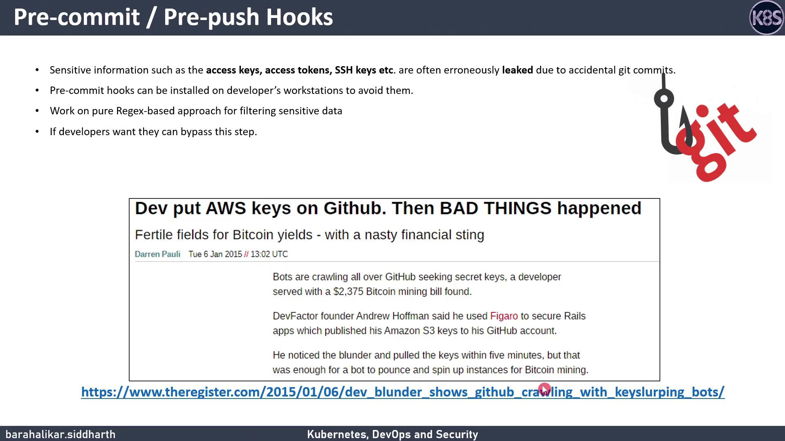
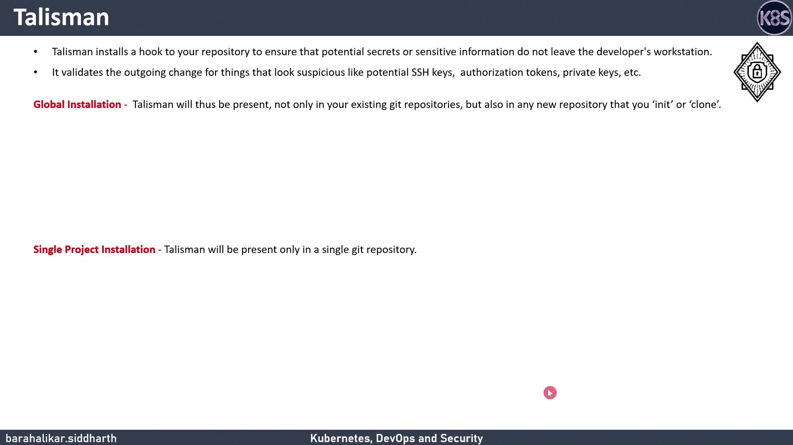

# Git Hooks and Talisman Introduction

Source: https://notes.kodekloud.com/docs/DevSecOps-Kubernetes-DevOps-Security/DevSecOps-Pipeline/Git-Hooks-and-Talisman-Introduction/page

This article explains using Git hooks and Talisman to prevent accidental commits of sensitive data in your codebase.

In this lesson, we’ll cover how to use Git hooks—scripts that run at specific points in your Git workflow—to catch accidental commits of sensitive data. We’ll also introduce **Talisman**, an open-source tool by ThoughtWorks that automates secret scanning in your repository.

## Why Git Hooks Matter

In 2015, a developer accidentally pushed [AWS S3](https://aws.amazon.com/s3) access keys to [GitHub](https://github.com). Within five minutes, automated bots exploited those keys for Bitcoin mining, accruing a \$2,400 bill. Git hooks help you stop this from happening by running custom scripts at critical events like commits and pushes.

<Frame>
  
</Frame>

### Common Git Hook Events

| Hook       | Triggers Before           |
| ---------- | ------------------------- |
| pre-commit | Finalizing a commit       |
| pre-push   | Sending commits to remote |

## Introducing Talisman

[Talisman](https://github.com/thoughtworks/talisman) installs Git hooks to scan outgoing changes for secrets—passwords, API tokens, private keys, credit-card numbers, and more. It also offers a history-scan feature to uncover any secrets already in your repo.

<Frame>
  
</Frame>

### Installation Options

| Scope                     | Description                                                   |
| ------------------------- | ------------------------------------------------------------- |
| Global                    | Applies hooks to all repos you clone or init on your machine. |
| Single-Project (pre-push) | Limits Talisman to one repo, using a `pre-push` hook.         |

We’ll demonstrate the **single-project** approach with a **pre-push** hook.

```bash theme={null}
