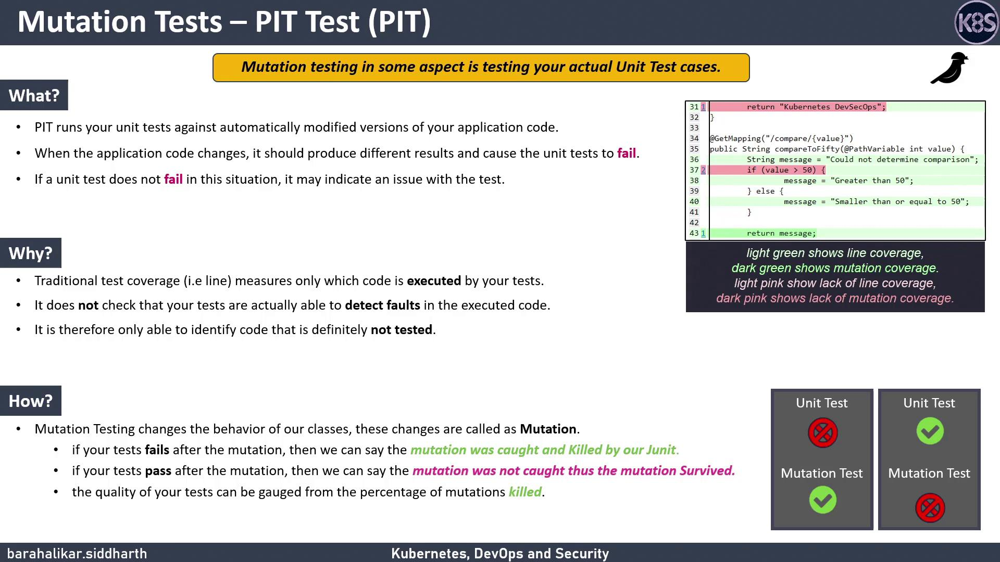

# Download and make the installer executable
curl https://thoughtworks.github.io/talisman/install.sh > ~/install-talisman.sh
chmod +x ~/install-talisman.sh

# In your project directory
cd my-git-project
~/install-talisman.sh
```

<Callout icon="lightbulb">
  If you want to apply Talisman globally, see the [global\_install\_scripts](https://github.com/thoughtworks/talisman/tree/master/global_install_scripts) in the Talisman repo.
</Callout>

## How Talisman Works

When you run `git push`, Talisman inspects your changes for:

* Base64 or hex-encoded secrets
* Common secret patterns (e.g., passwords, tokens)
* Large files with potential key material
* Credit-card numbers or sensitive file extensions (`.keys`, `.secrets`, `.credentials`)

If issues are detected, Talisman outputs a report:

| FILE     | ERRORS                                      | SEVERITY |
| -------- | ------------------------------------------- | -------- |
| test.txt | Potential secret pattern: password-password | low      |

```bash theme={null}
git push origin main
```

Another example:

| FILE | ERRORS                                              | SEVERITY |
| ---- | --------------------------------------------------- | -------- |
| aws  | Potential secret pattern: pikey=5589 4513 5412 4562 | low      |

filename: aws\
checksum: 14e3763161c3485181806245883bf1cebfa4f241dd23f4f01a5f9793ba45

When prompted:

```text theme={null}
? Do you want to add aws with above checksum in talismanrc ? No
```

If the file is safe, answer **Yes** to whitelist it in `.talismanrc`. Otherwise, you can bypass Talisman with:

```bash theme={null}
git push origin main --no-verify
```

<Callout icon="triangle-alert">
  Bypassing hooks (`--no-verify`) skips all pre-push checks. Use this only when you’re certain no sensitive data is included.
</Callout>

## Managing Talisman

To remove Talisman from your project, delete the hook scripts in `.git/hooks/` (for example, `pre-push` or `pre-commit`).

## Further Reading

* [Git Hooks Documentation](https://git-scm.com/docs/githooks)
* [Talisman GitHub Repository](https://github.com/thoughtworks/talisman)
* [Preventing Secret Leaks](https://owasp.org/www-project-best-practices/)

<CardGroup>
  <Card title="Watch Video" icon="video" href="https://learn.kodekloud.com/user/courses/devsecops-kubernetes-devops-security/module/877bd662-968c-40a5-bda6-a42b600ea957/lesson/72a56d55-7785-43ea-b698-a9dcf3278679" />
</CardGroup>


# Mutation Tests PIT Basics

Source: https://notes.kodekloud.com/docs/DevSecOps-Kubernetes-DevOps-Security/DevSecOps-Pipeline/Mutation-Tests-PIT-Basics/page

This article explains mutation testing in Spring Boot using PIT to assess and improve unit test quality.

Before diving into code, let’s understand how mutation testing can reveal gaps in your Spring Boot unit tests. Unlike simple coverage metrics, mutation testing actively modifies your code to verify that tests catch real faults.

## What Is Mutation Testing?

Mutation testing introduces small, deliberate changes—*mutations*—into your application code to validate the effectiveness of your tests. After each mutation, the code is recompiled and your existing tests are run against these altered versions. Two outcomes are possible:

* **Mutation killed**: A test fails, indicating it caught the mutation.
* **Mutation survived**: All tests pass, highlighting a potential blind spot.

The **mutation score** quantifies your test suite’s fault-detection ability:

```text theme={null}
mutation score = (number of killed mutations) / (total number of mutations)
```

A higher score means your tests are sensitive to code changes and more likely to catch bugs before they reach production.

<Callout icon="lightbulb">
  Mutation testing doesn’t replace unit testing—it complements it. Use mutation score alongside line coverage for a fuller picture of test quality.
</Callout>

## Why Use Mutation Testing Over Line Coverage?

Traditional tools report which lines were executed during tests, but they can't tell if tests actually validate the logic. Mutation testing fills that gap by ensuring that tests fail when the code is faulty.

* Line coverage checks *execution*.
* Mutation testing checks *verification*.

## Getting Started with PIT

[PIT](https://pitest.org/) (Pitest) is a leading mutation testing tool for Java. To integrate PIT into your Maven-based Spring Boot project:

1. Add the PIT plugin to your `pom.xml`:
   ```xml theme={null}
   <build>
     <plugins>
       <plugin>
         <groupId>org.pitest</groupId>
         <artifactId>pitest-maven</artifactId>
         <version>1.10.2</version>
         <configuration>
           <targetClasses>
             <param>com.example.*</param>
           </targetClasses>
         </configuration>
       </plugin>
     </plugins>
   </build>
   ```
2. Run PIT:
   ```bash theme={null}
   mvn clean test org.pitest:pitest-maven:mutationCoverage
   ```
3. Inspect the HTML report in `target/pit-reports/YYYYMMDDHHMM/index.html`.

### Common Mutation Operators

| Operator               | Description                                   | Example                          |
| ---------------------- | --------------------------------------------- | -------------------------------- |
| Arithmetic Replacement | Replaces `+`, `-`, `*`, `/` with alternatives | `a + b` → `a - b`                |
| Conditional Boundary   | Flips relational operators                    | `if (x > y)` → `if (x <= y)`     |
| Return Value           | Changes method return values                  | `return true;` → `return false;` |
| Negate Conditional     | Inverts boolean conditions                    | `if (flag)` → `if (!flag)`       |

## Reviewing the PIT HTML Report

After running mutation testing, open the generated HTML report:

<Frame>
  
</Frame>

Key sections in the report:

* **Overview**: Killed vs. survived mutations and overall score.
* **Source view**: Mutated code highlighted inline.
* **Test results**: Failing tests for each surviving mutant.

<Callout icon="triangle-alert">
  Mutation testing can significantly increase build time. For large codebases, run PIT in incremental mode or focus on key modules first.
</Callout>

## Next Steps

In the upcoming demo, we’ll:

1. Integrate PIT into a live Spring Boot application.
2. Execute mutation tests via Maven.
3. Analyze surviving mutations to improve test cases.

Stay tuned for hands-on examples showing how to elevate your test suite with mutation testing!

***

## Links and References

* [PIT (Pitest) Documentation](https://pitest.org/)
* [Mutation Testing (Wikipedia)](https://en.wikipedia.org/wiki/Mutation_testing)
* [Spring Boot Official Site](https://spring.io/projects/spring-boot)

<CardGroup>
  <Card title="Watch Video" icon="video" href="https://learn.kodekloud.com/user/courses/devsecops-kubernetes-devops-security/module/877bd662-968c-40a5-bda6-a42b600ea957/lesson/18a4c568-e6ad-481b-a32f-3fa8646303d2" />
</CardGroup>
