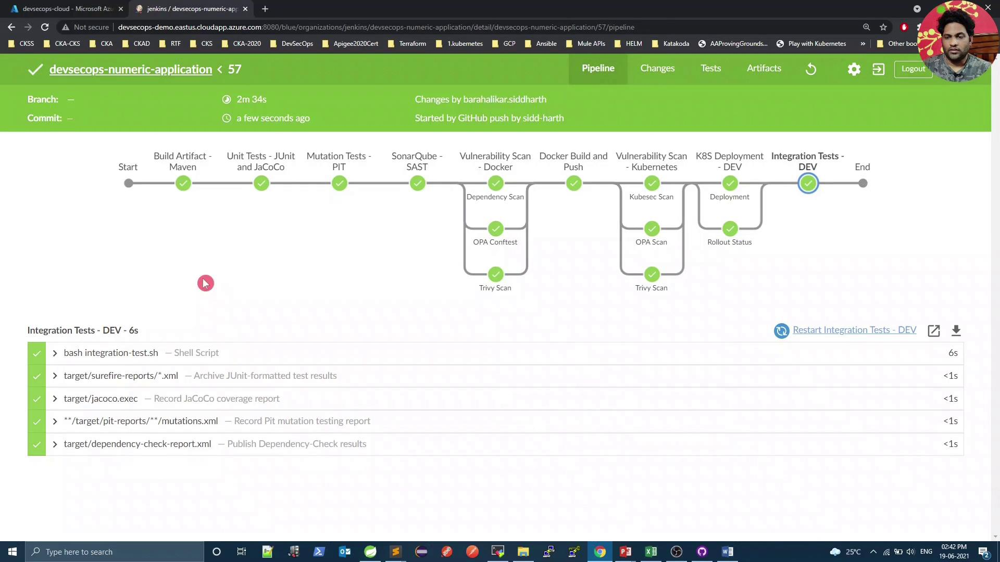

# Check HTTP status code (should print 200)
curl -s -o /dev/null -w "%{http_code}" http://<external-ip>:31933/increment/99

# Check payload (should return 100)
curl -s http://<external-ip>:31933/increment/99
```

## Embedding Integration Tests in Jenkins Pipeline

Add a dedicated `Integration Test - DEV` stage right after deploying to Kubernetes. The stage will:

* Execute `integration-test.sh` for `curl`-based checks
* Automatically roll back on failure using `kubectl rollout undo`

### Jenkins Pipeline Stages at a Glance

| Stage                       | Purpose                                               | Command Example                                                    |
| --------------------------- | ----------------------------------------------------- | ------------------------------------------------------------------ |
| Build Artifact - Maven      | Compile code & package JAR                            | `mvn clean package -DskipTests=true`                               |
| Unit Tests - JUnit & JaCoCo | Run unit tests                                        | `mvn test`                                                         |
| Mutation Tests - PIT        | Perform mutation testing                              | `mvn org.pitest:pitest-maven:mutationCoverage`                     |
| SonarQube - SAST            | Static analysis & code quality                        | `mvn sonar:sonar`                                                  |
| K8S Deployment - DEV        | Deploy to Kubernetes and monitor rollout              | `bash k8s-deployment.sh` / `bash k8s-deployment-rollout-status.sh` |
| Integration Test - DEV      | Validate connectivity and payload; rollback if needed | `bash integration-test.sh`                                         |

### Jenkinsfile Snippet

```groovy theme={null}
pipeline {
    agent any

    environment {
        deploymentEnv  = "devsecops"
        containerName  = "devsecops-container"
        serviceName    = "devsecops-svc"
        imageName      = "siddharth67/numeric-app:${GIT_COMMIT}"
        applicationURL = "http://devsecops-demo.eastus.cloudapp.azure.com"
        applicationURI = "/increment/99"
    }

    stages {
        stage('Build Artifact - Maven') {
            steps {
                sh "mvn clean package -DskipTests=true"
                archiveArtifacts artifacts: 'target/*.jar'
            }
        }

        stage('Unit Tests - JUnit & JaCoCo') {
            steps {
                sh "mvn test"
            }
        }

        stage('Mutation Tests - PIT') {
            steps {
                sh "mvn org.pitest:pitest-maven:mutationCoverage"
            }
        }

        stage('SonarQube - SAST') {
            steps {
                withSonarQubeEnv('SonarQube') {
                    sh """
                        mvn sonar:sonar \
                          -Dsonar.projectKey=numeric-application \
                          -Dsonar.host.url=http://devsecops-demo.eastus.cloudapp.azure.com:9000
                    """
                }
            }
        }

        stage('K8S Deployment - DEV') {
            parallel {
                stage('Deployment') {
                    steps {
                        withKubeConfig([credentialsId: 'kubeconfig']) {
                            sh "bash k8s-deployment.sh"
                        }
                    }
                }
                stage('Rollout Status') {
                    steps {
                        withKubeConfig([credentialsId: 'kubeconfig']) {
                            sh "bash k8s-deployment-rollout-status.sh"
                        }
                    }
                }
            }
        }

        stage('Integration Test - DEV') {
            steps {
                script {
                    try {
                        withKubeConfig([credentialsId: 'kubeconfig']) {
                            sh "bash integration-test.sh"
                        }
                    } catch (e) {
                        withKubeConfig([credentialsId: 'kubeconfig']) {
                            sh "kubectl -n default rollout undo deploy ${serviceName}"
                        }
                        error("Integration tests failed, rolled back deployment.")
                    }
                }
            }
        }
    }

    post {
        always {
            junit 'target/surefire-reports/*.xml'
            jacoco execPattern: 'target/jacoco.exec'
        }
    }
}
```

<Callout icon="lightbulb">
  Ensure that the `serviceName` environment variable matches your Kubernetes Deployment name. Replace `${serviceName}` if needed.
</Callout>

## integration-test.sh Script

Create an `integration-test.sh` file with executable permissions (`chmod +x integration-test.sh`):

```bash theme={null}
#!/usr/bin/env bash
set -euo pipefail
sleep 5

# Retrieve the NodePort for the service
PORT=$(kubectl -n default get svc "${serviceName}" -o jsonpath='{.spec.ports[0].nodePort}')

if [[ -z "$PORT" ]]; then
  echo "Error: Service ${serviceName} has no NodePort."
  exit 1
fi

URL="${applicationURL}:${PORT}${applicationURI}"
echo "Testing endpoint: $URL"

# Validate payload increments 99 to 100
response=$(curl -s "$URL")
if [[ "$response" != "100" ]]; then
  echo "❌ Payload Test Failed: expected 100, got $response"
  exit 1
else
  echo "✅ Payload Test Passed"
fi

# Check HTTP status code 200
http_code=$(curl -s -o /dev/null -w "%{http_code}" "$URL")
if [[ "$http_code" != "200" ]]; then
  echo "❌ HTTP Status Test Failed: expected 200, got $http_code"
  exit 1
else
  echo "✅ HTTP Status Test Passed"
fi
```

## Local Testing

Before committing to Jenkins, validate tests locally:

```bash theme={null}
# Get NodePort
kubectl -n default get svc "${serviceName}" -o jsonpath='{.spec.ports[0].nodePort}'

# Test status code
curl -s -o /dev/null -w "%{http_code}" http://localhost:<PORT>/increment/99

# Test payload
curl -s http://localhost:<PORT>/increment/99
```

If you see `200` and `100`, your integration test script is working.

***

After pushing changes, Jenkins will run the updated pipeline, including the new integration test stage.

<Frame>
  
</Frame>

## References

* [Kubernetes Basics](https://kubernetes.io/docs/concepts/overview/what-is-kubernetes/)
* [Jenkins Pipeline Syntax](https://jenkins.io/doc/book/pipeline/syntax/)
* [curl Manual](https://curl.se/docs/manual.html)
* [jq Manual](https://stedolan.github.io/jq/manual/)

Thank you!

<CardGroup>
  <Card title="Watch Video" icon="video" href="https://learn.kodekloud.com/user/courses/devsecops-kubernetes-devops-security/module/877bd662-968c-40a5-bda6-a42b600ea957/lesson/92c36009-3a0b-4321-afd5-b9dc4d60bb74" />
</CardGroup>


# Demo Kubernetes Deployment Rollout

Source: https://notes.kodekloud.com/docs/DevSecOps-Kubernetes-DevOps-Security/DevSecOps-Pipeline/Demo-Kubernetes-Deployment-Rollout/page

This guide enhances a Jenkins pipeline to deploy a Kubernetes application with rollout checks and automatic rollback on failure.

In this guide, we’ll enhance a Jenkins pipeline to deploy a Kubernetes application with proper rollout checks and automatic rollback on failure. By combining vulnerability scanning, dynamic image updates, and robust deployment scripts, you ensure that failed releases don’t leave your cluster in an unhealthy state.

## Problem Statement

Our initial pipeline applied an updated `Deployment` manifest (including `runAsUser: 100`), but we never verified the rollout status. The `kubectl apply` command succeeded, yet the pods failed to start due to a misconfiguration. We need to:

* Scan manifests for security issues
* Apply or update the deployment
* Monitor rollout status
* Roll back automatically on failure

## Kubernetes Manifest: `k8s_deployment_service.yaml`

```yaml theme={null}
apiVersion: apps/v1
kind: Deployment
metadata:
  labels:
    app: devsecops
  name: devsecops
spec:
  replicas: 2
  selector:
    matchLabels:
      app: devsecops
  strategy: {}
  template:
    metadata:
      labels:
        app: devsecops
    spec:
      containers:
        - image: replace
          name: devsecops-container
          securityContext:
            runAsUser: 100
---
apiVersion: v1
kind: Service
metadata:
  labels:
    app: devsecops
  name: devsecops-svc
spec:
  ports:
    - port: 8080
      protocol: TCP
      targetPort: 8080
  selector:
    app: devsecops
  type: NodePort
```

## Initial Jenkinsfile Stages

```groovy theme={null}
stage('Vulnerability Scan - Kubernetes') {
    steps {
        sh 'docker run --rm -v $(pwd):/project openpolicyagent/conftest test --policy opa-k8s-security.rego k8s_deployment_service.yaml'
    }
}

stage('Kubernetes Deployment - DEV') {
    steps {
        withKubeConfig([credentialsId: 'kubeconfig']) {
            sh 'sed -i "s#replace:siddharth67/numeric-app:${GIT_COMMIT}#g" k8s_deployment_service.yaml'
            sh 'kubectl apply -f k8s_deployment_service.yaml'
        }
    }
}
```

<Callout icon="lightbulb">
  Without `kubectl rollout status`, Kubernetes errors during pod startup don’t fail the pipeline, leading to “silent” broken deployments.
</Callout>

## Enhanced Jenkinsfile: Parallel Deploy and Rollout

We replace the simple apply step with two parallel branches:

1. **Deployment**: applies or updates the manifest
2. **Rollout\_Status**: monitors the rollout and triggers rollback on failure

```groovy theme={null}
stage('Vulnerability Scan - Kubernetes') {
    steps {
        sh 'docker run --rm -v $(pwd):/project openpolicyagent/conftest test --policy opa-k8s-security.rego k8s_deployment_service.yaml'
    }
}

stage('K8S Deployment - DEV') {
    steps {
        parallel(
            Deployment: {
                withKubeConfig([credentialsId: 'kubeconfig']) {
                    sh 'bash k8s-deployment.sh'
                }
            },
            Rollout_Status: {
                withKubeConfig([credentialsId: 'kubeconfig']) {
                    sh 'bash k8s-deployment-rollout-status.sh'
                }
            }
        )
    }
}

post {
    always {
        junit 'target/surefire-reports/*.xml'
    }
}
```

## Deployment Script: `k8s-deployment.sh`

This script replaces the placeholder image name, then either creates a new Deployment or updates the existing one with `--record=true` to capture change-cause.

```bash theme={null}
#!/bin/bash
