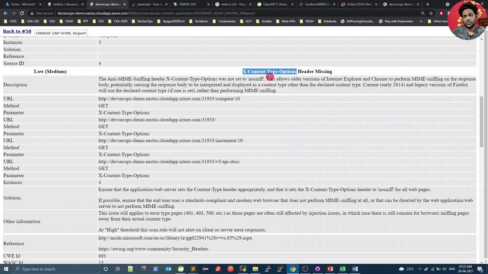
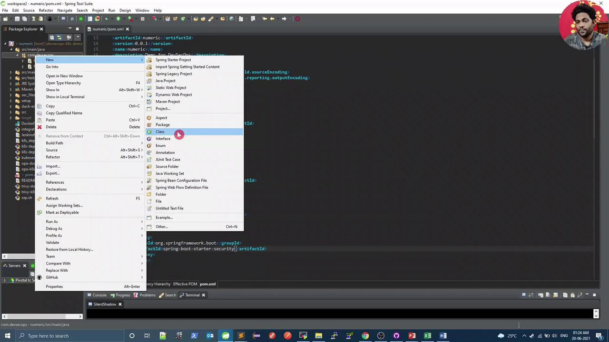
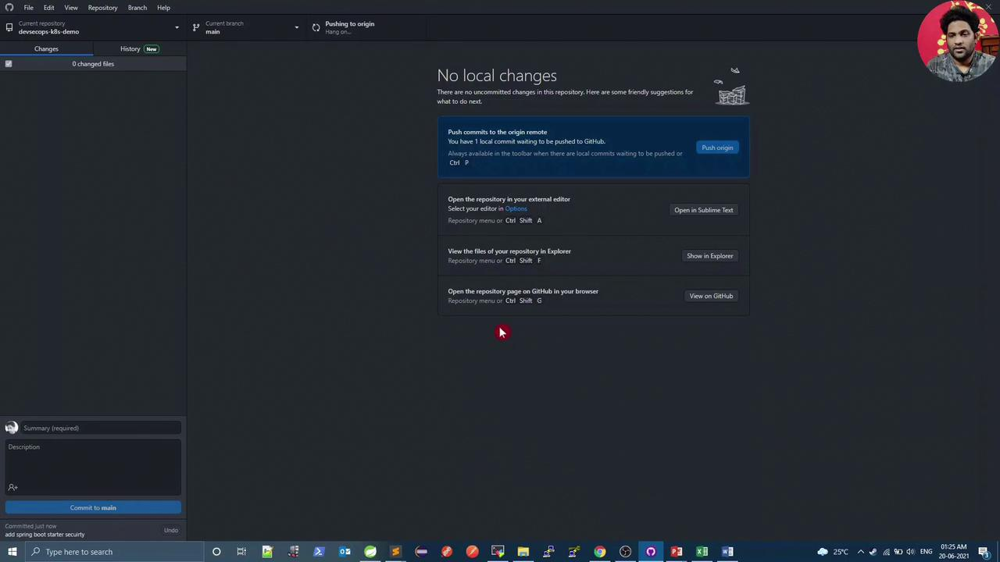
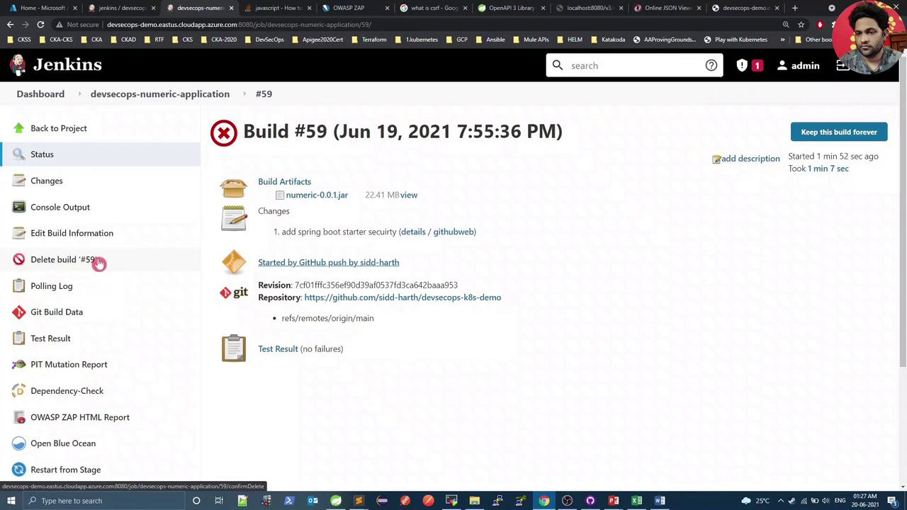
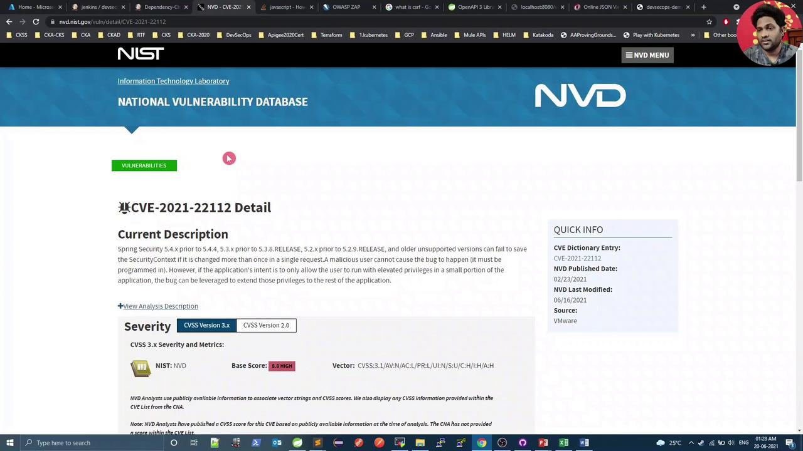
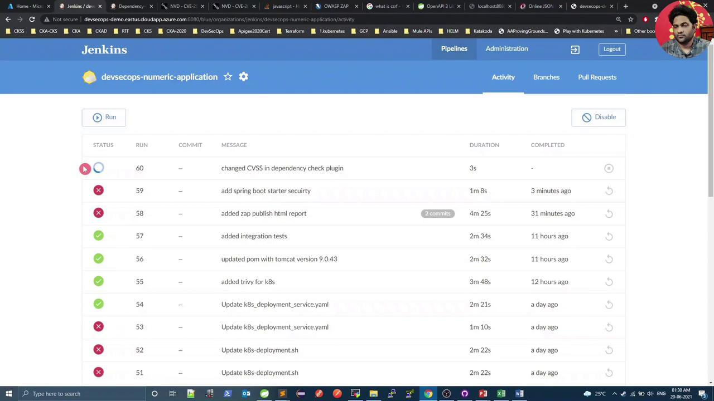
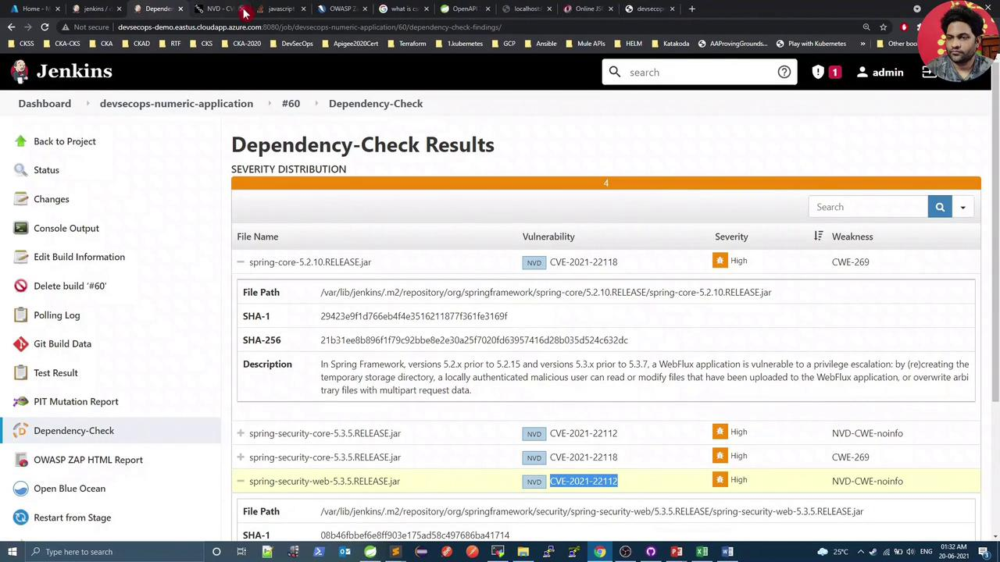

# Demo OWASP ZAP Fixing Issue

Source: https://notes.kodekloud.com/docs/DevSecOps-Kubernetes-DevOps-Security/DevSecOps-Pipeline/Demo-OWASP-ZAP-Fixing-Issue/page

This guide walks you through remediating the missing X-Content-Type-Options header in HTTP responses for a Spring Boot application.

In our previous tutorial, we ran an OWASP ZAP scan against a Spring Boot application and published an HTML report via Jenkins. This guide walks you through remediating the missing **X-Content-Type-Options** header in HTTP responses.

First, let’s inspect the vulnerability reported by ZAP:

<Frame>
  
</Frame>

A quick search on [Stack Overflow](https://stackoverflow.com) suggests adding Spring Security Starter to include this header automatically. We’ll:

1. Add the `spring-boot-starter-security` dependency.
2. Create a `WebSecurityConfig` class to disable CSRF (since we’re only using security for headers).

***

## 1. Update pom.xml

Add Spring Security Starter (version managed by your parent POM):

```xml theme={null}
<dependency>
  <groupId>org.springframework.boot</groupId>
  <artifactId>spring-boot-starter-security</artifactId>
</dependency>
```

After insertion, your `<dependencies>` block might resemble:

```xml theme={null}
<dependencies>
  <dependency>
    <groupId>org.springframework.boot</groupId>
    <artifactId>spring-boot-starter-web</artifactId>
  </dependency>
  <dependency>
    <groupId>org.springframework.boot</groupId>
    <artifactId>spring-boot-starter-security</artifactId>
  </dependency>
  <dependency>
    <groupId>org.springdoc</groupId>
    <artifactId>openapi-ui</artifactId>
    <version>1.2.30</version>
  </dependency>
  <!-- other dependencies -->
</dependencies>
```

<Callout icon="lightbulb">
  Spring Security automatically adds many secure headers, including `X-Content-Type-Options: nosniff`.
</Callout>

***

## 2. Create WebSecurityConfig

In your IDE, right-click the package under `src/main/java` and select **New → Class**:

<Frame>
  
</Frame>

Name the class `WebSecurityConfig` and add the following:

```java theme={null}
package com.devsecops;

import org.springframework.security.config.annotation.web.builders.HttpSecurity;
import org.springframework.security.config.annotation.web.configuration.EnableWebSecurity;
import org.springframework.security.config.annotation.web.configuration.WebSecurityConfigurerAdapter;

@EnableWebSecurity
public class WebSecurityConfig extends WebSecurityConfigurerAdapter {
    @Override
    protected void configure(HttpSecurity http) throws Exception {
        http.csrf().disable();
    }
}
```

Commit and push your changes (e.g., via GitHub Desktop):

<Frame>
  
</Frame>

Once pushed, Jenkins will start a new build.

***

## 3. Dependency-Check Failure (CVSS ≥ 8)

During the Maven dependency scan, the build fails due to high-severity issues in Spring Security:

```bash theme={null}
mvn dependency-check:check
...
[ERROR] One or more dependencies were identified with vulnerabilities that have a CVSS score greater than or equal to '8.0':
[ERROR]   spring-security-core-5.3.5.RELEASE.jar (CVE-2021-21112)
[ERROR]   spring-security-web-5.3.5.RELEASE.jar (CVE-2021-21112)
```

Review the failed build in [Jenkins](https://www.jenkins.io) Build #59:

<Frame>
  
</Frame>

Verify CVE-2021-21112 on the [NVD](https://nvd.nist.gov):

<Frame>
  
</Frame>

Since no patched version is available yet, we’ll **temporarily** raise the CVSS threshold to **10**.

<Callout icon="triangle-alert">
  Raising the CVSS threshold should only be temporary. Revert once a fixed release is available.
</Callout>

***

## 4. Adjust `failBuildOnCVSS`

In your `pom.xml`, configure the OWASP Dependency-Check plugin:

```xml theme={null}
<build>
  <plugins>
    <plugin>
      <groupId>org.owasp</groupId>
      <artifactId>dependency-check-maven</artifactId>
      <version>6.1.6</version>
      <configuration>
        <format>ALL</format>
        <!-- Fail build on CVSS ≥ threshold -->
        <failBuildOnCVSS>10</failBuildOnCVSS>
        <!-- Optional internal mirrors and suppression files -->
        <!-- <cveUrlModified>http://internal-mirror/...json.gz</cveUrlModified> -->
        <!-- <suppressionFiles>... -->
      </configuration>
    </plugin>
    <!-- other plugins -->
  </plugins>
</build>
```

Commit and push again.

***

## 5. Build Passes with CVSS 10

With the threshold raised, the dependency scan now succeeds, and Jenkins shows:

<Frame>
  
</Frame>

<Frame>
  
</Frame>

***

## 6. OWASP ZAP DAST

The ZAP stage now completes, reporting only one warning:

```plaintext theme={null}
PASS: X-Content-Type-Options [10021]
...
WARN-NEW: 1 WARN-ING: 1 INFO: 0 IGNORE: 0 PASS: 115
Exit Code: 2
OWASP ZAP Report has either Low/Medium Risk. Please check the HTML Report
```

***

## 7. Verify Response Headers

Refresh your application endpoint in the browser. You should now see:

* **Before:** No `X-Content-Type-Options` header
* **After:** `X-Content-Type-Options: nosniff`

This confirms the header is correctly applied. The only remaining ZAP warning relates to **unexpected Content-Type**, which can be addressed by customizing ZAP’s scan rules.

***

## Links and References

* [OWASP ZAP Official Site](https://www.zaproxy.org)
* [Spring Boot Security Reference](https://docs.spring.io/spring-[SECRET_REDACTED]/)
* [OWASP Dependency-Check Maven Plugin](https://jeremylong.github.io/DependencyCheck/dependency-check-maven/)
* [National Vulnerability Database (NVD)](https://nvd.nist.gov)

<CardGroup>
  <Card title="Watch Video" icon="video" href="https://learn.kodekloud.com/user/courses/devsecops-kubernetes-devops-security/module/877bd662-968c-40a5-bda6-a42b600ea957/lesson/5e67ad83-dfe2-4a7f-a40a-0ec00a26ff2e" />
</CardGroup>
