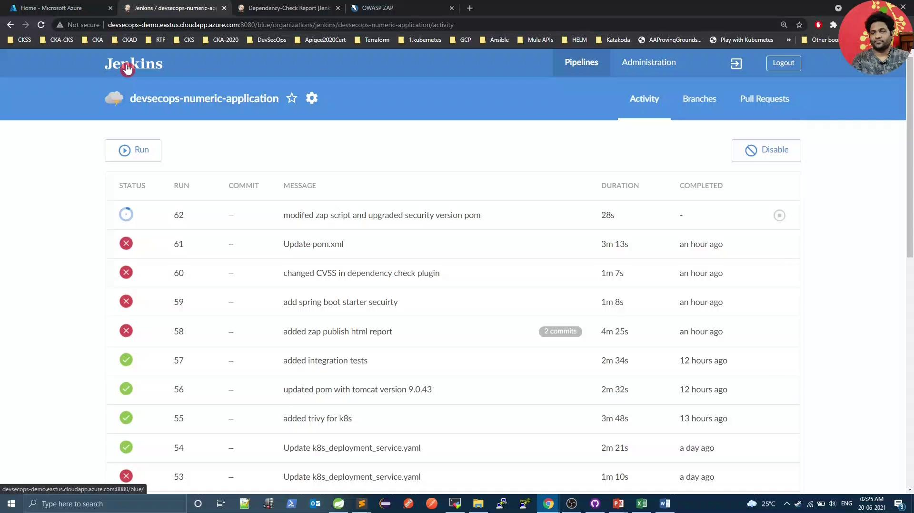
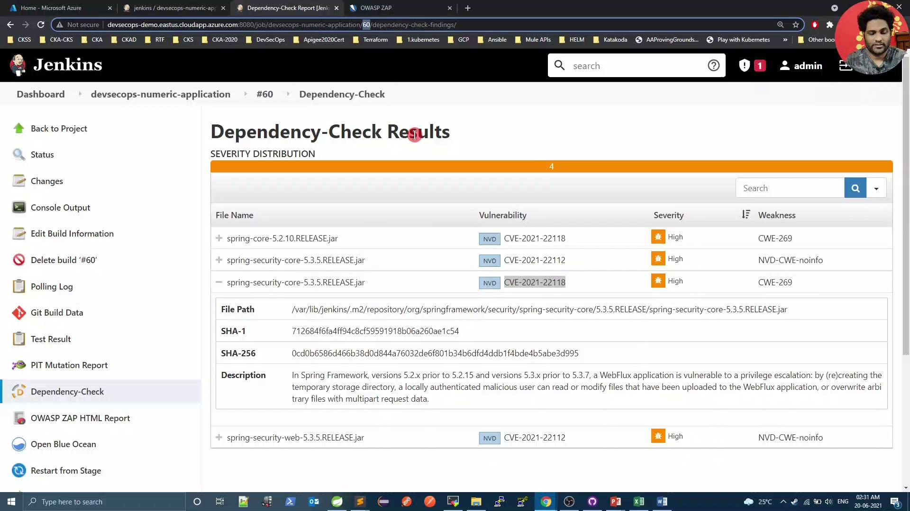

# zap-api-scan rule configuration file
# Columns: <ruleId> <status> <description>
10001	IGNORE	(Unexpected Content-Type was returned)
10000	IGNORE	(A Server Error response code was returned)
```

<Callout icon="lightbulb">
  Use **tabs** between columns—not spaces—to separate `ruleId`, `status`, and `description`.
</Callout>

### 2.3 Update `zap.sh`

Modify your scan script to reference `zap_rules` and generate an HTML report:

```bash theme={null}
#!/bin/bash
PORT=$(kubectl get svc ${serviceName} -o json | jq .spec.ports[].nodePort)
docker run -v $(pwd):/zap/wrk/:rw -t owasp/zap2docker-weekly \
  zap-api-scan.py \
    -t $applicationURL:$PORT/v3/api-docs \
    -f openapi \
    -c zap_rules \
    -r zap_report.html

exit_code=$?
echo "Exit Code: $exit_code"
if [[ $exit_code -ne 0 ]]; then
  echo "OWASP ZAP Report has risks. Check zap_report.html"
  exit 1
else
  echo "OWASP ZAP did not report any risk."
  exit 0
fi
```

Commit both `zap_rules` and `zap.sh`, then start a Jenkins build.

<Frame>
  
</Frame>

In the ZAP stage logs, you’ll see ignored rules:

```bash theme={null}
...
IGNORE-NEW: Unexpected Content-Type was returned [10001] x 30
IGNORE-NEW: A Server Error response code was returned [10000] x 8
FAIL-NEW: 0 WARN-NEW: 0 IGNORE: 2 PASS: 115
Exit Code: 0
OWASP ZAP did not report any risk.
```

***

## 3. Adjust Dependency-Check and Verify Results

Since we resolved Spring Security issues, lower your `failBuildOnCVSS` threshold in the OWASP Dependency-Check Maven plugin:

```xml theme={null}
<plugin>
  <groupId>org.owasp</groupId>
  <artifactId>dependency-check-maven</artifactId>
  <version>6.1.6</version>
  <configuration>
    <format>ALL</format>
    <failBuildOnCVSS>8</failBuildOnCVSS>
    <!-- other configuration -->
  </configuration>
</plugin>
```

<Callout icon="triangle-alert">
  Lowering the `failBuildOnCVSS` threshold may allow medium-risk vulnerabilities to pass the build. Only do this after ensuring critical issues are remediated.
</Callout>

Push your changes and review the Dependency-Check results in Jenkins:

<Frame>
  
</Frame>

Finally, rerun the Trivy scan to confirm there are **zero** issues:

```bash theme={null}
bash trivy-k8s-scan.sh
```

```text theme={null}
Total: 0 (LOW: 0, MEDIUM: 0, HIGH: 0)
Exit Code: 0
Image scanning passed. No vulnerabilities found
```

***

## Conclusion

By upgrading Spring Security, customizing OWASP ZAP scans, and tuning Dependency-Check thresholds, you can maintain a secure codebase and reduce noise from expected warnings. Automate these steps in your CI/CD pipeline to enforce continuous security validation.

***

## References

* [Spring Security Documentation](https://docs.spring.io/spring-security/)
* [OWASP ZAP API Scan Guide](https://www.zaproxy.org/docs/automate/scan-openapi/)
* [Trivy: Vulnerability Scanner](https://github.com/aquasecurity/trivy)
* [OWASP Dependency-Check](https://owasp.org/www-project-dependency-check/)

<CardGroup>
  <Card title="Watch Video" icon="video" href="https://learn.kodekloud.com/user/courses/devsecops-kubernetes-devops-security/module/877bd662-968c-40a5-bda6-a42b600ea957/lesson/7f505d9c-d66a-4b1a-8a76-08569cbc9de9" />
</CardGroup>


# Demo OWASP ZAP Jenkins Scan

Source: https://notes.kodekloud.com/docs/DevSecOps-Kubernetes-DevOps-Security/DevSecOps-Pipeline/Demo-OWASP-ZAP-Jenkins-Scan/page

Integrate OWASP ZAP security testing into Jenkins CI/CD workflow using OpenAPI spec for scanning and reporting vulnerabilities.

Integrate OWASP ZAP security testing into your Jenkins CI/CD workflow by leveraging the OpenAPI spec exposed at `/v3/api-docs` in your Spring Boot application. This guide walks you through updating your Jenkinsfile, creating a ZAP scan script, publishing HTML reports, and fixing security headers.

## Prerequisites

| Prerequisite             | Description                                                            |
| ------------------------ | ---------------------------------------------------------------------- |
| Spring Boot + Springdoc  | Exposes the OpenAPI JSON at `/v3/api-docs`.                            |
| Jenkins with Kubernetes  | Uses `withKubeConfig` for running stages against a Kubernetes cluster. |
| jq                       | Parses JSON output from `kubectl`.                                     |
| Docker & OWASP ZAP image | `owasp/zap2docker-weekly` for running the scan.                        |

## 1. Update the Jenkinsfile

Add an **OWASP ZAP – DAST** stage after your integration tests, and configure the `post` section to publish the HTML report.

| Stage                   | Purpose                                                        |
| ----------------------- | -------------------------------------------------------------- |
| Integration Tests - DEV | Run `integration-test.sh` and rollback on failure.             |
| OWASP ZAP - DAST        | Execute `zap.sh` to scan the API endpoints defined in OpenAPI. |

```groovy theme={null}
pipeline {
    agent any

    stages {
        stage('Integration Tests - DEV') {
            steps {
                script {
                    try {
                        withKubeConfig(credentialsId: 'kubeconfig') {
                            sh 'bash integration-test.sh'
                        }
                    } catch (e) {
                        withKubeConfig(credentialsId: 'kubeconfig') {
                            sh "kubectl -n default rollout undo deploy ${deploymentName}"
                        }
                        throw e
                    }
                }
            }
        }

        stage('OWASP ZAP - DAST') {
            steps {
                withKubeConfig(credentialsId: 'kubeconfig') {
                    sh 'bash zap.sh'
                }
            }
        }
    }

    post {
        always {
            junit 'target/surefire-reports/*.xml'
            jacoco execPattern: 'target/jacoco.exec'
            pitmutation mutationStatsFile: '**/target/pit-reports/**/mutations.xml'
            dependencyCheckPublisher pattern: 'target/dependency-check-report.xml'
            publishHTML(
                allowMissing: false,
                alwaysLinkToLastBuild: true,
                keepAll: true,
                reportDir: 'owasp-zap-report',
                reportFiles: 'zap_report.html',
                reportName: 'OWASP ZAP HTML Report',
                reportTitles: 'OWASP ZAP HTML Report'
            )
        }
    }
}
```

## 2. Create the `zap.sh` Script

This script retrieves your service’s NodePort, invokes the ZAP API scan against the OpenAPI spec, and organizes the report for Jenkins.

```bash theme={null}
#!/bin/bash
