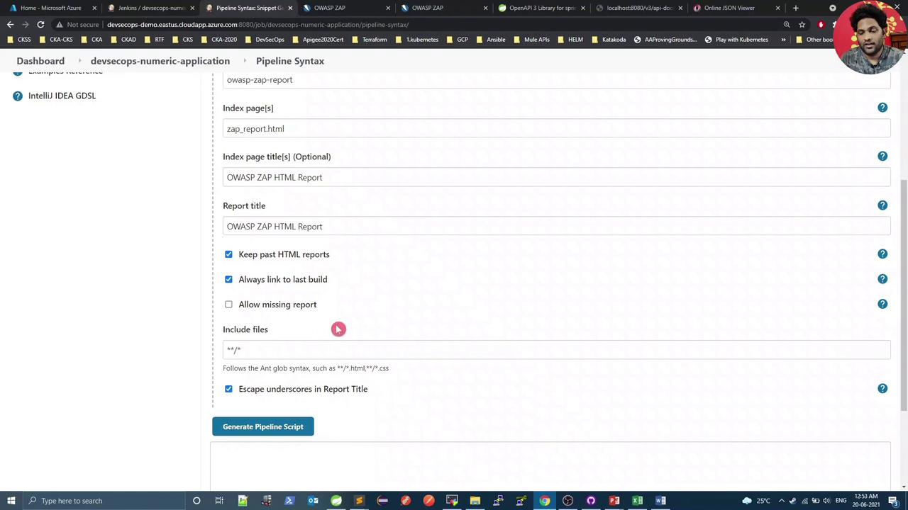
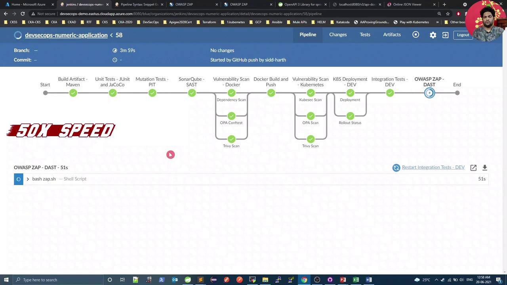
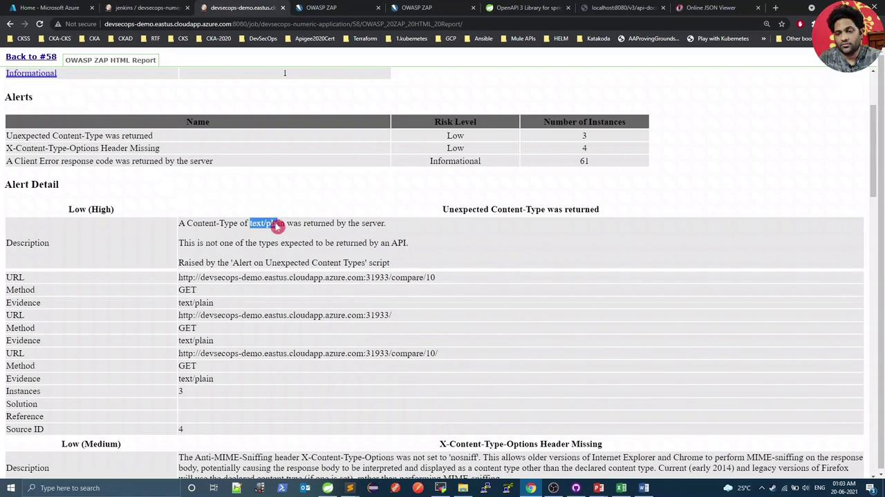
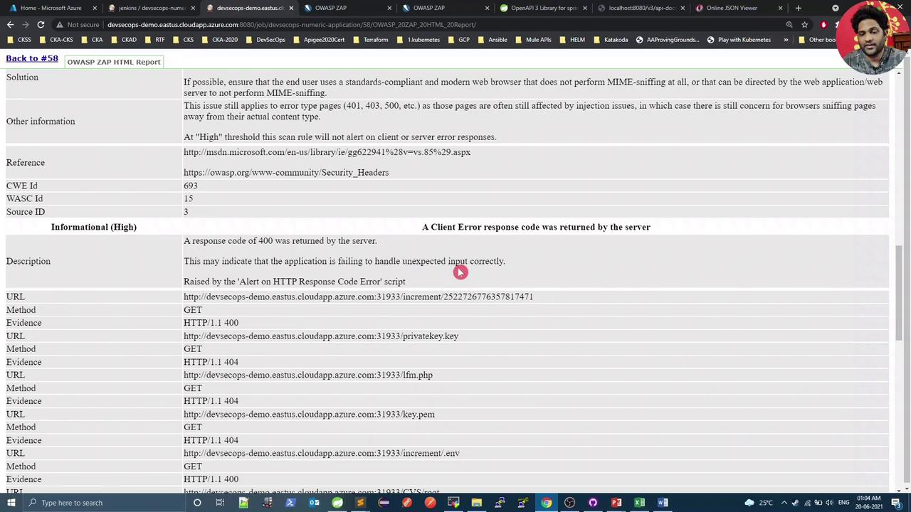
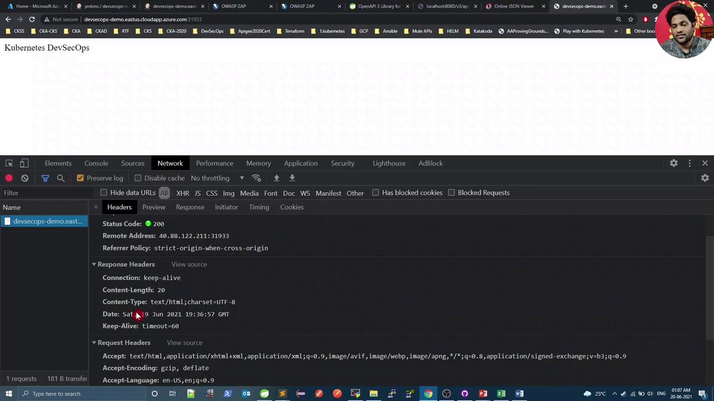

# Fetch the NodePort that exposes our service
PORT=$(kubectl -n default get svc ${serviceName} -o json | jq .spec.ports[0].nodePort)

# Ensure write permissions for the report directory
chmod 777 $(pwd)

# Run the OWASP ZAP API scan against the OpenAPI spec
docker run \
  -v $(pwd):/zap/wrk/:rw \
  -t owasp/zap2docker-weekly \
  zap-api-scan.py \
    -t $applicationURL:$PORT/v3/api-docs \
    -f openapi \
    -r zap_report.html

exit_code=$?

# Move the HTML report into its own folder
mkdir -p owasp-zap-report
mv zap_report.html owasp-zap-report

echo "Exit Code: $exit_code"
if [[ $exit_code -ne 0 ]]; then
    echo "OWASP ZAP found vulnerabilities. Please check the HTML report."
    exit 1
else
    echo "No vulnerabilities detected by OWASP ZAP."
fi
```

Save this as `zap.sh`, make it executable (`chmod +x zap.sh`), and commit it alongside your Jenkinsfile.

<Callout icon="triangle-alert">
  If OWASP ZAP exits with a non-zero code, the pipeline will fail. Review the HTML report to triage any findings.
</Callout>

## 3. Configure Jenkins to Publish HTML

Use the **Pipeline Syntax Snippet Generator** in Jenkins to configure the `publishHTML` step:

* HTML directory: `owasp-zap-report`
* Index page(s): `zap_report.html`
* Report title: **OWASP ZAP HTML Report**

<Frame>
  
</Frame>

<Frame>
  
</Frame>

## 4. Trigger a Build and Review

After pushing your commits, Jenkins will run a new build including the OWASP ZAP – DAST stage:

<Frame>
  
</Frame>

In the console output, you will see ZAP importing your API endpoints and executing its security rules:

```text theme={null}
...
Number of Imported URLs: 8
PASS: Directory Browsing [0]
...
WARN-NEW: Unexpected Content-Type returned [100001] x 3
WARN-NEW: X-Content-Type-Options Header Missing [10021] x 4
FAIL-NEW: ? FAIL-IMPROG: 0 INFO: 0 IGNORE: 0 PASS: 114
Exit Code 2:
OWASP ZAP Report has either Low/Medium/High Risk. Please check the HTML Report
```

## 5. View the Published HTML Report

Open the **OWASP ZAP HTML Report** link on your Jenkins build page to explore vulnerabilities:

<Frame>
  
</Frame>

Select any alert for detailed information:

<Frame>
  
</Frame>

> In this demo, `text/plain` responses are expected and can be treated as false positives, but the missing `X-Content-Type-Options: nosniff` header is a genuine low-risk issue.

## 6. Verify and Fix the Missing Header

Open your application endpoint in a browser and inspect the response headers under Developer Tools → Network. You should see that `X-Content-Type-Options` is absent:

<Frame>
  
</Frame>

Next, enhance your Spring Boot security configuration to include the `X-Content-Type-Options: nosniff` header and eliminate the warning.

***

## Links and References

* [Springdoc OpenAPI](https://springdoc.org/)
* [OWASP ZAP DAST with Docker](https://www.zaproxy.org/docs/desktop/addons/docker/)
* [Jenkins Pipeline Syntax](https://www.jenkins.io/doc/book/pipeline/syntax/)
* [OWASP ZAP Official Documentation](https://www.zaproxy.org/docs/)
* [Jenkins HTML Publisher Plugin](https://plugins.jenkins.io/htmlpublisher/)

<CardGroup>
  <Card title="Watch Video" icon="video" href="https://learn.kodekloud.com/user/courses/devsecops-kubernetes-devops-security/module/877bd662-968c-40a5-bda6-a42b600ea957/lesson/e51c2a87-6bfa-43c9-9c40-3c72fede71cb" />
</CardGroup>


# Demo OWASP ZAP

Source: https://notes.kodekloud.com/docs/DevSecOps-Kubernetes-DevOps-Security/DevSecOps-Pipeline/Demo-OWASP-ZAP/page

This article provides a guide for automating API security scans using OWASP ZAP with a Spring Boot application.

Welcome to this hands-on guide for automating API security scans using **OWASP ZAP** and a **Spring Boot** application powered by **OpenAPI**. In this tutorial, you will learn how to:

1. Run the `zap-api-scan.py` script
2. Customize scan rules and add authentication headers
3. Generate and serve an OpenAPI 3 spec from Spring Boot via SpringDoc
4. Execute the ZAP API scan and review reports

Let’s dive in!

***

## 1. OWASP ZAP API Scan Usage

The `zap-api-scan.py` script is bundled in the ZAP Docker images. It accepts an API definition—OpenAPI, SOAP, or GraphQL (file or URL)—or directly targets a GraphQL endpoint.

```bash theme={null}
Usage: zap-api-scan.py -t <target> -f <format> [options]

  -t target            API spec (OpenAPI/SOAP file or URL, or GraphQL endpoint)
  -f format            openapi | soap | graphql

Options:
  -c config_file       INFO/IGNORE/FAIL custom rules file
  -u config_url        URL to custom rules config
  -g gen_file          generate default config template
  -r report_html       output full HTML report
  -w report_md         output full Markdown report
  -x report_xml        output XML report
  -j report_json       output JSON report
  -a                   include alpha passive scan rules
  -d                   debug mode
  -P port              override ZAP listen port
  -D delay             wait seconds for passive scan
  -i                   default rules not in config to INFO
  -I                   do not treat warnings as failure (post 2.9.0)
  -l level             min level to show: PASS|IGNORE|INFO|WARN|FAIL
  -n context_file      load context file before scanning
  -p progress_file     progress file for addressed issues
  -s                   short output (no PASS or example URLs)
  -S                   safe mode (baseline only)
  -T timeout           max time (minutes) for startup + passive scan
  -U user              authenticated scan username (defined in context)
  -O hostname          override hostname in remote spec
  -z zap_options       pass custom ZAP CLI options
  --hook               Python file for custom hooks
```

<Callout icon="lightbulb">
  By default, ZAP listens on port 8090. Use `-P` to bind a different port if it conflicts with your environment.
</Callout>

***

## 2. Custom Scan Rules & Authentication Headers

### 2.1 Default Rule Levels

You can adjust rules to fire at INFO, WARN, or FAIL by supplying a custom config file (`-c`) or URL (`-u`). Here’s a sample of default rule IDs:

| Rule ID | Level | Description                                    |
| ------: | :---: | ---------------------------------------------- |
|   90001 |  WARN | Insecure JSF ViewState – Passive/beta          |
|   90011 |  WARN | Charset Mismatch – Passive/beta                |
|   90019 |  WARN | Server Side Code Injection – Active/release    |
|   90021 |  WARN | Remote OS Command Injection – Active/release   |
|   90022 |  WARN | XPath Injection – Active/beta                  |
|   90023 |  WARN | Application Error Disclosure – Passive/release |
|   90024 |  WARN | XML External Entity Attack – Active/beta       |
|   90025 |  WARN | Generic Padding Oracle – Active/beta           |
|   90027 |  WARN | Expression Language Injection – Active/beta    |
|   90028 |  WARN | SOAP Action Spoofing – Active/alpha            |
|   90029 |  WARN | SOAP XML Injection – Active/alpha              |
|   90030 |  WARN | WSDL File Passive Scanner – Passive/alpha      |
|   90033 |  WARN | Loosely Scoped Cookie – Passive/beta           |

Use `-c myrules.conf` or `-u https://example.com/myrules.conf` to apply your tailored policy.

### 2.2 Adding Authentication Headers

For authenticated scans, ZAP’s **replacer** options let you insert or replace HTTP headers. Here’s an example that adds two headers via Docker:

```bash theme={null}
docker run -v $(pwd):/zap/wrk/:rw -t owasp/zap2docker-weekly zap-api-scan.py \
  -t https://api.example.com/openapi.json -f openapi \
  -z "-configfile /zap/wrk/options.prop" \
  -z "replacer.full_list(0).description=auth1" \
  -z "replacer.full_list(0).enabled=true" \
  -z "replacer.full_list(0).matchtype=REQ_HEADER" \
  -z "replacer.full_list(0).matchstr=Authorization" \
  -z "replacer.full_list(0).regex=false" \
  -z "replacer.full_list(0).replacement=Bearer abcdef12345" \
  -z "replacer.full_list(1).description=auth2" \
  -z "replacer.full_list(1).enabled=true" \
  -z "replacer.full_list(1).matchtype=REQ_HEADER" \
  -z "replacer.full_list(1).matchstr=X-Custom-Token" \
  -z "replacer.full_list(1).regex=false" \
  -z "replacer.full_list(1).replacement=token12345"
```

<Callout icon="triangle-alert">
  Never commit your authentication tokens or sensitive headers into version control. Use environment variables or secret management.
</Callout>

***

## 3. Generating an OpenAPI Spec from Spring Boot

ZAP needs a REST API definition to drive its scans. With **[SpringDoc OpenAPI](https://springdoc.org/)**, you can automatically generate and serve an OpenAPI 3 spec alongside a Swagger UI.

### 3.1 Add the SpringDoc Dependency

In your `pom.xml`, include:

```xml theme={null}
<dependency>
  <groupId>org.springdoc</groupId>
  <artifactId>springdoc-openapi-ui</artifactId>
  <version>1.6.14</version>
</dependency>
```

This exposes:

* OpenAPI JSON at: `/v3/api-docs`
* Swagger UI at: `/swagger-ui.html`

### 3.2 Example `pom.xml`

```xml theme={null}
<project xmlns="http://maven.apache.org/POM/4.0.0"
         xmlns:xsi="http://www.w3.org/2001/XMLSchema-instance"
         xsi:schemaLocation=
           "http://maven.apache.org/POM/4.0.0
            http://maven.apache.org/xsd/maven-4.0.0.xsd">
  <modelVersion>4.0.0</modelVersion>
  <groupId>com.devsecops</groupId>
  <artifactId>numeric</artifactId>
  <version>0.0.1</version>

  <properties>
    <java.version>1.8</java.version>
  </properties>

  <dependencies>
    <dependency>
      <groupId>org.springframework.boot</groupId>
      <artifactId>spring-boot-starter-web</artifactId>
    </dependency>
    <dependency>
      <groupId>org.springdoc</groupId>
      <artifactId>springdoc-openapi-ui</artifactId>
      <version>1.6.14</version>
    </dependency>
  </dependencies>

  <build>
    <plugins>
      <plugin>
        <groupId>org.springframework.boot</groupId>
        <artifactId>spring-boot-maven-plugin</artifactId>
      </plugin>
    </plugins>
  </build>
</project>
```

### 3.3 Build and Run

```bash theme={null}
mvn clean package
java -jar target/numeric-0.0.1.jar
```

Your Spring Boot app will start on port **8080**, serving the OpenAPI spec.

***

## 4. Viewing the OpenAPI Definition

Open your browser or REST client to:

```text theme={null}
http://localhost:8080/v3/api-docs
```

Example response:

```json theme={null}
{
  "openapi": "3.0.1",
  "info": {
    "title": "Numeric Service API",
    "version": "v0.1.0"
  },
  "servers": [
    { "url": "http://localhost:8080", "description": "Local server" }
  ],
  "paths": {
    "/increment/{value}": { "get": { /* ... */ } },
    "/compare/{value}":  { "get": { /* ... */ } },
    "/welcome":          { "get": { /* ... */ } }
  },
  "components": {}
}
```

You can also browse the interactive docs at:

```text theme={null}
http://localhost:8080/swagger-ui.html
```

***

## 5. Running the ZAP API Scan

With your API spec live, start the security scan:

```bash theme={null}
docker run -v $(pwd):/zap/wrk/:rw -t owasp/zap2docker-weekly zap-api-scan.py \
  -t http://localhost:8080/v3/api-docs -f openapi \
  -r zap-report.html -j zap-report.json
```

This command produces both `zap-report.html` and `zap-report.json` in your current directory for review.

***

## Links and References

* [OWASP ZAP API Scan Documentation](https://www.zaproxy.org/docs/api/)
* [SpringDoc OpenAPI](https://springdoc.org/)
* [Swagger UI](https://swagger.io/tools/swagger-ui/)
* [OpenAPI Specification](https://swagger.io/specification/)

<CardGroup>
  <Card title="Watch Video" icon="video" href="https://learn.kodekloud.com/user/courses/devsecops-kubernetes-devops-security/module/877bd662-968c-40a5-bda6-a42b600ea957/lesson/b4f91177-3a0f-4a3f-84a2-0642f159a480" />
</CardGroup>
