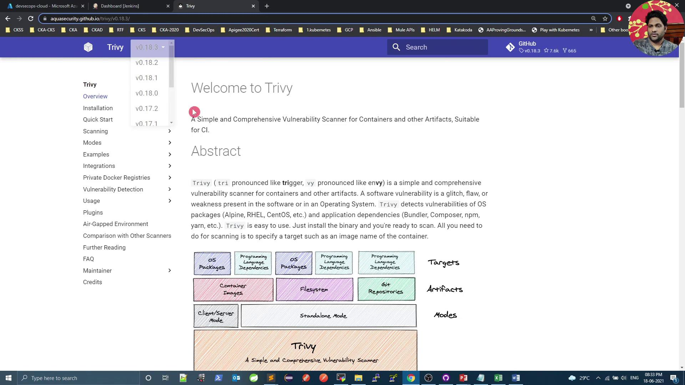

# Demo Trivy Image Scan Docker 1

Source: https://notes.kodekloud.com/docs/DevSecOps-Kubernetes-DevOps-Security/DevSecOps-Pipeline/Demo-Trivy-Image-Scan-Docker-1/page

This tutorial demonstrates using Trivy to scan container images for vulnerabilities in Docker.

In this tutorial, we'll use **Trivy**—the open-source vulnerability scanner from Aqua Security—to analyze a base image defined in your `Dockerfile`. Trivy can operate in **standalone** or **client-server** mode and supports three artifact types:

* Container images
* File systems
* Git repositories

Throughout this guide, we’ll focus on scanning **container images** with Trivy’s Docker image.

<Callout icon="lightbulb">
  Refer to the official [Trivy Documentation](https://aquasecurity.github.io/trivy/) for detailed information on supported targets and scanning modes.
</Callout>

<Frame>
  
</Frame>

***

## Installation

You can install Trivy as a native binary or pull the official Docker image.

### RPM-based Systems

```bash theme={null}
sudo tee /etc/yum.repos.d/trivy.repo <<EOF
[trivy]
name=Trivy repository
baseurl=https://aquasecurity.github.io/trivy-repo/rpm/releases/$releasever/$basearch/
gpgcheck=0
enabled=1
EOF

sudo yum -y update
sudo yum -y install trivy
```

### Debian-based Systems

```bash theme={null}
sudo apt-get update
sudo apt-get install -y wget apt-transport-https gnupg lsb-release
wget -qO - https://aquasecurity.github.io/trivy-repo/deb/public.key | sudo apt-key add -
echo "deb https://aquasecurity.github.io/trivy-repo/deb $(lsb_release -sc) main" \
  | sudo tee /etc/apt/sources.list.d/trivy.list
sudo apt-get update
sudo apt-get install -y trivy
```

### Docker Image

```bash theme={null}
docker pull aquasec/trivy:0.18.3
```

***

## Trivy Scanning Targets & Modes

| Artifact Type   | Description                         | Example Command                                    |
| --------------- | ----------------------------------- | -------------------------------------------------- |
| Container Image | Docker or OCI images                | `trivy image python:3.4-alpine`                    |
| File System     | Local directory scan                | `trivy fs /path/to/project`                        |
| Git Repository  | Remote or local Git repository scan | `trivy repo https://github.com/aquasecurity/trivy` |

| Mode          | Description                                   |
| ------------- | --------------------------------------------- |
| Standalone    | Local DB, no server required                  |
| Client-server | Centralized vulnerability database (gRPC API) |

***

## Quick Scan with Trivy Docker Image

Scan the `python:3.4-alpine` image and cache the vulnerability database locally:

```bash theme={null}
docker run --rm \
  -v $HOME/Library/Caches:/root/.cache/ \
  aquasec/trivy:0.18.3 \
  python:3.4-alpine
```

Sample output:

```plaintext theme={null}
2021-06-18T15:04:39.306Z    INFO  Detected OS: alpine
2021-06-18T15:04:39.306Z    INFO  Detecting Alpine vulnerabilities...
2021-06-18T15:04:39.306Z    WARN  This OS version is no longer supported: alpine 3.9.2

Total: 37 (UNKNOWN: 0, LOW: 4, MEDIUM: 16, HIGH: 13, CRITICAL: 4)
...
```

<Callout icon="lightbulb">
  Mounting a cache directory speeds up repeated scans by storing the vulnerability database locally.
</Callout>

***

## Filtering by Severity

To report only **CRITICAL** vulnerabilities:

```bash theme={null}
docker run --rm \
  -v $HOME/Library/Caches:/root/.cache/ \
  aquasec/trivy:0.18.3 \
  --severity CRITICAL \
  python:3.4-alpine
```

Sample output:

```plaintext theme={null}
Total: 4 (CRITICAL: 4)
...
```

<Callout icon="triangle-alert">
  By default, Trivy exits with code `0` even if vulnerabilities are found. Use `--exit-code` to enforce build failures in CI/CD.
</Callout>

***

## Using Custom Exit Codes

Fail CI pipelines on CRITICAL issues:

```bash theme={null}
docker run --rm \
  -v $HOME/Library/Caches:/root/.cache/ \
  aquasec/trivy:0.18.3 \
  --severity CRITICAL \
  --exit-code 1 \
  python:3.4-alpine

echo $?  # Returns 1 if any CRITICAL vulnerabilities are detected
```

Ignore LOW severity issues while still failing on HIGH+:

```bash theme={null}
docker run --rm \
  -v $HOME/Library/Caches:/root/.cache/ \
  aquasec/trivy:0.18.3 \
  --severity LOW \
  --exit-code 0 \
  python:3.4-alpine

echo $?  # Always returns 0, even if LOW or MEDIUM are found
```

***

## Integrating Trivy in a Jenkins Pipeline

Scan the base image before building and pushing Docker artifacts. Below is a sample **declarative Jenkinsfile**:

```groovy theme={null}
pipeline {
  agent any

  stages {
    stage('SonarQube - SAST') {
      steps {
        withSonarQubeEnv('SonarQube') {
          sh "mvn sonar:sonar \
             -Dsonar.projectKey=numeric-application \
             -Dsonar.host.url=http://devsecops-demo.eastus.cloudapp.azure.com:9000"
        }
      }
      post {
        always {
          timeout(time: 2, unit: 'MINUTES') {
            script { waitForQualityGate abortPipeline: true }
          }
        }
      }
    }

    stage('Vulnerability Scan - Docker') {
      steps {
        parallel(
          'Dependency Scan': {
            sh "mvn dependency-check:check"
          },
          'Trivy Scan': {
            sh "bash trivy-docker-image-scan.sh"
          }
        )
      }
    }

    stage('Docker Build and Push') {
      steps {
        withDockerRegistry([credentialsId: 'docker-hub', url: '']) {
          sh 'docker build -t siddharth67/numeric-app:$GIT_COMMIT .'
          sh 'docker push siddharth67/numeric-app:$GIT_COMMIT'
        }
      }
    }

    stage('Kubernetes Deployment - DEV') {
      steps {
        // Add deployment steps here
      }
    }
  }
}
```

***

## Creating the Trivy Scan Script

Add a file named `trivy-docker-image-scan.sh` at the repository root:

```bash theme={null}
#!/bin/bash
