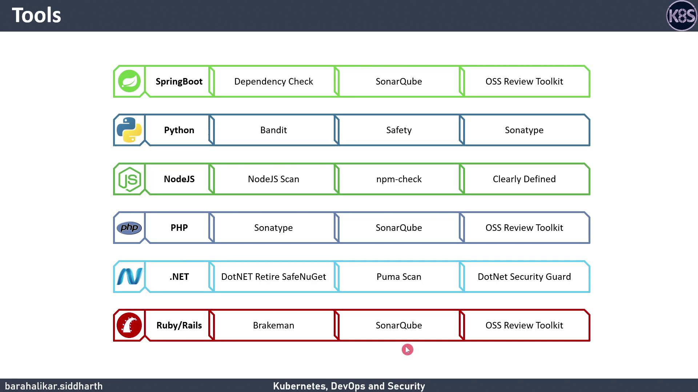

# Tools and Technologies for other Programming Languages

Source: https://notes.kodekloud.com/docs/DevSecOps-Kubernetes-DevOps-Security/DevSecOps-Pipeline/Tools-and-Technologies-for-other-Programming-Languages/page

Overview of static analysis and security scanning tools for various programming languages in DevSecOps workflows.

In modern DevSecOps workflows, integrating static analysis and security-scanning tools early in the development cycle helps catch vulnerabilities, enforce best practices, and maintain code quality. Below is an overview of top tools—both multi-language and ecosystem-specific—so you can tailor your toolchain to your tech stack.

## Quick Reference Table

| Language / Framework | Security & Analysis Tools                             | Purpose                                                 |
| -------------------- | ----------------------------------------------------- | ------------------------------------------------------- |
| Spring Boot (Java)   | OWASP Dependency-Check, SonarQube, OSS Review Toolkit | Dependency vulnerability scanning, code quality metrics |
| Python               | Bandit, Safety, Sonatype Lift                         | Security linting, license checks                        |
| Node.js              | Node.js Scan, npm-check, ClearlyDefined               | CVE detection, dependency updates, license data         |
| PHP                  | Sonatype Lift, SonarQube, OSS Review Toolkit          | SAST, code quality, open-source compliance              |
| .NET                 | Retire.NET, Puma Scan, .NET Security Guard            | NuGet package audit, rule-based analysis                |
| Ruby / Rails         | Brakeman, SonarQube, OSS Review Toolkit               | Rails-specific SAST, code metrics, dependency scanning  |

<Callout icon="lightbulb">
  Prioritize integrating both ecosystem-specific tools (e.g., Brakeman for Rails) and multi-language platforms (e.g., SonarQube) to get comprehensive coverage.
</Callout>

***

## Tool Breakdown by Ecosystem

### Spring Boot (Java)

* **OWASP Dependency-Check**\
  Scan Maven and Gradle dependencies for known CVEs.
* **SonarQube**\
  Continuous inspection of code quality and security hotspots.
* **OSS Review Toolkit (ORT)**\
  Automated license compliance and vulnerability reporting.

### Python

* **Bandit**\
  Finds common security issues in Python code.
* **Safety**\
  Checks installed dependencies against a public vulnerability database.
* **Sonatype Lift**\
  Offers automated code review for security, quality, and open-source policy violations.

### Node.js

* **Node.js Scan**\
  Static analysis for Node.js applications, focusing on security patterns.
* **npm-check**\
  Interactive tool to update, remove, and manage dependencies.
* **ClearlyDefined**\
  Open-source project metadata for license and vulnerability insights.

### PHP

* **Sonatype Lift**\
  SAST platform that supports PHP with custom rules.
* **SonarQube**\
  Tracks code smells and security hotspots in PHP projects.
* **OSS Review Toolkit (ORT)**\
  Ensures license compliance and flags vulnerable packages.

### .NET

* **Retire.NET**\
  Detects vulnerable NuGet packages in .NET applications.
* **Puma Scan**\
  Static analysis with a focus on .NET security best practices.
* **.NET Security Guard**\
  Analyzer for common OWASP Top 10 issues in C# code.

### Ruby / Rails

* **Brakeman**\
  Fast, Rails-specific static analysis tool for security vulnerabilities.
* **SonarQube**\
  Monitors Ruby code quality, test coverage, and security hotspots.
* **OSS Review Toolkit (ORT)**\
  Scans gems for licenses and CVEs.

***

<Frame>
  
</Frame>

## Further Reading and References

* [OWASP Dependency-Check](https://owasp.org/www-project-dependency-check/)
* [SonarQube Documentation](https://docs.sonarqube.org/)
* [OSS Review Toolkit (ORT)](https://github.com/oss-review-toolkit/ort)
* [Bandit Security Linter](https://bandit.readthedocs.io/)
* [Safety: Python Vulnerability Scanner](https://pyup.io/safety/)
* [Brakeman for Rails](https://brakemanscanner.org/)
* [Retire.NET on GitHub](https://github.com/RetireNet/Retire.NET)

<CardGroup>
  <Card title="Watch Video" icon="video" href="https://learn.kodekloud.com/user/courses/devsecops-kubernetes-devops-security/module/877bd662-968c-40a5-bda6-a42b600ea957/lesson/abfbc83b-6c63-41e7-958c-0956317cd254" />
</CardGroup>
