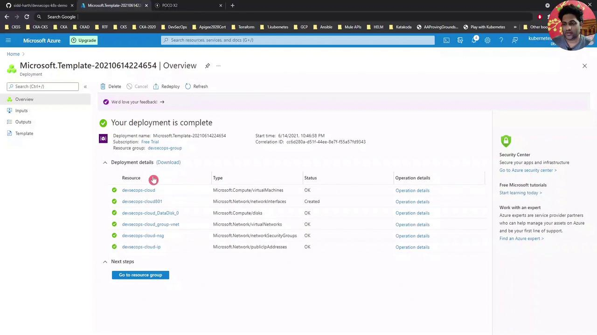
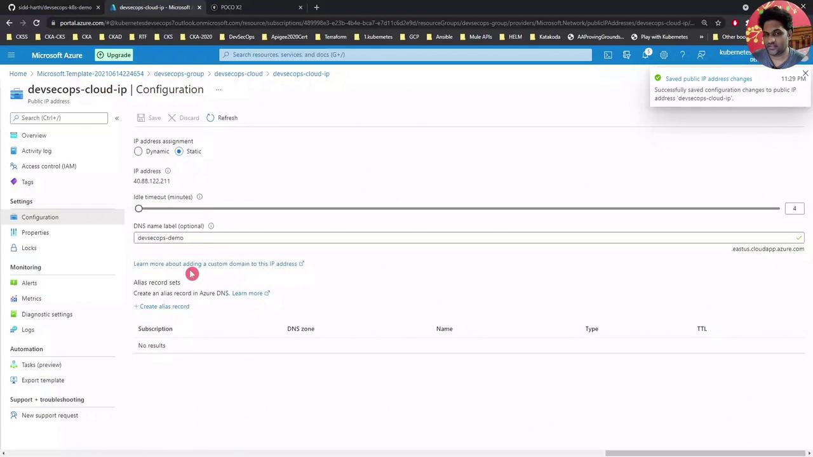
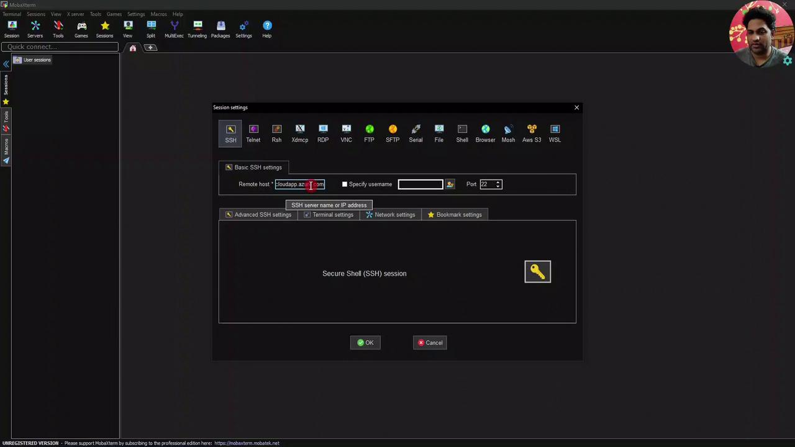

# Shell Script - docker build -t siddharth67/numeric-app="$GIT_COMMIT"  # (self time 9s)
# Shell Script - docker push siddharth67/numeric-app="$GIT_COMMIT"      # (self time 310ms)
```

List images again to confirm the new tags:

```bash theme={null}
root@devsecops-cloud:~$ docker images
REPOSITORY                       TAG                                 IMAGE ID        CREATED          SIZE
siddharth67/numeric-app         8be376a2279c6b3d924c62779a9e90c71   a014560b0908    32 seconds ago   122MB
siddharth67/numeric-app         93d6e7e8ad593a435bcdf8787b7fe8f5   c52599977e7a    4 minutes ago    122MB
nginx                           latest                              d1a364dc548d    2 weeks ago      133MB
...
```

You’ve now successfully built and pushed your Docker image. Next, integrate deployment to your Kubernetes cluster via the Jenkins Pipeline.

## Links and References

* [Jenkins Pipeline Documentation](https://www.jenkins.io/doc/book/pipeline/)
* [Docker Hub](https://hub.docker.com/)
* [Jenkins Docker Pipeline Plugin](https://plugins.jenkins.io/docker-workflow/)

<CardGroup>
  <Card title="Watch Video" icon="video" href="https://learn.kodekloud.com/user/courses/devsecops-kubernetes-devops-security/module/6942848d-9481-472e-a8ec-47357cf8ceaa/lesson/c7e8307c-6637-4e08-8702-e582f013832e" />

  <Card title="Practice Lab" icon="installation" href="https://learn.kodekloud.com/user/courses/devsecops-kubernetes-devops-security/module/6942848d-9481-472e-a8ec-47357cf8ceaa/lesson/0315b3d9-0698-4b56-af3c-f0d659e355c8" />
</CardGroup>


# Demo Installing software in VM

Source: https://notes.kodekloud.com/docs/DevSecOps-Kubernetes-DevOps-Security/DevOps-Pipeline/Demo-Installing-software-in-VM/page

This article provides a tutorial for setting up a DevSecOps environment on an Azure VM, including software installation and deployment of an Nginx application.

In this lesson, we'll set up a DevSecOps environment on an Azure Virtual Machine. We’ll install Docker, Kubernetes (kubeadm & kubectl), Jenkins, and Maven, then deploy a simple Nginx application. This end-to-end tutorial is ideal for anyone looking to automate CI/CD in the cloud.

## Verifying Deployment in Azure

After your deployment finishes, confirm that all resources (VM, network interfaces, disks, VNet, NSGs, public IP) show a **Succeeded** status:

<Frame>
  
</Frame>

**Tip:** Use the Azure portal’s search and filter features to quickly locate resources in large subscriptions.

## Configuring a DNS Name

Assigning a DNS label to your VM’s public IP makes SSH and service URLs easier to remember:

1. In the Azure portal, go to your **Resource Group**.
2. Select the **Public IP** resource (e.g., `devsecops-cloud-ip`).
3. Under **Configuration**, enter a DNS name label (e.g., `DevSecOpsDemo`).
4. Click **Save**.

<Frame>
  
</Frame>

After saving, refresh the VM overview to see the FQDN:\
`DevSecOpsDemo.eastus.cloudapp.azure.com`

<Callout icon="lightbulb">
  DNS changes can take a few minutes to propagate. Use `nslookup DevSecOpsDemo.eastus.cloudapp.azure.com` to verify resolution.
</Callout>

## Connecting via SSH

Use any SSH client. Here’s an example with MobaXterm:

<Frame>
  
</Frame>

* Remote host: `DevSecOpsDemo.eastus.cloudapp.azure.com`
* Username: your VM admin (e.g., `devsecops`)

Enter your password or SSH key to log in.

## Preparing the VM

Switch to the root user to avoid typing `sudo` repeatedly:

```bash theme={null}
devsecops@devsecops-cloud:~$ sudo -i
root@devsecops-cloud:~#
```

## Cloning the Demo Repository

Download the demo scripts and navigate to the install script directory:

```bash theme={null}
root@devsecops-cloud:~# git clone https://github.com/sidd-harth/devsecops-k8s-demo.git
root@devsecops-cloud:~# cd devsecops-k8s-demo/setup/vm-install-script/
root@devsecops-cloud:~/devsecops-k8s-demo/setup/vm-install-script# ls -l
-rw-r--r-- 1 root root 3024 Jun 14 18:02 install-script.sh
```

## Running the Install Script

The `install-script.sh` automates installation of:

| Component  | Installation Method | Version |
| ---------- | ------------------- | ------- |
| Docker     | apt                 | Latest  |
| Kubernetes | kubeadm, kubectl    | v1.20.0 |
| Jenkins    | apt                 | 2.289.1 |
| Maven      | apt                 | 3.x     |

<Callout icon="triangle-alert">
  Always review scripts from external sources before executing them on production systems.
</Callout>

Execute the installer (this may take several minutes):

```bash theme={null}
root@devsecops-cloud:~/devsecops-k8s-demo/setup/vm-install-script# bash install-script.sh
...
Setting up jenkins (2.289.1) ...
...
```

When finished, confirm your Kubernetes node is ready:

```bash theme={null}
root@devsecops-cloud:~# kubectl get node -o wide
NAME              STATUS   ROLES                  AGE   VERSION   INTERNAL-IP   OS-IMAGE            KERNEL-VERSION
devsecops-cloud   Ready    control-plane,master   4m    v1.20.0   10.0.0.4      Ubuntu 18.04.5 LTS   5.4.0-1
```

## Deploying a Sample Nginx Application

1. Create the Nginx pod:

   ```bash theme={null}
   root@devsecops-cloud:~# kubectl run nginx-pod --image=nginx
   pod/nginx-pod created
   ```

2. Check pod status:

   ```bash theme={null}
   root@devsecops-cloud:~# kubectl get pods
   NAME        READY   STATUS             RESTARTS   AGE
   nginx-pod   0/1     ContainerCreating  0          15s
   ```

   Watch until it’s running:

   ```bash theme={null}
   root@devsecops-cloud:~# kubectl get pods -w
   NAME        READY   STATUS    RESTARTS   AGE
   nginx-pod   1/1     Running   0          25s
   ```

3. Expose it via a NodePort service:

   ```bash theme={null}
   root@devsecops-cloud:~# kubectl expose pod nginx-pod --type=NodePort --port=80
   service/nginx-pod exposed
   root@devsecops-cloud:~# kubectl get svc nginx-pod
   NAME        TYPE       CLUSTER-IP    EXTERNAL-IP   PORT(S)        AGE
   nginx-pod   NodePort   10.96.xxx.xxx <none>        80:32325/TCP   1m
   ```

4. In your browser, go to:

   ```text theme={null}
   http://DevSecOpsDemo.eastus.cloudapp.azure.com:32325
   ```

You should see the default Nginx welcome page.

***

Next, we’ll configure a Jenkins pipeline to automate builds and deployments in Kubernetes.

## Links and References

* [Azure Virtual Machines Documentation][azure-vm]
* [Docker Documentation][docker-docs]
* [Kubernetes Basics][k8s-basics]
* [Jenkins User Handbook][jenkins-docs]
* [Apache Maven Project][maven-docs]

[azure-vm]: https://docs.microsoft.com/azure/virtual-machines/

[docker-docs]: https://docs.docker.com/

[k8s-basics]: https://kubernetes.io/docs/concepts/overview/what-is-kubernetes/

[jenkins-docs]: https://www.jenkins.io/doc/

[maven-docs]: https://maven.apache.org/

<CardGroup>
  <Card title="Watch Video" icon="video" href="https://learn.kodekloud.com/user/courses/devsecops-kubernetes-devops-security/module/6942848d-9481-472e-a8ec-47357cf8ceaa/lesson/6bbd9c44-a42d-4f65-a84b-7891420615b6" />
</CardGroup>
