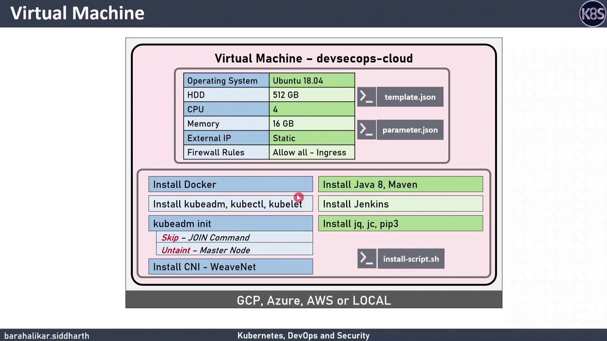

# VM Configuration

Source: https://notes.kodekloud.com/docs/DevSecOps-Kubernetes-DevOps-Security/DevOps-Pipeline/VM-Configuration/page

This guide covers provisioning a DevSecOps Cloud virtual machine, installing tools, and configuring a single-node Kubernetes cluster for CI/CD and containerization learning.

In this guide, we’ll walk through provisioning a **DevSecOps Cloud** virtual machine, installing essential DevSecOps tools, and configuring a single-node Kubernetes cluster. This setup is perfect for learning CI/CD, containerization, and Kubernetes orchestration.

## Table of Contents

1. [Prerequisites](#prerequisites)
2. [VM Specifications](#vm-specifications)
3. [Provisioning the VM](#provisioning-the-vm)
   * [Azure Resource Manager Template](#azure-resource-manager-template)
   * [Google Cloud Platform (gcloud) Commands](#google-cloud-platform-gcloud-commands)
   * [Local VirtualBox Deployment (Vagrant)](#local-virtualbox-deployment-vagrant)
4. [Software Installation](#software-installation)
5. [Cluster Configuration](#cluster-configuration)
6. [Download Resources](#download-resources)

## Prerequisites

* Azure CLI ≥ 2.20 or GCP SDK
* Vagrant & VirtualBox (for local testing)
* Basic Linux shell proficiency

## VM Specifications

| Specification    | Details                 |
| ---------------- | ----------------------- |
| Operating System | Ubuntu 20.04 LTS        |
| vCPUs            | 4                       |
| Memory           | 16 GB RAM               |
| Ingress Firewall | All traffic (demo only) |

<Callout icon="triangle-alert">
  The firewall rule allowing all inbound traffic is for demonstration only. **Do not** use such permissive settings in production environments.
</Callout>

<Frame>
  
</Frame>

## Provisioning the VM

### Azure Resource Manager Template

Use the provided ARM template and parameters:

```bash theme={null}
