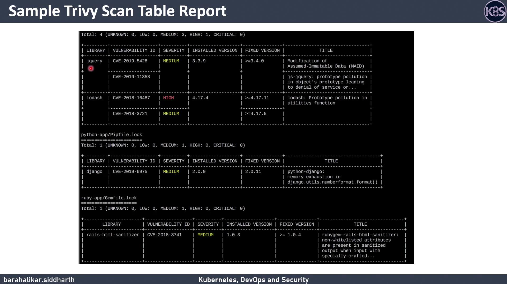

# Scan with default settings
trivy image nginx:alpine

# Only show HIGH and CRITICAL issues
trivy image --severity HIGH,CRITICAL ruby:2.4.0

# Scan OS packages only
trivy image --vuln-type os nodejs-image:1.2

# Skip updating the local database
trivy image --skip-update python:3.4-alpine3.9
```

<Callout icon="lightbulb">
  If you skip the vulnerability database update (`--skip-update`), you may miss newly disclosed CVEs.
</Callout>

### Using Docker

Use the official Trivy image and mount a cache to speed up repeat scans:

```bash theme={null}
docker run --rm \
  -v $HOME/.cache:/root/.cache/ \
  aquasec/trivy:latest \
  --exit-code 0 \
  --severity HIGH \
  nginx:latest

docker run --rm \
  -v $HOME/.cache:/root/.cache/ \
  aquasec/trivy:latest \
  --exit-code 1 \
  --severity CRITICAL \
  nginx:latest
```

<Callout icon="lightbulb">
  Mounting `~/.cache` ensures that vulnerability databases persist between runs, dramatically reducing scan time.
</Callout>

## Scan Exit Codes

Control your CI/CD pipeline behavior by setting one of these exit codes:

* `--exit-code 0`\
  Always returns 0—even if vulnerabilities are found.
* `--exit-code 1`\
  Returns 1 when vulnerabilities meet or exceed your severity threshold.

Use the exit code strategy to fail builds when critical flaws are detected.

## Output Formats

Trivy supports three formats:

| Format   | Description                    | Usage                                   |
| -------- | ------------------------------ | --------------------------------------- |
| table    | Human-readable table (default) | `--format table`                        |
| json     | Machine-readable JSON          | `--format json`                         |
| template | Custom Go-template output      | `--format template --template "@/path"` |

Example:

```bash theme={null}
trivy image nginx:alpine --format json > report.json
```

## Listing All Packages

By default, Trivy only reports packages with known vulnerabilities. To list every package in the image:

```bash theme={null}
trivy image --list-all-pkgs <IMAGE_NAME>
```

This helps you understand the full software inventory, not just vulnerable components.

## Common Options

| Option                             | Description                                             |
| ---------------------------------- | ------------------------------------------------------- |
| `--format [table\|json\|template]` | Choose output format (default: `table`)                 |
| `--exit-code <0\|1>`               | Set exit code when vulnerabilities exceed threshold     |
| `--list-all-pkgs`                  | Show all installed packages                             |
| `--severity <levels>`              | Comma-separated severity levels (e.g., `CRITICAL,HIGH`) |
| `--vuln-type <os\|library>`        | Scan OS packages or application libraries               |
| `--skip-update`                    | Skip updating the vulnerability database                |

## Sample Report

Below is a sample Trivy table output, showing each vulnerability’s ID, severity, installed version, and fixed version when available:

<Frame>
  
</Frame>

Key columns:

* **Vulnerability ID** (e.g., CVE-2021-1234)
* **Severity** level
* **Installed version**
* **Fixed version** (if available)

When scanning a full image, Trivy aggregates OS-level and application dependency vulnerabilities in one report.

***

## References & Links

* [Trivy Documentation](https://aquasecurity.github.io/trivy/)
* [Trivy GitHub Repository](https://github.com/aquasecurity/trivy)
* [Kubernetes Basics](https://kubernetes.io/docs/concepts/overview/what-is-kubernetes/)

Now you’re ready to run your own vulnerability scans and integrate Trivy into your CI/CD pipeline. Happy scanning!

<CardGroup>
  <Card title="Watch Video" icon="video" href="https://learn.kodekloud.com/user/courses/devsecops-kubernetes-devops-security/module/877bd662-968c-40a5-bda6-a42b600ea957/lesson/0f988dcd-b4eb-49b6-9e7a-9e420090adea" />
</CardGroup>


# Demo Vault Annotations Template

Source: https://notes.kodekloud.com/docs/DevSecOps-Kubernetes-DevOps-Security/HashiCorp-Vault-Kubernetes/Demo-Vault-Annotations-Template/page

This tutorial explores using HashiCorp Vault annotations and templates to inject secrets into Kubernetes Pods via the Vault Agent Injector.

In this tutorial, we’ll explore how to use HashiCorp Vault annotations and templates to inject secrets into Kubernetes Pods via the [Vault Agent Injector](https://www.vaultproject.io/docs/platform/k8s/injector). Annotations control both the injection process and how the Vault Agent interacts with Vault.

## Table of Contents

1. [Prerequisites](#prerequisites)
2. [Vault Annotation Overview](#vault-annotation-overview)
3. [1. Injecting the Full Secret Map](#1-injecting-the-full-secret-map)
4. [2. Rendering a Single Field with Templates](#2-rendering-a-single-field-with-templates)
5. [3. Injecting Multiple Secrets with Templates](#3-injecting-multiple-secrets-with-templates)
6. [Pod Initialization and Containers](#pod-initialization-and-containers)
7. [Conclusion](#conclusion)
8. [References](#references)

***

## Prerequisites

* A running Kubernetes cluster (v1.16+).
* A Vault server with KV v2 secrets stored at `crds/data/mysql`.
* An existing `php` Deployment applied in your cluster.

<Callout icon="lightbulb">
  When using KV v2, remember that paths include `/data/` (e.g., `crds/data/mysql`).
</Callout>

***

## Vault Annotation Overview

Vault annotations fall into two main categories:

| Annotation Group      | Controls                                        |
| --------------------- | ----------------------------------------------- |
| **Agent annotations** | Secret retrieval, templating, injection toggles |
| **Vault annotations** | Connection settings (address, TLS, auth role)   |

Below is a quick reference for the five annotations used in this demo:

| Annotation                                         | Purpose                                                                       | Default / Values               |
| -------------------------------------------------- | ----------------------------------------------------------------------------- | ------------------------------ |
| `vault.hashicorp.com/agent-inject`                 | Enable or disable injection                                                   | `"true"` / `"false"` (default) |
| `vault.hashicorp.com/agent-inject-status`          | Update existing secrets instead of fresh injection                            | `"update"`                     |
| `vault.hashicorp.com/agent-inject-secret-<name>`   | Define a secret path under a unique `<name>` (e.g., `username`)               | —                              |
| `vault.hashicorp.com/agent-inject-template-<name>` | Provide a template for rendering the `<name>` secret; must match the `<name>` | —                              |
| `vault.hashicorp.com/role`                         | Vault role used for agent authentication                                      | —                              |

***

## 1. Injecting the Full Secret Map

By default, the Vault Agent Injector writes both the data and metadata of a KV secret into a single file.

1. Create `patch-annotations.yaml`:

   ```yaml theme={null}
   spec:
     template:
       metadata:
         annotations:
           vault.hashicorp.com/agent-inject: "true"
           vault.hashicorp.com/agent-inject-secret-username: "crds/data/mysql"
           vault.hashicorp.com/role: "phpapp"
   ```

2. Apply the patch:

   ```bash theme={null}
   kubectl patch deploy php -p "$(cat patch-annotations.yaml)"
   ```

3. Verify the injected content:

   ```bash theme={null}
   POD=$(kubectl get po -l app=php -o jsonpath='{.items[0].metadata.name}')
   kubectl exec -it $POD -- cat /vault/secrets/username
   ```

   Output:

   ```text theme={null}
   data: map[password:12345 username:root]
   metadata: map[created_time:... deletion_time: destroyed:false version:1]
   ```

***

## 2. Rendering a Single Field with Templates

To extract only a specific field (e.g., `username`), use a templating annotation.

1. Create `patch-annotations-template.yaml`:

   ```yaml theme={null}
   spec:
     template:
       metadata:
         annotations:
           vault.hashicorp.com/agent-inject: "true"
           vault.hashicorp.com/agent-inject-status: "update"
           vault.hashicorp.com/agent-inject-secret-username: "crds/data/mysql"
           vault.hashicorp.com/agent-inject-template-username: |
             {{- with secret "crds/data/mysql" -}}
             {{ .Data.data.username }}
             {{- end }}
           vault.hashicorp.com/role: "phpapp"
   ```

2. Apply the patch and wait for the new Pod:

   ```bash theme={null}
   kubectl patch deploy php -p "$(cat patch-annotations-template.yaml)"
   ```

3. Confirm the output:

   ```bash theme={null}
   POD=$(kubectl get po -l app=php -o jsonpath='{.items[0].metadata.name}')
   kubectl exec -it $POD -- cat /vault/secrets/username
   ```

   Expected:

   ```text theme={null}
   root
   ```

***

## 3. Injecting Multiple Secrets with Templates

You can inject several secrets into separate files by defining multiple `<name>` annotations.

1. Create `patch-annotations-multi.yaml`:

   ```yaml theme={null}
   spec:
     template:
       metadata:
         annotations:
           vault.hashicorp.com/agent-inject: "true"
           vault.hashicorp.com/agent-inject-status: "update"
           vault.hashicorp.com/agent-inject-secret-username: "crds/data/mysql"
           vault.hashicorp.com/agent-inject-template-username: |
             {{- with secret "crds/data/mysql" -}}
               {{ .Data.data.username }}
             {{- end }}
           vault.hashicorp.com/agent-inject-secret-password: "crds/data/mysql"
           vault.hashicorp.com/agent-inject-template-password: |
             {{- with secret "crds/data/mysql" -}}
               {{ .Data.data.password }}
             {{- end }}
           vault.hashicorp.com/agent-inject-secret-apikey: "crds/data/mysql"
           vault.hashicorp.com/agent-inject-template-apikey: |
             {{- with secret "crds/data/mysql" -}}
               {{ .Data.data.apikey }}
             {{- end }}
           vault.hashicorp.com/role: "phpapp"
   ```

2. Apply the patch:

   ```bash theme={null}
   kubectl patch deploy php -p "$(cat patch-annotations-multi.yaml)"
   ```

3. List the injected files:

   ```bash theme={null}
   POD=$(kubectl get po -l app=php -o jsonpath='{.items[0].metadata.name}')
   kubectl exec -it $POD -- ls /vault/secrets
   ```

   Expected:

   ```text theme={null}
   username  password  apikey
   ```

4. Verify each secret:

   ```bash theme={null}
   kubectl exec -it $POD -- cat /vault/secrets/username  # root
   kubectl exec -it $POD -- cat /vault/secrets/password  # 12345
   kubectl exec -it $POD -- cat /vault/secrets/apikey    # Vbdj794HNUH8945tojr3
   ```

***

## Pod Initialization and Containers

After applying annotations, inspect the Pod:

```bash theme={null}
kubectl describe pod <pod-name>
```

You’ll see three containers:

1. **vault-agent-init** (initContainer)
2. **vault-agent** (sidecar)
3. **php** (your application)

These handle authentication, periodic secret renewal, and your app’s access to `/vault/secrets`.

***

## Conclusion

In this demo, you learned how to:

* Enable full secret map injection
* Render specific secret fields with templates
* Inject multiple secrets into separate files

Using Vault annotations and templates helps keep your Kubernetes workloads secure and your secrets management automated.

***

## References

* [Vault Agent Injector Documentation](https://www.vaultproject.io/docs/platform/k8s/injector)
* [Kubernetes Secrets](https://kubernetes.io/docs/concepts/configuration/secret/)
* [KV Secrets Engine Version 2](https://www.vaultproject.io/docs/secrets/kv/kv-v2)

<CardGroup>
  <Card title="Watch Video" icon="video" href="https://learn.kodekloud.com/user/courses/devsecops-kubernetes-devops-security/module/baf5859d-32c2-4e7c-9808-f3486d6b9827/lesson/a4ae16d5-e9a9-40ee-9a6b-c646c4b413dc" />
</CardGroup>
