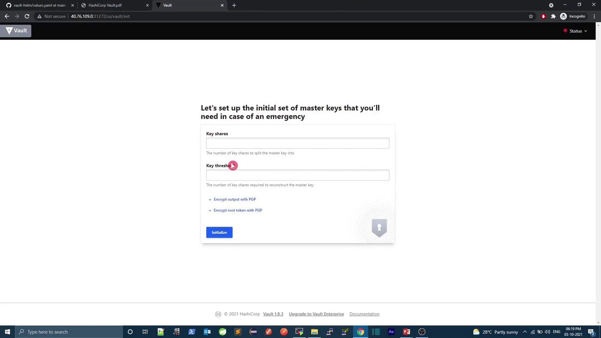

# values.yaml (excerpt)
ui:
  enabled: false
  serviceType: ClusterIP
  serviceNodePort: null

server:
  dataStorage:
    enabled: true
    size: 10Gi
```

In this demo, we’ll:

* Enable the Vault UI
* Expose the UI via `NodePort`
* Disable persistent storage (for demo purposes)

### Prerequisites Check

```bash theme={null}
# Verify Kubernetes
kubectl version --short
# Verify Helm
helm version --short
```

## Step by Step: Deploying to a Dedicated Namespace

1. **Create and switch to the `demo` namespace:**

   ```bash theme={null}
   kubectl create namespace demo
   kubectl config set-context --current --namespace=demo
   ```

2. **Install the Vault chart with custom settings:**

   ```bash theme={null}
   helm install vault hashicorp/vault --version 0.16.1 \
     --set ui.enabled=true \
     --set ui.serviceType=NodePort \
     --set server.dataStorage.enabled=false
   ```

3. **Verify Kubernetes resources:**

   ```bash theme={null}
   kubectl get all
   ```

   Wait until the `vault-0` pod and related components are in the `Running` state:

   ```bash theme={null}
   kubectl get pods
   ```

## Checking Vault Status

Once the pods are running, access the Vault pod and check its seal status:

```bash theme={null}
kubectl exec -it vault-0 -- vault status
```

You should see output similar to:

```text theme={null}
Key             Value
---             -----
Seal Type       shamir
Sealed          true
Version         1.8.3
Cluster Name    vault-cluster
```

<Callout icon="lightbulb">
  Vault is sealed by default. You must initialize and unseal it using key shares and a threshold. These steps can be done via CLI or the UI.
</Callout>

## Accessing the Vault UI

The Vault UI is exposed on a NodePort (e.g., 31272). Open your browser to:

```text theme={null}
http://<your-node-ip>:31272
```

You will be prompted to set up master keys and a root token:

<Frame>
  
</Frame>

***

## References

* [Vault Helm Chart on GitHub](https://github.com/hashicorp/vault-helm)
* [HashiCorp Vault Documentation](https://www.vaultproject.io/docs)
* [Kubernetes Documentation](https://kubernetes.io/docs/)

<CardGroup>
  <Card title="Watch Video" icon="video" href="https://learn.kodekloud.com/user/courses/devsecops-kubernetes-devops-security/module/baf5859d-32c2-4e7c-9808-f3486d6b9827/lesson/69cbeea5-e1b2-4da9-bade-2c50fb72e4ed" />
</CardGroup>


# Demo Vault Initialization

Source: https://notes.kodekloud.com/docs/DevSecOps-Kubernetes-DevOps-Security/HashiCorp-Vault-Kubernetes/Demo-Vault-Initialization/page

This guide explains how to initialize and unseal HashiCorp Vault, including verification in local and Kubernetes environments.

In this guide, you’ll learn how to initialize HashiCorp Vault, unseal it, and verify its status both locally and in Kubernetes. Initialization generates the master key shares and the initial root token—secrets revealed only once.

## Table of Contents

1. [Understanding Initialization & Unsealing](#understanding-initialization--unsealing)
2. [Default Initialization and Unseal Workflow](#default-initialization-and-unseal-workflow)
3. [Customizing Key Shares and Threshold](#customizing-key-shares-and-threshold)
4. [Initializing and Unsealing Vault in Kubernetes](#initializing-and-unsealing-vault-in-kubernetes)
5. [Links and References](#links-and-references)

***

## Understanding Initialization & Unsealing

When Vault starts, it remains **sealed**—incapable of decrypting any stored data. Initialization performs the following:

* Generates a **master key**, split into shares using [Shamir’s Secret Sharing](https://www.vaultproject.io/docs/concepts/seal).
* Creates an **encryption key** for the backend storage.
* Issues the **initial root token**.

Unsealing reconstructs the master key (never stored on disk) by providing a quorum of unseal key shares.

<Callout icon="lightbulb">
  Store unseal key shares and the root token securely. Loss of the root token requires using Recovery Keys or reinitializing with existing shares.
</Callout>

***

## Default Initialization and Unseal Workflow

By default, Vault uses **5 shares** and a **threshold of 3**. Run:

```bash theme={null}
vault operator init
```

Sample output:

```text theme={null}
Unseal Key 1: [AWS_SECRET_ACCESS_KEY]JgOm
Unseal Key 2: [SECRET_REDACTED]
Unseal Key 3: [SECRET_REDACTED]
Unseal Key 4: 0cZEOC/gEk3YHaKjIwxyfS8REhRqk/CXtmniLv+
Unseal Key 5: [SECRET_REDACTED]
Initial Root Token: s.KhNJWF5g0pomcCLEmDb0VCW
```

To unseal, supply any **3** shares:

```bash theme={null}
vault operator unseal <Unseal Key 1>
vault operator unseal <Unseal Key 2>
vault operator unseal <Unseal Key 3>
vault login s.KhNJWF5g0pomcCLEmDb0VCW
```

Once unsealed and authenticated, Vault is ready for secret management.

***

## Customizing Key Shares and Threshold

You can adjust the number of shares and the threshold:

| Parameter        | Description                       | Example |
| ---------------- | --------------------------------- | ------- |
| `-key-shares`    | Total master key shares to create | `3`     |
| `-key-threshold` | Minimum shares required to unseal | `2`     |

```bash theme={null}
vault operator init -key-shares=3 -key-threshold=2
```

Example output:

```text theme={null}
Unseal Key 1: AbCdEfGhIjKlMnOpQrStUvWxYz123456
Unseal Key 2: BaDcFeHgIjKlMnOpQrStUvWxYz654321
Unseal Key 3: CaDbEaFgHiJkLmNoPqRsTuVwXyZ789012
Initial Root Token: s.XYZ1234567890abcdef
```

Unseal with **2** shares and log in:

```bash theme={null}
vault operator unseal <Unseal Key 1>
vault operator unseal <Unseal Key 2>
vault login s.XYZ1234567890abcdef
```

***

## Initializing and Unsealing Vault in Kubernetes

If Vault is deployed with Helm, follow these steps:

1. **Verify Pods**
   ```bash theme={null}
   kubectl get pods
   # NAME                              READY   STATUS    AGE
   # vault-0                           0/1     Running   41s
   # vault-agent-injector-...         1/1     Running   41s
   ```

2. **Check Vault Status**
   ```bash theme={null}
   kubectl exec -it vault-0 -- vault status
   # Initialized      false
   # Sealed           true
   # Total Shares     0
   # Threshold        0
   ```

3. **Initialize Vault**
   ```bash theme={null}
   kubectl exec -it vault-0 -- vault operator init
   ```
   Sample output:
   ```text theme={null}
   Unseal Key 1: tUt+pJ0mIKRHTIigQRu2B90X7PjIaIp
   Unseal Key 2: NYAzWgTQ4qTgHaBUMsK0xR2mX5Pwh9W8
   Unseal Key 3: ivymuAvH42gHbY7nXfe109LvBK7
   Unseal Key 4: P4qJ1vYp+XJBxqEHr5Xyf01UPe
   Unseal Key 5: 3mgVcrKfSwpFqZJ3Y1vNVPB1M3Gg/LsGgB
   Initial Root Token: s.A1yg3V1lBD3uTG0X4DqGpNbP
   ```

4. **Unseal with Any 3 Keys**
   ```bash theme={null}
   kubectl exec -it vault-0 -- vault operator unseal tUt+pJ0mIKRHTIigQRu2B90X7PjIaIp
   kubectl exec -it vault-0 -- vault operator unseal NYAzWgTQ4qTgHaBUMsK0xR2mX5Pwh9W8
   kubectl exec -it vault-0 -- vault operator unseal ivymuAvH42gHbY7nXfe109LvBK7
   ```

5. **Verify and Log In**
   ```bash theme={null}
   kubectl exec -it vault-0 -- vault status
   # Sealed: false
   # Total Shares: 5
   # Threshold: 3
   ```
   ```bash theme={null}
   kubectl exec -it vault-0 -- vault login s.A1yg3V1lBD3uTG0X4DqGpNbP
   ```

6. **Confirm Pod is Ready**
   ```bash theme={null}
   kubectl get pods
   # vault-0                      1/1     Running   5m
   # vault-agent-injector-...     1/1     Running   5m
   ```

Vault is now unsealed and ready for storing secrets, enabling auth methods, and integrating with applications.

***

## Links and References

* [Vault Initialization Command](https://www.vaultproject.io/docs/commands/operator/init)
* [Shamir’s Secret Sharing](https://www.vaultproject.io/docs/concepts/seal)
* [Vault Kubernetes Helm Chart](https://www.vaultproject.io/docs/platform/k8s/helm)

<CardGroup>
  <Card title="Watch Video" icon="video" href="https://learn.kodekloud.com/user/courses/devsecops-kubernetes-devops-security/module/baf5859d-32c2-4e7c-9808-f3486d6b9827/lesson/b6e471d9-7ac6-4312-a6ef-97366a5fa28f" />
</CardGroup>
