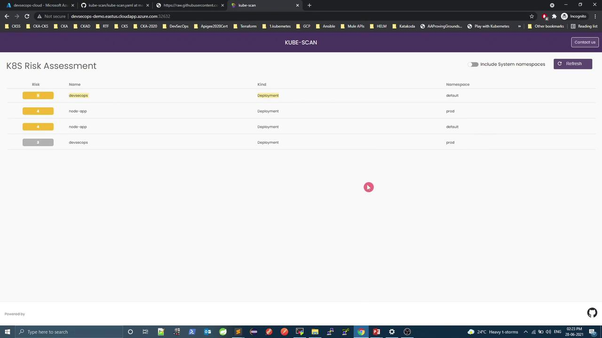
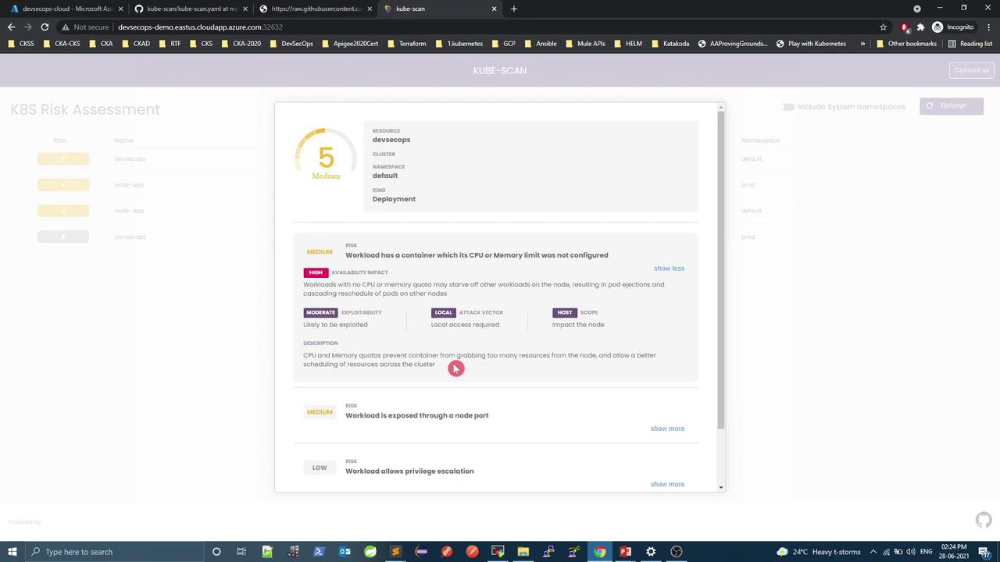
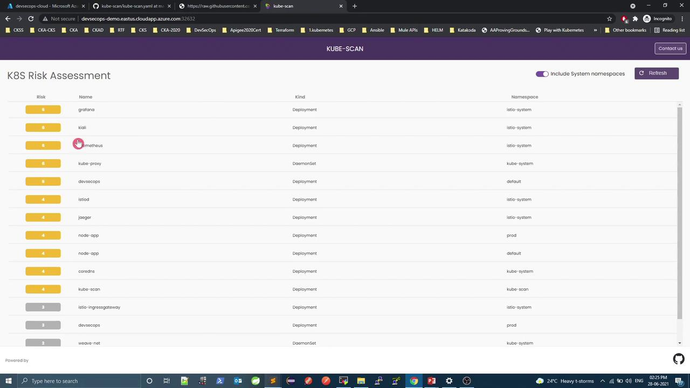
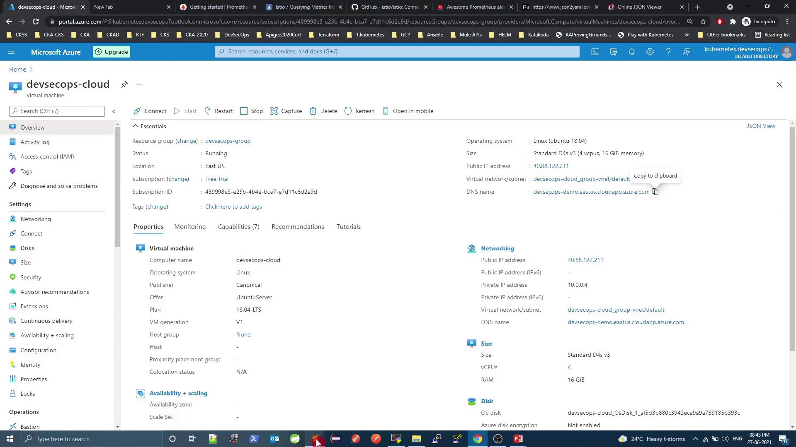

# Build the UI client
cd client
docker build -t <YOUR_CLIENT_IMAGE> .
docker push <YOUR_CLIENT_IMAGE>

# Build the server
cd ../server
docker build -t <YOUR_SERVER_IMAGE> .
docker push <YOUR_SERVER_IMAGE>
```

## 2. Configure Risk Scoring

Open `kube-scan.yaml` and locate the ConfigMap under the `kube-scan` namespace. Adjust thresholds or add rules to match your security policy:

```yaml theme={null}
apiVersion: v1
kind: Namespace
metadata:
  name: kube-scan
---
apiVersion: v1
kind: ConfigMap
metadata:
  name: kube-scan
  namespace: kube-scan
data:
  risk-config.yaml: |
    expConst: 9         # Exploitability weight
    impactConst: 3      # Impact weight
    low: 3              # Low risk threshold
    medium: 5           # Medium risk threshold
    max: 10             # Maximum score
    basic:
      - name: "privileged"
        title: "Workload is privileged"
        shortDescription: "Privileged containers get full host access"
        description: "Privileged containers can compromise host confidentiality."
        integrity: "Low"
        availability: "Low"
        exploitability: "Moderate"
        attackVector: "Local"
        scope: "Host"
        handler: "IsPrivileged"
```

<Callout icon="lightbulb">
  You can extend `basic` or create new rule sets for network, resource limits, or Pod security policies.
</Callout>

## 3. Deploy KubeScan

Update the Deployment spec in `kube-scan.yaml` to use your built images:

```yaml theme={null}
apiVersion: apps/v1
kind: Deployment
metadata:
  name: kube-scan
  namespace: kube-scan
spec:
  template:
    spec:
      containers:
        - name: kube-scan-ui
          image: <YOUR_CLIENT_IMAGE>
          env:
            - name: API_SERVER_PORT
              value: "80"
        - name: kube-scan
          image: <YOUR_SERVER_IMAGE>
          env:
            - name: KUBESCAN_RISK_CONFIG_FILE_PATH
              value: "/etc/kubescan/risk-config.yaml"
          volumeMounts:
            - name: config
              mountPath: /etc/kubescan
      volumes:
        - name: config
          configMap:
            name: kube-scan
```

Apply the complete manifest:

```bash theme={null}
kubectl apply -f kube-scan.yaml
kubectl -n kube-scan get all
```

## 4. Expose the UI Service

By default, the UI Service is `ClusterIP`. To access it externally, switch to `LoadBalancer` or `NodePort`:

```yaml theme={null}
apiVersion: v1
kind: Service
metadata:
  name: kube-scan-ui
  namespace: kube-scan
spec:
  type: LoadBalancer
  selector:
    app: kube-scan
  ports:
    - port: 80
      targetPort: 80
      protocol: TCP
```

Reapply and get the external endpoint:

```bash theme={null}
kubectl apply -f kube-scan.yaml
kubectl -n kube-scan get svc kube-scan-ui
```

## 5. Access the Dashboard

Open your browser at `http://<HOST>:<PORT>`. The **K8S Risk Assessment** dashboard displays all workloads with their risk scores.

<Frame>
  
</Frame>

## 6. Workload Risk Comparison

Compare two deployments of the same `DevSecOps` application:

| Environment | Risk Score | Security Context                                            | Resource Limits                                                      |
| ----------- | ---------- | ----------------------------------------------------------- | -------------------------------------------------------------------- |
| Default     | 5 (Medium) | None                                                        | None                                                                 |
| Production  | 3 (Low)    | runAsNonRoot, noPrivilegeEscalation, readOnlyRootFilesystem | requests: cpu=200m, memory=256Mi<br />limits: cpu=500m, memory=512Mi |

### Default Deployment (Higher Risk)

```yaml theme={null}
apiVersion: apps/v1
kind: Deployment
metadata:
  name: devsecops
spec:
  template:
    spec:
      containers:
        - name: devsecops-container
          image: replace
```

### Production Deployment (Lower Risk)

```yaml theme={null}
apiVersion: apps/v1
kind: Deployment
metadata:
  name: devsecops
  namespace: prod
spec:
  template:
    spec:
      containers:
        - name: devsecops-container
          image: replace
          securityContext:
            runAsNonRoot: true
            allowPrivilegeEscalation: false
            readOnlyRootFilesystem: true
          resources:
            requests:
              cpu: "200m"
              memory: "256Mi"
            limits:
              cpu: "500m"
              memory: "512Mi"
```

<Frame>
  
</Frame>

## 7. System Namespace Pods

Enable “Show system pods” to include core components (e.g., `grafana`, `prometheus`) in the assessment.

<Frame>
  
</Frame>

## 8. Risky Nginx Pod Demo

Create a deliberately risky Pod and Service in both `default` and `prod` namespaces:

```yaml theme={null}
apiVersion: v1
kind: Pod
metadata:
  name: nginx-risky-pod
  labels:
    run: nginx-risky-pod
spec:
  shareProcessNamespace: true
  volumes:
    - name: vol
      hostPath:
        path: /etc
  containers:
    - name: nginx-risky-pod
      image: nginx
      securityContext:
        allowPrivilegeEscalation: true
        readOnlyRootFilesystem: false
        capabilities:
          add: ["ALL"]
      volumeMounts:
        - name: vol
          mountPath: /opt
---
apiVersion: v1
kind: Service
metadata:
  name: risky-pod-svc
spec:
  selector:
    run: nginx-risky-pod
  ports:
    - port: 80
      targetPort: 80
      protocol: TCP
```

Apply and force an immediate scan:

```bash theme={null}
kubectl apply -f risk-pod.yaml
kubectl apply -f risk-pod.yaml -n prod
kubectl -n kube-scan delete pod -l app=kube-scan
```

* In **default**, `nginx-risky-pod` scores **7 (High)** due to `hostPath`, `ALL` capabilities, missing limits, and LoadBalancer exposure.
* In **prod** with an [Istio](https://istio.io) sidecar, the score drops to **6 (Medium)** thanks to service-mesh encryption and identity features.

<Frame>
  
</Frame>

<Frame>
  
</Frame>

## Conclusion

KubeScan provides an automated scoring engine to surface misconfigurations and risk hotspots. By reviewing scores and iteratively adding Pod security contexts, resource constraints, or service meshes, you can drive your cluster toward a more secure posture.

***

## Links and References

* [Kubernetes Concepts](https://kubernetes.io/docs/concepts/)
* [Docker Hub](https://hub.docker.com/)
* [Istio Service Mesh](https://istio.io/)
* [OctarineSec KubeScan GitHub](https://github.com/octarinesec/kube-scan)

<CardGroup>
  <Card title="Watch Video" icon="video" href="https://learn.kodekloud.com/user/courses/devsecops-kubernetes-devops-security/module/fc1733bc-1e9c-4e38-ae86-84e6bd9af04d/lesson/7c617a0f-a126-48a9-8f6c-c0518dd64284" />
</CardGroup>


# Demo Prometheus Grafana

Source: https://notes.kodekloud.com/docs/DevSecOps-Kubernetes-DevOps-Security/Kubernetes-Operations-and-Security/Demo-Prometheus-Grafana/page

This guide explains how to monitor Kubernetes using Prometheus, Grafana, and Alertmanager, including setup, metrics querying, visualization, and alert configuration.

In this guide, you’ll learn how to integrate **Prometheus**, **Grafana**, and **Alertmanager** to monitor Kubernetes resources and push alerts to external services like Slack. We’ll cover:

* Exposing Grafana & Prometheus via NodePort
* Querying metrics with Prometheus (PromQL)
* Visualizing Istio data in Grafana dashboards
* Configuring alerting channels in Grafana
* Defining Prometheus alert rules and using Alertmanager

<Frame>
  
</Frame>

***

## 1. Exposing Grafana & Prometheus

By default, both services are deployed as `ClusterIP`, which prevents external access. To view dashboards from outside the cluster, change the Service type to `NodePort`.

| Service    | Default Type | NodePort Port | Access URL                       |
| ---------- | ------------ | ------------- | -------------------------------- |
| Grafana    | ClusterIP    | 3000:32556    | http\://\<VM\_PUBLIC\_DNS>:32556 |
| Prometheus | NodePort     | 9090:32690    | http\://\<VM\_PUBLIC\_DNS>:32690 |

<Callout icon="lightbulb">
  A `NodePort` service maps a port on each node’s IP to your service, allowing external HTTP/S access without an Ingress.
</Callout>

### 1.1 Expose Grafana

Check current services:

```bash theme={null}
kubectl -n istio-system get svc
