# NAME       TYPE        CLUSTER-IP     PORT(S)
# grafana    ClusterIP   10.106.90.144  3000/TCP
# prometheus NodePort    10.108.8.197   9090:32458/TCP,20001:13086/TCP
```

Edit the Grafana Service and set `type: NodePort`:

```yaml theme={null}
apiVersion: v1
kind: Service
metadata:
  name: grafana
  namespace: istio-system
spec:
  type: NodePort
  selector:
    app.kubernetes.io/name: grafana
  ports:
    - port: 3000
      targetPort: 3000
      protocol: TCP
      name: service
```

Apply and verify:

```bash theme={null}
kubectl -n istio-system apply -f grafana-service.yaml
kubectl -n istio-system get svc grafana
# NAME      TYPE       CLUSTER-IP      PORT(S)
# grafana   NodePort   10.106.90.144   3000:32556/TCP
```

Access Grafana at `http://\<VM_PUBLIC_DNS>:32556`.\
Prometheus is already listening on `http://\<VM_PUBLIC_DNS>:32690`.

***

## 2. Exploring Metrics with Prometheus

Prometheus scrapes metrics at intervals defined in `prometheus.yml`:

```yaml theme={null}
global:
  scrape_interval: 15s  # scrape every 15 seconds
```

Since Istio injects service metrics automatically, you can use built-in dashboards or craft PromQL queries. For example:

```promql theme={null}
istio_requests_total
```

<Frame>
  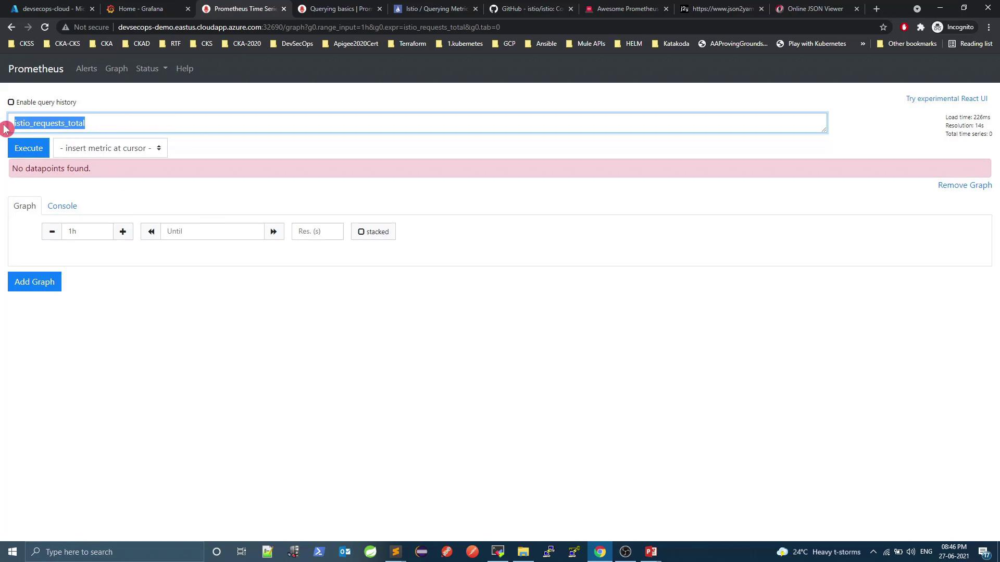
</Frame>

### 2.1 Generating Traffic

To populate metrics, send continuous HTTP requests via the Istio Ingress Gateway:

<Callout icon="triangle-alert">
  This loop will run indefinitely until you stop it (`Ctrl+C`). Ensure you target the correct host and port to avoid unintended load.
</Callout>

```bash theme={null}
while true; do
  curl -s http://<INGRESS_HOST>:<INGRESS_PORT>/increment/99
  sleep 0.1
done
```

After a few seconds, refresh Prometheus and switch to **Graph** view. You should see:

<Frame>
  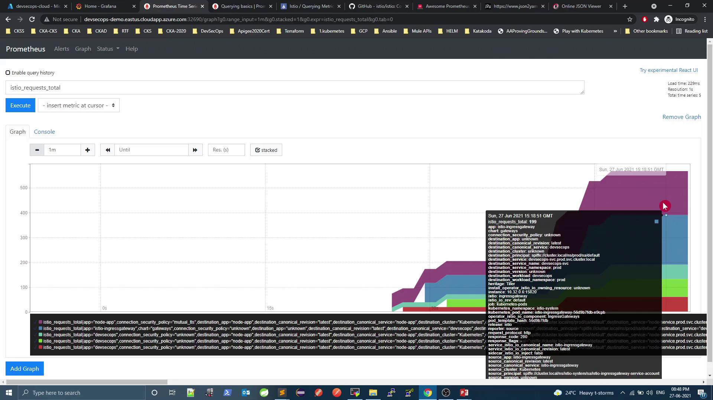
</Frame>

***

## 3. Visualizing Data in Grafana

Grafana provides prebuilt dashboards for Istio monitoring. Log in at `http://\<VM_PUBLIC_DNS>:32556`, then configure your data source (Prometheus) and explore:

<Frame>
  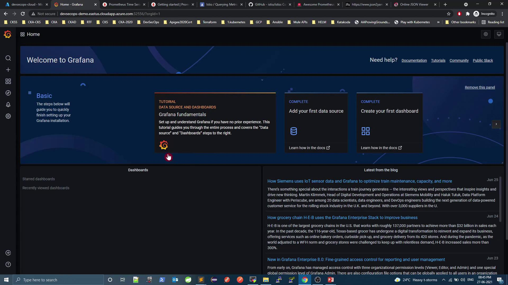
</Frame>

### 3.1 Istio Workload Dashboard

Shows per‐workload metrics (request rate, success rate, latency). Example for `node-app.prod`:

<Frame>
  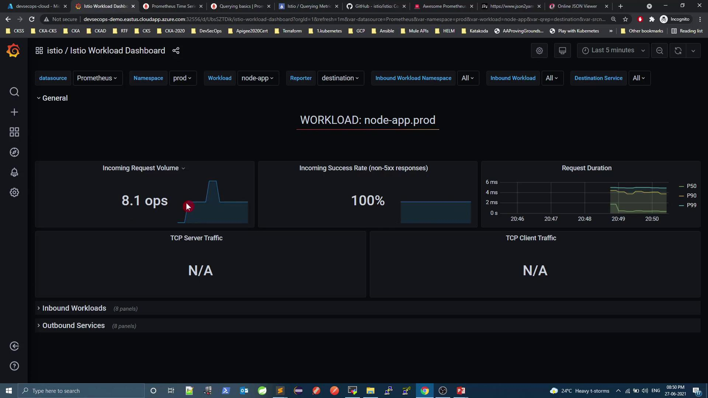
</Frame>

### 3.2 Inbound Workloads

Detailed inbound metrics: request/response sizes, mTLS usage, error rates:

<Frame>
  
</Frame>

### 3.3 Mesh Dashboard

Get global insights: overall request volume, success rate, virtual services, gateways:

<Frame>
  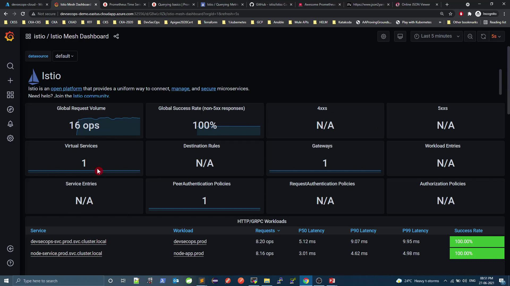
</Frame>

***

## 4. Alerting with Grafana

Grafana supports built-in alert rules and notification channels (Slack, email, PagerDuty, etc.). To create a Slack channel:

1. **Notification channel** → **New channel**

<Frame>
  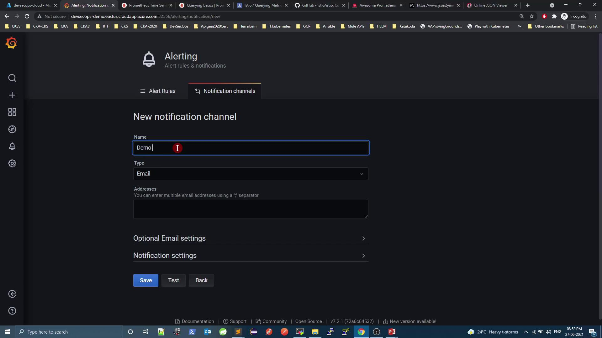
</Frame>

2. Select **Slack** and add your webhook URL.

<Frame>
  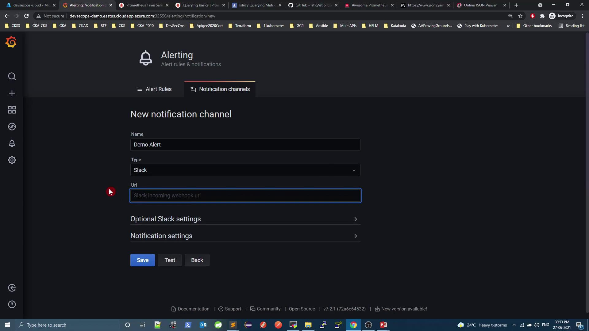
</Frame>

3. Approve the Grafana app in Slack.

<Frame>
  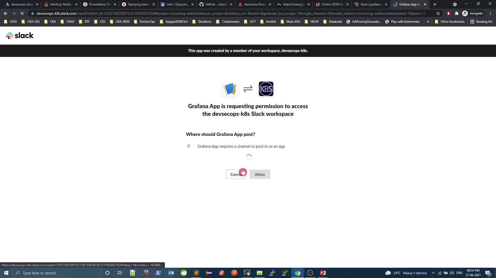
</Frame>

4. Test the channel and watch alerts roll in:

<Frame>
  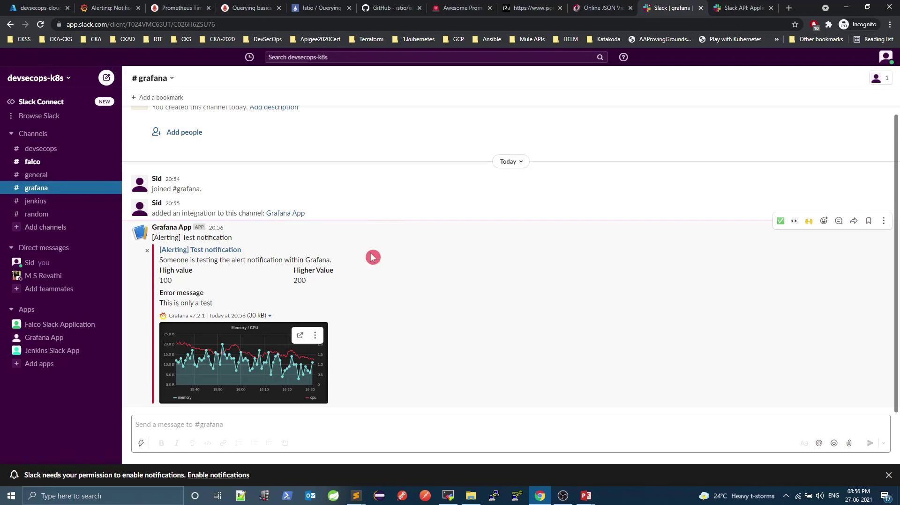
</Frame>

***

## 5. Prometheus Alerts & Alertmanager

Out of the box, Prometheus doesn’t ship with alert rules. Let’s integrate **Alertmanager** and define rules:

1. **Verify current state**

<Frame>
  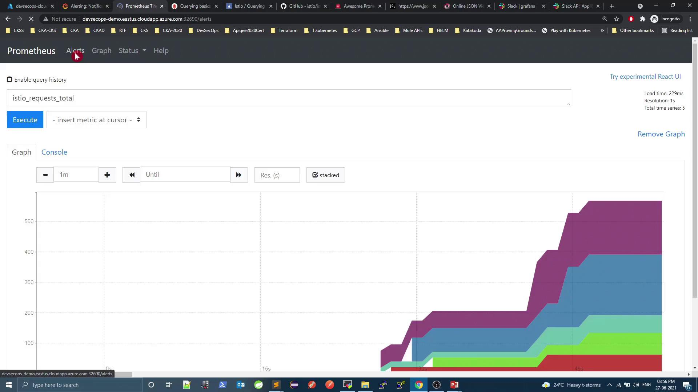
</Frame>

2. **Check Alertmanager integration**

<Frame>
  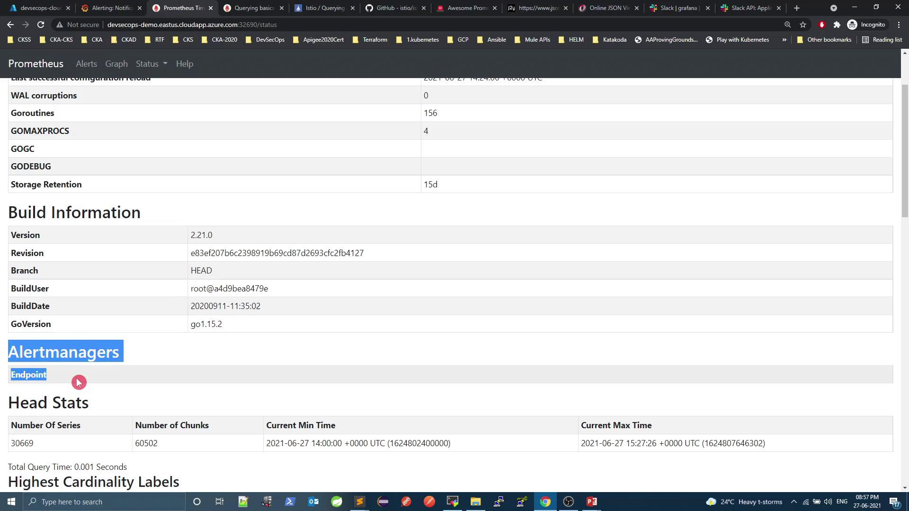
</Frame>

Next, install Alertmanager, create custom alert rules, and configure routing (Slack, email, etc.) in `alertmanager.yml` and your Prometheus `rules` files.

***

## Links & References

* [Kubernetes Services Overview](https://kubernetes.io/docs/concepts/services-networking/service/)
* [Istio Metrics & Telemetry](https://istio.io[AWS_SECRET_ACCESS_KEY]/)
* [Grafana Alerting](https://grafana.com/docs/grafana/latest/alerting/)
* [Prometheus Alertmanager Guide](https://prometheus.io/docs/alerting/latest/alertmanager/)

<CardGroup>
  <Card title="Watch Video" icon="video" href="https://learn.kodekloud.com/user/courses/devsecops-kubernetes-devops-security/module/fc1733bc-1e9c-4e38-ae86-84e6bd9af04d/lesson/a6c076c1-9beb-4fe3-9c5d-14e3cb82cf15" />

  <Card title="Practice Lab" icon="installation" href="https://learn.kodekloud.com/user/courses/devsecops-kubernetes-devops-security/module/fc1733bc-1e9c-4e38-ae86-84e6bd9af04d/lesson/ebdada21-fa81-43bf-bac2-b7ba6f3065c4" />
</CardGroup>


# Demo Slack Attachments

Source: https://notes.kodekloud.com/docs/DevSecOps-Kubernetes-DevOps-Security/Kubernetes-Operations-and-Security/Demo-Slack-Attachments/page

Learn to send rich Slack notifications from Jenkins pipelines using attachments and Block Kit for enhanced message layouts and interactivity.

In this lesson, you’ll learn how to send rich, interactive Slack notifications from Jenkins pipelines using attachments and Block Kit. We will:

* Explore Slack’s Block Kit Builder and message layouts
* Build JSON payloads with attachments and blocks
* Integrate payloads in Jenkins via a shared library
* Customize messages with emojis, images, and buttons

***

## Quick Slack Notifications Example

Out of the box, Jenkins’ Slack plugin can send basic build statuses:

```bash theme={null}
jenkins  APP  20:46
ABORTED: devsecops-numeric-application #72: http://…/job/devsecops-numeric-application/72/

jenkins  APP  21:00
SUCCESS: devsecops-numeric-application #73: http://…/job/devsecops-numeric-application/73/
```

These simple messages work, but to stand out you can leverage Slack’s rich layouts.

***

## Slack API: Rich Message Layouts

Slack’s [Messaging Layouts](https://api.slack.com/messaging/composing/layouts) guide shows how to assemble messages with attachments and blocks:

<Frame>
  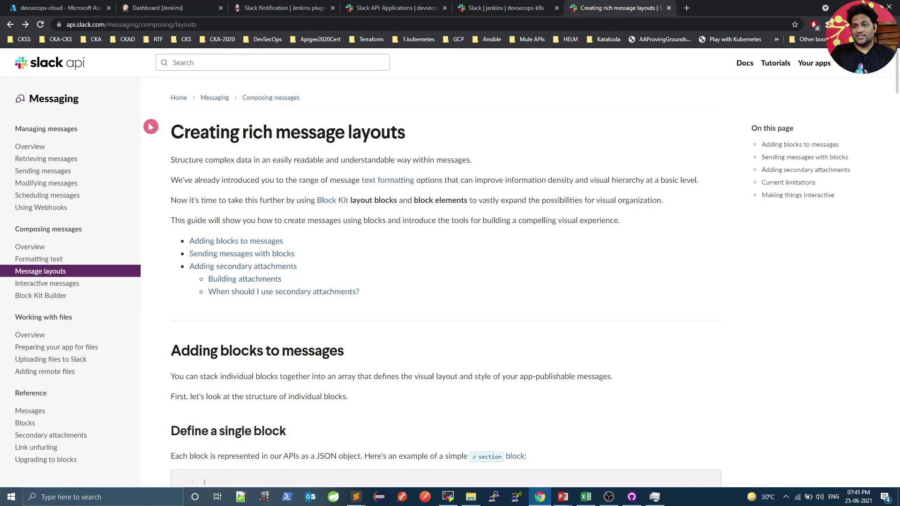
</Frame>

<Callout icon="lightbulb">
  Use the Slack API documentation to discover block types like `section`, `divider`, and interactive elements such as buttons and overflow menus.
</Callout>

### Block Kit Builder

Prototype your message in Slack’s [Block Kit Builder](https://api.slack.com/tools/block-kit-builder) before coding.

#### Basic Section Block

```json theme={null}
{
  "blocks": [
    {
      "type": "section",
      "text": {
        "type": "mrkdwn",
        "text": "New Paid Time Off request from <https://example.com|Fred Enriquez>\n\n<https://example.com|View request>"
      }
    }
  ]
}
```

#### Interactive Message with Button and Image

```json theme={null}
{
  "blocks": [
    {
      "type": "section",
      "text": {
        "type": "mrkdwn",
        "text": "Hello, Assistant to the Regional Manager Dwight! *Michael Scott* wants to know where you'd like to take the investors to dinner.\n*Please select a restaurant:*"
      }
    },
    { "type": "divider" },
    {
      "type": "section",
      "text": {
        "type": "mrkdwn",
        "text": "*Farmhouse Thai Cuisine*\n⭐️⭐️⭐️⭐️ 1528 reviews\nThey do have some vegan options…"
      },
      "accessory": {
        "type": "image",
        "image_url": "https://s3-media3.fl.yelpcdn.com/bphoto/c7e05s9lC12mA3arueZ7A/o.jpg",
        "alt_text": "Thai restaurant"
      }
    }
  ]
}
```

***

## Constructing an Attachment Payload

Wrap blocks in an `attachments` array to add colors, fallbacks, or pretext:

```json theme={null}
{
  "attachments": [
    {
      "color": "#2fc744",
      "blocks": [
        {
          "type": "section",
          "text": {
            "type": "mrkdwn",
            "text": "*Hi devsecops!*"
          }
        },
        { "type": "divider" },
        {
          "type": "section",
          "text": {
            "type": "mrkdwn",
            "text": "*Farmhouse Thai Cuisine*\n⭐️⭐️⭐️⭐️⭐️…"
          },
          "accessory": {
            "type": "image",
            "image_url": "https://s3-media1.fl.yelpcdn.com/photo/c7e0s5m9lC2mA3aruue7A/o.jpg",
            "alt_text": "Restaurant image"
          }
        }
      ]
    }
  ]
}
```

<Callout icon="triangle-alert">
  Always validate your JSON. Slack expects arrays `[]` around lists and objects `{}` for key/value pairs.
</Callout>

***

## Jenkins Slack Notification Plugin

Jenkins uses the [Slack Notification Plugin](https://plugins.jenkins.io/slack/) to send JSON payloads. You can pass your attachment payload directly:

```groovy theme={null}
slackSend(color: color, attachments: attachments)
```

Table: Build Status Mapping

| Build Status | Color   | Emoji     |
| ------------ | ------- | --------- |
| SUCCESS      | #47e05e | :tada:    |
| UNSTABLE     | #d9d26d | :warning: |
| FAILURE      | #ec2805 | :hulk:    |

***

## Shared Library: sendNotifications.groovy

Use a shared library to assemble attachments dynamically:

```groovy theme={null}
def call(String buildStatus = 'STARTED') {
    buildStatus = buildStatus ?: 'SUCCESS'

    // Map status to color and emoji
    def (color, emoji) = buildStatus == 'SUCCESS' ? ['#47e05e', ':tada:']
                          : buildStatus == 'UNSTABLE'? ['#d9d26d', ':warning:']
                          : ['#ec2805', ':hulk:']

    def attachments = [
        [
            "color": color,
            "blocks": [
                [
                    "type": "header",
                    "text": [
                        "type": "plain_text",
                        "text": "K8S Deployment - ${env.JOB_NAME} ${emoji}",
                        "emoji": true
                    ]
                ],
                [
                    "type": "section",
                    "fields": [
                        ["type": "mrkdwn", "text": "*Job Name:*\n${env.JOB_NAME}"],
                        ["type": "mrkdwn", "text": "*Build Number:*\n${env.BUILD_NUMBER}"]
                    ],
                    "accessory": [
                        "type": "image",
                        "image_url": "https://raw.githubusercontent.com/sidd-harth/numeric/main/images/jenkins-slack.png",
                        "alt_text": "Slack Icon"
                    ]
                ],
                ["type": "divider"]
            ]
        ]
    ]

    slackSend(color: color, attachments: attachments)
}
```

***

## Custom Emojis in Slack

Add custom emojis under **Customize Slack** → **Add Emoji**. For example, upload `deadpool.png` as `:deadpool:`:

<Frame>
  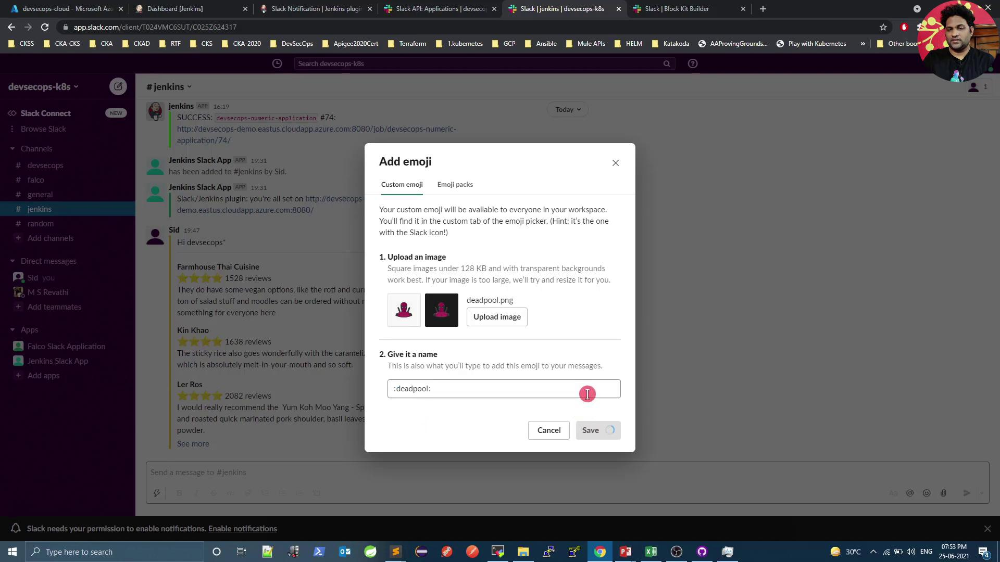
</Frame>

Ensure your team has emojis like `:tada:`, `:warning:`, and `:hulk:` available.

***

## Integrating in Jenkinsfile

Call `sendNotifications` in your pipeline’s `post` section:

```groovy theme={null}
pipeline {
    agent any
    stages {
        stage('Integration Tests - PROD') {
            steps {
                withKubeConfig([credentialsId: 'kubeconfig']) {
                    sh 'bash integration-test-PROD.sh'
                }
            }
        }
        stage('Testing Slack') {
            steps {
                sh 'exit 0'
            }
        }
    }
    post {
        always { /* Optional reports */ }
        success {
            script {
                env.emoji = ':white_check_mark:'
                sendNotifications(currentBuild.result)
            }
        }
        failure {
            script {
                env.emoji = ':hulk:'
                sendNotifications(currentBuild.result)
            }
        }
    }
}
```

***

## Resulting Slack Message

A successful pipeline produces a detailed Slack notification:

<Frame>
  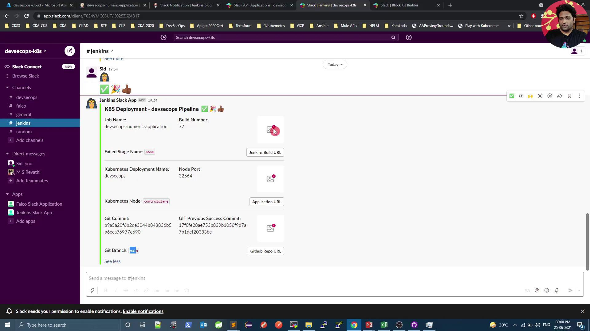
</Frame>

This message includes:

* A header with deployment name and emoji
* Job name and build number fields
* Custom icons and images
* Optional action buttons or links to Jenkins, Kubernetes, or GitHub

Use this approach to highlight failed stages or add actionable buttons directly in Slack.

<CardGroup>
  <Card title="Watch Video" icon="video" href="https://learn.kodekloud.com/user/courses/devsecops-kubernetes-devops-security/module/fc1733bc-1e9c-4e38-ae86-84e6bd9af04d/lesson/28e760d8-8273-4d35-9d07-aae29333f401" />
</CardGroup>
