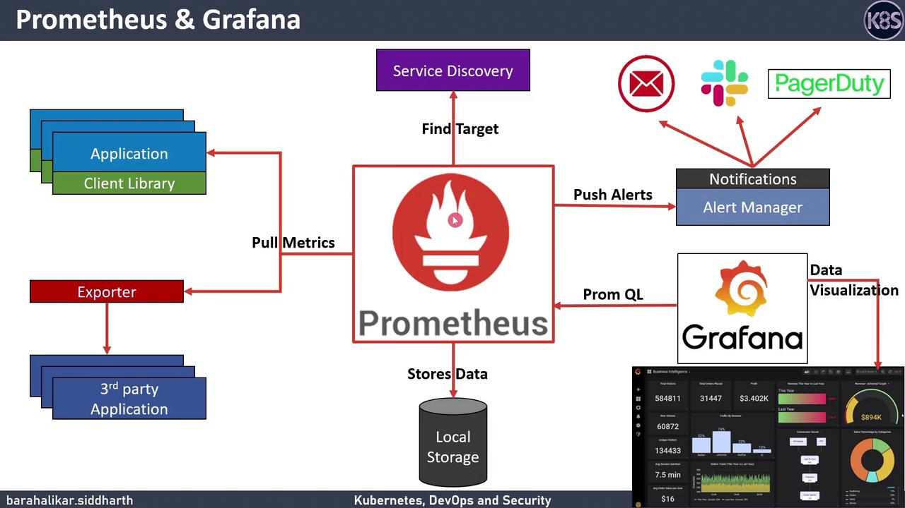
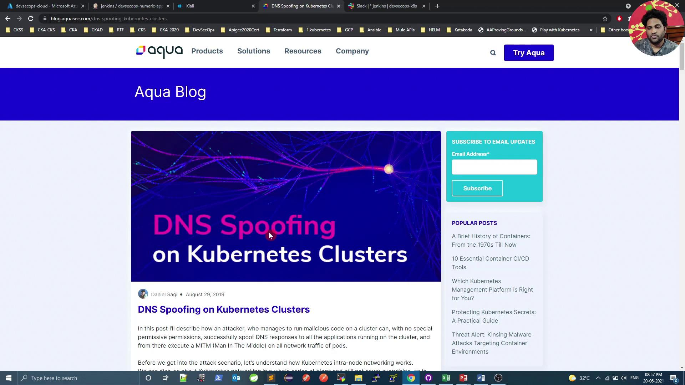

# prometheus.yml
global:
  scrape_interval: 15s
  evaluation_interval: 30s

scrape_configs:
  - job_name: 'node-exporter'
    static_configs:
      - targets: ['node1:9100', 'node2:9100']
```

<Callout icon="triangle-alert">
  Ensure your scrape intervals are tuned to your environment. Too frequent scrapes can overload the TSDB, while too infrequent scrapes may miss critical events.
</Callout>

***

## 3. Data Visualization with Grafana

Grafana is the leading open-source platform for time series analytics. It provides:

* First-class support for Prometheus as a data source via PROMQL queries.
* Interactive dashboards: graphs, heatmaps, tables, and more.
* Alerting capabilities directly on dashboards.
* A rich marketplace of community and official plugins.

**Steps to connect Prometheus to Grafana:**

1. Log in to Grafana and go to **Configuration → Data Sources**.
2. Add a new Prometheus data source and set the URL (e.g., `http://prometheus:9090`).
3. Save & Test, then import or build dashboards.

<Frame>
  
</Frame>

***

## 4. Alerting with Prometheus and Alertmanager

Prometheus defines alerting rules in `rules.yml` using PROMQL expressions. When a condition is met for a specified duration, an alert is fired and sent to Alertmanager.

```yaml theme={null}
# rules.yml
groups:
  - name: node_alerts
    rules:
      - alert: HighCPUUsage
        expr: node_cpu_seconds_total{mode!="idle"} > 0.85
        for: 5m
        labels:
          severity: critical
        annotations:
          summary: "High CPU usage on {{ $labels.instance }}"
```

**Alertmanager** manages notifications by:

* Grouping and deduplicating alerts
* Applying silence, inhibition, and inhibition rules
* Throttling notifications to avoid floods
* Routing to receivers: email, Slack, PagerDuty, webhook, etc.

```yaml theme={null}
# alertmanager.yml
route:
  group_by: ['alertname']
  receiver: 'slack-notifications'

receivers:
  - name: 'slack-notifications'
    slack_configs:
      - channel: '#alerts'
        api_url: 'https://hooks.slack.com/services/XXX/YYY/ZZZ'
```

***

## Hands-On Demo: Istio + Prometheus + Grafana

We’ll now deploy Prometheus and Grafana on an Istio-enabled Kubernetes cluster to visualize service mesh metrics. You’ll learn to:

* Deploy Prometheus using the [Prometheus Operator](https://github.com/prometheus-operator/prometheus-operator).
* Configure Grafana with Istio dashboards.
* Set up Alertmanager for service-level alerts.

***

## Links and References

* [Prometheus Official Website](https://prometheus.io/)
* [Grafana Documentation](https://grafana.com/docs/)
* [Alertmanager Guide](https://prometheus.io/docs/alerting/latest/alertmanager/)
* [Istio Monitoring Tasks](https://istio.io/latest/docs/tasks/observability/)

<CardGroup>
  <Card title="Watch Video" icon="video" href="https://learn.kodekloud.com/user/courses/devsecops-kubernetes-devops-security/module/fc1733bc-1e9c-4e38-ae86-84e6bd9af04d/lesson/fa82420e-3083-471b-8657-f73fc6722387" />
</CardGroup>


# Promoting App to Prod and Visualize using Kiali

Source: https://notes.kodekloud.com/docs/DevSecOps-Kubernetes-DevOps-Security/Kubernetes-Operations-and-Security/Promoting-App-to-Prod-and-Visualize-using-Kiali/page

This tutorial teaches how to deploy a Kubernetes application to production using Jenkins and visualize it with Kiali.

In this tutorial, you’ll learn how to extend your existing Jenkins pipeline to deploy a Kubernetes application into a production namespace and then visualize the service mesh using Kiali. While a dedicated pipeline is recommended for production, this guide demonstrates how to add a production stage to your current Jenkinsfile.

## Table of Contents

1. [Updating the Jenkinsfile](#updating-the-jenkinsfile)
2. [Kubernetes Production Deployment YAML](#kubernetes-production-deployment-yaml)
3. [Why Drop `NET_RAW`?](#why-drop-net_raw)
4. [Rollout Status Script](#rollout-status-script)
5. [Triggering the Deployment](#triggering-the-deployment)
6. [Verifying the Production Deployment](#verifying-the-production-deployment)
7. [Visualizing with Kiali](#visualizing-with-kiali)
   * [Namespaces Overview](#namespaces-overview)
   * [Outbound & Inbound Metrics](#outbound--inbound-metrics)
   * [Workload Health and Logs](#workload-health-and-logs)
   * [Service Mesh Graph](#service-mesh-graph)
8. [References](#references)

***

## Updating the Jenkinsfile

Add a new stage named **K8S Deployment - PROD** right after your CIS Benchmarking stage. This stage runs two parallel steps:

```groovy theme={null}
stage('K8S Deployment - PROD') {
  steps {
    parallel(
      'Deployment': {
        withKubeConfig([credentialsId: 'kubeconfig']) {
          sh "sed -i 's#replace#${imageName}#g' k8s_PROD-deployment_service.yaml"
          sh "kubectl -n prod apply -f k8s_PROD-deployment_service.yaml"
        }
      },
      'Rollout Status': {
        withKubeConfig([credentialsId: 'kubeconfig']) {
          sh "bash k8s-PROD-deployment-rollout-status.sh"
        }
      }
    )
  }
}
```

<Callout icon="lightbulb">
  Make sure your Jenkins agent has permissions to apply manifests in the `prod` namespace.
</Callout>

***

## Kubernetes Production Deployment YAML

Create a file named `k8s_PROD-deployment_service.yaml` with the following content. It includes:

* A Deployment with three replicas
* A security context that drops `NET_RAW`
* Resource requests and limits
* A `ClusterIP` Service

```yaml theme={null}
apiVersion: apps/v1
kind: Deployment
metadata:
  name: devsecops
  labels:
    app: devsecops
spec:
  replicas: 3
  selector:
    matchLabels:
      app: devsecops
  template:
    metadata:
      labels:
        app: devsecops
    spec:
      serviceAccountName: default
      volumes:
        - name: vol
          emptyDir: {}
      containers:
        - name: devsecops-container
          image: replace
          ports:
            - containerPort: 8080
          volumeMounts:
            - mountPath: /tmp
              name: vol
          securityContext:
            capabilities:
              drop:
                - NET_RAW
            runAsUser: 100
            runAsNonRoot: true
            readOnlyRootFilesystem: true
            allowPrivilegeEscalation: false
          resources:
            requests:
              memory: "256Mi"
              cpu: "200m"
            limits:
              memory: "512Mi"
              cpu: "500m"
---
apiVersion: v1
kind: Service
metadata:
  name: devsecops-svc
  labels:
    app: devsecops
spec:
  type: ClusterIP
  selector:
    app: devsecops
  ports:
    - port: 8080
      targetPort: 8080
      protocol: TCP
```

### Resource Requests and Limits

| Resource | Request | Limit |
| -------- | ------- | ----- |
| CPU      | 200m    | 500m  |
| Memory   | 256Mi   | 512Mi |

***

## Why Drop `NET_RAW`?

Dropping the `NET_RAW` capability mitigates DNS spoofing and other low-level network attacks. For a deeper dive, read [DNS Spoofing on Kubernetes Clusters](https://www.aquasec.com/blog/dns-spoofing-kubernetes-clusters/).

<Frame>
  
</Frame>

```yaml theme={null}
apiVersion: v1
kind: Pod
metadata:
  name: security-context-demo
spec:
  containers:
    - name: test
      image: alpine
      securityContext:
        capabilities:
          drop:
            - NET_RAW
```

<Callout icon="triangle-alert">
  Ensure no essential functionality relies on raw sockets before dropping `NET_RAW`.
</Callout>

***

## Rollout Status Script

Save the following as `k8s-PROD-deployment-rollout-status.sh` in your repo. It waits for the deployment to roll out, then rolls back on failure:

```bash theme={null}
#!/bin/bash
