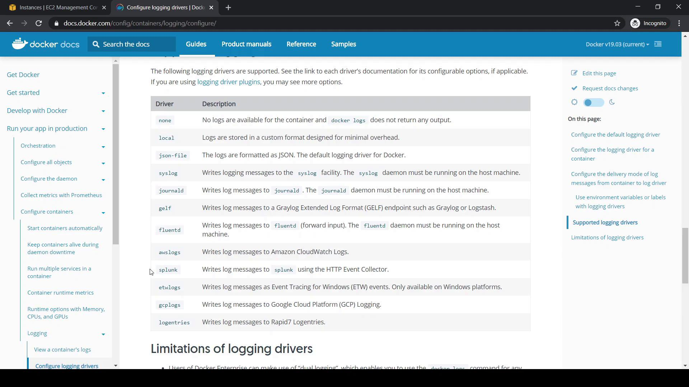
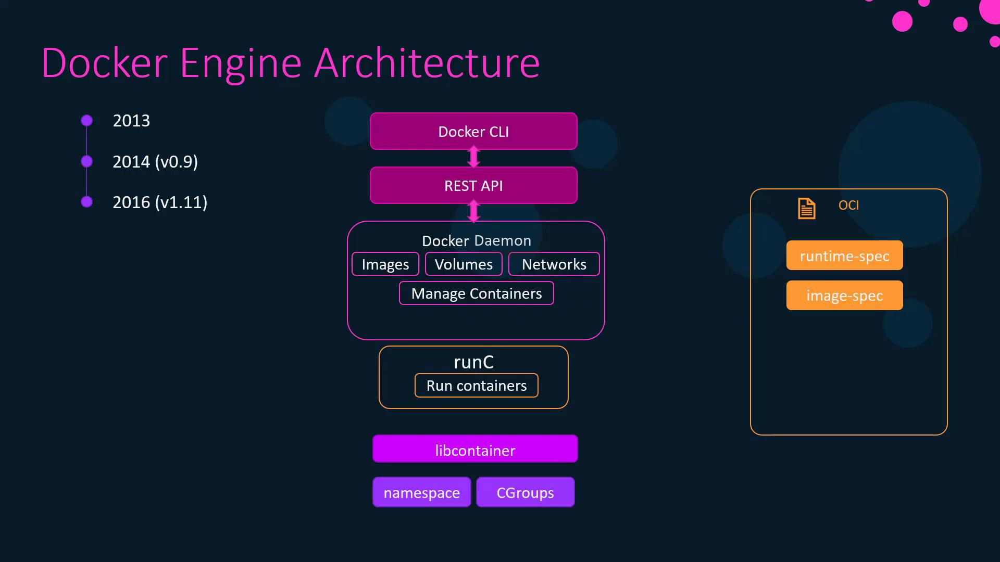
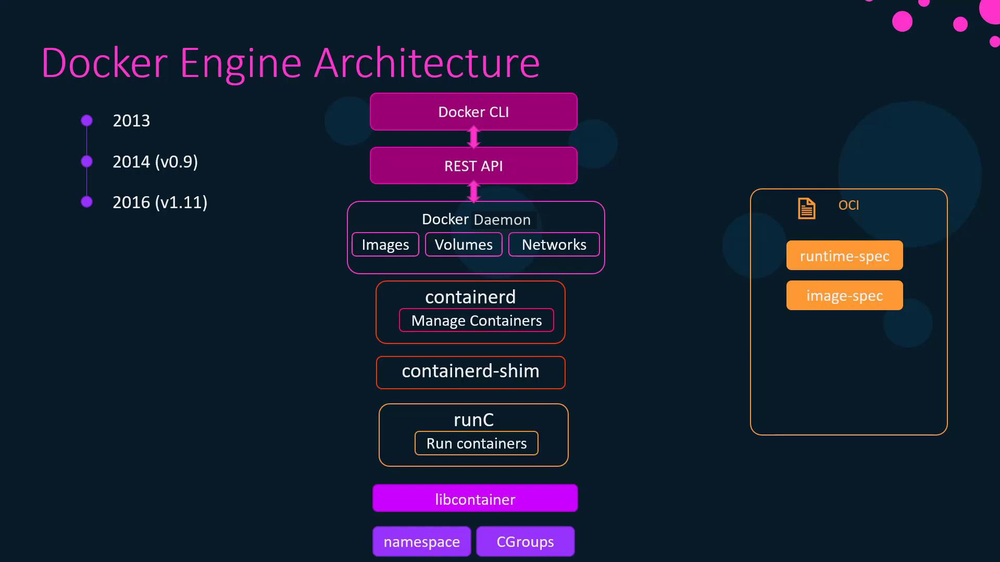
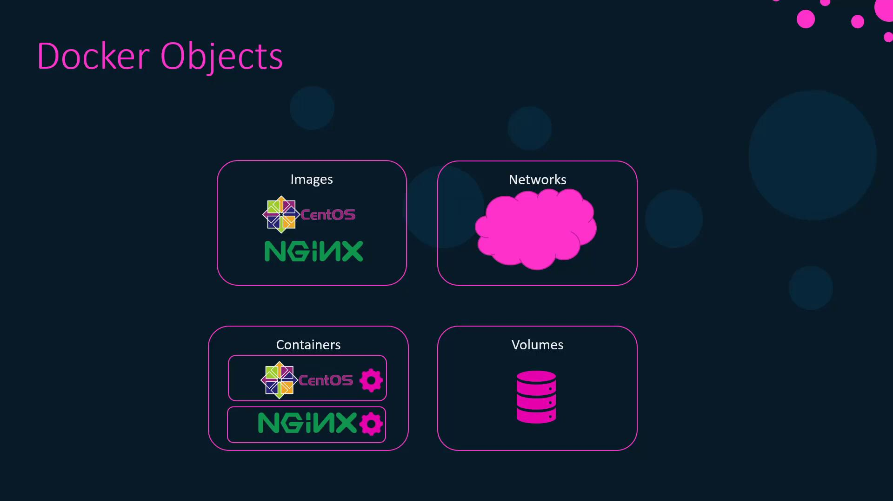

# Verify the current logging driver
docker system info | grep -i "logging driver"
# Output: Logging Driver: json-file
```

<Callout icon="lightbulb">
  The `json-file` driver is the standard Docker logging backend. It’s easy to parse and works out of the box.
</Callout>

## 2. Create and Inspect a Test Container

Run an Ubuntu container to see its inherited log configuration:

```bash theme={null}
# Start a detached Ubuntu container
docker container run -itd --name test-container ubuntu
```

Inspect its log settings:

```bash theme={null}
docker container inspect test-container \
  --format='{{json .HostConfig.LogConfig}}'
# Output:
# {
#   "Type": "json-file",
#   "Config": {}
# }
```

## 3. Supported Logging Drivers

Docker supports multiple logging backends for different use cases. You can find the full list in the official docs:\
[Configure containers → Logging](https://docs.docker.com/config/containers/logging/configure/)

<Frame>
  
</Frame>

| Driver    | Use Case                                         |
| --------- | ------------------------------------------------ |
| json-file | Local JSON logs, simple parsing                  |
| syslog    | Centralized logging to syslog daemon             |
| journald  | Integration with systemd’s journal               |
| fluentd   | Forward logs to a Fluentd collector              |
| awslogs   | Ship logs to Amazon CloudWatch Logs              |
| splunk    | Send logs to a Splunk HTTP Event Collector (HEC) |
| …         | And others (gcplogs, logentries, etc.)           |

## 4. Change the Default Driver to Syslog

To switch the daemon-wide driver to `syslog`, edit `/etc/docker/daemon.json`:

<Callout icon="triangle-alert">
  Modifying `daemon.json` requires restarting the Docker daemon. Existing containers will continue using their current driver until recreated.
</Callout>

1. Stop Docker:
   ```bash theme={null}
   sudo systemctl stop docker
   ```
2. Update `/etc/docker/daemon.json`:
   ```json theme={null}
   {
     "log-driver": "syslog"
   }
   ```
3. Restart Docker:
   ```bash theme={null}
   sudo systemctl start docker
   ```
4. Verify:
   ```bash theme={null}
   docker system info | grep -i "logging driver"
   # Output: Logging Driver: syslog
   ```

## 5. Advanced Logging Options

You can fine-tune log behavior with `log-opts`. For example, to limit file size and rotation on `json-file`:

```json theme={null}
{
  "log-driver": "json-file",
  "log-opts": {
    "max-size": "10m",
    "max-file": "3"
  },
  "labels": "production_status",
  "env": "os_customer"
}
```

Retrieve the current default driver in scripts:

```bash theme={null}
docker info --format '{{.LoggingDriver}}'
# e.g., json-file
```

## 6. Override the Logging Driver per Container

Even when the daemon default is `syslog`, you can pick a different driver for a specific container:

```bash theme={null}
docker container run -itd \
  --name logtest \
  --log-driver journald \
  ubuntu
```

Confirm the override:

```bash theme={null}
docker container inspect logtest \
  --format='{{json .HostConfig.LogConfig}}'
# Output:
# {
#   "Type": "journald",
#   "Config": {}
# }
```

## 7. Conclusion

You’ve learned how to:

* Check and view Docker’s default logging driver
* Change the daemon-wide driver in `/etc/docker/daemon.json`
* Apply advanced options like rotation and size limits
* Override logging drivers for individual containers

Happy logging!

***

## References

* [Docker Logging Drivers Documentation](https://docs.docker.com/config/containers/logging/configure/)
* [Docker System Info](https://docs.docker.com/engine/reference/commandline/system_info/)
* [Docker Container Inspect](https://docs.docker.[AWS_SECRET_ACCESS_KEY]/)

<CardGroup>
  <Card title="Watch Video" icon="video" href="https://learn.kodekloud.com/user/courses/docker-certified-associate-exam-course/module/871494af-49f8-42e9-95e9-cb0df80c2b21/lesson/575ffa85-12fe-4501-85ac-e2236cbddbcf" />
</CardGroup>


# Docker Engine Architecture

Source: https://notes.kodekloud.com/docs/Docker-Certified-Associate-Exam-Course/Docker-Engine/Docker-Engine-Architecture/page

This article explores Docker Engine architecture, its components, evolution, standards, key objects, registry model, container creation flow, and installation verification.

In this article, we dive into Docker Engine architecture, exploring its core components, how it evolved from LXC to Libcontainer, and the standards defined by the Open Container Initiative (OCI). You’ll also learn about key Docker objects, the registry model, the container creation flow, and how to verify your Docker installation.

***

## Key Components

Docker Engine consists of three primary parts that work together to build, ship, and run containers:

* **Docker Daemon (`dockerd`)**\
  The background service that manages images, containers, networks, and volumes on your host.
* **REST API**\
  A set of HTTP endpoints that expose the daemon’s functionality to clients and automation tools.
* **Docker CLI (`docker`)**\
  The command-line interface that sends commands to the REST API.

***

## From LXC to Libcontainer

When Docker launched in 2013, it used [Linux Containers (LXC)](https://linuxcontainers.org/) to isolate processes via namespaces and cgroups. By version 0.9, Docker introduced **Libcontainer**, a Go library that interfaces directly with kernel primitives—eliminating the LXC dependency and simplifying container management.

***

## The Open Container Initiative (OCI)

Before 2015, container formats and runtimes were fragmented. Docker, CoreOS, and other industry leaders formed the **Open Container Initiative (OCI)** to standardize:

1. **Runtime Specification**\
   Defines lifecycle operations (`create`, `start`, `delete`, etc.).
2. **Image Specification**\
   Specifies how container images are formatted and distributed.

With these standards, Docker Engine 1.11 was refactored into modular components:

<Frame>
  
</Frame>

* **runC**\
  The OCI-compliant runtime that handles low-level container operations.
* **containerd**\
  A daemon responsible for managing runC instances, image transfer, and storage.
* **containerd-shim**\
  Allows containers to keep running independently of containerd, ensuring resilience if the daemon restarts.

<Frame>
  
</Frame>

***

## Core Docker Objects

Docker Engine manages four primary resource types:

| Object         | Description                                                                  |
| -------------- | ---------------------------------------------------------------------------- |
| **Images**     | Read-only templates composed of layered filesystem snapshots and metadata.   |
| **Containers** | Instances of images providing a writable layer and running processes.        |
| **Networks**   | Virtual networks enabling container-to-container and external communication. |
| **Volumes**    | Persistent storage volumes decoupled from container lifecycles.              |

<Frame>
  
</Frame>

***

## Docker Registry

A **registry** is a service for storing and distributing Docker images:

* **Docker Hub** (default public registry)
* **Private Registry** (self-hosted)
* **Docker Trusted Registry (DTR)** (enterprise-grade, on-premises)

***

## Container Creation Flow

When you run `docker run`, Docker follows a series of steps:

1. **CLI to API**\
   The Docker CLI translates your command into a REST API call.
2. **Daemon Processing**\
   The daemon checks for the image locally or pulls it from the registry.
3. **containerd**\
   Converts the image into an OCI bundle.
4. **containerd-shim**\
   Hands off the bundle to runC and monitors the container’s lifecycle.
5. **runC**\
   Uses kernel namespaces and cgroups to spawn and isolate the container.

Example:

```bash theme={null}
docker container run -it ubuntu
```

***

## Verifying Your Installation

After installing Docker on CentOS or Ubuntu, confirm that everything is set up correctly:

```bash theme={null}
docker version
```

Sample output:

```bash theme={null}
Client: Docker Engine - Community
 Version:           19.03.5
 API version:       1.40
 Go version:        go1.12.12

Server: Docker Engine - Community
 Engine:
  Version:          19.03.5
  API version:      1.40 (minimum version 1.12)
 containerd:
  Version:          1.2.10
 runc:
  Version:          1.0.0-rc8+dev
```

Check the CLI version:

```bash theme={null}
docker --version
