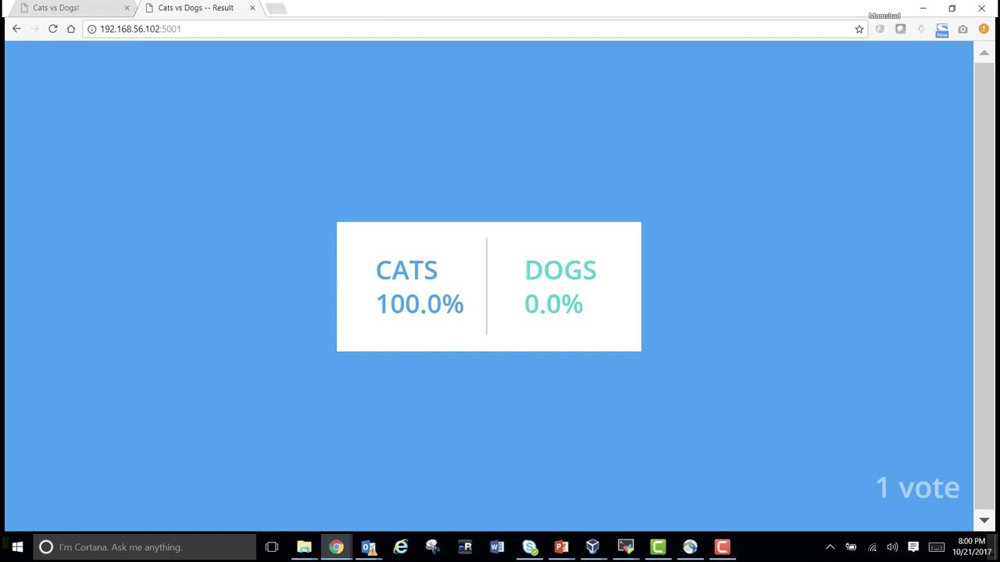
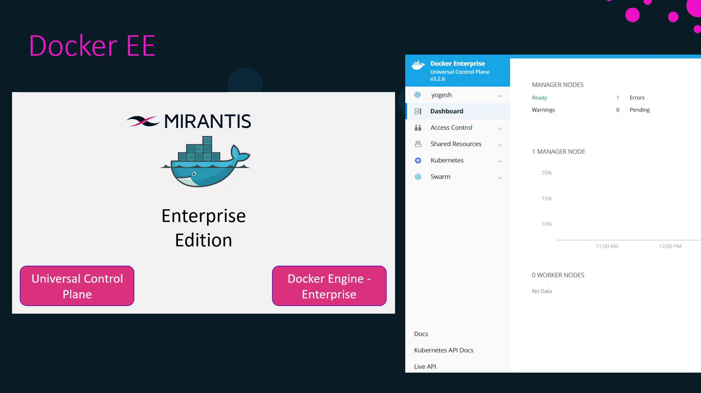
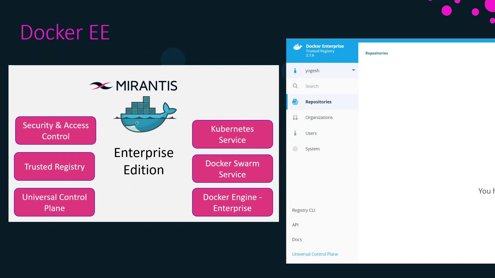
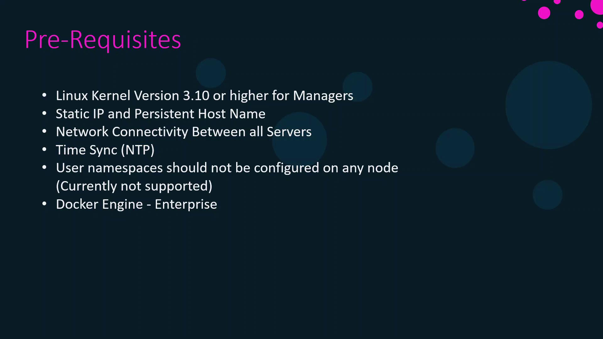
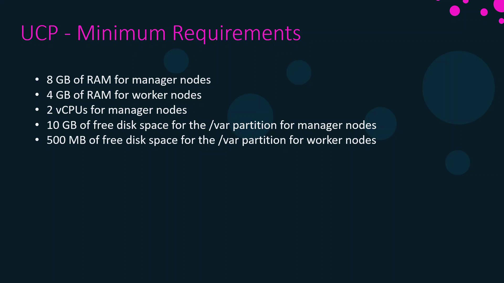
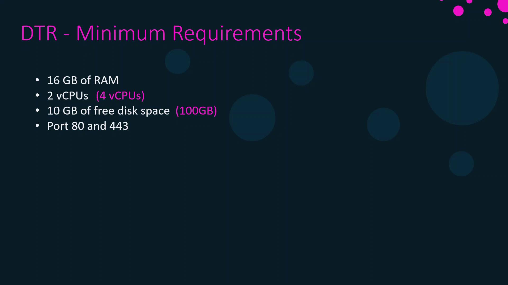

# Use official Python runtime
FROM python:2.7-alpine
WORKDIR /app

# Install dependencies
ADD requirements.txt /app/
RUN pip install -r requirements.txt

# Copy application code
ADD . /app
EXPOSE 80

# Launch with Gunicorn
CMD ["gunicorn", "app:app", "-b", "0.0.0.0:80", "--workers", "4", "--keep-alive", "0"]
```

***

## 2. worker (Java)

The **worker** service consumes vote messages from Redis and writes them into PostgreSQL.

### Worker.java

```java theme={null}
import redis.clients.jedis.Jedis;
import org.json.JSONObject;
import java.sql.*;
import java.util.List;

class Worker {
    public static void main(String[] args) {
        try {
            Jedis redis = new Jedis("redis");
            Connection dbConn = DriverManager.getConnection(
                "jdbc:postgresql://db/postgres", "postgres", "password"
            );
            System.err.println("Watching vote queue");

            while (true) {
                List<String> item = redis.blpop(0, "votes");
                String voteJSON = item.get(1);
                JSONObject voteData = new JSONObject(voteJSON);
                String voterID = voteData.getString("voter_id");
                String vote = voteData.getString("vote");

                System.err.printf("Processing vote '%s' by '%s'%n", vote, voterID);
                updateVote(dbConn, voterID, vote);
            }
        } catch (SQLException e) {
            e.printStackTrace();
            System.exit(1);
        }
    }

    static void updateVote(Connection dbConn, String voterID, String vote) throws SQLException {
        PreparedStatement stmt = dbConn.prepareStatement(
            "INSERT INTO votes (id, vote) VALUES (?, ?)"
        );
        stmt.setString(1, voterID);
        stmt.setString(2, vote);
        stmt.executeUpdate();
    }
}
```

### Dockerfile

```dockerfile theme={null}
# Use .NET SDK image
FROM microsoft/dotnet:1.1.1-sdk
WORKDIR /code

# Copy and restore/publish the worker
ADD src/Worker /code/src/Worker
RUN dotnet restore src/Worker && \
    dotnet publish -c Release -o out src/Worker

CMD ["dotnet", "out/Worker.dll"]
```

***

## 3. result (Node.js/Express)

The **result** service queries PostgreSQL for vote counts and renders a results page.

### server.js

```javascript theme={null}
const express = require('express');
const { Client } = require('pg');
const app = express();
const port = process.env.PORT || 80;

const client = new Client({
  host: 'db',
  user: 'postgres',
  password: 'password',
  database: 'postgres'
});
client.connect();

app.set('view engine', 'pug');
app.use(express.static('public'));

app.get('/', async (req, res) => {
  const result = await client.query(
    'SELECT vote, COUNT(*) AS count FROM votes GROUP BY vote'
  );
  res.render('results', { votes: result.rows });
});

app.listen(port, () => console.log(`Result app listening on ${port}`));
```

### Dockerfile

```dockerfile theme={null}
FROM node:5.11.0-slim
WORKDIR /app

# Global utilities
RUN npm install -g nodemon

ADD package.json /app/
RUN npm config set registry http://registry.npmjs.org && \
    npm install && npm ls

# Copy app code
ADD . /app
EXPOSE 80

CMD ["node", "server.js"]
```

***

## 4. Deploying with `docker run`

<Callout icon="triangle-alert">
  The `--link` flag is considered legacy. For production, prefer [user-defined networks](https://docs.docker.com/network/) or Docker Compose.
</Callout>

### 4.1 Clone & Build the Voting UI

```bash theme={null}
git clone https://github.com/dockersamples/example-voting-app.git
cd example-voting-app/vote
docker build -t voting-app .
```

### 4.2 Start Redis & Voting UI

```bash theme={null}
# Redis message queue
docker run -d --name redis redis:latest

# Voting UI linked to Redis on port 5000
docker run -d --name vote-ui \
  -p 5000:80 \
  --link redis:redis \
  voting-app
```

Open [http://localhost:5000](http://localhost:5000) to cast your vote.

### 4.3 Launch PostgreSQL Database

```bash theme={null}
docker run -d --name db \
  -e POSTGRES_PASSWORD=password \
  postgres:9.4
```

### 4.4 Build & Run the Worker

```bash theme={null}
cd ../worker
docker build -t worker-app .
docker run -d --name vote-worker \
  --link redis:redis \
  --link db:db \
  worker-app
```

### 4.5 Build & Run the Result App

```bash theme={null}
cd ../result
docker build -t result-app .
docker run -d --name vote-result \
  -p 5001:80 \
  --link db:db \
  result-app
```

Visit [http://localhost:5001](http://localhost:5001) to see live voting results:

<Frame>
  
</Frame>

***

Congratulations! You’ve manually deployed all services using `docker run`, linked them together, and completed a full voting workflow. Next, we’ll automate this setup with **Docker Compose**.

***

## References

* [Docker Documentation](https://docs.docker.com/)
* [Flask (Python) Documentation](https://flask.palletsprojects.com/)
* [Redis Official Site](https://redis.io/)
* [PostgreSQL Documentation](https://www.postgresql.org/docs/)
* [Express (Node.js) Guide](https://expressjs.com/)

<CardGroup>
  <Card title="Watch Video" icon="video" href="https://learn.kodekloud.com/user/courses/docker-certified-associate-exam-course/module/a2906902-2117-467c-90e3-4cdd032599f8/lesson/0e24785c-3e0a-46e9-9b23-c26058f54547" />
</CardGroup>


# Docker EE Introduction

Source: https://notes.kodekloud.com/docs/Docker-Certified-Associate-Exam-Course/Docker-Engine-Enterprise/Docker-EE-Introduction/page

This article introduces Docker Enterprise Edition, its components, architecture, setup, and configuration requirements for deploying enterprise-grade applications.

Hello and welcome! In this lesson, we’ll explore the components and architecture of Docker Enterprise Edition (Docker EE). Docker Engine is available in two major editions:

* **Docker CE** (Community Edition): the free, open-source version
* **Docker EE** (Enterprise Edition): the certified, enterprise-grade version

Since November 2019, Mirantis Inc. maintains Docker EE. Built for developers and IT teams, Docker EE enables you to build, share, and run business-critical applications at scale with enterprise-grade security and management.

Docker EE comprises three core components:

* **Docker Engine Enterprise**: Certified container runtime with FIPS compliance
* **Universal Control Plane (UCP)**: Web-based cluster management portal with role-based access control (RBAC) and LDAP/AD integration
* **Docker Trusted Registry (DTR)**: Private, secure image storage behind your firewall

UCP supports both Docker Swarm and Kubernetes on the same cluster. You can label nodes as Swarm workers, Kubernetes workers, or both, then deploy services across them.

<Frame>
  
</Frame>

Docker Trusted Registry integrates seamlessly with UCP and Engine. You can deploy Docker EE clusters on-premises, in public clouds, or in hybrid environments.

<Frame>
  
</Frame>

## High-Level Setup

Follow these steps to get Docker Enterprise up and running:

1. Provision your infrastructure (manager and worker nodes)
2. Install Docker Engine Enterprise on all nodes
3. Deploy Universal Control Plane (UCP) on manager nodes
4. Install Docker Trusted Registry (DTR) on designated worker nodes

## Infrastructure Prerequisites

Ensure your environment meets the following requirements before installing UCP or DTR:

* Linux kernel version ≥ 3.10
* Static IP address configured for each node
* Bi-directional network connectivity between nodes
* NTP configured for accurate time synchronization
* User namespaces **disabled** (not currently supported)
* Docker Engine Enterprise installed on every node

<Callout icon="triangle-alert">
  User namespaces must be disabled or UCP deployment will fail.
</Callout>

<Frame>
  
</Frame>

## UCP & DTR Configuration Requirements

Docker UCP and DTR each have minimum and recommended hardware specifications. Use minimum specs for testing or proofs of concept; follow recommended specs for production environments.

### UCP Requirements

| Specification            | Minimum (Test) | Recommended (Production) |
| ------------------------ | -------------- | ------------------------ |
| RAM (manager)            | 8 GB           | 16 GB                    |
| vCPUs (manager)          | 2 vCPUs        | 4 vCPUs                  |
| Disk on `/var` (manager) | 10 GB          | 25–100 GB                |
| RAM (worker)             | 4 GB           | 4 GB                     |
| Disk on `/var` (worker)  | 500 MB         | 500 MB                   |

<Frame>
  
</Frame>

### DTR Requirements

| Specification | Minimum (Test) | Recommended (Production) |
| ------------- | -------------- | ------------------------ |
| RAM           | 16 GB          | 16 GB                    |
| vCPUs         | 2 vCPUs        | 4 vCPUs                  |
| Free Disk     | 10 GB          | 100 GB                   |
| Network Ports | 80, 443 open   | 80, 443 open             |

DTR must be installed on worker nodes within your UCP cluster.

<Frame>
  
</Frame>

## Sample Lab Topology

In this course lab, we’ll deploy:

* 1 UCP manager node
* 1 UCP worker node (for DTR)
* 1 DTR instance

<Callout icon="lightbulb">
  - 3 UCP managers (high-availability quorum)
  - 3 UCP workers (DTR hosts)
  - 3 DTR replicas
  - 3 load balancers (one each for managers, workers, and DTR)
</Callout>

***

## Links and References

* [Docker Documentation](https://docs.docker.com/)
* [Mirantis Docker EE](https://www.mirantis.com/software/docker/)
* [Kubernetes Basics](https://kubernetes.io/docs/concepts/overview/what-is-kubernetes/)
* [NTP Configuration Guide](https://www.ntp.org/)

<CardGroup>
  <Card title="Watch Video" icon="video" href="https://learn.kodekloud.com/user/courses/docker-certified-associate-exam-course/module/a6a39359-7fb1-4fab-b0c2-6fc58a6ce617/lesson/371ca398-2ac5-45e8-9c92-9ce00e5834c0" />
</CardGroup>
