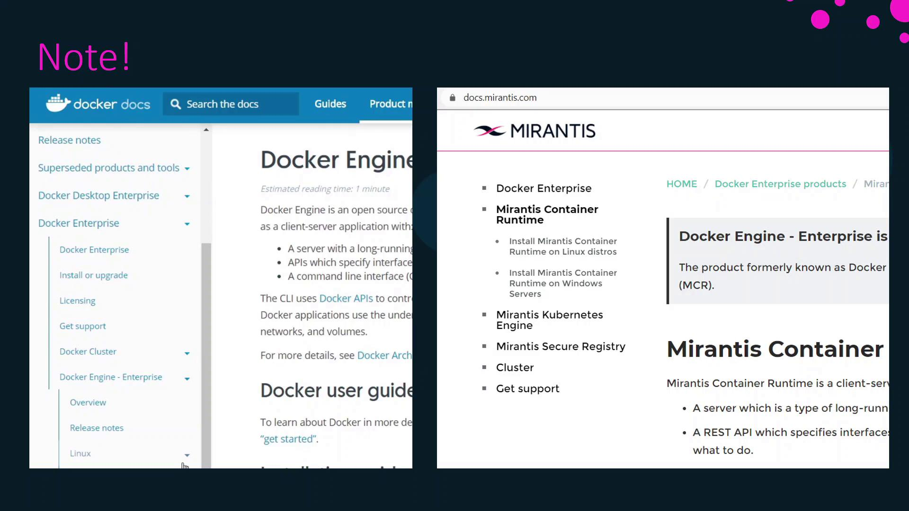

# On the new worker node
curl -fsSL https://get.docker.com | sh
sudo systemctl enable docker
sudo systemctl start docker
```

## 2. Joining the Swarm Cluster

First, retrieve the worker join token on your UCP manager:

```bash theme={null}
# On the Swarm manager
docker swarm join-token worker
```

You’ll see output similar to:

```bash theme={null}
To add a worker to this swarm, run the following command:

    docker swarm join --token SWMTKN-1-0abcd1234efgh5678ijkl9012mnop3456 10.0.0.5:2377
```

<Callout icon="triangle-alert">
  Keep the join token confidential; anyone with access can join your Swarm cluster as a worker.
</Callout>

Copy the `docker swarm join` command and execute it on the new worker:

```bash theme={null}
# On the new worker node
docker swarm join --token SWMTKN-1-0abcd1234efgh5678ijkl9012mnop3456 10.0.0.5:2377
```

## 3. Automatic UCP Agent Deployment

UCP configures its agent as a global service in Docker Swarm. After the worker joins:

1. Docker Swarm schedules the UCP agent on the new node.
2. The agent pulls and installs UCP components (e.g., UCP proxy).
3. The node is automatically registered with the UCP control plane.

## 4. Verification in UCP Console

1. Open the UCP web UI on your manager node.
2. Navigate to **Nodes** in the sidebar.
3. Confirm the new worker appears with the **Worker** role and a **Ready** status.

| Task                | Host            | Command / UI Action                                                                                              |
| ------------------- | --------------- | ---------------------------------------------------------------------------------------------------------------- |
| Install Docker      | Worker node     | `curl -fsSL https://get.docker.com \| sh`<br />`sudo systemctl enable docker`<br />`sudo systemctl start docker` |
| Retrieve join token | Manager node    | `docker swarm join-token worker`                                                                                 |
| Join the swarm      | Worker node     | `docker swarm join --token <token> <manager-ip>:2377`                                                            |
| Verify in UCP       | Manager Console | Go to **Nodes** and check for the new worker                                                                     |

Next, let’s walk through a live demo to see this process in action!

## Links and References

* [Docker Engine Installation](https://docs.docker.com/engine/install/)
* [Docker Swarm Overview](https://docs.docker.com/engine/swarm/)
* [UCP Administration Guide](https://docs.docker.com/ee/ucp/)

<CardGroup>
  <Card title="Watch Video" icon="video" href="https://learn.kodekloud.com/user/courses/docker-certified-associate-exam-course/module/a6a39359-7fb1-4fab-b0c2-6fc58a6ce617/lesson/87635106-d520-4944-ab5b-b90e21bd3299" />
</CardGroup>


# Note about changes in Names and Documentation

Source: https://notes.kodekloud.com/docs/Docker-Certified-Associate-Exam-Course/Docker-Engine-Enterprise/Note-about-changes-in-Names-and-Documentation/page

This article reviews the renaming of key Docker products and the migration of their documentation to the Mirantis website.

In this lesson, we’ll review the recent renaming of key Docker products and the migration of their documentation to the Mirantis website. While all underlying functionality remains unchanged, it’s important to be aware of the new names—especially since current Docker certification exams still reference the original terms.

## Product Renaming Overview

| Original Name                         | New Name                         |
| ------------------------------------- | -------------------------------- |
| Docker Trusted Registry (DTR)         | Mirantis Secure Registry (MSR)   |
| Universal Control Plane (UCP)         | Mirantis Kubernetes Engine (MKE) |
| Docker Enterprise Edition (Docker EE) | Mirantis Runtime Engine          |

<Callout icon="lightbulb">
  These are branding updates only. The features and workflows you know have not changed.
</Callout>

### Certification Exam Reminder

Until the Docker certification materials switch to the new terminology, you should map names as follows:

* DTR → MSR
* UCP → MKE
* Docker Enterprise Edition → Mirantis Runtime Engine

## Documentation Migration

Docker Engine documentation has moved from the Docker website to Mirantis. Although our demo recordings point to the legacy pages, the content itself is identical—only the URLs differ.

<Frame>
  
</Frame>

<Callout icon="triangle-alert">
  When setting up your environment, always refer to the updated Mirantis documentation to ensure you’re using the latest guidance.

  * Mirantis Secure Registry Docs
  * Mirantis Kubernetes Engine Docs
  * Mirantis Runtime Engine Docs
</Callout>

## Useful Links and References

* [Mirantis Secure Registry (MSR)](https://docs.mirantis.com/msr)
* [Mirantis Kubernetes Engine (MKE)](https://docs.mirantis.com/mke)
* [Mirantis Runtime Engine](https://docs.mirantis.com/runtime-engine)
* [Docker Certified Associate Exam Guide](https://docs.docker.com/certification/)\\

<CardGroup>
  <Card title="Watch Video" icon="video" href="https://learn.kodekloud.com/user/courses/docker-certified-associate-exam-course/module/a6a39359-7fb1-4fab-b0c2-6fc58a6ce617/lesson/84d4947a-1ffe-4704-9078-ed909992dda1" />
</CardGroup>
