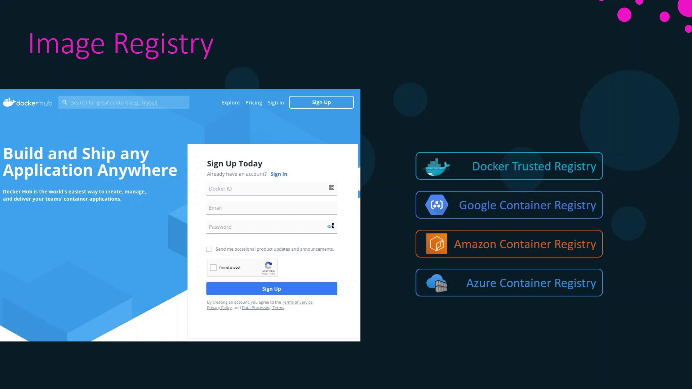
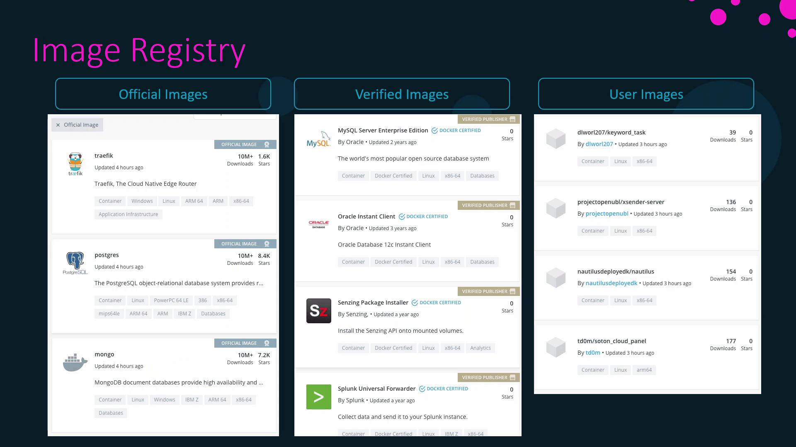
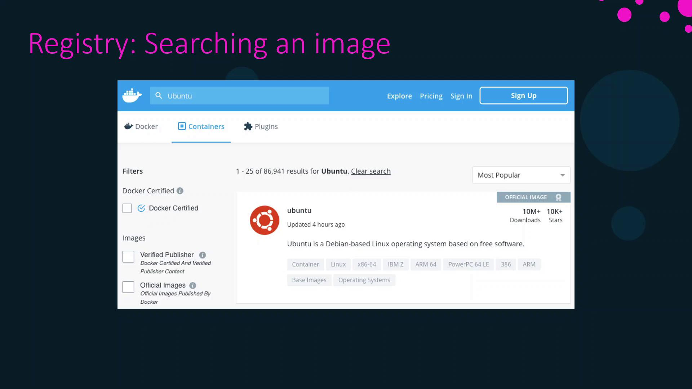

# Docker Image Registry

Source: https://notes.kodekloud.com/docs/Docker-Certified-Associate-Exam-Course/Docker-Image-Management/Docker-Image-Registry/page

This lesson explores Dockers image registry, including Docker Hub and private registries, image categories, searching, and managing images.

In this lesson, we explore Docker’s image registry. Throughout our work, we’ve run many containers using images—but where do these images reside, and how do you access them?

All images are stored in a central repository called an **image registry**. By default, Docker uses **Docker Hub**, a public registry hosting thousands of both public and private images. You can push your own images to Docker Hub and choose to keep them private.

## Default Registries

On top of Docker Hub, organizations can deploy private registries internally or use managed services from cloud providers:

<Frame>
  
</Frame>

| Registry Type                     | Description                         | Link                                                                                                         |
| --------------------------------- | ----------------------------------- | ------------------------------------------------------------------------------------------------------------ |
| Docker Hub                        | Docker’s public registry            | [hub.docker.com](https://hub.docker.com/)                                                                    |
| Docker Trusted Registry           | On-premises private registry        | [docs.docker.com/enterprise/registry](https://docs.docker.com/enterprise/registry/)                          |
| Google Container Registry         | Managed registry by Google Cloud    | [cloud.google.com/container-registry](https://cloud.google.com/container-registry)                           |
| Amazon Elastic Container Registry | Managed registry by AWS             | [aws.amazon.com/ecr](https://aws.amazon.com/ecr/)                                                            |
| Azure Container Registry          | Managed registry by Microsoft Azure | [azure.microsoft.com/services/container-registry/](https://azure.microsoft.com/services/container-registry/) |

## Image Categories on Docker Hub

On Docker Hub, images are organized into three categories:

<Frame>
  
</Frame>

| Category        | Maintained By          | Examples                                    |
| --------------- | ---------------------- | ------------------------------------------- |
| Official Images | Docker                 | `ubuntu`, `nginx`, `node`, `mongo`          |
| Verified Images | Trusted vendors        | `oracle`, `splunk`, `datadog`, `dynatrace`  |
| User Images     | Community contributors | Various open-source and custom applications |

## Searching for Images on Docker Hub

You can browse and search images via the web interface. For example, searching for “Ubuntu” displays official Ubuntu images along with download counts and star ratings:

<Frame>
  
</Frame>

## Working with Image Tags

Each image can have multiple tags. When you pull or run an image without specifying a tag, Docker uses the default tag: `latest`. This tag points to the version designated by the image maintainers.

<Callout icon="lightbulb">
  Pulling `ubuntu` is equivalent to pulling `ubuntu:latest`, which currently refers to Ubuntu 20.04.
</Callout>

```bash theme={null}
