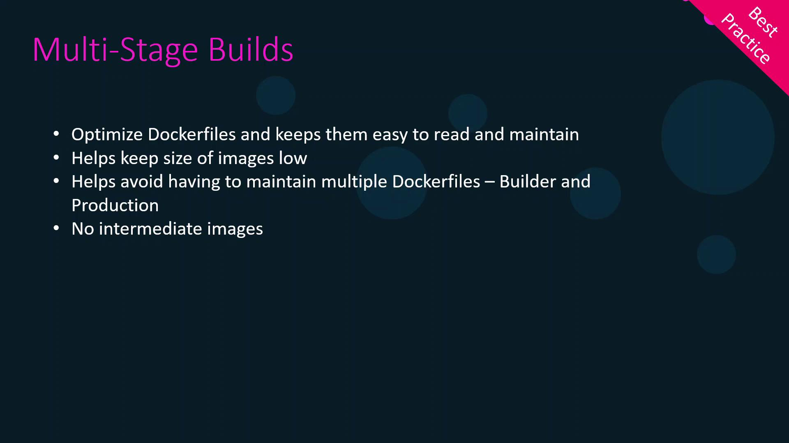

# Dockerfile (production)
FROM nginx
COPY dist /usr/share/nginx/html
CMD ["nginx", "-g", "daemon off;"]
```

Build and run:

```bash theme={null}
docker build -t my-app .
docker run -d -p 80:80 my-app
```

| Command                         | Description                      |
| ------------------------------- | -------------------------------- |
| `npm run build`                 | Compile source into `dist/`      |
| `docker build -t my-app .`      | Build Docker image               |
| `docker run -d -p 80:80 my-app` | Launch container on host port 80 |

### Drawbacks of This Approach

| Issue             | Impact                                                       |
| ----------------- | ------------------------------------------------------------ |
| Environment Drift | Builds may vary across developer machines                    |
| Manual Packaging  | Two-step process: build locally, then containerize           |
| CI/CD Complexity  | Every pipeline must replicate your local environment exactly |

## 2. Using a Separate Builder Image

To ensure repeatable builds, move compilation into its own container:

```dockerfile theme={null}
# Dockerfile.builder
FROM node:16-alpine
WORKDIR /app
COPY package*.json ./
RUN npm install
COPY . .
RUN npm run build
```

You still use the production Dockerfile from before. Then:

```bash theme={null}
docker build -f Dockerfile.builder -t builder .
docker build -f Dockerfile          -t my-app .
```

Now you have:

1. **builder** image with `dist/`
2. **my-app** image ready to serve via Nginx

<Callout icon="triangle-alert">
  Manually extracting artifacts involves creating temporary containers and copying files. This adds complexity and slows down CI/CD pipelines.
</Callout>

## 3. Simplifying with Multi-Stage Builds

Multi-stage builds merge builder and final stages:

```dockerfile theme={null}
# Dockerfile (multi-stage)
FROM node:16-alpine AS builder
WORKDIR /app
COPY package*.json ./
RUN npm install
COPY . .
RUN npm run build

FROM nginx:stable-alpine
COPY --from=builder /app/dist /usr/share/nginx/html
CMD ["nginx", "-g", "daemon off;"]
```

Just build once:

```bash theme={null}
docker build -t my-app .
```

What happens:

1. **builder** stage installs dependencies and compiles into `dist/`.
2. **final** stage pulls only the built assets into a minimal Nginx image.

### 3.1 Using Numeric Stage References

Instead of names, you can refer to stages by index:

```dockerfile theme={null}
FROM node:16-alpine
# (stage 0)
WORKDIR /app
COPY . .
RUN npm install && npm run build

FROM nginx:stable-alpine
# (stage 1)
COPY --from=0 /app/dist /usr/share/nginx/html
CMD ["nginx", "-g", "daemon off;"]
```

<Callout icon="lightbulb">
  Using named stages (e.g., `AS builder`) improves readability in complex Dockerfiles.
</Callout>

### 3.2 Building a Specific Stage

For debugging or CI-cache purposes, target only the build stage:

```bash theme={null}
docker build --target builder -t my-app-builder .
```

## 4. Benefits of Multi-Stage Builds

| Benefit             | Explanation                                         |
| ------------------- | --------------------------------------------------- |
| Smaller Final Image | Excludes build tools and source code                |
| Single Dockerfile   | Easier maintenance and less duplication             |
| Faster CI/CD        | Leverages Docker cache across stages                |
| Enhanced Security   | Only runtime dependencies end up in the final image |

<Frame>
  
</Frame>

## Links and References

* [Docker Multi-Stage Builds](https://docs.docker.com/develop/develop-images/multistage-build/)
* [Dockerfile reference](https://docs.docker.com/engine/reference/builder/)
* [Node.js Official Image](https://hub.docker.com/_/node)
* [Nginx Official Image](https://hub.docker.com/_/nginx)

<CardGroup>
  <Card title="Watch Video" icon="video" href="https://learn.kodekloud.com/user/courses/docker-certified-associate-exam-course/module/f2e605a0-1ea7-434b-a139-0db000b0a250/lesson/14e3548a-9589-417f-a471-96846a268077" />
</CardGroup>


# Removing a Docker Image

Source: https://notes.kodekloud.com/docs/Docker-Certified-Associate-Exam-Course/Docker-Image-Management/Removing-a-Docker-Image/page

Cleaning up unused Docker images helps reclaim disk space and maintain a tidy environment.

Cleaning up unused Docker images helps reclaim disk space and keep your environment tidy. Before deleting an image, ensure no containers are running from it. Stop and remove any dependent containers first.

<Callout icon="lightbulb">
  You cannot remove an image if there are existing containers based on it. Always run `docker container ls -a` and `docker container rm <container_id>` as needed.
</Callout>

***

## 1. List All Images

To view all images on your host:

```bash theme={null}
docker image ls
```

Example output:

```bash theme={null}
REPOSITORY   TAG        IMAGE ID       CREATED      SIZE
httpd        alpine     52862a02e4e9   2 weeks ago  112MB
httpd        customv1   52862a02e4e9   2 weeks ago  112MB
httpd        latest     c2aa7e16edd8   2 weeks ago  165MB
ubuntu       latest     549b9b86cb8d   4 weeks ago  64.2MB
```

In this example, the image ID `52862a02e4e9` has two tags: `httpd:alpine` and `httpd:customv1`.

***

## 2. Remove a Single Tag

When you run `docker image rm <repository>:<tag>`, Docker:

1. Removes the tag (soft link).
2. Deletes the image layers only if no other tags reference them.

Remove the `customv1` tag:

```bash theme={null}
docker image rm httpd:customv1
```

Output:

```bash theme={null}
Untagged: httpd:customv1
```

Since `httpd:alpine` still points to the same layers, only the tag is removed.

Verify the remaining images:

```bash theme={null}
docker image ls
```

Result:

```bash theme={null}
REPOSITORY   TAG        IMAGE ID       CREATED      SIZE
httpd        alpine     52862a02e4e9   2 weeks ago  112MB
httpd        latest     c2aa7e16edd8   2 weeks ago  165MB
ubuntu       latest     549b9b86cb8d   4 weeks ago  64.2MB
```

Removing the last tag deletes the layers and reclaims space:

```bash theme={null}
docker image rm httpd:alpine
```

Output:

```bash theme={null}
Untagged: httpd:alpine
Deleted: sha256:52862a02e4e9...
Deleted: sha256:...
Total reclaimed space: 112MB
```

***

## 3. Prune All Unused Images

If you have many dangling or unreferenced images, use:

```bash theme={null}
docker image prune -a
```

<Callout icon="triangle-alert">
  This command deletes **all** images not currently used by at least one container. Use with caution in production.
</Callout>

You will be prompted to confirm:

```bash theme={null}
WARNING! This will remove all images without at least one container associated to them.
Are you sure you want to continue? [y/N] y
```

Sample output:

```bash theme={null}
Deleted Images:
untagged: ubuntu:latest
deleted: sha256:549b9b86c8d75a2668c21c50ee927...
untagged: httpd:latest
deleted: sha256:c2aa7e16d855da8827aa0ccf9761...
Total reclaimed space: 229.4MB
```

***

## Common Docker Image Removal Commands

| Command                              | Description                                        |
| ------------------------------------ | -------------------------------------------------- |
| `docker image ls`                    | List all images                                    |
| `docker image rm <repository>:<tag>` | Remove a specific image tag (and layers if orphan) |
| `docker image prune`                 | Delete dangling images (untagged)                  |
| `docker image prune -a`              | Delete all unused images                           |
| `docker container ls -a`             | List all containers (to identify dependencies)     |
| `docker container rm <container_id>` | Remove specified container                         |

***

## Links and References

* [Docker Image Management](https://docs.docker.com/engine/reference/commandline/image_rm/)
* [Docker Container Management](https://docs.docker.com/engine/reference/commandline/container_ls/)
* [Docker CLI Prune Commands](https://docs.docker.com/engine/reference/commandline/system_prune/)

<CardGroup>
  <Card title="Watch Video" icon="video" href="https://learn.kodekloud.com/user/courses/docker-certified-associate-exam-course/module/f2e605a0-1ea7-434b-a139-0db000b0a250/lesson/7884336d-dd48-4128-aa4e-4c3d396daeef" />
</CardGroup>
