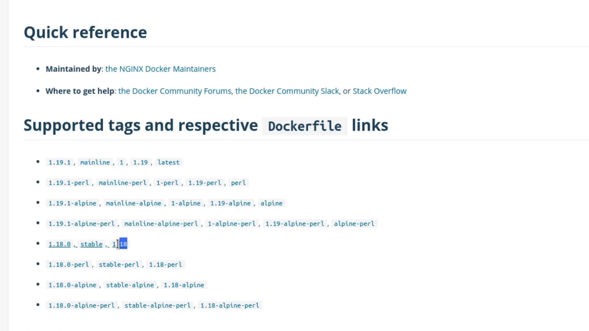

# No resources found in default namespace.
```

Define your Deployment in `deployment.yaml`:

```yaml theme={null}
apiVersion: apps/v1
kind: Deployment
metadata:
  name: myapp-deployment
  labels:
    tier: frontend
spec:
  replicas: 6
  selector:
    matchLabels:
      app: myapp
  template:
    metadata:
      labels:
        app: myapp
    spec:
      containers:
        - name: nginx
          image: nginx
```

Create the Deployment and track its rollout:

```bash theme={null}
kubectl create -f deployment.yaml --record
kubectl rollout status deployment/myapp-deployment
# deployment "myapp-deployment" successfully rolled out
```

View the rollout history:

```bash theme={null}
kubectl rollout history deployment/myapp-deployment
# REVISION  CHANGE-CAUSE
# 1         kubectl create -f deployment.yaml --record
```

| Command                                               | Purpose                                          |
| ----------------------------------------------------- | ------------------------------------------------ |
| `kubectl create -f deployment.yaml --record`          | Create Deployment and annotate the change-cause  |
| `kubectl rollout status deployment/myapp-deployment`  | Watch the rolling update until completion        |
| `kubectl rollout history deployment/myapp-deployment` | List Deployment revisions and their change-cause |

***

## 2. Downgrade NGINX via `kubectl edit`

Inspect the current spec:

```bash theme={null}
kubectl describe deployment myapp-deployment
```

All Pods run `nginx:latest` by default. To downgrade to `nginx:1.18`:

```bash theme={null}
kubectl edit deployment myapp-deployment --record
```

Locate the container definition and update the image tag:

```diff theme={null}
       containers:
       - name: nginx
-        image: nginx
+        image: nginx:1.18
```

<Callout icon="lightbulb">
  Browse all available NGINX tags on Docker Hub to pick a stable version:\
  [https://hub.docker.com/\_/nginx](https://hub.docker.com/_/nginx)
</Callout>

<Frame>
  
</Frame>

Save and close the editor, then monitor the rollout:

```bash theme={null}
kubectl rollout status deployment/myapp-deployment
# deployment "myapp-deployment" successfully rolled out
```

Verify the annotation:

```bash theme={null}
kubectl describe deployment myapp-deployment
```

Look under **Annotations** for:\
`kubernetes.io/change-cause=kubectl edit deployment myapp-deployment --record`

***

## 3. Update Using `kubectl set image`

Alternatively, patch the image without editing YAML:

```bash theme={null}
kubectl set image deployment/myapp-deployment \
  nginx=nginx:1.18-perl --record
kubectl rollout status deployment/myapp-deployment
kubectl rollout history deployment/myapp-deployment
# REVISION  CHANGE-CAUSE
# 1         kubectl create -f deployment.yaml --record
# 2         kubectl edit deployment myapp-deployment --record
# 3         kubectl set image deployment/myapp-deployment nginx=nginx:1.18-perl --record
```

Confirm all Pods have the updated image:

```bash theme={null}
kubectl get pods
```

***

## 4. Roll Back to a Previous Revision

If `nginx:1.18-perl` proves unstable, revert to revision 2 (the plain `1.18`):

```bash theme={null}
kubectl rollout undo deployment/myapp-deployment --to-revision=2
kubectl rollout status deployment/myapp-deployment
kubectl describe deployment myapp-deployment
# Container Image: nginx:1.18
```

***

## 5. Simulate a Failed Rollout

Intentionally introduce a bad image to see rollback behavior:

```bash theme={null}
kubectl edit deployment myapp-deployment --record
```

Change the image to an invalid tag:

```diff theme={null}
       containers:
       - name: nginx
-        image: nginx:1.18
+        image: nginx:1.18-does-not-exist
```

<Callout icon="triangle-alert">
  Using a non-existent image will trigger `ImagePullBackOff` errors and stall the rollout.\
  Ensure you revert quickly to avoid service disruption.
</Callout>

Save and watch the rollout status:

```bash theme={null}
kubectl rollout status deployment/myapp-deployment
# Waiting for deployment "myapp-deployment" rollout to finish: 3 out of 6 new replicas have been updated...
```

Inspect Pods:

```bash theme={null}
kubectl get pods
# Some Pods display ImagePullBackOff while old replicas still serve traffic.
```

Rollback the faulty revision:

```bash theme={null}
kubectl rollout undo deployment/myapp-deployment
kubectl rollout status deployment/myapp-deployment
kubectl get pods
```

All Pods should now run `nginx:1.18` again.

***

## Links and References

* [Kubernetes Deployments](https://kubernetes.[SECRET_REDACTED]/)
* [kubectl Cheat Sheet](https://kubernetes.io/docs/reference/kubectl/cheatsheet/)
* [Docker Hub – NGINX Repository](https://hub.docker.com/_/nginx/)

<CardGroup>
  <Card title="Watch Video" icon="video" href="https://learn.kodekloud.com/user/courses/docker-certified-associate-exam-course/module/d9358627-4fc7-4acc-ab96-fa25232555c6/lesson/a3b9e4cb-07ab-499b-8226-02f90f323b02" />
</CardGroup>


# Demo Deployments

Source: https://notes.kodekloud.com/docs/Docker-Certified-Associate-Exam-Course/Kubernetes/Demo-Deployments/page

This walkthrough teaches how to convert a ReplicaSet into a Deployment in Kubernetes, covering creation, application, and verification steps.

In this walkthrough, you’ll learn how to convert an existing ReplicaSet into a fully managed **Deployment**. Deployments offer declarative updates, rollbacks, and scaling capabilities—making them the recommended way to run replicas in production. We’ll:

1. Prepare the project structure
2. Create the Deployment manifest
3. Apply the Deployment
4. Verify the rollout and inspect resources

***

## 1. Prepare the directories and files

1. From your project root, create a folder named `deployments`.
2. Inside `deployments`, create a file called `deployment.yaml`.

To see what we’re building on, here’s the reference ReplicaSet we defined earlier:

```yaml theme={null}
