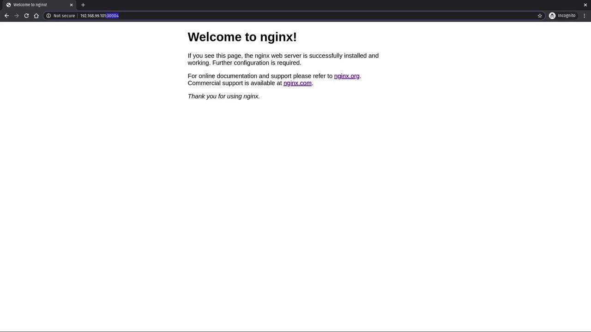

# NAME                DESIRED   CURRENT   READY   AGE
kubectl get pods
# NAME                         READY   STATUS    RESTARTS   AGE
# myapp-replicaset-8nxxl       1/1     Running   0          24s
# myapp-replicaset-jlgr2       1/1     Running   0          24s
# myapp-replicaset-pm4rl       1/1     Running   0          24s
```

| Command                    | Description                                   |
| -------------------------- | --------------------------------------------- |
| `kubectl create -f <file>` | Create resources from a manifest file         |
| `kubectl get replicaset`   | List all ReplicaSets in the current namespace |
| `kubectl get pods`         | List all Pods in the current namespace        |

## 3. ReplicaSet Self-Healing

To observe self-healing, delete one of the Pods:

```bash theme={null}
kubectl delete pod myapp-replicaset-8nxxl
```

After a few seconds, the ReplicaSet controller will recreate a replacement Pod:

```bash theme={null}
kubectl get pods
# NAME                         READY   STATUS    RESTARTS   AGE
# myapp-replicaset-jlgr2       1/1     Running   0          45s
# myapp-replicaset-pm4rl       1/1     Running   0          45s
# myapp-replicaset-<new-id>    1/1     Running   0          15s
```

You can inspect events to confirm:

```bash theme={null}
kubectl describe replicaset myapp-replicaset
```

Check the **Events** section for Pod creation and deletion entries.

## 4. Preventing Extra Pods

If you manually create a Pod matching the ReplicaSet’s selector, the controller will delete it to maintain the desired count.

```yaml theme={null}
# pods/nginx.yaml (modified)
apiVersion: v1
kind: Pod
metadata:
  name: nginx-external
  labels:
    env: production
spec:
  containers:
    - name: nginx
      image: nginx
```

```bash theme={null}
kubectl create -f ../pods/nginx.yaml
kubectl get pods
# NAME                         READY   STATUS        RESTARTS   AGE
# myapp-replicaset-...         1/1     Running       0          2m
# nginx-external               0/1     Terminating   0          5s
```

<Callout icon="triangle-alert">
  The ReplicaSet controller enforces the desired replica count by deleting any excess Pods that match its selector.
</Callout>

## 5. Scaling the ReplicaSet

### 5.1 Using `kubectl edit`

```bash theme={null}
kubectl edit replicaset myapp-replicaset
```

Locate the `spec.replicas` field and adjust it:

```diff theme={null}
 spec:
-  replicas: 3
+  replicas: 4
```

Save and exit. Verify new Pod creation:

```bash theme={null}
kubectl get pods
# myapp-replicaset-...   1/1   Running   0   6s
```

### 5.2 Using `kubectl scale`

```bash theme={null}
kubectl scale replicaset myapp-replicaset --replicas=2
kubectl get pods
# NAME                         READY   STATUS    RESTARTS   AGE
# myapp-replicaset-jlgr2       1/1     Running   0          6m
# myapp-replicaset-pm4rl       1/1     Running   0          6m
```

Excess Pods beyond the new replica count are gracefully terminated.

***

## Links and References

* [Kubernetes ReplicaSet Concepts](https://kubernetes.io/docs/concepts/workloads/controllers/replicaset/)
* [Kubectl Cheat Sheet](https://kubernetes.io/docs/reference/kubectl/cheatsheet/)
* [Deployments vs ReplicaSets](https://kubernetes.io/docs/concepts/workloads/controllers/deployment/)

<CardGroup>
  <Card title="Watch Video" icon="video" href="https://learn.kodekloud.com/user/courses/docker-certified-associate-exam-course/module/d9358627-4fc7-4acc-ab96-fa25232555c6/lesson/972ebd7a-dbd7-488c-b8e2-b075a9ecbefd" />
</CardGroup>


# Demo Services

Source: https://notes.kodekloud.com/docs/Docker-Certified-Associate-Exam-Course/Kubernetes/Demo-Services/page

Learn to expose Kubernetes application Pods by creating a NodePort Service for stable access and load balancing.

In this lesson, you’ll learn how to expose your application Pods in Kubernetes by creating a Service of type `NodePort`. Services provide stable endpoints for accessing your workloads and enable load balancing across Pods.

## Prerequisites

Verify that your Deployment is running and has created Pods:

```bash theme={null}
kubectl get deployment
NAME               READY   UP-TO-DATE   AVAILABLE   AGE
myapp-deployment   6/6     6            6           23m
```

You should see `6/6` READY, meaning six Pods are available.

## Step 1: Define the Service

Create a directory called `service` (optional) and add a file named `service-definition.yaml`:

```yaml theme={null}
apiVersion: v1
kind: Service
metadata:
  name: myapp-service
spec:
  type: NodePort
  selector:
    app: myapp
  ports:
    - port: 80
      targetPort: 80
      nodePort: 30004
```

### Service Specification Breakdown

| Field              | Description                                                 | Example      |
| ------------------ | ----------------------------------------------------------- | ------------ |
| `type`             | Service exposure method (ClusterIP, NodePort, LoadBalancer) | `NodePort`   |
| `selector`         | Matches Pods by label                                       | `app: myapp` |
| `ports.port`       | Port exposed inside the cluster                             | `80`         |
| `ports.targetPort` | Port on the Pod that receives traffic                       | `80`         |
| `ports.nodePort`   | Port on each Node for external access (30000–32767)         | `30004`      |

<Callout icon="lightbulb">
  NodePort Services allocate a port between `30000` and `32767`. If you omit `nodePort`, Kubernetes assigns one automatically.
</Callout>

Save the file, then apply it:

```bash theme={null}
kubectl apply -f service/service-definition.yaml
```

## Step 2: Verify the Service

Run the following command to list Services in the current namespace:

```bash theme={null}
kubectl get svc
```

Example output:

```plaintext theme={null}
NAME            TYPE        CLUSTER-IP      EXTERNAL-IP   PORT(S)         AGE
kubernetes      ClusterIP   10.96.0.1       <none>        443/TCP         24h
myapp-service   NodePort    10.101.76.121   <none>        80:30004/TCP    5s
```

* **CLUSTER-IP**: Internal IP of the Service.
* **80:30004/TCP**: Maps Service port `80` to NodePort `30004`.

## Step 3: Access the Application

There are two ways to reach your application:

1. Using your node’s IP address:
   ```bash theme={null}
   minikube ip   # If you're on Minikube
   ```
   Then open your browser at
   ```text theme={null}
   http://<NODE_IP>:30004
   ```

2. Using Minikube’s service tunnel:
   ```bash theme={null}
   minikube service myapp-service --url
   ```
   This outputs a URL such as:
   ```text theme={null}
   http://192.168.99.101:30004
   ```

<Callout icon="triangle-alert">
  Exposing a Service via NodePort makes it accessible externally on the node’s network. Ensure your firewall rules and security groups are configured appropriately.
</Callout>

Open the URL in your browser. You should see the default NGINX welcome page:

<Frame>
  
</Frame>

***

## Next Steps

* Explore other Service types such as `ClusterIP` and `LoadBalancer`.
* Learn about Ingress resources for advanced HTTP routing.
* Consult the [Kubernetes Services documentation](https://kubernetes.io/docs/concepts/services-networking/service/) for more details.

## Links and References

* [Kubernetes Services](https://kubernetes.io/docs/concepts/services-networking/service/)
* [Kubernetes Basics](https://kubernetes.io/docs/concepts/overview/what-is-kubernetes/)
* [Minikube — Quickstart](https://minikube.sigs.k8s.io/docs/start/)

<CardGroup>
  <Card title="Watch Video" icon="video" href="https://learn.kodekloud.com/user/courses/docker-certified-associate-exam-course/module/d9358627-4fc7-4acc-ab96-fa25232555c6/lesson/5c68b556-29eb-40eb-8eb7-bf20f1378079" />
</CardGroup>
