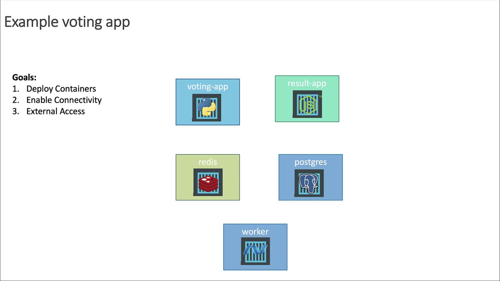

# Deploy voting app on Kubernetes

Source: https://notes.kodekloud.com/docs/Docker-Certified-Associate-Exam-Course/Kubernetes/Deploy-voting-app-on-Kubernetes/page

Learn to deploy a containerized voting application on Kubernetes, covering service deployment, connectivity, and external access.

Learn how to deploy a containerized voting application on Kubernetes. In this guide, we’ll walk through deploying each component as a container, configuring intra-cluster connectivity, and exposing the frontend services externally.

## Objectives

* Deploy each service as containers on a Kubernetes cluster
* Enable reliable connectivity so services can communicate
* Expose the Voting and Result apps externally via web browser

<Frame>
  
</Frame>

## High-Level Plan

1. Deploy each application as a standalone Pod (we’ll convert them to Deployments later).
2. Create Services for internal connectivity:
   * **redis** (ClusterIP)
   * **db** (ClusterIP)
3. Expose the frontends using NodePort Services:
   * **voting-app**
   * **result-app**
4. Skip a Service for the worker (it’s only a background job).

## Connectivity Requirements

* **voting-app** writes votes to Redis.
* **worker** reads votes from Redis and writes aggregates to PostgreSQL.
* **result-app** reads results from PostgreSQL to display.
* **voting-app** and **result-app** are user-facing.
* **worker** runs in the background and doesn’t receive external traffic.

Each component listens on its own port:

* voting-app: 80
* result-app: 80
* redis: 6379
* postgres: 5432
* worker: no external port

### Why Use a Service?

Pod IPs are ephemeral. Kubernetes Services provide a stable DNS name and virtual IP. For example, the Python app connects to Redis at host `redis`:

```python theme={null}
