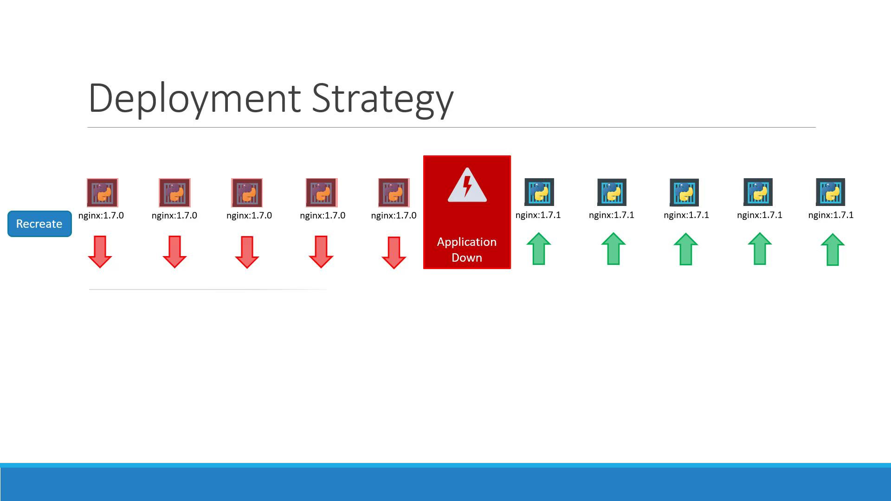
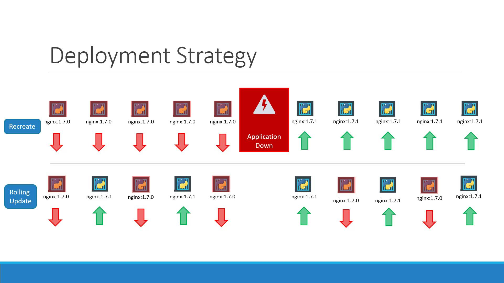
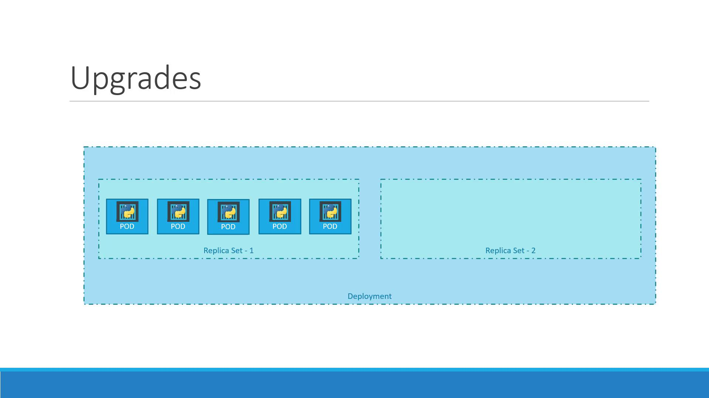
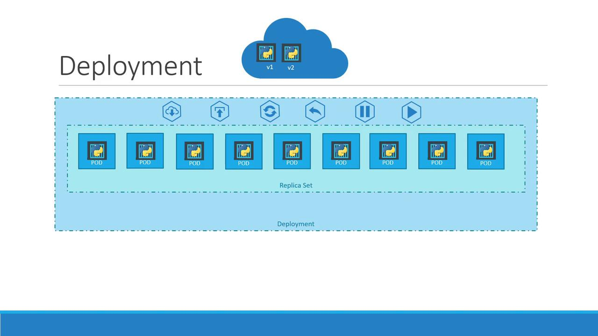

# Waiting for rollout to finish: 0 of 10 updated replicas are available...
# ...
kubectl rollout history deployment/myapp-deployment
# REVISION  CHANGE-CAUSE
# 1         initial create
# 2         updated image to nginx:1.7.1
```

<Callout icon="lightbulb">
  Use `kubectl rollout status` to ensure a smooth update before proceeding with any dependent tasks.
</Callout>

## Deployment Strategies

Kubernetes supports two primary update strategies:

### Recreate

This strategy terminates all existing Pods before creating new ones—resulting in downtime.

<Frame>
  
</Frame>

<Callout icon="triangle-alert">
  Recreate will interrupt service during the update. Use only when downtime is acceptable.
</Callout>

### RollingUpdate (default)

With RollingUpdate, old Pods are replaced incrementally, ensuring continuous availability.

<Frame>
  
</Frame>

If you omit a strategy in your `Deployment` spec, RollingUpdate applies by default.

## Applying Updates

You can update a Deployment by editing its YAML or using `kubectl set image`.

deployment.yaml:

```yaml theme={null}
apiVersion: apps/v1
kind: Deployment
metadata:
  name: myapp-deployment
  labels:
    app: myapp
    tier: frontend
spec:
  replicas: 3
  selector:
    matchLabels:
      app: myapp
      tier: frontend
  template:
    metadata:
      labels:
        app: myapp
        tier: frontend
    spec:
      containers:
        - name: nginx-container
          image: nginx:1.7.0
```

Apply the manifest:

```bash theme={null}
kubectl apply -f deployment.yaml
# deployment "myapp-deployment" configured
```

Or update the image directly:

```bash theme={null}
kubectl set image deployment/myapp-deployment \
  nginx-container=nginx:1.9.1
# deployment "myapp-deployment" image updated
```

Each change creates a new revision and triggers a rollout.

## Inspecting Deployment Details

To see strategy settings, ReplicaSet events, and scaling details:

```bash theme={null}
kubectl describe deployment myapp-deployment
```

Example for **Recreate**:

```plaintext theme={null}
Name:                   myapp-deployment
StrategyType:           Recreate
Replicas:               5 desired | 5 total | 5 available
Events:
  Type    Reason             Age   From                   Message
  ----    ------             ----  ----                   -------
  Normal  ScalingReplicaSet  11m   deployment-controller  Scaled up replica set myapp-deployment-6795… to 5
```

Example for **RollingUpdate**:

```plaintext theme={null}
Name:                   myapp-deployment
StrategyType:           RollingUpdate
RollingUpdateStrategy:  25% max unavailable, 25% max surge
Replicas:               5 desired | 6 total | 4 available | 2 unavailable
Events:
  Type    Reason             Age  From                   Message
  ----    ------             ---- ----                   -------
  Normal  ScalingReplicaSet  1m   deployment-controller  Scaled up replica set myapp-deployment-67c7… to 5
```

Under the hood, each Deployment manages ReplicaSets:

<Frame>
  
</Frame>

List ReplicaSets:

```bash theme={null}
kubectl get replicasets
# NAME                         DESIRED CURRENT READY AGE
# myapp-deployment-67c749c58c  0       0       0     22m
# myapp-deployment-75d7bdbd8d  5       5       5     20m
```

## Rolling Back

To revert a faulty rollout:

```bash theme={null}
kubectl rollout undo deployment/myapp-deployment
# deployment "myapp-deployment" rolled back
```

After rollback, ReplicaSet counts swap:

```bash theme={null}
kubectl get replicasets
# NAME                         DESIRED CURRENT READY AGE
# myapp-deployment-67c749c58c  5       5       5     22m
# myapp-deployment-75d7bdbd8d  0       0       0     20m
```

## Creating a Deployment with `kubectl run`

Although `kubectl run nginx --image=nginx` creates a Deployment by default:

```bash theme={null}
kubectl run nginx --image=nginx
# deployment "nginx" created
```

<Callout icon="lightbulb">
  Using manifest files ensures version control, repeatability, and easier collaboration.
</Callout>

## Summary of Key Commands

| Command                          | Description                                  |
| -------------------------------- | -------------------------------------------- |
| kubectl create deployment        | Create a new Deployment                      |
| kubectl get deployments          | List Deployments                             |
| kubectl apply -f deployment.yaml | Apply or update a Deployment manifest        |
| kubectl set image                | Update container image in a Deployment       |
| kubectl rollout status           | Monitor rollout progress                     |
| kubectl rollout history          | View revision history                        |
| kubectl rollout undo             | Roll back to the previous revision           |
| kubectl describe deployment      | Show detailed Deployment settings and events |

## References

* [Kubernetes Basics](https://kubernetes.io/docs/concepts/overview/what-is-kubernetes/)
* [Deployments](https://kubernetes.[SECRET_REDACTED]/)
* [kubectl Cheat Sheet](https://kubernetes.io/docs/reference/kubectl/cheatsheet/)

<CardGroup>
  <Card title="Watch Video" icon="video" href="https://learn.kodekloud.com/user/courses/docker-certified-associate-exam-course/module/d9358627-4fc7-4acc-ab96-fa25232555c6/lesson/b17579bc-b0dc-45f5-af0c-38781ca2779d" />
</CardGroup>


# Deployments

Source: https://notes.kodekloud.com/docs/Docker-Certified-Associate-Exam-Course/Kubernetes/Deployments/page

This article explains Kubernetes Deployments, covering their features, how they manage resources, and how to create and inspect Deployment manifests.

Kubernetes Deployments automate application upgrades, scaling, and self-healing in production environments. They enable rolling updates, controlled rollbacks, and pause/resume capabilities—all without downtime. In this guide, you’ll learn how Deployments manage ReplicaSets and Pods, define a Deployment manifest, and inspect your resources using `kubectl`.

## Why Use a Deployment?

* **Rolling Updates**: Replace pods one by one to avoid service interruption.
* **Rollbacks**: Instantly revert to a previous version if something goes wrong.
* **Pause & Resume**: Apply several changes as a batch and resume when ready.
* **Declarative Scaling**: Increase or decrease replicas in your manifest.

## How Deployments Work

A Deployment sits above ReplicaSets and Pods:

1. **Pod**: The basic execution unit (one or more containers).
2. **ReplicaSet**: Ensures a specified number of pod replicas run at any time.
3. **Deployment**: Manages ReplicaSets and orchestrates updates, rollbacks, and scaling.

<Frame>
  
</Frame>

## Resource Comparison

| Resource Type | Purpose                                   | Example Command                               |
| ------------- | ----------------------------------------- | --------------------------------------------- |
| Pod           | Single instance of one or more containers | `kubectl run nginx --image=nginx`             |
| ReplicaSet    | Maintains desired pod replicas            | `kubectl create -f replicaset-definition.yml` |
| Deployment    | Declarative updates and rollbacks         | `kubectl apply -f deployment-definition.yml`  |

## Writing a Deployment Manifest

Create a YAML file (`deployment-definition.yml`) to declare your desired state:

```yaml theme={null}
apiVersion: apps/v1
kind: Deployment
metadata:
  name: myapp-deployment
  labels:
    app: myapp
    type: front-end
spec:
  replicas: 3
  selector:
    matchLabels:
      type: front-end
  template:
    metadata:
      labels:
        app: myapp
        type: front-end
    spec:
      containers:
        - name: nginx-container
          image: nginx:latest
          ports:
            - containerPort: 80
```

* **apiVersion**: The API group (`apps/v1`).
* **kind**: Must be `Deployment`.
* **metadata**: Identifies the Deployment (`name` and `labels`).
* **spec.replicas**: Desired number of pods.
* **spec.selector**: Matches labels on pods.
* **spec.template**: Defines the pod spec, just like a ReplicaSet.

<Callout icon="lightbulb">
  Using `kubectl apply -f` is recommended for idempotent updates. It creates or updates resources based on your manifest.
</Callout>

## Deploying and Inspecting Resources

1. **Create or update the Deployment**
   ```bash theme={null}
   kubectl apply -f deployment-definition.yml
   ```
2. **View Deployments**
   ```bash theme={null}
   kubectl get deployments
   ```
   Example output:
   ```text theme={null}
   NAME              READY   UP-TO-DATE   AVAILABLE   AGE
   myapp-deployment  3/3     3            3           30s
   ```
3. **List ReplicaSets**
   ```bash theme={null}
   kubectl get rs
   ```
4. **Check Pods**
   ```bash theme={null}
   kubectl get pods
   ```
5. **See All Resources**
   ```bash theme={null}
   kubectl get all
   ```

<Callout icon="triangle-alert">
  If an update fails, rollback immediately:

  ```bash theme={null}
  kubectl rollout undo deployment/myapp-deployment
  ```
</Callout>

## Next Steps & References

* Learn more about [Kubernetes Deployments](https://kubernetes.[SECRET_REDACTED]/)
* Explore the [kubectl Cheat Sheet](https://kubernetes.io/docs/reference/kubectl/cheatsheet/)
* Official [Kubernetes Documentation](https://kubernetes.io/docs/)

<CardGroup>
  <Card title="Watch Video" icon="video" href="https://learn.kodekloud.com/user/courses/docker-certified-associate-exam-course/module/d9358627-4fc7-4acc-ab96-fa25232555c6/lesson/d31c12f3-afcb-46dd-b90b-0b0e8abd08d4" />
</CardGroup>
