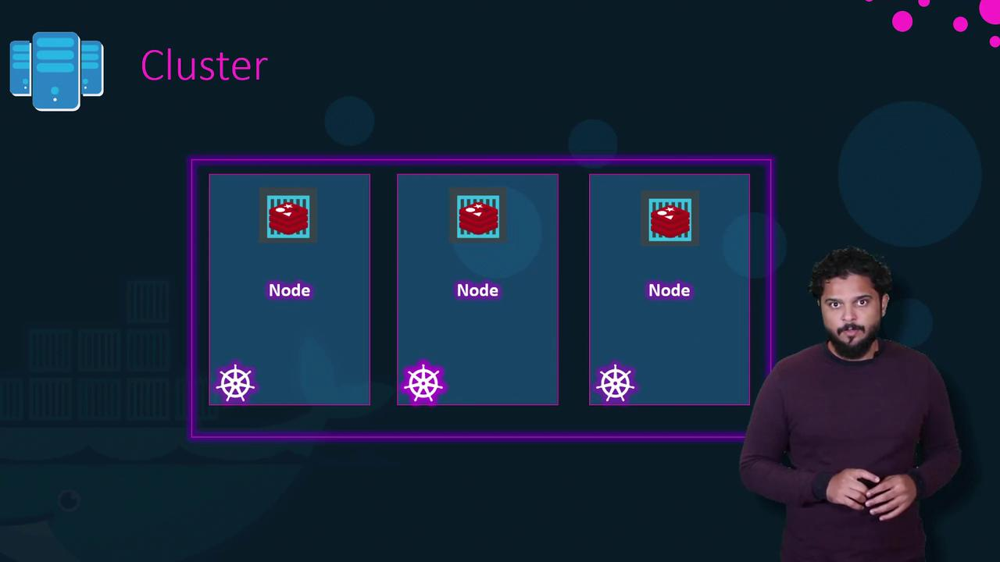
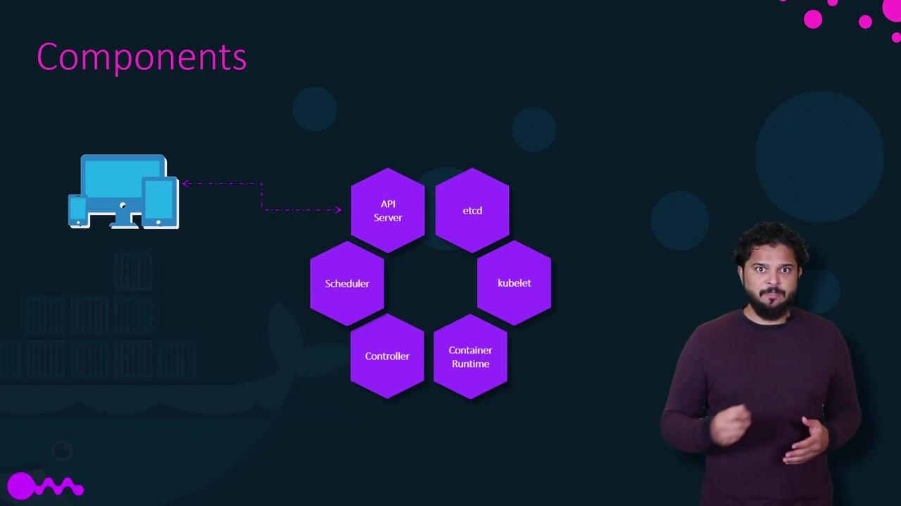

# Kubernetes Architecture

Source: https://notes.kodekloud.com/docs/Docker-Certified-Associate-Exam-Course/Kubernetes/Kubernetes-Architecture/page

This article provides an overview of Kubernetes architecture and core concepts for running and scaling containerized applications.

In this lesson, you’ll get a concise overview of Kubernetes architecture and its core concepts. While Kubernetes is a vast ecosystem—entire courses cover every detail—this guide focuses on the essentials you need to understand how Kubernetes runs and scales containerized applications.

## Docker vs. Kubernetes

Docker and Kubernetes often appear together, but they serve different purposes:

* Docker provides a **container runtime** for packaging and running individual containers.
* Kubernetes is an **orchestration system** that automates deployment, scaling, and management of containerized applications across a cluster.

<Callout icon="lightbulb">
  Kubernetes supports multiple container runtimes. While Docker is the most common, you can also use CRI-O or containerd via the [Container Runtime Interface (CRI)](https://kubernetes.io/docs/concepts/architecture/cri/).
</Callout>

## 1. Nodes and Cluster

A *node* is a physical or virtual machine that runs containerized workloads. You group multiple nodes into a *cluster* to achieve high availability and fault tolerance. If one node fails, other nodes continue serving your application.

<Frame>
  
</Frame>

## 2. Control Plane Components

The control plane (formerly called “master”) runs components that maintain the cluster’s desired state:

<Frame>
  
</Frame>

| Component             | Role                                                                                   |
| --------------------- | -------------------------------------------------------------------------------------- |
| **API Server**        | The cluster’s front end. All CLI (`kubectl`), UI, and internal requests go through it. |
| **etcd**              | A highly available key-value store for all cluster data and configuration.             |
| **Scheduler**         | Assigns pods to nodes based on resource requirements and policies.                     |
| **Controller**        | Monitors state and takes corrective actions (e.g., launching new pods on failure).     |
| **kubelet**           | Agent on each node ensuring containers described in PodSpecs are running and healthy.  |
| **Container Runtime** | Software that runs containers (e.g., Docker, containerd, CRI-O).                       |

<Callout icon="triangle-alert">
  Data in **etcd** is critical: back it up regularly. Loss of etcd data can render your cluster unusable.
</Callout>

## 3. Kubernetes CLI (`kubectl`)

`kubectl` is the primary command-line tool to interact with the Kubernetes API. Here are common commands:

| Command                    | Description                                         |
| -------------------------- | --------------------------------------------------- |
| `kubectl run`              | Deploy an application (create a Deployment or Pod). |
| `kubectl get nodes`        | List all nodes in the cluster.                      |
| `kubectl get pods`         | List all pods in the current namespace.             |
| `kubectl cluster-info`     | Display addresses of the control plane.             |
| `kubectl scale deployment` | Adjust the number of replicas in a Deployment.      |
| `kubectl set image`        | Update the image of a Deployment.                   |
| `kubectl rollout undo`     | Roll back to a previous Deployment version.         |

### Example Workflow

```bash theme={null}
