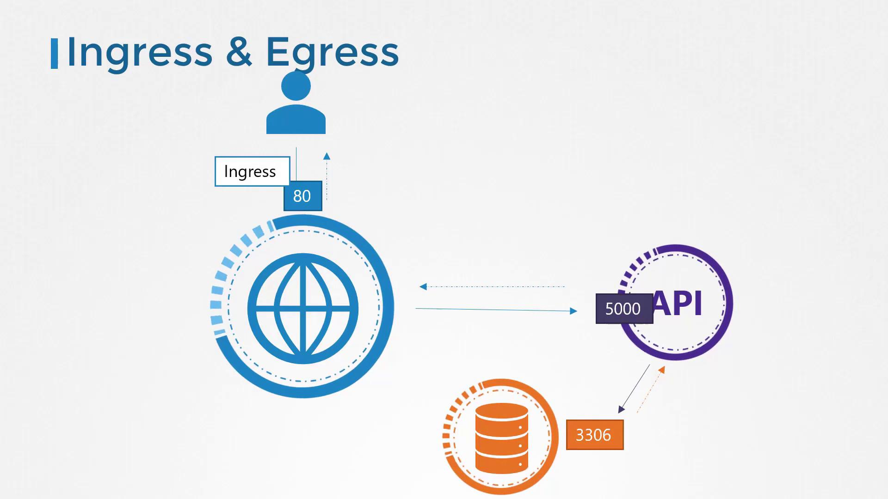
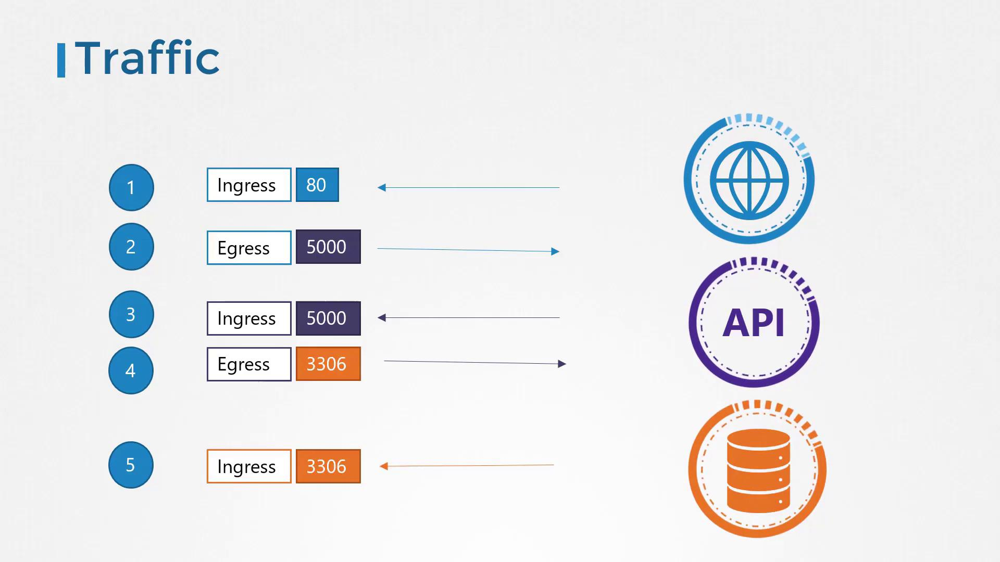
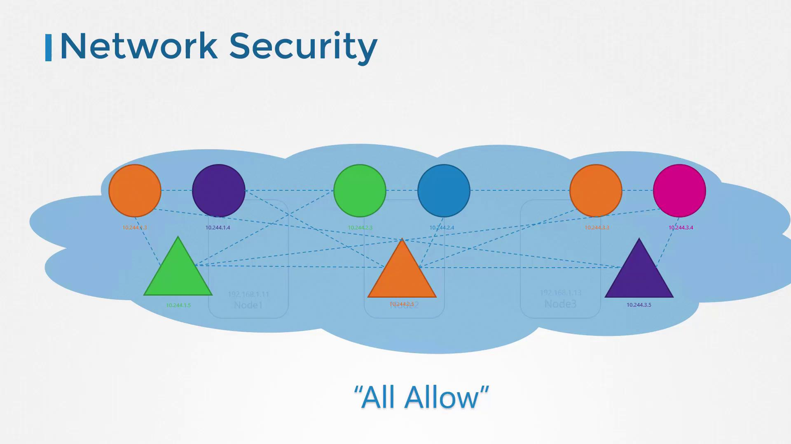
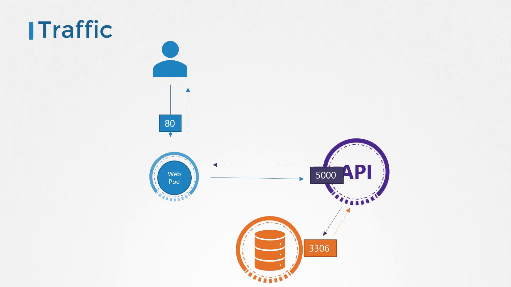
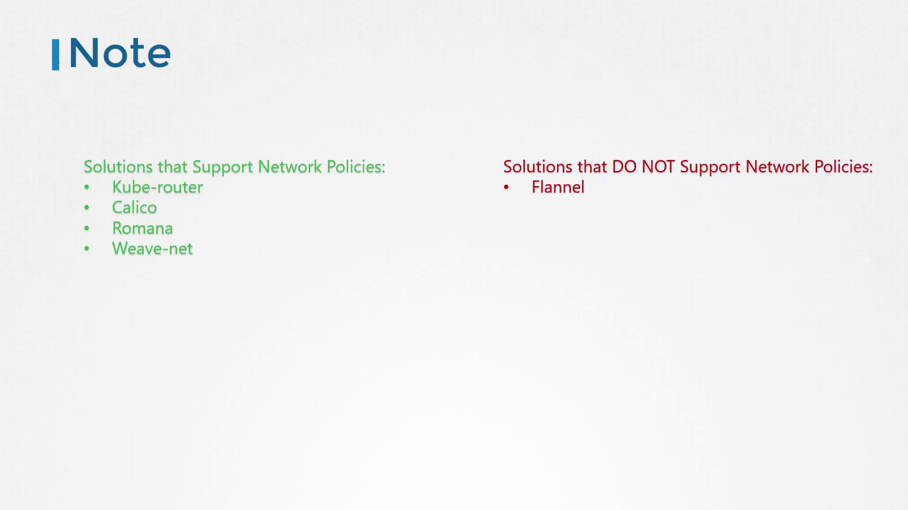

# Connect to a Service in the same namespace
mysql.connect("db-service")
```

To reach a Service in another namespace, use its fully qualified domain name (FQDN):

```python theme={null}
# Connect to a Service in 'dev' namespace
mysql.connect("db-service.dev.svc.cluster.local")
```

DNS format:

```text theme={null}
<service>.<namespace>.svc.<cluster-domain>
```

By default, `cluster-domain` is `cluster.local` and `svc` is the Services subdomain.

<Callout icon="lightbulb">
  You can customize the cluster-domain in kube-DNS/CoreDNS configuration if needed.
</Callout>

## Working with Namespaces in kubectl

### Common Operations

| Operation                   | Command                                                                           |
| --------------------------- | --------------------------------------------------------------------------------- |
| List Pods (current ns)      | `kubectl get pods`                                                                |
| List Pods (all namespaces)  | `kubectl get pods --all-namespaces`                                               |
| Create namespace            | `kubectl create namespace <name>`                                                 |
| Apply manifest in namespace | `kubectl apply -f <file.yml> --namespace=<name>`                                  |
| Switch context namespace    | `kubectl config set-context $(kubectl config current-context) --namespace=<name>` |

### Listing Pods

```bash theme={null}
# Default namespace
kubectl get pods

# kube-system namespace
kubectl get pods --namespace=kube-system
```

### Creating a Pod in a Specific Namespace

Override the namespace via CLI:

```bash theme={null}
kubectl create -f pod-definition.yml --namespace=dev
```

Or specify within the manifest:

```yaml theme={null}
# pod-definition.yml
apiVersion: v1
kind: Pod
metadata:
  name: myapp-pod
  namespace: dev
spec:
  containers:
    - name: nginx-container
      image: nginx
```

Then apply:

```bash theme={null}
kubectl apply -f pod-definition.yml
```

### Switching the Current Namespace

Set your default namespace for the current context:

```bash theme={null}
kubectl config set-context \
  $(kubectl config current-context) \
  --namespace=dev
```

Now, `kubectl get pods` targets **dev** by default.

## Defining Resource Quotas

Limit resource usage per namespace with a ResourceQuota manifest:

```yaml theme={null}
# compute-quota.yaml
apiVersion: v1
kind: ResourceQuota
metadata:
  name: compute-quota
  namespace: dev
spec:
  hard:
    pods: "10"
    requests.cpu: "4"
    requests.memory: 5Gi
    limits.cpu: "10"
    limits.memory: 10Gi
```

Apply it:

```bash theme={null}
kubectl apply -f compute-quota.yaml
```

## Summary

Namespaces are fundamental for organizing, isolating, and managing resources in Kubernetes. Use them to separate environments, enforce policies, and allocate quotas. Practice creating namespaces, deploying workloads, and exploring cross-namespace Service discovery to master this concept.

## References

* [Kubernetes Official Documentation](https://kubernetes.io/docs/concepts/overview/working-with-objects/namespaces/)
* [kubectl Cheat Sheet](https://kubernetes.io/docs/reference/kubectl/cheatsheet/)

<CardGroup>
  <Card title="Watch Video" icon="video" href="https://learn.kodekloud.com/user/courses/docker-certified-associate-exam-course/module/d9358627-4fc7-4acc-ab96-fa25232555c6/lesson/9a274a47-4b5c-46b1-8a99-2e8bfef9dea6" />
</CardGroup>


# Network Policies

Source: https://notes.kodekloud.com/docs/Docker-Certified-Associate-Exam-Course/Kubernetes/Network-Policies/page

Kubernetes Network Policies allow enforcement of fine-grained traffic rules between pods, enhancing security and control over pod communication.

Kubernetes Network Policies enable you to enforce fine-grained traffic rules between pods. In this guide, we’ll review networking fundamentals, explore the default “allow all” model, and walk through creating an ingress policy to restrict access to your database pod.

## Table of Contents

* [Traffic Flow Fundamentals](#traffic-flow-fundamentals)
* [Kubernetes Networking Basics](#kubernetes-networking-basics)
* [Default Behavior vs. Intentional Isolation](#default-behavior-vs-intentional-isolation)
* [Defining a NetworkPolicy](#defining-a-networkpolicy)
* [CNI Plugin Support](#cni-plugin-support)
* [Further Reading](#further-reading)

***

## Traffic Flow Fundamentals

Consider a three-tier application:

1. **Web Server**: Receives HTTP requests (port 80).
2. **API Server**: Processes logic (port 5000).
3. **Database Server**: Stores data (port 3306).

Incoming traffic to a pod is called **ingress**, and outgoing traffic is **egress**. For example:

* User → Web server on port 80: **ingress** to the web server
* Web server → API server on port 5000: **egress** from web, **ingress** to API
* API server → Database on port 3306: **egress** from API, **ingress** to database

<Callout icon="lightbulb">
  Response packets for established connections are automatically allowed. You only need to define rules for the initial traffic direction.
</Callout>

<Frame>
  
</Frame>

Below is a simplified view of the same flow:

<Frame>
  
</Frame>

**Required rules for this flow**

* **Web Server**
  * Ingress: TCP port 80
  * Egress: TCP port 5000 to API
* **API Server**
  * Ingress: TCP port 5000
  * Egress: TCP port 3306 to Database
* **Database Server**
  * Ingress: TCP port 3306

***

## Kubernetes Networking Basics

In a Kubernetes cluster with a compliant CNI plugin:

* All pods share a flat virtual network.
* Pods reach each other via IP or DNS.
* Services provide stable endpoints (`ClusterIP`, `NodePort`, `LoadBalancer`).
* Default behavior: **allow all** pod-to-pod traffic.

<Frame>
  
</Frame>

***

## Default Behavior vs. Intentional Isolation

Deploying our three tiers on Kubernetes:

* **Web Pod** exposed on port 80 via a Service.
* **API Pod** exposed on port 5000 via a ClusterIP Service.
* **DB Pod** exposed on port 3306 via a ClusterIP Service.

Without NetworkPolicies, every pod can talk to every other pod on any port. For instance, the Web Pod could directly reach the Database Pod on port 3306.

<Frame>
  
</Frame>

If you need to enforce separation—e.g., **only** the API Pod can query the database—you define a NetworkPolicy:

<Frame>
  
</Frame>

***

## Defining a NetworkPolicy

A `NetworkPolicy`:

* Resides in a namespace and selects pods via `podSelector`.
* Specifies `policyTypes`: `Ingress`, `Egress`, or both.
* Lists allowed traffic rules; any unspecified traffic is denied.

### Example: Restrict DB Pod Ingress

1. **Label the DB pod**\
   Add a label to your Pod manifest:
   ```yaml theme={null}
   apiVersion: v1
   kind: Pod
   metadata:
     name: db-pod
     labels:
       role: db
   spec:
     containers:
       - name: mysql
         image: mysql:5.7
   ```
2. **Create the NetworkPolicy**\
   Only allow pods labeled `name: api-pod` to connect on port 3306:
   ```yaml theme={null}
   apiVersion: networking.k8s.io/v1
   kind: NetworkPolicy
   metadata:
     name: db-policy
   spec:
     podSelector:
       matchLabels:
         role: db
     policyTypes:
       - Ingress
     ingress:
       - from:
           - podSelector:
               matchLabels:
                 name: api-pod
         ports:
           - protocol: TCP
             port: 3306
   ```
3. **Apply the policy**
   ```bash theme={null}
   kubectl apply -f db-policy.yaml
   ```

After applying, only pods with `name=api-pod` may reach the DB Pod on TCP port 3306. All other ingress is denied, while egress from the DB Pod remains unrestricted.

***

## CNI Plugin Support

Not all CNI plugins enforce NetworkPolicies. Below is an overview:

| CNI Plugin  | NetworkPolicy Support |
| ----------- | --------------------: |
| Kube-router |                   Yes |
| Calico      |                   Yes |
| Romana      |                   Yes |
| Weave Net   |                   Yes |
| Flannel     |                    No |

<Callout icon="triangle-alert">
  Flannel does **not** enforce NetworkPolicies by default. You may still create policy objects, but they won’t take effect. Always verify your CNI’s capabilities in its documentation.
</Callout>

<Frame>
  
</Frame>

***

## Further Reading

* [Kubernetes NetworkPolicy](https://kubernetes.io/docs/concepts/services-networking/network-policies/)
* [Calico NetworkPolicy](https://docs.projectcalico.org/)
* [Weave Net Documentation](https://www.weave.works/docs/net/latest/kubernetes/kube-addon/)

Practice these examples in your own cluster to gain confidence in securing pod-to-pod traffic.

<CardGroup>
  <Card title="Watch Video" icon="video" href="https://learn.kodekloud.com/user/courses/docker-certified-associate-exam-course/module/d9358627-4fc7-4acc-ab96-fa25232555c6/lesson/30201aa9-7361-491b-afbe-f1d49008dfe4" />
</CardGroup>
