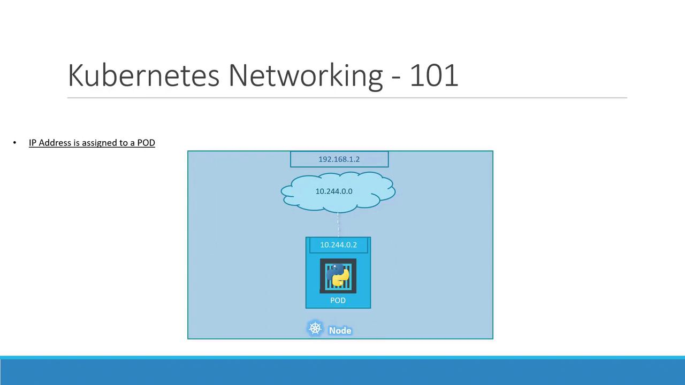
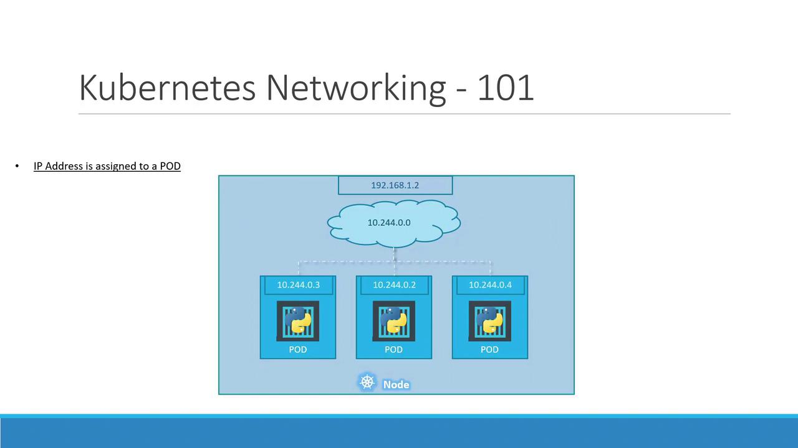
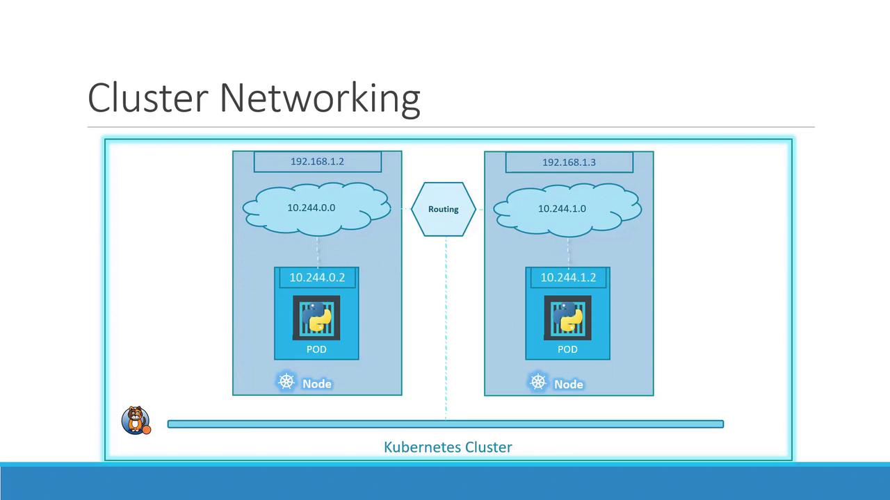

# Example Pod network CIDR
podCIDR: 10.244.0.0/16
```

When you spin up a Pod, Kubernetes assigns it an IP, such as `10.244.0.2`, which all containers in that Pod share.

<Frame>
  
</Frame>

If you deploy several Pods on this node, each receives a unique IP in the same `10.244.0.0/16` range. They can communicate directly using these IPs:

<Frame>
  
</Frame>

<Callout icon="lightbulb">
  Pod IP addresses are ephemeral. When a Pod is deleted and recreated, it may receive a different IP.
</Callout>

## Multi-Node Cluster Networking

As your cluster scales to multiple nodes, each host must carve out a non-overlapping slice of the Pod network to avoid IP conflicts.

Consider two nodes:

* Host IP: `192.168.1.2` → Pod subnet `10.244.0.0/24`
* Host IP: `192.168.1.3` → Pod subnet `10.244.1.0/24`

Without a CNI plugin, Kubernetes does not set up inter-node Pod routing. A CNI plugin handles:

| Requirement | Description                                                |
| ----------- | ---------------------------------------------------------- |
| Pod-to-Pod  | All Pods communicate directly across nodes without NAT     |
| Node-to-Pod | Nodes can reach any Pod IP without SNAT                    |
| Pod-to-Node | Pods can reach any node IP address                         |
| Non-overlap | Each node gets a unique Pod subnet to prevent IP conflicts |

<Callout icon="triangle-alert">
  If you skip installing a proper CNI, Pods on different nodes may end up with overlapping IPs, causing connectivity failures.
</Callout>

### Popular CNI Plugins

| Plugin       | Type          | Description                                                  | Link                                                                                                                             |
| ------------ | ------------- | ------------------------------------------------------------ | -------------------------------------------------------------------------------------------------------------------------------- |
| Calico       | Layer 3       | Advanced network policy, IP-in-IP or VXLAN overlay           | [https://docs.projectcalico.org/](https://docs.projectcalico.org/)                                                               |
| Flannel      | VXLAN/Host-gw | Simple overlay networking, ideal for labs and small clusters | [https://github.com/flannel-io/flannel](https://github.com/flannel-io/flannel)                                                   |
| Cilium       | eBPF          | High-performance networking, built-in security policies      | [https://cilium.io/](https://cilium.io/)                                                                                         |
| Weave Net    | VXLAN         | Automatic mesh networking, easy to deploy                    | [https://www.weave.works/docs/net/latest/kubernetes/kube-addon/](https://www.weave.works/docs/net/latest/kubernetes/kube-addon/) |
| Cisco ACI    | SDN           | Enterprise-grade, integrates with Cisco data center fabrics  | [https://developer.cisco.com/docs/aci/](https://developer.cisco.com/docs/aci/)                                                   |
| VMware NSX-T | SDN           | Micro-segmentation, multi-cloud networking                   | [https://docs.vmware.com/en/VMware-NSX-T/index.html](https://docs.vmware.com/en/VMware-NSX-T/index.html)                         |

Once your CNI is in place, each node’s CNI daemon (e.g., `flanneld` or `calico-node`) allocates a unique `/24` Pod subnet and programs the host routes. The result is a seamless overlay network:

<Frame>
  
</Frame>

With this virtual network, Pods on different nodes can communicate directly using stable Pod IPs, satisfying Kubernetes’ flat network model.

## Links and References

* [Kubernetes Networking Concepts](https://kubernetes.io/docs/concepts/cluster-administration/networking/)
* [Container Network Interface (CNI)](https://github.com/containernetworking/cni)
* [Flannel GitHub Repository](https://github.com/flannel-io/flannel)
* [Calico Documentation](https://docs.projectcalico.org/)

<CardGroup>
  <Card title="Watch Video" icon="video" href="https://learn.kodekloud.com/user/courses/docker-certified-associate-exam-course/module/d9358627-4fc7-4acc-ab96-fa25232555c6/lesson/0dd6c125-6564-4328-99fd-aefe2b07f95c" />
</CardGroup>


# PODs with YAML

Source: https://notes.kodekloud.com/docs/Docker-Certified-Associate-Exam-Course/Kubernetes/PODs-with-YAML/page

This comprehensive guide teaches how to define and manage a Kubernetes Pod using a YAML configuration file.

Welcome to this comprehensive guide where you'll learn how to define and manage a Kubernetes Pod using a YAML configuration file. Kubernetes relies on declarative YAML manifests to create and update resources such as Pods, Deployments, and Services. By the end of this tutorial, you'll understand the required fields, best practices for YAML structure, and how to deploy and inspect your Pod.

## Table of Contents

1. [Understanding the Top-Level Fields](#understanding-the-top-level-fields)
2. [Pod Definition Skeleton](#pod-definition-skeleton)
3. [Detailed Field Breakdown](#detailed-field-breakdown)
4. [Deploying Your Pod](#deploying-your-pod)
5. [Inspecting Your Pod](#inspecting-your-pod)
6. [Summary](#summary)
7. [Links and References](#links-and-references)

***

## Understanding the Top-Level Fields

Every Kubernetes manifest shares four mandatory top-level fields. These fields tell Kubernetes what to create, how to version it, and any additional identifying metadata or configuration details.

| Field      | Description                                                | Example             |
| ---------- | ---------------------------------------------------------- | ------------------- |
| apiVersion | API group and version for the resource                     | `v1`                |
| kind       | Type of Kubernetes object (Pod, Deployment, Service, etc.) | `Pod`               |
| metadata   | Key/value pair metadata, including `name` and `labels`     | `name: myapp-pod`   |
| spec       | Desired state specification, varies per resource type      | `containers: [...]` |

<Callout icon="lightbulb">
  YAML is indentation-sensitive. Always use spaces (not tabs) and ensure child elements are indented correctly under their parent keys.
</Callout>

***

## Pod Definition Skeleton

Start with the minimal skeleton for a Pod manifest:

```yaml theme={null}
apiVersion: v1
kind: Pod
metadata:
spec:
```

You’ll expand each section to specify your Pod’s name, labels, and container settings.

***

## Detailed Field Breakdown

### apiVersion

Defines the API group and version that Kubernetes will use to process this resource.\
For Pods, it’s always:

```yaml theme={null}
apiVersion: v1
```

### kind

Specifies the type of object to create. For this tutorial:

```yaml theme={null}
kind: Pod
```

Other common values include `Deployment`, `Service`, and `ReplicaSet`.

### metadata

Contains identifying information such as the resource’s name and optional labels for grouping and selection.

```yaml theme={null}
metadata:
  name: myapp-pod
  labels:
    app: myapp
    tier: frontend
```

* **name:** A unique identifier for the Pod within its namespace.
* **labels:** Arbitrary key/value pairs for organizational or selection purposes.

### spec

Defines the desired state. In a Pod, this means listing the containers it should run.

```yaml theme={null}
spec:
  containers:
    - name: nginx-container
      image: nginx:latest
      ports:
        - containerPort: 80
```

Key points:

* `containers` is a YAML list; you can define multiple containers per Pod.
* Each container requires at least a `name` and `image`.
* You can optionally define ports, environment variables, volume mounts, and more.

<Callout icon="triangle-alert">
  Kubernetes object names must:

  * Contain only lowercase alphanumeric characters and `-`.
  * Start and end with an alphanumeric character.
  * Be unique within a namespace.
</Callout>

***

## Deploying Your Pod

1. Save your manifest to `pod-definition.yaml`.
2. Run the following command to create the Pod:

```bash theme={null}
kubectl create -f pod-definition.yaml
```

You should see:

```bash theme={null}
pod/myapp-pod created
```

***

## Inspecting Your Pod

### List All Pods

```bash theme={null}
kubectl get pods
```

Sample output:

```bash theme={null}
NAME        READY   STATUS    RESTARTS   AGE
myapp-pod   1/1     Running   0          30s
```

### Describe a Pod

To view detailed status and event logs:

```bash theme={null}
kubectl describe pod myapp-pod
```

Key sections in the output include `Labels`, `Containers`, `Conditions`, and recent `Events`.

***

## Summary

In this lesson, you learned how to:

1. Structure a basic Kubernetes Pod manifest with the required top-level fields.
2. Define metadata and container specifications in YAML.
3. Deploy your Pod using `kubectl create`.
4. Inspect status and logs with `kubectl get` and `kubectl describe`.

Up next, we’ll explore Deployments and how they automate pod scaling and updates.

***

## Links and References

* [Kubernetes Official Documentation](https://kubernetes.io/docs/)
* [Kubernetes API Concepts](https://kubernetes.io/docs/concepts/overview/kubernetes-api/)
* [Kubectl Cheat Sheet](https://kubernetes.io/docs/reference/kubectl/cheatsheet/)

<CardGroup>
  <Card title="Watch Video" icon="video" href="https://learn.kodekloud.com/user/courses/docker-certified-associate-exam-course/module/d9358627-4fc7-4acc-ab96-fa25232555c6/lesson/7aedae91-8b20-49ab-8c8b-a893168ee158" />
</CardGroup>
