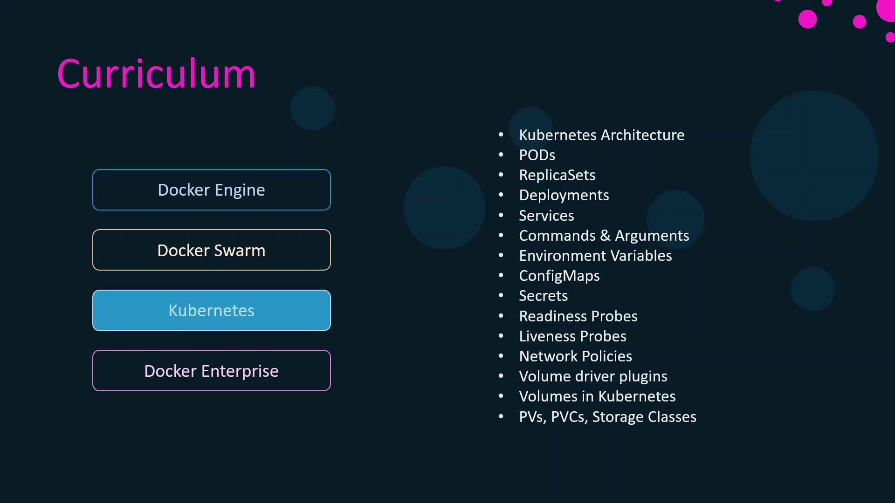

# paswrd
```

***

## Links and References

* [Kubernetes Secrets Documentation][secrets-doc]
* [ConfigMaps Overview][configmap-doc]
* [Flask Documentation](https://flask.palletsprojects.com/)

[secrets-doc]: https://kubernetes.io/docs/concepts/configuration/secret/

[configmap-doc]: https://kubernetes.[AWS_SECRET_ACCESS_KEY]/

<CardGroup>
  <Card title="Watch Video" icon="video" href="https://learn.kodekloud.com/user/courses/docker-certified-associate-exam-course/module/d9358627-4fc7-4acc-ab96-fa25232555c6/lesson/b1b5028f-3e44-4867-93a8-621308da3b56" />
</CardGroup>


# Section Introduction

Source: https://notes.kodekloud.com/docs/Docker-Certified-Associate-Exam-Course/Kubernetes/Section-Introduction/page

This article provides a deep dive into Kubernetes orchestration, focusing on key concepts and components essential for the DCA exam.

Welcome to our Kubernetes orchestration deep dive! This article merges core material from the **Kubernetes for Beginners** and **CKAD** courses, tailored to the DCA (Docker Certified Associate) exam. We focus exclusively on Kubernetes orchestration—installation and cluster setup (covered in CKA) are not included here.

<Frame>
  
</Frame>

<Callout icon="lightbulb">
  If you’ve already completed a Kubernetes for Beginners or CKAD course and feel comfortable with the basics, start with the research questions and practice tests below. Then revisit any topics that need more review.
</Callout>

## What You’ll Learn

| Topic                           | Description                                                     |
| ------------------------------- | --------------------------------------------------------------- |
| Kubernetes Architecture         | Control plane components, node structure, and key objects       |
| Pods, ReplicaSets & Deployments | Workload primitives and rolling updates                         |
| Services                        | ClusterIP, NodePort, LoadBalancer, and DNS routing              |
| Configuration Patterns          | Command arguments, env vars, ConfigMaps, and Secrets            |
| Probes                          | Liveness and readiness checks                                   |
| Network Policies                | Pod-to-pod network segmentation                                 |
| Storage Concepts                | Volume types, PersistentVolumes (PVs), PVCs, and StorageClasses |

With this roadmap, let’s get started on mastering Kubernetes orchestration!

<CardGroup>
  <Card title="Watch Video" icon="video" href="https://learn.kodekloud.com/user/courses/docker-certified-associate-exam-course/module/d9358627-4fc7-4acc-ab96-fa25232555c6/lesson/2f9949c9-b19d-4d4b-a30a-f45747ffd718" />
</CardGroup>
