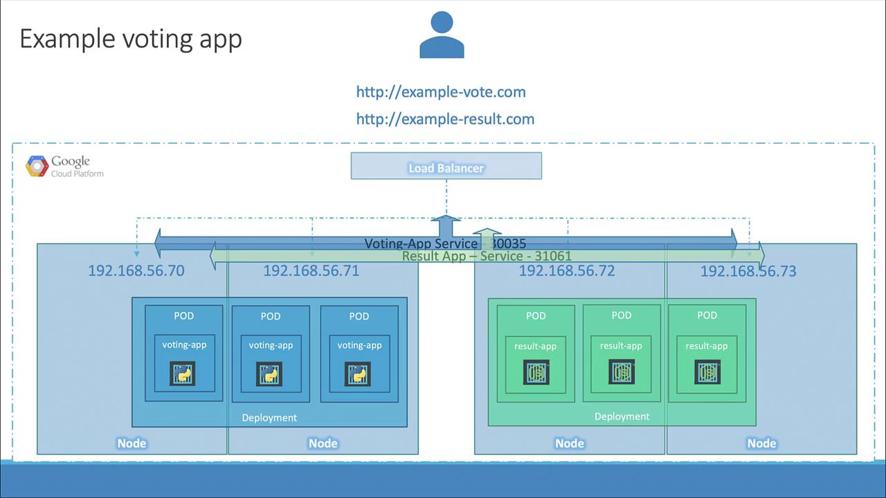
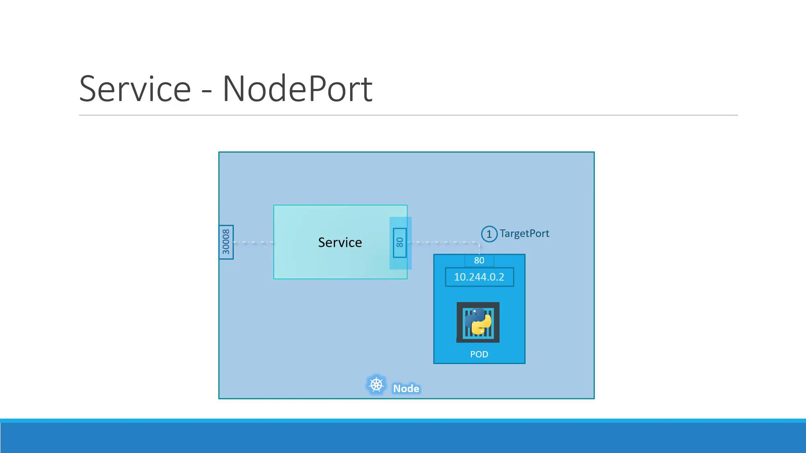

# NAME         TYPE           CLUSTER-IP     EXTERNAL-IP     PORT(S)        AGE
# voting-app   LoadBalancer   10.0.173.200   34.68.123.456   80:32000/TCP   1m
```

<Frame>
  
</Frame>

<Callout icon="lightbulb">
  `type: LoadBalancer` only works on supported cloud environments. In unsupported setups (e.g., VirtualBox), Kubernetes falls back to assigning a NodePort without provisioning an external load balancer.
</Callout>

## 4. Comparing Service Types

| Service Type | Use Case                                 | Behavior                                     |
| ------------ | ---------------------------------------- | -------------------------------------------- |
| NodePort     | Expose Service on a static port on nodes | Assigns a port from the 30000–32767 range    |
| LoadBalancer | Expose Service via cloud load balancer   | Provisions native LB and assigns external IP |

## Links and References

* [Kubernetes Services](https://kubernetes.io/docs/concepts/services-networking/service/)
* [LoadBalancer Service](https://kubernetes.io/docs/concepts/services-networking/service/#loadbalancer)
* [Cloud Provider Integration](https://kubernetes.io/docs/concepts/cluster-administration/cloud-providers/)

<CardGroup>
  <Card title="Watch Video" icon="video" href="https://learn.kodekloud.com/user/courses/docker-certified-associate-exam-course/module/d9358627-4fc7-4acc-ab96-fa25232555c6/lesson/9024d903-57f2-41ae-a659-3afa08da25a4" />
</CardGroup>


# Services NodePort

Source: https://notes.kodekloud.com/docs/Docker-Certified-Associate-Exam-Course/Kubernetes/Services-NodePort/page

This tutorial focuses on Kubernetes NodePort services, enabling external traffic to access Pods through a port on each Node.

Welcome to this tutorial on Kubernetes Services. In this guide, we'll focus on the NodePort type, which enables external traffic to reach Pods through a port on each Node. Kubernetes Services provide stable network endpoints for Pods, enabling reliable communication both within the cluster and from outside clients.

## Why Use Kubernetes Services?

Kubernetes Services decouple the front-end, back-end, and data-layer Pods, offering:

* **Stable endpoints**: Consistent IPs or DNS names for Pods that may be recreated.
* **Load balancing**: Distributes traffic evenly across multiple Pods.
* **Discoverability**: Native service discovery within the cluster network.

Applications typically consist of:

* Front-end Pods serving user interfaces
* Back-end Pods processing business logic
* Pods connecting to external data sources

With Services, these components can communicate without hardcoding Pod IPs.

## External Access Use Case

By default, Pod IPs (e.g., 10.244.0.2) are only reachable inside the cluster network. To access a web server Pod from your laptop (192.168.1.10) without SSH’ing into the Node (192.168.1.2), you need a NodePort Service which maps a port on the Node to the Pod’s port.

```bash theme={null}
curl http://192.168.1.2:30008
Hello World!
```

| Service Type | Use Case                                                        | Example Configuration                   |
| ------------ | --------------------------------------------------------------- | --------------------------------------- |
| ClusterIP    | Internal-only service for Pod-to-Pod communication              | `type: ClusterIP`                       |
| NodePort     | Exposes Pod on a port across all Nodes for external access      | `type: NodePort`<br />`nodePort: 30008` |
| LoadBalancer | Provisions a cloud load balancer to distribute external traffic | `type: LoadBalancer`                    |

<Callout icon="lightbulb">
  `NodePort` ranges from 30000 to 32767 by default. You can customize this in the API server flags.
</Callout>

<Frame>
  
</Frame>

## NodePort Service Ports Explained

A NodePort Service uses three port definitions:

* **targetPort**: Port on the Pod (e.g., 80)
* **port**: Virtual Service port inside the cluster (e.g., 80)
* **nodePort**: Port on each Node, accessible externally (e.g., 30008)

Traffic to `<NodeIP>:<nodePort>` → Service → `port` → Pod at `targetPort`.

## Defining a NodePort Service

1. **Create a Pod** with labels:

```yaml theme={null}
