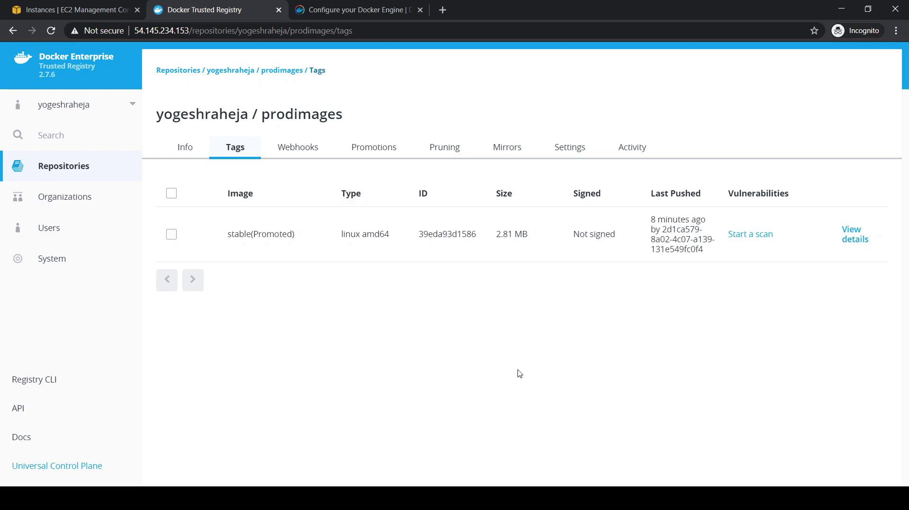
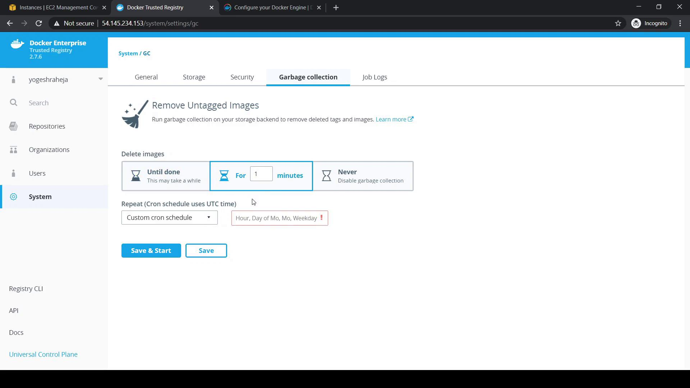
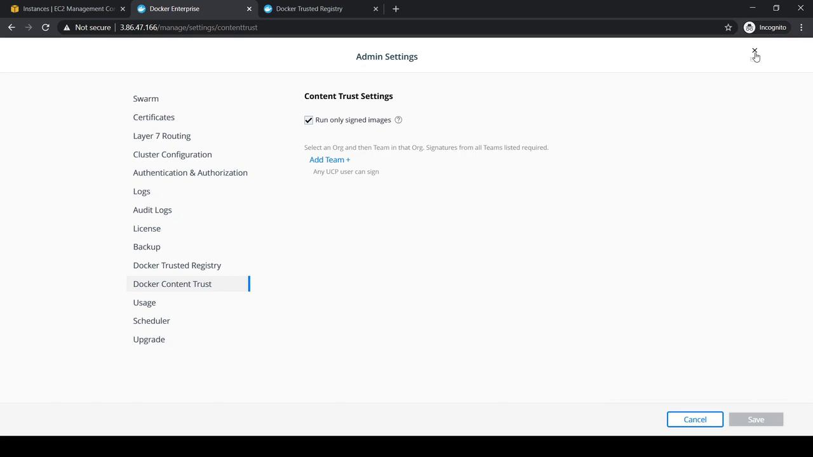

# Tag alpine:latest for devimages
docker tag alpine:latest 54.145.234.153/yogeshraheja/devimages:stable

# Push to the devimages repository
docker push 54.145.234.153/yogeshraheja/devimages:stable
```

Return to the DTR console:

1. Refresh **devimages**.
2. Under **Promotions**, **Last Promoted** will update to the current timestamp.
3. Click **Activity** to view the detailed promotion log.

To confirm, inspect **prodimages**:

<Frame>
  
</Frame>

The `stable (Promoted)` tag indicates that the image has been moved successfully.

<Callout icon="triangle-alert">
  Production repositories should only receive thoroughly tested images. Double-check your promotion rules to avoid deploying unverified containers.
</Callout>

***

## Configure Garbage Collection

Over time, untagged images accumulate and consume disk space. DTR’s Garbage Collection removes these images based on your schedule.

1. Navigate to **System** > **Garbage Collection** in the DTR UI.
2. Choose a collection mode:

| Mode               | Description                                       |
| ------------------ | ------------------------------------------------- |
| Until Done         | Runs until **all** untagged images are removed.   |
| For a Defined Time | Runs for a specified duration (e.g., 10 minutes). |
| Never (Default)    | Disables automatic garbage collection.            |

3. (Optional) Schedule it using a cron expression for regular cleanups.
4. Click **Save** to apply.

<Frame>
  
</Frame>

<Callout icon="lightbulb">
  By default, automatic garbage collection is disabled. Enabling it prevents your DTR storage from filling up.
</Callout>

***

## Links and References

* [Docker Trusted Registry Overview](https://docs.docker.com/ee/dtr/)
* [Manage Images with DTR](https://docs.docker.com/ee/dtr/manage-images/)
* [Docker Docs: Garbage Collection](https://docs.docker.com/ee/dtr/admin/store/#garbage-collection)

***

<CardGroup>
  <Card title="Watch Video" icon="video" href="https://learn.kodekloud.com/user/courses/docker-certified-associate-exam-course/module/d0ef5db6-09b0-45f3-a220-9036d58086c6/lesson/559a4fbc-c655-43aa-8fbc-74f0957c6c22" />
</CardGroup>


# Docker Content Trust and Image Signing

Source: https://notes.kodekloud.com/docs/Docker-Certified-Associate-Exam-Course/Docker-Trusted-Registry/Docker-Content-Trust-and-Image-Signing/page

This guide explains how to configure Docker Content Trust to enforce the use of cryptographically signed images.

In this guide, you’ll learn how to configure Docker Content Trust (DCT) to allow only cryptographically signed images in your environment. We cover:

* Pulling unsigned images without Content Trust
* Enabling Content Trust on an individual host
* Enforcing Content Trust across a UCP cluster
* Pushing unsigned images to Docker Trusted Registry (DTR)
* Managing Notary keys and signing images
* Verifying and pulling signed images

***

## Step 1: Pulling an Unsigned Image (without Content Trust)

On a UCP worker node, list existing images and pull the unsigned image `yogeshraheja/tomcatone:v1` from Docker Hub:

```bash theme={null}
[root@ucpworker ~]# docker image ls
REPOSITORY                  TAG       IMAGE ID       CREATED        SIZE
docker/ucp-pause            3.2.6     feb0e469f6ac   2 months ago   683kB
docker/ucp-agent            3.2.6     b9763a5e7df8   2 months ago   62.1MB
docker/ucp-hyperkube        3.2.6     56c3b92d2b4f   2 months ago   441MB
docker/ucp-calico-node      3.2.6     40091fdbb1b4   2 months ago   189MB
docker/ucp-calico-cni       3.2.6     dd89cabc02dd   2 months ago   162MB

[root@ucpworker ~]# docker image pull yogeshraheja/tomcatone:v1
v1: Pulling from yogeshraheja/tomcatone
[...]
Status: Downloaded newer image for docker.io/yogeshraheja/tomcatone:v1

[root@ucpworker ~]# docker image ls
REPOSITORY                  TAG       IMAGE ID       CREATED        SIZE
yogeshraheja/tomcatone      v1        bd808d1...     5 days ago     497MB
```

<Callout icon="lightbulb">
  By default, Docker allows pulling unsigned images from public registries.
</Callout>

***

## Step 2: Enabling Docker Content Trust on a Single Host

To require signed images, set the `DOCKER_CONTENT_TRUST` environment variable:

```bash theme={null}
[root@ucpworker ~]# export DOCKER_CONTENT_TRUST=1
```

Remove the previously pulled image and attempt to pull it again:

```bash theme={null}
[root@ucpworker ~]# docker image rm yogeshraheja/tomcatone:v1
[root@ucpworker ~]# docker image pull yogeshraheja/tomcatone:v1
Error: remote trust data does not exist for docker.io/yogeshraheja/tomcatone: notary.docker.io does not have trust data
```

Docker refuses to pull the unsigned image when Content Trust is enabled.

***

## Step 3: Enforcing Content Trust Cluster-Wide via UCP

Manually exporting an environment variable on each node is tedious. Instead, enforce Content Trust across your Docker Universal Control Plane (UCP) cluster:

1. Log in to UCP as an administrator.
2. Navigate to **Admin Settings** → **Account Settings**.
3. Enable **Docker Content Trust (Only Signed Images)**.
4. Save your changes.

This setting propagates `DOCKER_CONTENT_TRUST=1` to all cluster nodes.

<Frame>
  
</Frame>

***

## Step 4: Pulling an Unsigned Image from a Client with Content Trust Enabled

On your local workstation using the UCP client bundle, Content Trust is now enforced:

```bash theme={null}
[root@yogeshclientbundle ~]# ./docker image pull yogeshraheja/tomcatone:v1
Error response from daemon: image or trust data does not exist for docker.io/yogeshraheja/tomcatone:v1
```

<Callout icon="triangle-alert">
  Disabling Content Trust exposes your environment to unsigned and potentially unverified images. Only unset if absolutely necessary.
</Callout>

To continue working with unsigned images temporarily:

```bash theme={null}
[root@yogeshclientbundle ~]# unset DOCKER_CONTENT_TRUST
[root@yogeshclientbundle ~]# ./docker image pull yogeshraheja/tomcatone:v1
```

***

## Step 5: Pushing the Unsigned Image to Docker Trusted Registry (DTR)

1. In DTR, create a repository named `yogeshraheja/testimagesigning`.
2. Tag and push the image from your local host:

```bash theme={null}
[root@yogeshclientbundle ~]# ./docker image tag \
    yogeshraheja/tomcatone:v1 \
    54.145.234.153/yogeshraheja/testimagesigning:v1

[root@yogeshclientbundle ~]# ./docker login 54.145.234.153
Username: yogeshraheja
Password: 
Login Succeeded

[root@yogeshclientbundle ~]# ./docker image push \
    54.145.234.153/yogeshraheja/testimagesigning:v1
```

The repository now contains the unsigned image.

***

## Step 6: Signing the Image with Docker Content Trust

Docker Content Trust uses *Notary* to manage trust metadata. Below are the steps to import your keys, initialize trust for a repository, and sign an image.

### 6.1 Import Your Notary Private Key

Copy the private key into Docker’s trust directory and load it:

```bash theme={null}
[root@yogeshclientbundle ~]# mkdir -p ~/.docker/trust
[root@yogeshclientbundle ~]# cp key.pem ~/.docker/trust/
[root@yogeshclientbundle ~]# ./docker trust key load --name yogeshraheja key.pem
Loading key from "key.pem"...
Enter passphrase for new yogeshraheja key with ID 97dd9b8:
Repeat passphrase for new yogeshraheja key with ID 97dd9b8:
Successfully imported key from key.pem
```

### 6.2 Initialize Trust Metadata and Add a Signer

Authorize your user as a signer and initialize the repository’s trust data:

```bash theme={null}
[root@yogeshclientbundle ~]# ./docker trust signer add --key cert.pub \
    yogeshraheja \
    54.145.234.153/yogeshraheja/testimagesigning
Adding signer "yogeshraheja" to 54.145.234.153/yogeshraheja/testimagesigning...
Initializing signed repository for 54.145.234.153/yogeshraheja/testimagesigning...
Enter passphrase for root key with ID 47caaa5:
Enter passphrase for new repository key with ID faf8bd5:
Repeat passphrase for new key with ID faf8bd5:
Successfully initialized and added signer "yogeshraheja".
```

### 6.3 Sign the Image Tag

Sign the `v1` tag:

```bash theme={null}
[root@yogeshclientbundle ~]# ./docker trust sign \
    54.145.234.153/yogeshraheja/testimagesigning:v1
Enter passphrase for "yogeshraheja" key with ID 97dd9b8:
Signed 1 tag for 54.145.234.153/yogeshraheja/testimagesigning:v1
```

(Optional) Verify trust metadata:

```bash theme={null}
[root@yogeshclientbundle ~]# ./docker trust inspect \
    --pretty 54.145.234.153/yogeshraheja/testimagesigning
```

***

## Step 7: Pushing Signed Images and New Tags

After signing, push your `v1` image and optionally tag and sign a new version `v2`:

```bash theme={null}
[root@yogeshclientbundle ~]# ./docker push \
    54.145.234.153/yogeshraheja/testimagesigning:v1
