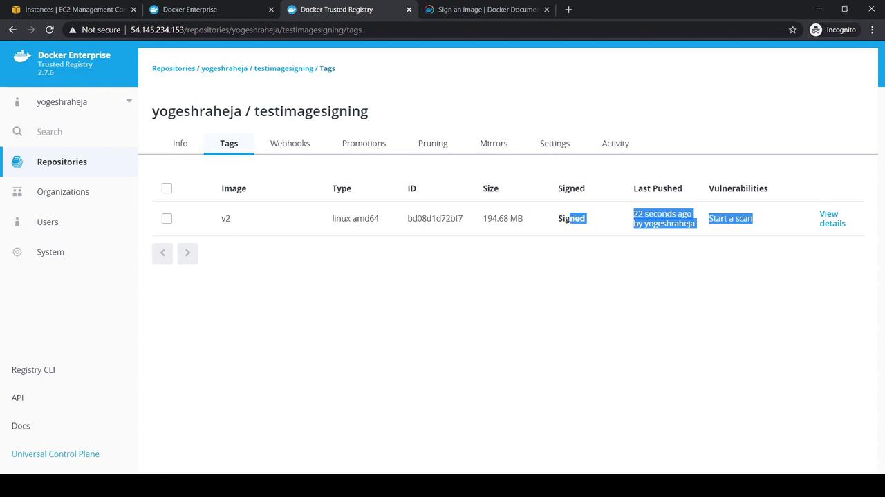

# Tag a new version
[root@yogeshclientbundle ~]# ./docker image tag \
    54.145.234.153/yogeshraheja/testimagesigning:v1 \
    54.145.234.153/yogeshraheja/testimagesigning:v2

# Sign the new tag
[root@yogeshclientbundle ~]# ./docker trust sign \
    54.145.234.153/yogeshraheja/testimagesigning:v2

# Push the v2 tag
[root@yogeshclientbundle ~]# ./docker push \
    54.145.234.153/yogeshraheja/testimagesigning:v2
```

<Frame>
  
</Frame>

***

## Summary Table of Content Trust Configuration

| Action                        | Method               | Command / UI Path                                                    |
| ----------------------------- | -------------------- | -------------------------------------------------------------------- |
| Enable Content Trust on host  | Environment variable | `export DOCKER_CONTENT_TRUST=1`                                      |
| Enforce Content Trust cluster | UCP Admin Settings   | **Admin Settings** → **Account Settings** → **Docker Content Trust** |
| Import Notary key             | CLI                  | `docker trust key load --name <user> key.pem`                        |
| Initialize repository signing | CLI                  | `docker trust signer add --key cert.pub <user> <repo>`               |
| Sign an image tag             | CLI                  | `docker trust sign <repo>:<tag>`                                     |

***

## Links and References

* [Docker Content Trust Documentation](https://docs.docker.com/engine/security/trust/)
* [Docker Notary Project](https://github.com/theupdateframework/notary)
* [Docker Trusted Registry (DTR)](https://docs.docker.com/ee/dtr/)

<CardGroup>
  <Card title="Watch Video" icon="video" href="https://learn.kodekloud.com/user/courses/docker-certified-associate-exam-course/module/d0ef5db6-09b0-45f3-a220-9036d58086c6/lesson/8b950e04-d2c2-4dec-8f77-0c8014b8b786" />
</CardGroup>


# Docker Trusted Registry Operations

Source: https://notes.kodekloud.com/docs/Docker-Certified-Associate-Exam-Course/Docker-Trusted-Registry/Docker-Trusted-Registry-Operations/page

This article covers the workflow for using Docker Trusted Registry, including naming, tagging, pushing, and sharing images in a private registry.

In this lesson, we’ll walk through the end-to-end workflow for working with Docker Trusted Registry (DTR). You’ll learn how to name, tag, push, and share images within your organization’s private registry.

## Recap: Docker Image Naming Conventions

When you reference an image without specifying a registry host, Docker defaults to Docker Hub (`docker.io`). An image reference is composed of three parts:

| Component  | Description                   | Example     |
| ---------- | ----------------------------- | ----------- |
| Registry   | Host address for the registry | `docker.io` |
| Namespace  | Account or organization name  | `httpd`     |
| Repository | Repository (image) name       | `httpd`     |

```yaml theme={null}
